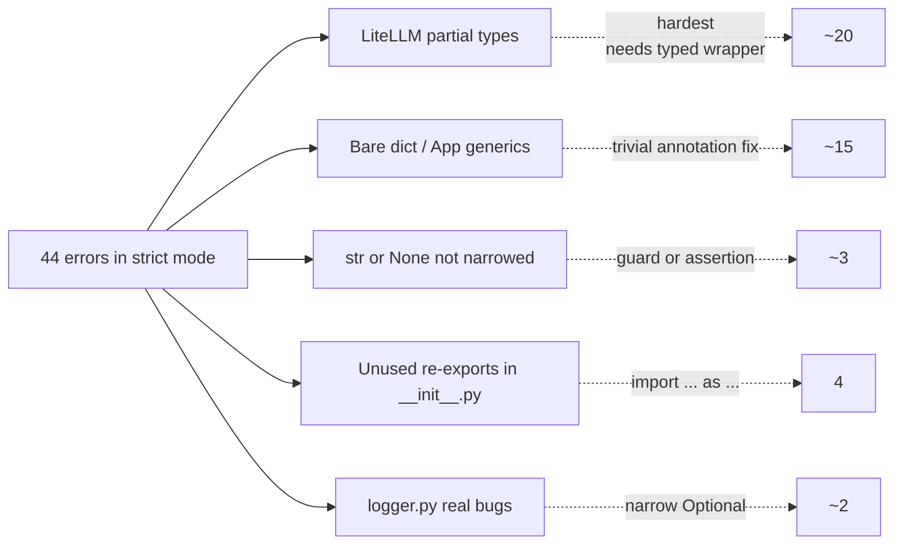

Pyright is Microsoft's static type checker for Python. It is also the
engine behind **Pylance**, the default Python extension in VS Code —
so if you use Pylance you are already running Pyright in the editor
whether you know it or not. This post walks through how Pyright
compares to mypy, how to configure it inside a `uv`-managed project,
and what strict mode actually catches on a small real codebase.

## Table of contents

## Pyright vs. mypy 🆚

Both tools check types, but they make different trade-offs.

| | **Pyright** | **mypy** |
|---|---|---|
| First release | 2019 | 2012 |
| Implementation | TypeScript, incremental | Python |
| Speed | Very fast | Slower, though improving |
| Strictness | Stricter by default, better inference | More permissive, configurable |
| Editor integration | Powers Pylance in VS Code | Works via LSP but less polished |
| Plugin ecosystem | No plugins (by design) | Plugins for Django, SQLAlchemy, Pydantic, attrs |
| Maintainer | Microsoft | Python core / Dropbox origins |
| Config file | `pyrightconfig.json` or `pyproject.toml` | `mypy.ini` or `pyproject.toml` |

**Adoption:** mypy still wins in CI and explicit-config usage — it is
the reference implementation referenced in typing PEPs and powers
large codebases at Dropbox, Instagram, and similar. Pyright wins
in day-to-day editor usage because Pylance ships it to every VS Code
user by default. Many teams run both: Pyright in the editor for fast
feedback, mypy in CI for the plugin ecosystem.

**Rules of thumb:**

- Pick **Pyright** for speed, strong inference, and VS Code
  integration. Best for new or greenfield code.
- Pick **mypy** if you rely on framework plugins (SQLAlchemy, Django,
  etc.) or need its particular type-narrowing behaviors.

## Configuring Pyright in `pyproject.toml`

You can configure Pyright two ways:

1. **`pyproject.toml`** under a `[tool.pyright]` table (recommended —
   keeps all tool config in one file).
2. **`pyrightconfig.json`** in the project root. This takes
   **precedence** over `pyproject.toml` if both exist.

A minimal strict-mode configuration:

```toml
[tool.pyright]
include = ["src"]
pythonVersion = "3.12"
venvPath = "."
venv = ".venv"
typeCheckingMode = "strict"
reportMissingTypeStubs = false
```

### What `[tool.pyright]` actually is

`pyproject.toml` is Python's standard project-config file. Anything
under `[tool.<name>]` is reserved for tool `<name>` to read — Python
itself ignores it. Ruff reads `[tool.ruff]`, pytest reads
`[tool.pytest.ini_options]`, and Pyright reads `[tool.pyright]`.

When Pyright (or Pylance) starts, it walks up from the file being
checked looking for either `pyrightconfig.json` or
`pyproject.toml` with a `[tool.pyright]` section.

### Settings, line by line

| Setting | Why it matters |
|---|---|
| `include` | Without this, Pyright also checks `docs/`, scratch files, etc. Scoping to `src/` keeps diagnostics focused. |
| `pythonVersion` | Tells Pyright which syntax is legal (e.g. `type X = int` aliases require 3.12+) and which stdlib APIs exist. Should match `requires-python`. |
| `venvPath` + `venv` | Together they point Pyright at `./.venv`, where `uv sync` installs third-party packages. Without this you get "Import could not be resolved" errors everywhere. |
| `typeCheckingMode` | `"off"` \| `"basic"` \| `"standard"` \| `"strict"`. Strict adds ~50 checks: every parameter and return must be annotated, no implicit `Any`, unknown member access is an error. |
| `reportMissingTypeStubs` | Libraries like LiteLLM ship without `.pyi` stubs. In strict mode Pyright would flag every import — this silences just that category. |

### Other settings worth knowing

- `exclude = ["**/tests/**"]` — skip directories
- `reportUnusedImport = "warning"` — downgrade a specific rule
- `strictListInference = true` — extra inference rules
- `executionEnvironments = [...]` — different rules per subdirectory

Full reference: [Pyright configuration][pyright-config].

## Running Pyright from the CLI 🖥️

Two options in a `uv` project:

**1. Install as a dev dependency (recommended):**

```bash
uv add --dev pyright
uv run pyright
```

Pins Pyright in your lockfile so CI and teammates get the same
version.

**2. Run ad-hoc without installing:**

```bash
uvx pyright
```

`uvx` downloads and runs it in a throwaway environment — good for
trying it once.

### Useful invocations

```bash
uv run pyright                    # check everything in `include`
uv run pyright src/foo.py         # check one file
uv run pyright --watch            # re-run on file changes
uv run pyright --stats            # show timing + file counts
uv run pyright --outputjson       # machine-readable output for CI
```

Pyright is distributed as an npm package wrapped in a Python shim.
The first run downloads a Node.js runtime if you do not have one —
takes a few seconds the first time, then it is fast.

### Strict vs. standard: where to start

Starting at `typeCheckingMode = "standard"` is the safe path on an
existing codebase — strict will flag every missing annotation at
once, which is noisy. Bump to `"strict"` once the standard-mode
warnings are clean. On a small greenfield project, jumping straight
to strict is fine and catches more.

## What strict mode actually catches

Running `uv run pyright` in strict mode on a small async agent
project produced **44 errors**. The interesting thing is how they
cluster by root cause — strict mode does not generate 44 independent
problems, it generates four or five *categories*.



### 1. Partial types from third-party libraries

Many libraries return objects whose types are only partially known
to Pyright — fields typed as `Unknown`, unions Pyright cannot
narrow. Strict mode surfaces every one as
`reportUnknownVariableType` or `reportUnknownMemberType`.

These are the hardest to fix. Options:

- Wrap the library in a typed helper that returns `TypedDict`s or
  dataclasses you own.
- Add targeted `# pyright: ignore[reportUnknownMemberType]`
  comments.
- Drop that one rule via a module-level override.
- Loosen to `"standard"` mode — most of this noise disappears.

### 2. Bare `dict` and generic class annotations

Strict mode requires type arguments on generic classes. Things like:

```python
# before
def handle(args: dict) -> None: ...
class ChatApp(App): ...

# after
def handle(args: dict[str, Any]) -> None: ...
class ChatApp(App[None]): ...
```

Mechanical, high-volume fix. Handles the majority of violations on
any codebase that has not previously been type-checked.

### 3. `str | None` not narrowed

Libraries often return `Optional` fields that are *almost always*
populated but still typed with `None` in the union. For example,
Textual's `event.button.id` is `str | None`. Indexing a dict with
it directly fails strict mode:

```python
# before — Pyright: str | None not assignable to str
self.dismiss(mapping[event.button.id])

# after — explicit narrow
button_id: str | None = event.button.id
assert button_id is not None
self.dismiss(mapping[button_id])
```

The `assert` is a runtime guard that doubles as a type narrowing
hint to Pyright.

### 4. Unused re-exports in `__init__.py`

A very common trap. A tool package's `__init__.py` that re-exports
a symbol:

```python
# __init__.py
from vibe_flow.tools.bash.bash import tool
```

…gets flagged `reportUnusedImport` because Pyright does not see
`tool` being used inside `__init__.py`. Two idiomatic fixes:

```python
# option A — explicit re-export alias
from vibe_flow.tools.bash.bash import tool as tool

# option B — declare public API
from vibe_flow.tools.bash.bash import tool
__all__ = ["tool"]
```

Both tell Pyright "this is intentional." The `as tool` trick is
the shortest.

### 5. Real bugs hiding behind strict mode

Sometimes strict mode finds actual latent bugs, not just annotation
noise. Two patterns that came up:

**`hasattr` does not narrow types.** Pyright cannot verify that
`obj.model_dump` exists at call time just because `hasattr`
returned true:

```python
# before — reportUnknownMemberType
if hasattr(obj, "model_dump"):
    return obj.model_dump()

# after — captures a callable reference Pyright can reason about
model_dump = getattr(obj, "model_dump", None)
if callable(model_dump):
    return model_dump()
```

**`cursor.lastrowid` is `int | None`.** A SQLite cursor that has
not inserted a row returns `None`. Most code paths assume it is
always populated and will crash silently if the row id is missing.
Strict mode forces you to acknowledge it:

```python
self._conn.commit()
row_id: int | None = cursor.lastrowid
assert row_id is not None
return row_id
```

## A practical escalation path 🪜

On an existing project, going from "no type checking" to "strict
Pyright passes clean" in one jump is rarely worth it. A more
realistic path:

- [x] Install Pyright and run it at `"standard"` mode.
- [x] Fix the low-hanging fruit: bare generics, unused imports,
      re-exports.
- [ ] Add `typeCheckingMode = "strict"` and run again.
- [ ] Tackle the `Optional`-narrowing and real-bug categories.
- [ ] Wrap badly-typed third-party libraries in your own typed
      adapters.
- [ ] Wire `uv run pyright` into CI so the ratchet holds.

The category breakdown matters more than the error count. Counting
errors makes the first run demoralizing — 44 sounds like a lot.
Grouping them reveals that the same three or four fixes, applied
mechanically, delete most of the list in minutes.

## Pylance + CLI = one source of truth ✅

Since Pylance also reads `[tool.pyright]`, the editor and CLI share
a single configuration. Reload VS Code after editing
`pyproject.toml` (`Ctrl+Shift+P` → "Developer: Reload Window") and
the same diagnostics appear in both places. That alignment is
arguably Pyright's biggest practical advantage: the squiggles you
see while editing are exactly what CI will enforce.

[pyright-config]: https://microsoft.github.io/pyright/#/configuration
