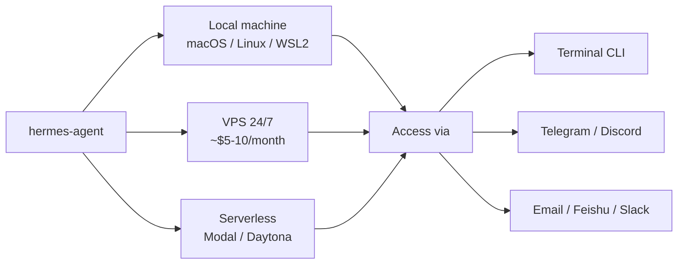
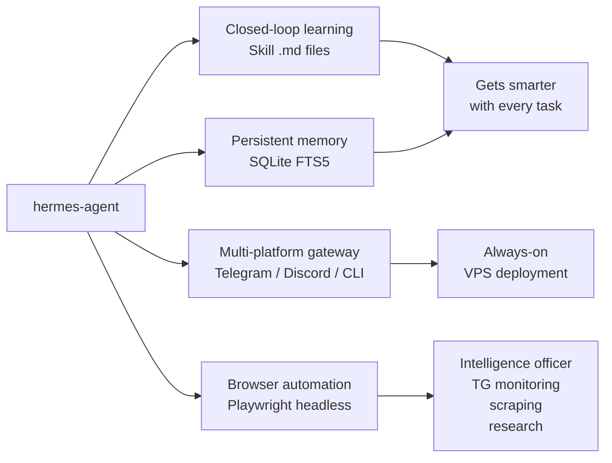

## What Is Hermes Agent? 🤖

[`NousResearch/hermes-agent`][hermes-gh] is an open-source AI agent framework from **Nous Research** — the team behind the popular Nous Hermes model line. Released in late February 2026, it is not a chatbot. Its stated goal is to solve the AI "forgetting" problem and act as a **long-term, evolving assistant** that accumulates skills through use.

Three properties distinguish it from conventional AI tools:

| Property | Description |
|---|---|
| **Closed-loop learning** | After completing a complex task, it automatically summarises the solution path and writes a reusable **Markdown skill file**. Next time a similar task arrives, it calls that skill directly. |
| **Persistent memory** | Uses SQLite FTS5 full-text search combined with LLM summarisation to remember operations, project context, and preferences across sessions and devices. |
| **Multi-platform gateway** | A single Hermes instance is reachable via terminal, Telegram, Discord, WhatsApp, Slack, email, and iMessage. A task started at a desktop terminal can be continued from a phone. |

---

## Deployment Options 🚀



**Local** is suitable for development and experimentation. It runs on macOS (Intel and Apple Silicon), Linux, and Windows via WSL2. Minimum RAM is 4 GB; 8 GB is recommended. Using a local model with Ollama requires a GPU with 8–16 GB of VRAM.

**VPS** is the recommended production mode. A 2-core, 4–8 GB RAM server (≈$5–10/month) running `hermes gateway` stays online even when the local machine is off, and receives instructions via Telegram or Discord.

**Serverless** deployment on Modal or Daytona starts the agent only when a command arrives, making it near-zero cost for infrequent use.

Install on any Linux/macOS machine with:

```bash
curl -fsSL https://hermes-agent.nousresearch.com/install.sh | bash
hermes setup
```

---

## Core Capabilities ⚙️

### Closed-Loop Code Writing

Unlike web-based chat tools that produce code snippets you then paste elsewhere, Hermes Agent is an **action-first** tool that operates directly on the filesystem and execution environment.

Workflow for a coding task:

1. **First run** — reasons, writes code, checks documentation.
2. **Skill capture** — on completion, saves the solution as a `.md` skill file.
3. **Subsequent runs** — calls the saved skill directly, producing consistent style, library choices, and structure.

It can create files, read existing codebases, run code in a Docker or local sandbox, read error logs, self-correct, and loop until tests pass. For frontend work it can drive a browser to verify UI rendering.

Multi-model collaboration is also supported — for example, routing architecture decisions to Claude and implementation to a cost-efficient model like DeepSeek or a local Llama 3 instance. Sub-agents can run parallel code reviews.

### Browser Automation and Headless Servers 🌐

Hermes uses **Playwright** (and optionally `browser-use`) to drive a headless Chromium instance. On a GUI-less Ubuntu Server this works out of the box:

```bash
# Install browser runtime once
sudo npx playwright install-deps chromium
npx playwright install chromium
```

Interaction modes when there is no display:

- **Screenshot forwarding** — send `"Take a screenshot and send it to me"` and the agent delivers the image to Telegram.
- **HTML → Markdown** — strips ads and noise, converts the DOM to clean text for the model.
- **Video recording** — optionally records a `.webm` of the full session for debugging complex flows.

Sessions (cookies + localStorage) are persisted in SQLite, so a login performed once remains valid for weeks or months.

### Built-in Tool Library 🧰

Over 40 built-in tools cover:

- File system read/write
- Browser automation
- GitHub operations
- Image generation
- Cron-scheduled tasks
- Docker sandbox execution

---

## Use Cases 🎯

### 1 — 24/7 Personal Intelligence Officer

Because Hermes runs on a VPS and sends notifications via Telegram, it can act as a continuous monitor:

- **GitHub** — watch specific repositories; summarise new releases or issue replies.
- **Research feeds** — each morning, collect the top papers on a topic from the past 24 hours, summarise in plain language, download PDFs to cloud storage.
- **Price/availability alerts** — watch a product listing; notify when price drops below a threshold or a ticket goes on sale.

### 2 — Cross-Platform Remote Control

With Hermes running on a server, routine tasks become phone commands:

- Ask it to locate and send a file from the home machine.
- Trigger a training script on a remote GPU server; receive a loss-curve image when it finishes.

### 3 — Automated Administrative Assistant

Using its Cron integration:

- Every Friday at 5 PM, read the week's Git commits and calendar entries; draft a work summary and email it.
- Extract amounts and categories from receipt images sent to Telegram; append rows to a shared spreadsheet.

### 4 — Deep Research

Its FTS5 persistent memory enables multi-session research threads. Ask about details discussed days ago, or instruct it to evaluate a new library by writing three demos, running each, and reporting performance comparisons.

---

## Comparisons 🔍

### Hermes Agent vs OpenClaw

| Dimension | Hermes Agent | OpenClaw |
|---|---|---|
| **Core focus** | Agent-first: depth of reasoning and skill evolution | Gateway-first: multi-platform routing and tool distribution |
| **Learning** | Writes new skill files automatically after tasks | Relies on developer-authored plugins |
| **Memory** | Long-term, FTS5-indexed, logically consistent | Personality/SOUL system; strong on character, looser on logical continuity |
| **Security** | Automatic API key obfuscation; Docker isolation | Open by default; misconfiguration can leak keys to logs |
| **Complexity** | Single process, quick setup | Highly modular; better for complex enterprise pipelines |
| **Best fit** | Solo productivity and deep personalisation | Multi-platform coordination and plugin ecosystem |

**One-line summary:** Hermes teaches itself to fish. OpenClaw ships a fully stocked tackle shop.

### Hermes Agent vs Claude Code

| Feature | Claude Code (Anthropic) | Hermes Agent (Nous Research) |
|---|---|---|
| **Open source** | Closed source, Claude-only | Fully open source, model-agnostic |
| **Strengths** | Deep programming, architecture, complex refactors | Self-evolution, cross-platform tasks, long-term research |
| **Runtime** | Terminal / IDE primarily | All platforms — Telegram, Discord, WhatsApp, CLI |
| **Learning** | Static toolset (updated by Anthropic) | Closed-loop: writes and reuses skill files |
| **Memory** | Session-scoped | Persistent across sessions (SQLite + Markdown) |
| **Cost** | Claude token usage + subscription | Only the model tokens you choose (supports local models) |

**Rule of thumb:** choose Claude Code for deep, in-session coding work on a large codebase. Choose Hermes Agent when you want a persistent, always-on assistant that grows more capable the longer you use it.

---

## Practical Case: Monitoring a Telegram Channel 📡

This is a concrete illustration of how Hermes combines its browser and persistence capabilities.

### Public channels — browser scraping

Most public Telegram channels have a web preview at `t.me/s/<channel_name>`. Hermes can open this URL on a schedule with its headless browser, extract new messages, and push a summary to a notification channel.

No special permissions are needed — if the channel is public, this works immediately.

### Private channels — UserBot mode

For private channels, Hermes supports a **UserBot** configuration using Telegram's Client API (`api_id` + `api_hash` from `my.telegram.org`). It logs in as a full Telegram client, gaining the same visibility as a regular user. Recommended polling interval: every 3–10 minutes to avoid rate-limiting.

### Zero-local-install login via WebUI + SSH tunnel

If the Telegram Client API is unavailable and no software can be installed locally, an alternative path uses Hermes's built-in Web UI:

1. On the Ubuntu server, start the gateway with web support:

   ```bash
   hermes gateway --web
   ```

2. Open an SSH tunnel from the local machine:

   ```bash
   ssh -L 8787:127.0.0.1:8787 user@server_ip
   ```

3. Open `http://localhost:8787` in a local browser. Navigate to **Tools → Browser → Open New Session** and point it at `https://web.telegram.org`.

4. The UI streams the server-side browser window. Enter the phone number, then scan the QR code displayed in the browser with a mobile phone.

5. The session is saved on the server at `~/.hermes/sessions`. Subsequent runs reload the session automatically.

> ⚠️ The session file contains full account access. Never store it on shared infrastructure or commit it to version control.

A fallback for minimal environments: instruct Hermes to take a screenshot of the QR code and send it as an image via Telegram. Use a second device to scan the image.

---

## Release Timeline 📅

| Date | Milestone |
|---|---|
| **Feb 2026** | Public release; immediate traction on Reddit r/LocalLLaMA |
| **Mar 2026** | Rapid iteration from v0.3.0 to v0.6.0; multi-platform gateway and cron tasks land |
| **Apr 2026** | v0.9.0–v0.10.0 "Everywhere Release" — local Web UI, iMessage and WeChat support added; 100k GitHub stars reached |

The project releases major updates roughly weekly. Version 0.10 introduced the WebUI panel that powers the remote login flow described above.

---

## Summary



Hermes Agent sits in a different conceptual space from most AI coding tools. Rather than being a session-scoped "co-pilot," it is designed to be a **persistent system** that accumulates knowledge and skills over time. The closed-loop learning model — where completed tasks become reusable Markdown skill files — is the mechanism that differentiates it from both conventional chatbots and static agent frameworks.

[hermes-gh]: https://github.com/NousResearch/hermes-agent
