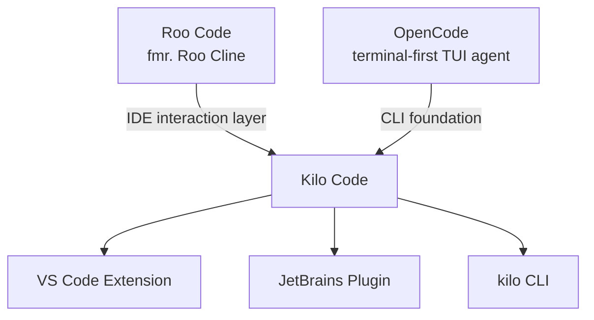
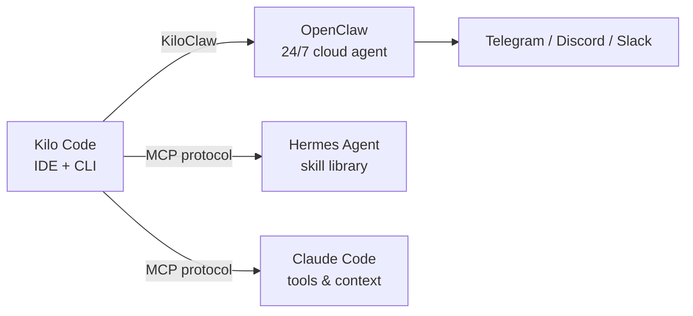

## What Is Kilo Code? 🤖

[**Kilo-Org/kilocode**][kilocode-gh] is an open-source **Agentic Engineering Platform** — not a code-completion plugin, but a system that can autonomously plan, write, test, and refactor code across an entire project. It positions itself as the open-source alternative to GitHub Copilot and Cursor.

The key word is *agentic*: Kilo understands whole-codebase context and executes multi-step tasks the way a real engineer would, rather than generating isolated snippets.

- **License**: Apache-2.0 (commercially permissive)
- **GitHub stars**: 1.8k+ and growing
- **Business model**: open-source core + optional hosted API gateway (Kilo Gateway) at zero markup

---

## Dual Lineage: A Fork of Two Projects 🧬

Kilo Code is built from two distinct open-source roots:



| Layer | Source | What it contributes |
|---|---|---|
| **IDE extension** | Roo Code (fork of Roo Cline) | Agent modes UI, Diff viewer, chat panel |
| **CLI** | OpenCode | Native TUI, multi-session, LSP integration |

The community sometimes refers to it as a "sloppy fork" because early versions still surfaced OpenCode branding in deep error paths — a known artifact, not a bug.

---

## Core Features ⚙️

### Multi-Mode Agent Roles

Kilo assigns specialist roles within a single session:

| Mode | Responsibility |
|---|---|
| **Architect** | Plans the implementation path; waits for approval before handing off |
| **Coder** | Writes and modifies files |
| **Debugger** | Finds and fixes errors |
| **Custom** | User-defined modes for specific workflows |

### Orchestrator — Parallel Sub-Agents

Introduced in v7.2.x (early 2026), the **Orchestrator** mode decomposes a large task and dispatches it to multiple sub-agents running in parallel. For example: one sub-process queries documentation while another rewrites code, both reporting back to a coordinator.

### Memory Bank and Codebase Indexing

Kilo maintains a **Memory Bank** — a persistent index of the project's structure, dependencies, and past decisions — to avoid context loss when working on large codebases. This is the mechanism that differentiates it from stateless chat interfaces.

### Model Support: 500+ Options

Kilo is model-agnostic by design:

- Cloud: Claude 3.x, GPT-4o, Gemini, DeepSeek, Kimi K2.6, and hundreds more via [Kilo Gateway][gateway]
- Local: any Ollama or LM Studio model (Llama 3, DeepSeek-V2, etc.)
- Pattern: use an expensive model for planning, a cheap one for implementation, a third for review

### Autonomous Execution

It can run terminal commands directly — install dependencies, execute test suites, read error logs, self-correct, and loop until tests pass. For frontend projects it can drive a browser for end-to-end testing.

### AGENTS.md

Kilo promotes the `AGENTS.md` convention: a file placed in the project root that defines project-specific AI guidance rules (coding style, off-limits paths, preferred libraries). Analogous to a `.cursor-rules` or `CLAUDE.md` file.

---

## Installation 🚀

### CLI

Requires Node.js ≥ 18.

```bash
# Install globally
npm install -g @kilocode/cli

# Or run without installing
npx @kilocode/cli
```

First launch runs an interactive setup to configure API keys. Verify the installation points at the right project:

```bash
kilo hello   # detects language/framework of the current directory
```

### VS Code Extension

Search **"Kilo Code"** in the VS Code Extensions marketplace. After install, a `K` icon appears in the sidebar; enter an API key in the settings panel.

### Local Models via Ollama

```bash
# 1. Pull a model
ollama run deepseek-v2

# 2. In Kilo settings, set Provider → Ollama, URL → http://localhost:11434
```

This path costs nothing beyond electricity and keeps code entirely off-network.

---

## IDE Plugin vs CLI 🖥️

Both interfaces share the same backend logic but feel meaningfully different in practice.

| Dimension | IDE Plugin | CLI (`kilo` command) |
|---|---|---|
| **Ease of use** | ⭐⭐⭐⭐⭐ — chat-like, familiar | ⭐⭐⭐ — requires comfort with TUI |
| **Change visibility** | Git-style Diff per line, accept/reject per hunk | Auto-applied; confirmation at task level |
| **Safety** | High — every edit is manually confirmed | Medium — commands run automatically |
| **Task scope** | Best for targeted file edits | Best for large, cross-file, system-level tasks |
| **Performance** | Shares IDE memory; can lag | Lightweight, fast startup |
| **Remote use** | Requires IDE open | Works over SSH on headless servers |

**Common pattern among advanced users**: run the IDE plugin for inspection and micro-edits, drop into the terminal for the heavy jobs (`kilo fix the build error`).

---

## Kilo Code vs Claude Code 🔍

| Feature | Kilo Code | Claude Code (Anthropic) |
|---|---|---|
| **Open source** | Apache-2.0, fully open | Closed source |
| **Model support** | 500+ models, BYOK | Primarily Claude 3.x series |
| **Pricing** | Tool is free; pay only API costs | Claude Pro / Anthropic Console |
| **Agent design** | Multi-Mode + Orchestrator (parallel) | Single-agent, sequential deep reasoning |
| **Context strategy** | Memory Bank + codebase index | Very large context window (1M+ tokens) |
| **IDE integration** | VS Code, JetBrains, CLI | CLI-primary |
| **Startup** | Slightly heavier (initialises index) | Near-instant |
| **Autonomy style** | Plans first, requests approval, then executes | Executes continuously, self-checks inline |
| **Privacy** | Local model option via Ollama | Always cloud, code sent to Anthropic |

**One-line framing**: Claude Code is an iPhone — exceptionally polished, one ecosystem, premium price. Kilo Code is a high-end Android — modular, anything goes, you control the cost.

### When to pick which

**Choose Kilo Code** when:
- You want to use cost-effective models (DeepSeek, local Llama) for most work
- You need privacy — sensitive codebases, offline/airgapped environments
- You prefer an IDE sidebar workflow
- You need parallel sub-agents on large refactors

**Choose Claude Code** when:
- You need the strongest available reasoning on a tangled architectural bug
- Your workflow is terminal-native and you want tight Anthropic integration
- API cost is not the primary concern

---

## Kilo in the Broader Ecosystem 🌐



### KiloClaw

Kilo's managed version of OpenClaw — a 24/7 cloud agent that runs without a local IDE. Assign it a long-running task, and it reports results back to Telegram or Slack when done.

### MCP Protocol

The [Model Context Protocol][mcp] (from Anthropic) is becoming the universal connector between these tools. Kilo, Claude Code, and Hermes Agent all support MCP, meaning:

- Hermes's skill library can be mounted as an MCP server inside Kilo
- Kilo's index can be shared with Claude Code
- Long tasks can be dispatched from Kilo to a cloud OpenClaw instance via MCP

### Suggested Composable Stack

| Layer | Tool | Role |
|---|---|---|
| Core engine | **Kilo CLI** | Daily coding, refactors, IDE integration |
| Skill memory | **Hermes via MCP** | Reusable task patterns across sessions |
| Long-running tasks | **KiloClaw** | Async jobs running 24/7 in the cloud |
| Hard logic problems | **Claude Code** | Called in for deep architectural debugging |

---

## Release Timeline 📅

| Date | Milestone |
|---|---|
| **2024 Q4** | Kilo-Org forked from Roo Code; independent direction established |
| **2025 March** | v7.0 released — Memory Bank and codebase indexing land; true Agent behaviour begins |
| **2025 November** | Sid Sijbrandij (GitLab founder) publicly backs the project; Kilo Gateway launches |
| **2026 Jan–Mar** | v7.2.x — Orchestrator mode introduced; AGENTS.md convention promoted |
| **2026 April** | Rapid Claude 3.7 and Kimi K2.6 support; OpenClaw cloud integration via KiloClaw |

---

## Summary

Kilo Code occupies a distinct niche: the open-source answer to Cursor, built from two proven foundations (Roo Code for IDE UX, OpenCode for CLI backbone), extensible to any model, and moving quickly toward a composable multi-agent future via MCP. It won't beat Claude Code on raw reasoning depth, but for cost control, model diversity, privacy, and IDE ergonomics, it is currently the most complete open alternative.

[kilocode-gh]: https://github.com/Kilo-Org/kilocode/
[gateway]: https://kilocode.ai/gateway
[mcp]: https://modelcontextprotocol.io/
