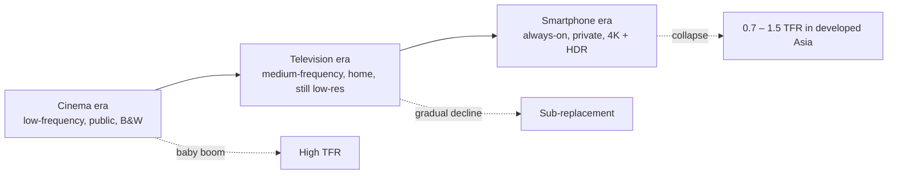

## Where global fertility stands in 2026

Global fertility is at a historic low and still trending down. The world is at a demographic inflection point.

- **Global average total fertility rate (TFR):** ~2.2
- **Replacement level (ignoring migration):** 2.1
- **1960s baseline:** ~5.0 (the global average has roughly halved in two generations)

Analysts expect the global average to fall below replacement for the first time in recorded history within the next few years.

### Regional picture

The global average hides enormous variance:

| Region / country cluster              | TFR       | Status                                                                          |
| :------------------------------------ | :-------- | :------------------------------------------------------------------------------ |
| **East Asia** (China, Japan, Korea)   | 0.7 – 1.0 | World's lowest. South Korea has touched ~0.7.                                   |
| **Europe & North America**            | 1.3 – 1.6 | Chronically sub-replacement; aging-driven pressure on pensions and labor.       |
| **Latin America & Southeast Asia**    | 1.7 – 1.9 | Brazil, Thailand, Vietnam — places once assumed to stay high — are below 2.1.   |
| **Sub-Saharan Africa**                | 3.5 – 5.8 | Still the engine of global population growth, though falling (from ~6.5 to ~4). |

### The standard explanations

Mainstream demography attributes the decline to a fairly stable set of drivers:

- **Women's education and labor-force participation** raise the age of first marriage and first birth.
- **Cost of living** — housing and child-rearing costs especially — suppress intended fertility (East Asia is the canonical case).
- **Modern contraception** gives couples tighter control over family size.
- **Value shift** from lineage/duty framings toward individual well-being and autonomy.

### Consequences

The second-order effects are structural, not cosmetic:

1. **Labor shortages** — fewer workers paying into pension systems, more retirees drawing out.
2. **Anemic growth** — weaker aggregate demand, and aging populations may sap innovation.
3. **Fiscal stress on healthcare and social security** as dependency ratios invert.

## An unconventional hypothesis: the visual environment

There is a contrarian reading that doesn't get much mainstream airtime, but is worth taking seriously. The claim, in one line:

> The more high-quality, sexually unattainable opposite-sex individuals a person sees in media and public space, the lower their fertility.

This is not the standard economic story. It treats the drop in fertility as a **cognitive-environmental** effect — a side effect of the information diet, not of the wallet.

### Why it's not obviously wrong

Two observations put pressure on the pure economic-determinism view:

1. **Strict religious communities** (e.g., Amish, Haredi/Hasidic Jewish communities) live inside modern economies. Their women have modern healthcare, many have secondary or higher education, they face the same price levels for goods. Yet their TFR stays at 3.0–6.0. The main variable that distinguishes them is the **visual and media environment**: no filtered faces, no algorithmic feeds, no beauty pageants, no stylized public displays of attractiveness.
2. **Parts of Sub-Saharan Africa** now getting cheap smartphones and data have begun showing fertility drops even when household economics, women's schooling, and lifestyle are essentially unchanged. The variable that flipped is **information access**, not material modernity.

If the economic story were the whole story, neither of those should happen.

### The mechanisms, in named terms

The hypothesis draws on several established ideas:

- **Supernormal stimuli** (Tinbergen). Organisms respond more strongly to exaggerated versions of natural signals than to the real thing. Filtered, retouched, surgically optimized, algorithmically curated faces and bodies are supernormal stimuli for the mate-evaluation system.
- **Mate-value calibration drift.** Repeated exposure to top-percentile attractiveness recalibrates the baseline. Partner satisfaction drops; self-assessed market position also drops. Both effects discourage commitment and reproduction.
- **Parasocial substitution.** One-way attachments to streamers, idols, short-form video personas, otome/romance-sim characters, etc., deliver cheap dopamine from a "mate-like" source with zero friction, zero negotiation, zero responsibility — displacing the costly work of real pairing.
- **Aesthetic saturation.** When extreme attractiveness is ambient and free, its novelty fades, real-life erotic charge gets diluted, and the drive to form bonds in meatspace weakens.

### A historical calibration point

Post-WWII America had mass media (film, TV) but also a strict self-censorship regime (the Hays Code, 1934–1968): on-screen sexuality was muted, married couples slept in separate single beds with one foot on the floor, and footage was low-resolution and black-and-white. That era was the **baby boom**. The medium existed, but its signal was kept at a distance from the viewer's real-world mate-evaluation system.

As technical fidelity rose (Technicolor, widescreen, later high-definition, then personal 24/7 feeds) and restrictions loosened, fertility in developed economies began its long slide. This is sometimes half-jokingly called the "image fidelity vs. fertility" correlation:

The claim isn't that media fidelity is the *only* driver — it's that as the visual signal gets closer to "real, available, and infinite," the mate-evaluation system misfires harder.

## Three governance models

Once you take the hypothesis seriously, societies roughly cluster into three patterns. Each produces a different fertility outcome.

| Model                                | Treatment of sex & visual attractiveness                                           | Fertility outcome                                                                                       |
| :----------------------------------- | :--------------------------------------------------------------------------------- | :------------------------------------------------------------------------------------------------------ |
| **Strict traditionalist** (Amish, Haredi) | Full blockade: no filtered images, no beauty industry, no mass media.         | High. Real partners are the only reference class; biological baseline undisturbed.                      |
| **Liberal / open**                   | Marketized and transparent: sex education, fewer taboos, higher real-world contact.    | Low, but less extreme. Sex decouples from reproduction, but in-person interaction stays live.       |
| **"Both and neither"** (e.g., China) | Real contact suppressed (restricted sex ed, anti-early-dating norms, porn banned), while beauty-filter and "edge-of-legal" soft content boom. | Lowest. Imagination is supercharged; real-world practice is starved.                                   |

The third pattern is worth isolating. It is the most punishing of the three because it pulls both levers the wrong way:

- Cuts off low-cost real-world practice at mate selection and intimacy, so social skills atrophy and real pairing feels high-stakes and costly.
- Simultaneously lets the most advanced beauty-filter pipelines and "suggestive but unreachable" content flood the same young people's feeds.

The result is a population with maximally inflated standards and minimally developed skills to act on them. Arousal without outlet. Desire without contact. This is more sterilizing than either pure traditionalism or pure liberalism.

## "Psychological violence" framing

A sharper version of the argument reframes the problem ethically. Showing people, at scale and on loop, **high-quality opposite-sex imagery that they have no path to interact with** isn't just entertainment — it's a form of harm:

- Biologically, desire exists to drive *action*. Algorithms trigger it continuously while structurally foreclosing action. The result is a chronic, ungrounded charge on the mate-evaluation system — an open loop with no reward.
- The harm is unequal: the system (platform + algorithm + studio-grade retouching) has overwhelming power relative to the individual viewer's cognition. That asymmetry is the defining feature of bullying.
- The side effect isn't just unhappiness — it's acquired aversion to real, biological bodies, which look "wrong" next to the filtered reference.

Under this framing, declining fertility isn't a preference; it's a **stress response**. When every real candidate fails a visual benchmark set by images that aren't even real, the safe move is to disengage entirely.

## What gets lost in the mainstream debate

The visual-environment story is uncomfortable for several structural reasons:

- **It collides with "visual freedom."** The logical endpoint is some kind of restriction on filtering, beauty pageants, cosmetic surgery advertising, or algorithmic push of top-percentile imagery. Liberal societies find this direction very hard to discuss seriously.
- **It's the third rail of the attention economy.** The short-video, livestream, cosmetics, medical-aesthetic, and ad industries are all monetizing exactly the mechanism the hypothesis indicts. Acknowledging the causal chain threatens trillion-scale revenue.
- **It feels unsolvable.** Housing cost, childcare cost, parental leave — these are policy-shaped. "The visual environment has rewritten people's mate-evaluation baseline" is not something a subsidy fixes. Societies prefer tractable framings.
- **It leans on evolutionary-psychology premises** — that human cognition can be hijacked by media artifacts at the species level — which is culturally unpopular even where it's empirically plausible.

A related observation: **restriction is not actually new** in modern societies. Hate speech, discriminatory advertising, tobacco marketing, and gambling access are all curtailed for stated public-good reasons. The hypothesis merely asks whether "unfiltered exposure to retouched/AI-perfected attractiveness" deserves the same scrutiny as a public-health hazard. It's a political question, not a technical one — and nothing about it requires halting scientific or industrial progress.

## Takeaways

- Global fertility in 2026 is near 2.2 and falling; East Asia is already well below 1.0 in places.
- The standard drivers (education, cost, contraception, values) are real but don't cleanly explain why fertility also drops in high-fertility-culture communities as soon as smartphones arrive, nor why tightly-sealed traditionalist communities stay fertile inside modern economies.
- A **visual-environment hypothesis** — supernormal stimuli, mate-value miscalibration, parasocial substitution — completes the picture better than pure economics.
- The worst configuration is the hybrid one: suppress real-world intimacy practice, amplify filtered imagery. It produces the steepest fertility declines on record.
- Whether this framing is accepted is less a scientific question than a political one, because the remedies cross several of modernity's sacred defaults.

The sober version of the conclusion: subsidies and housing reform are probably necessary but clearly not sufficient. If fertility is partly a function of the visual diet, then no amount of cash transfer will move the needle until the information environment itself changes.
