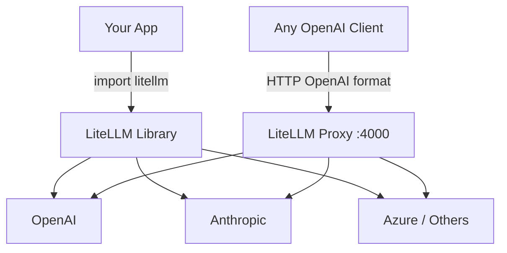

## What is LiteLLM?

LiteLLM is an open-source Python library that provides a unified interface for calling 100+ LLM providers — OpenAI, Anthropic, Azure, Cohere, and more — using the OpenAI API format. It removes provider lock-in by letting you swap models with a single config change.

## Two Ways to Use LiteLLM



### 1. Python Library (in-process)

Import LiteLLM directly in your app. It handles routing in-process.

```python
from litellm import completion

response = completion(
    model="gpt-4o",
    messages=[{"role": "user", "content": "Hello"}]
)
```

Your app links against LiteLLM, which forwards calls to the actual provider.

### 2. Proxy Server (standalone)

Run LiteLLM as a local HTTP server that any OpenAI-compatible client can talk to.

```bash
litellm --config config.yaml
# Listening on http://localhost:4000
```

Your app doesn't need the LiteLLM library at all — it just speaks the OpenAI REST format.

---

## Drop-in Replacement: Only Change Base URL and API Key

This is the main value of proxy mode. To switch an existing OpenAI client:

```python
from openai import OpenAI

# Before — direct to OpenAI
client = OpenAI(
    api_key="sk-...",
    # base_url defaults to https://api.openai.com/v1
)

# After — through LiteLLM proxy
client = OpenAI(
    api_key="anything",           # or a LiteLLM virtual key
    base_url="http://localhost:4000"
)
```

Everything else — `client.chat.completions.create(...)`, response parsing, streaming, tool use — stays **identical**. Since LiteLLM proxy mirrors the OpenAI REST spec, it's a drop-in at the HTTP level. The same applies to any OpenAI-compatible SDK (JS, Go, curl, etc.).

---

## OpenAI LLM APIs

LiteLLM proxy primarily emulates the **Chat Completions** endpoint, but here's the full landscape:

| API | Endpoint | Purpose |
|-----|----------|---------|
| **Chat Completions** | `POST /v1/chat/completions` | Primary API — streaming, tool use, vision, structured outputs |
| **Completions** *(legacy)* | `POST /v1/completions` | Old text-in/text-out, being phased out |
| **Embeddings** | `POST /v1/embeddings` | Text → vector embeddings |
| **Assistants** | `/v1/assistants`, `/v1/threads`, `/v1/runs` | Stateful multi-turn with built-in tools |
| **Batch** | `POST /v1/batches` | Async bulk completions at 50% cost discount |
| **Responses** *(newer)* | `POST /v1/responses` | Replacement for Assistants API |
| **Audio** | `/v1/audio/speech`, `/v1/audio/transcriptions` | TTS and Whisper STT |

Current Chat Completions models include `gpt-4o`, `gpt-4o-mini`, `o1`, `o3`, `o3-mini`, `o4-mini`.

For most use cases, **Chat Completions** is the API that matters — and the one LiteLLM proxy is optimised to emulate.

---

## When to Use Each Mode

| | Library Mode | Proxy Mode |
|---|---|---|
| **Setup** | `pip install litellm` | `litellm --config config.yaml` |
| **Client changes** | Replace SDK calls | Change base URL + key only |
| **Best for** | Single Python app | Multi-app, team-wide, non-Python clients |
| **Observability** | In-process callbacks | Centralised logging for all clients |
| **Model routing** | Per-call in code | Config-driven, outside app code |

The proxy shines for teams that want centralised control over model routing, cost tracking, and rate limiting — without touching each individual app.
