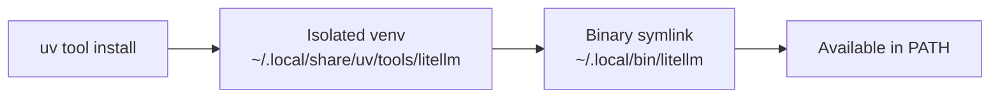

## The Command

```bash
uv tool install 'litellm[proxy]'
```

Three distinct pieces, each doing something specific.

## `uv` — The Package Manager

`uv` is a fast Python package and project manager written in Rust. It replaces `pip`, `pipx`, `virtualenv`, and more with a single binary. It's 10–100x faster than `pip` due to Rust internals and a shared global package cache.

## `tool install` — Isolated CLI Installation

`tool install` is `uv`'s equivalent of `pipx install`. It:

- Creates an **isolated virtualenv** for the package (no global dependency pollution)
- Exposes the package's **CLI binaries** in your `PATH`
- Lets you run the tool from anywhere without activating an environment



Compare with plain `uv pip install`, which installs into the current environment and doesn't manage a binary link.

## `litellm[proxy]` — Package with Extras

The `[proxy]` part is a **Python extras** specifier. Packages can declare optional dependency groups; `[proxy]` pulls in the extra deps needed to run LiteLLM as a server (e.g., `fastapi`, `uvicorn`).

Without `[proxy]`:

```bash
uv tool install litellm        # installs the library only
```

With `[proxy]`:

```bash
uv tool install 'litellm[proxy]'  # installs library + proxy server deps
```

The single quotes prevent the shell from interpreting `[` and `]` as glob characters.

## What LiteLLM Is

LiteLLM provides a **unified OpenAI-compatible API** that routes requests to 100+ LLM backends — Anthropic, Gemini, Ollama, Azure, and more. In proxy mode it runs as a local HTTP server, so any OpenAI-compatible client can point at `localhost:4000` without knowing which backend it's talking to.

## After Installation

```bash
# Start with a single model
litellm --model anthropic/claude-sonnet-4-6

# Start with a config file
litellm --config config.yaml
```

The proxy listens on `http://localhost:4000` by default and accepts standard OpenAI API requests.

## Summary

| Part | What it does |
|---|---|
| `uv` | Fast Rust-based Python toolchain |
| `tool install` | Install as isolated CLI tool (like pipx) |
| `litellm` | The package to install |
| `[proxy]` | Optional extra — pulls in server dependencies |
