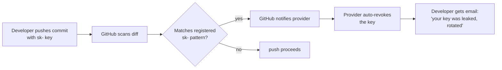

If you've used OpenAI, Anthropic, Stripe, or any number of other API providers, you've seen credentials that look like this:

```
sk-proj-abc123...
sk-ant-api03-xyz789...
sk_live_51H...
```

That `sk-` prefix isn't random. It's a deliberate, widely-copied convention with a clear purpose.

## What `sk-` Stands For

`sk-` is short for **secret key**. It's paired with a sibling convention:

| Prefix | Meaning           | Where it lives                          |
|--------|-------------------|------------------------------------------|
| `sk-`  | secret key        | Server-side only, never exposed         |
| `pk-`  | publishable key   | Safe to embed in client-side code (JS, mobile apps) |

Stripe popularized this split. They needed a way for merchants to use one credential in browser JavaScript (to tokenize cards) and a different one on their server (to actually charge those tokens). The prefixes made the distinction obvious at a glance — even to a developer copy-pasting in a hurry.

OpenAI adopted the convention. So did Anthropic, Replicate, Together, Fireworks, and most of the post-2020 AI API ecosystem. Today it's effectively the default for new API products.

## Why Everyone Copies It

The prefix isn't cryptographically meaningful — the entropy lives in the random part after it. So why bother?

### 1. Self-documenting leaks 🔍

A string starting with `sk-` is **instantly recognizable as a secret**, both to humans skimming logs and to automated scanners. If one shows up in:

- a screenshot in a bug report
- a paste in a Slack channel
- a commit pushed to a public repo
- a stack trace shipped to an error tracker

…anyone seeing it knows immediately that it shouldn't be there.

### 2. Secret-scanning tooling ⚙️

This is the big one. The major secret-scanning tools all key off known prefixes:

- **GitHub push protection** blocks pushes containing strings matching registered partner patterns. OpenAI, Anthropic, Stripe, and dozens more have registered their `sk-...` patterns so leaks get blocked at `git push` time.
- **gitleaks**, **truffleHog**, **detect-secrets**, and similar scanners ship with rule packs that look for these prefixes.
- **CI secret scanners** (Semgrep, Snyk, etc.) also rely on prefix-based detection.

Without a stable prefix, scanners would have to fall back on entropy heuristics — which produce far more false positives and miss obfuscated secrets.

### 3. Auto-revocation pipelines 🚨

Many providers participate in GitHub's **secret scanning partner program**. The flow:



A stable prefix is what makes this loop possible. Without it, the provider would have to scan every high-entropy string GitHub flags — far noisier and slower.

### 4. Internal classification at the provider 🏷️

On the receiving end, the prefix lets the API gateway route the request before doing the expensive lookup:

- `sk-proj-...` — project-scoped key (OpenAI)
- `sk-ant-api03-...` — Anthropic API v3 key
- `sk_live_...` vs `sk_test_...` — Stripe production vs test mode

The prefix encodes **key type, environment, and version** without needing a database hit. That's a real performance win at the edge.

## What the Prefix Doesn't Do

Worth being explicit about a few things `sk-` is **not**:

- ❌ It's **not encryption** or any kind of cryptographic signal. The prefix is plaintext.
- ❌ It's **not authentication** — anyone can put `sk-` in front of a string. The actual key material that follows is what matters.
- ❌ It **doesn't make the key safer to share**. Quite the opposite: the prefix is a giant flag that says *this is sensitive*.

The prefix is a **label**, not a security mechanism. Security comes from the random bytes after it (typically 32+ bytes of cryptographic randomness, base32/base64-encoded).

## Anatomy of a Modern API Key

Many providers have evolved past the bare `sk-<random>` form into a structured layout:

```
sk-ant-api03-aBcDeF...XyZ
│  │   │     │
│  │   │     └── high-entropy random component (the actual secret)
│  │   └──────── version tag (api03 = third major API key revision)
│  └──────────── vendor namespace (ant = Anthropic)
└─────────────── secret-key marker
```

This pattern — **role prefix + vendor + version + entropy** — has become standard. It gives providers room to roll out new key formats (e.g., bumping `api03` to `api04`) without breaking older keys, and lets scanners write more precise rules.

## Practical Takeaways

If you're a developer:

- ✅ Treat **anything starting with `sk-`** as production-secret. Never paste it into a chat, screenshot, or public file.
- ✅ Configure your repos with **GitHub push protection** — it's free and catches leaks before they ship.
- ✅ When you see `pk-` or `sk_test_`, those are the keys safe to commit or share. Know the difference per provider.

If you're designing your own API:

- ✅ Use a clear prefix scheme (`sk-`, `pk-`, plus your vendor namespace).
- ✅ Register the pattern with GitHub's secret-scanning partner program if you offer paid API access.
- ✅ Include a version field so you can rotate the format later without a flag day.

The convention costs nothing to adopt and plugs straight into a mature ecosystem of tooling that protects your users from themselves.
