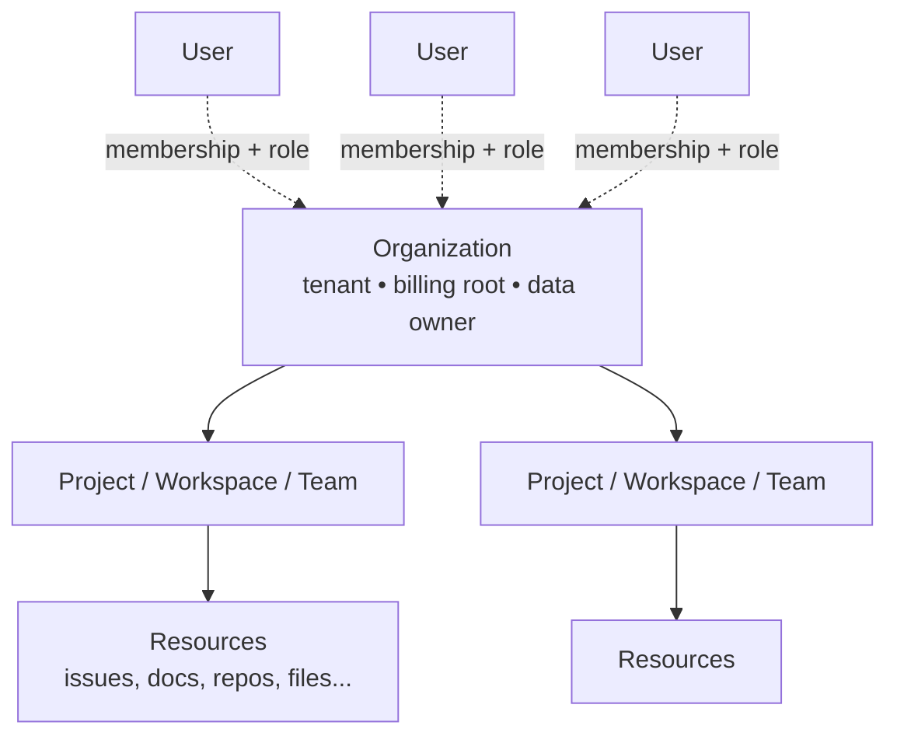

> **The data model is the product.** Whether a system is B2B, social, or somewhere in between is not a feature decision — it is the foundational choice of *who owns the data and who has power over it*. Everything else (UI, pricing, sales motion, even company culture) follows from that choice.

This post walks through the three dominant data-ownership shapes on the modern internet, the tensions baked into each, and why the choice determines whether you have built a workplace tool, a consumer product, or a platform business.

## 1. Three layers of "ownership" in any system

Before the model comparison, it helps to separate three things that often get conflated when people say "X owns the data":

| Layer | Who | What they can do |
|---|---|---|
| **Legal owner** | The organization (LLC / company / individual) | Bound by contract; signed the ToS |
| **Operational keyholder** | The admin account(s) holding credentials | Add/remove members, export, delete, change billing |
| **Ultimate root** | The platform provider itself (GitHub, Slack, Twitter, ...) | Lock out admins, comply with subpoenas, restore deleted data |

Most product/architecture confusion comes from treating these as the same. The legal owner is *supposed* to be in charge, but in practice control flows through whoever holds admin credentials. And above all of them sits the platform — invisible during normal operation, decisive during disputes, takedowns, or recovery.

## 2. The B2B multi-tenant model

The default shape of productivity SaaS:

GitHub, Linear, Slack, Figma, Notion, Stripe, Vercel — they all share this shape. The user is a *participant* in the org, not the *owner* of the data.

### Why orgs own data in productivity tools

- **Continuity** — if data lived on a personal account, an employee leaving would walk out with the company's work. Org ownership means the data stays when people churn.
- **Billing & seats** — the org is the contracting party. Per-seat pricing only makes sense if the org sits above the users.
- **Access control** — RBAC needs a tenant boundary. "Who can see what" only has meaning inside a unit larger than the individual.
- **Audit / compliance** — SOC2, GDPR, HIPAA, etc. require a clear owner of record for the data. The org is that owner.

### The IAM gap — and how enterprises close it

The legal owner (the company) is supposed to be in charge, but the operational keyholder (admins) actually holds the keys. A rogue admin or a dead admin is a real problem. Most of enterprise IAM exists to close this gap:

- **SSO / SAML** — identity moves out of the SaaS into an IdP (Okta, Azure AD, Google Workspace). The *company's IdP* becomes the root, not a personal admin account. Fire someone, they lose access automatically.
- **SCIM** — the IdP can provision/deprovision users in the SaaS without admin intervention.
- **Domain verification** — "you control the @company.com domain → you control the org." Recovery flows hinge on this.
- **Primary owner / break-glass accounts** — Slack Enterprise, Google Workspace, etc. layer a privilege tier above regular admins, often tied to billing or domain ownership.
- **Multi-admin requirements** — best practice (and sometimes enforced) to have ≥2 admins, no single point of failure.

The pain is most visible when a founder leaves a startup with the only admin credentials on Stripe / Vercel / the domain registrar. Recovery becomes a legal exercise: prove to the platform that you are the legitimate org, often via court orders or domain control. The legal owner has to claw back operational control from a departed individual.

## 3. The hybrid model — personal account + org tenant

Modern SaaS rarely picks one or the other. GitHub, ChatGPT, Notion, Figma, Vercel, Linear, Slack, Loom, Replit, Anthropic Console — all support both a **personal namespace** and an **organization namespace** for the same login.

> **Architecturally, the personal account is just a degenerate org with one member.** GitHub makes this explicit: a "namespace" can be either a user or an org, and they expose nearly identical APIs (repos, settings, billing). The mental model is the same — only the membership shape differs.

### Why this pattern won

- **Bottom-up adoption (PLG — product-led growth).** An individual signs up, uses it personally, brings it to work, and becomes the champion who tells their employer to buy a team plan. Slack, Notion, Figma, Linear all grew this way. Top-down enterprise sales alone cannot compete with developers/designers/PMs sneaking tools in.
- **Onboarding friction is the killer.** "Sign up with email and start" beats "create an org, invite members, set up SSO" by a wide margin for first-time use.
- **The personal account is a free funnel** for the paid B2B product. Most users never convert, but the ones who do bring whole companies with them.

### Tensions baked into the model

| Tension | What goes wrong |
|---|---|
| **Mode confusion** | "Did I push that repo to my personal account or the org?" GitHub forces explicit owner selection on every create action because of this. |
| **Data leakage** | Accidentally using a personal ChatGPT for confidential work, or storing client work in personal Notion. Often invisible until something goes wrong. |
| **Identity sprawl** | Same person logs in with personal email at home, work email at the office. Some end up with parallel accounts; some link both to one. |
| **Migration friction** | Moving a repo from personal → org is irreversible-ish; people get stuck with stuff in the wrong place. |
| **Billing double-dipping** | You pay for ChatGPT Plus personally, then your company gives you ChatGPT Team. Same user, two bills, no automatic reconciliation. |
| **Context switching** | Slack solved this brutally — separate workspaces = separate sessions. ChatGPT now does the same with personal vs workspace toggles. |

### Pure models for contrast

- **Pure-org** (Jira classic, Asana, Salesforce) — no personal mode. High onboarding friction, but no mode confusion or leakage. Lives or dies on enterprise sales.
- **Pure-personal** (Twitter, Instagram, Letterboxd) — no org mode. Cannot capture B2B spend, but identity stays clean.

The hybrid wins because **the same product can serve a freelancer and a Fortune 500**, capturing the entire revenue spectrum. The cost is all that mode-confusion / leakage / billing complexity, which the platform absorbs as a permanent UX tax.

## 4. The flat-social model — identity without hierarchy

Social media inverts the entire model:

> **The defining architectural choice of social media is that identity is flat.** There is no structural relationship between accounts. Whatever connection exists between, say, a CEO's account, an official company account, and an employee's account exists only in the *real world*, not in the data model.

### Consequences of flat identity

- **No automatic affiliation.** The platform has no idea that a personal account belongs to the CEO of the company that owns the official account. It cannot enforce "official spokesperson," cannot tie an employee's account to the company, cannot auto-revoke access when someone leaves.
- **Impersonation is the default failure mode.** Because affiliation is not structural, anyone can claim anything. A typo'd handle can pretend to be anyone. The platform has no native way to know.
- **Verification is a bolt-on.** The blue check (originally) was a manual workaround: "we confirmed this account is who it claims to be." It is a meta-layer adding identity claims on top of the flat model. The fact that paid verification broke trust so badly shows how load-bearing this layer was.
- **No org-level control.** A company has zero ability (in-product) to manage what its employees post on their personal accounts. Compare to a company Slack where the org owns every message. On Twitter, an employee's bad tweet is *their* tweet, not the company's. PR consequences exist only outside the system.
- **Symmetric reachability.** You can DM a CEO because there is no workspace boundary between you. This is the *social* part. Slack/Teams have walls precisely because they are work tools.

### The hidden hierarchy that does exist

The platform itself is not actually a peer of its users — it is the **platform-as-root** layer. Platform employees with backend access can suspend, shadow-ban, see DMs, etc. But this lives *outside* the user-facing data model. From the user perspective, all accounts are equal; from the operator perspective, there is a god-tier admin layer no user can see.

So the model is: **flat at the surface, hierarchical at the root**. The flatness is what makes it feel social. The hidden hierarchy is what makes moderation possible.

### Why this design wins for social and loses for work

- **Social** — you want to follow individuals, not orgs. You want to DM strangers. You want symmetric reach. Flat identity enables the network effects that define social media.
- **Work** — you want continuity when people leave. You want clear data ownership. You want to limit who can see what. Hierarchical identity is the entire point.

It is why no one has successfully merged the two. LinkedIn tries (you have a personal profile, but companies have pages, and you can claim employment) — but the "claimed" employment is just a string in your profile. There is no enforced relationship. Even the "verified employee" badge is opt-in via company admins, layered on top of flat accounts.

## 5. Why work doesn't happen on WhatsApp / Telegram / Discord

In theory, companies could run on WhatsApp, Telegram, or Discord. Many small ones do. But large/regulated companies pick Slack, Microsoft Teams, DingTalk, Feishu, or WeCom. The word that does the heavy lifting is **manageable**.

### What "manageable" actually means in B2B chat

| Capability | B2B chat (Slack/Teams/etc.) | Social chat (WhatsApp/Telegram/Discord) |
|---|---|---|
| Membership control | Admin adds/removes; deactivation cuts access instantly | You can leave voluntarily, screenshot before being kicked |
| Message ownership | Messages belong to the workspace; survive sender leaving | Messages live on individual devices; walk out with the person |
| Audit & compliance | eDiscovery, legal hold, retention policies | None of this exists |
| SSO / SCIM | Work identity tied to corporate IdP | Phone number / personal account, not employer-controlled |
| Channel structure | Organized by team/project, admin-controlled visibility | Flat, ad-hoc groups |
| Restrictions | Disable downloads, DMs to externals, guest invites | Few or no levers |
| Off-boarding | Off-board in IdP → gone from chat tool automatically | Ex-employee in a group chat is hard to fully expunge |

### DingTalk and Feishu — control-heavy variants

DingTalk and Feishu are not just "Slack for China." They are **management tools dressed as chat tools**, and they sit further along the control spectrum than Western tools:

- **DING / Ding-Ding** — force a message to be read via push, SMS, even a phone call. The recipient cannot ignore.
- **Read receipts on every message** (mandatory, can't disable) — manager sees exactly who has and has not seen a directive.
- **Org chart as first-class** — every chat is contextualized by reporting hierarchy. You can `@` an entire department.
- **Mandatory response windows** — manager can require ack within N minutes.
- **Clock-in, location tracking, performance metrics** — bundled into the same app.
- **Approval workflows** — leave requests, expense reports, all flow through chat.

Same B2B data model as Slack — very different point on the **control spectrum**. That spectrum reflects management culture: Western enterprise SaaS optimizes for *collaboration with auditability*; Chinese enterprise SaaS optimizes for *management with collaboration features*. Both are unthinkable on a social platform because **flat identity has no concept of "manager."**

### Where the line breaks down

- **Small companies / freelancers** — totally use WhatsApp/Telegram for work. They do not need eDiscovery; the manageability cost isn't worth the friction.
- **Discord as work tool** — open-source projects, crypto teams, indie game studios. Discord has servers/roles/admins that *look* B2B, but identity is still personal Discord accounts. It is the *form* of B2B without the *substance* of org-owned identity. Works for unregulated, low-stakes orgs; impossible for a bank.
- **Regional defaults** — WhatsApp Business is genuinely how a lot of small businesses in India, Brazil, and parts of Africa run customer service and even internal ops. The "social tools cannot do work" claim is mostly a Western enterprise framing.
- **WeChat → WeCom split** — Tencent literally split consumer WeChat into a separate enterprise product (WeCom) precisely because they realized you cannot bolt the management layer onto a social model. They had to fork it.

## 6. Is B2B a good business?

A natural question once you see how much of B2B is just "selling a digital mirror of company structure." The honest answer: **B2B is one of the best business shapes in software — but the strongest B2B businesses are not actually mirrors.**

### Why B2B is structurally great

- **Companies have budgets, individuals have wallets.** A $50/month consumer app is premium; $50/seat/month B2B is cheap. Willingness-to-pay is an order of magnitude higher per user.
- **Stickiness is real.** Once embedded in workflows, integrations, training, and data — switching costs are brutal. Churn drops to single digits annually for good enterprise products.
- **Predictable revenue.** Annual contracts, multi-year deals, expanding seat counts.
- **Net dollar retention >100%** — the same customer pays more next year as they add seats and modules. Mathematical compounding consumer products cannot match.
- **Sales scales differently.** 10,000 enterprise customers is a unicorn; 10 million consumers is barely a small social app.
- **Margins are insane.** Software is ~zero marginal cost; B2B prices are high. 70-90% gross margins are normal.

This is why public-market multiples on B2B SaaS are routinely 10–20x revenue, vs. 2–5x for consumer.

### Two kinds of B2B — mirror vs enabler

**1. Mirror products** — encode the customer's *existing* structure: org chart, projects, roles, workflows.

- Examples: Slack, Notion, Jira, Asana, Workday, BambooHR, Monday, Linear, Confluence.
- Useful and sticky, but not *enabling* anything new — they are digitizing what the company already does.
- Every customer's structure is slightly different, so these products become either rigid templates or endlessly customizable beasts (Salesforce, SAP).
- They tend toward **commoditization over time** — once "team chat" or "project tracker" is a category, switching costs keep customers in but pricing power erodes. Linear unseating Jira shows even sticky mirror products can be displaced by a better mirror.

**2. Enabler products** — provide a *capability* the customer could not build alone.

- Examples: AWS, Stripe, Snowflake, Cloudflare, Twilio, OpenAI API, Datadog, Plaid.
- These do not mirror anything — they let the customer *do something new*. Process payments globally. Spin up 10,000 servers in 30 seconds. Query petabytes in seconds.
- The moat is technological/operational, not workflow-encoding.
- Pricing power compounds because the customer's product literally depends on yours. Stripe takes 2.9% of every transaction forever; AWS takes a slice of every byte.
- These are the *best* businesses in software, period. They do not just have moats — they have gravity wells.

### A useful test

> **If your product disappeared overnight, what happens to the customer?**
>
> - Slack disappears: companies scramble, switch to Teams in two weeks, mostly survive. Annoying, not fatal.
> - AWS disappears: half the internet goes dark for months. Companies cannot independently replace it on any reasonable timeline.

Both are good businesses. Only the second has the kind of indispensability that produces decades of pricing power.

### The trap of pure mirroring

Pure-mirror SaaS has a hidden trap — **you are locked into reflecting your customer's reality, even when their reality is messy.** Reorgs break your assumptions. Customer-specific quirks demand customization. You become a consulting shop disguised as a product company. This is why mid-market mirror SaaS often has worse margins than people expect — implementation cost eats the SaaS margin.

## 7. The meta-pattern

Every model in this post — flat-social, B2B-tenant, hybrid-personal-plus-org, control-heavy-B2B — is fundamentally a choice about **who owns the data and who has power over it**. Features follow from that choice; UI follows from features; culture follows from UI.

The very best B2B businesses do not mirror — they **unbundle a capability** that used to live inside companies (computing, payments, identity, storage, ML inference) and sell it back as a utility. That is not "a mirror of company architecture"; it is "a piece of the company that no longer needs to exist." Every wave of B2B that produced a $100B+ outcome — AWS, Stripe, Snowflake, possibly OpenAI — followed this shape.

So the summary, sharpened:

- **B2B is a great business.**
- **Mirror-B2B is a good business that commoditizes.**
- **Enabler-B2B is a generational business.**
- **Hybrid models exist because PLG demands a personal-account on-ramp into the B2B tenant.**
- **Social media is a different category entirely** — flat identity makes the network effects of social possible and makes work-style management impossible.

The data model is not just architecture. It is organizational politics encoded in software, and the choice you make on day one determines which kind of company you can become.
