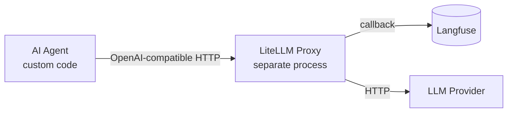
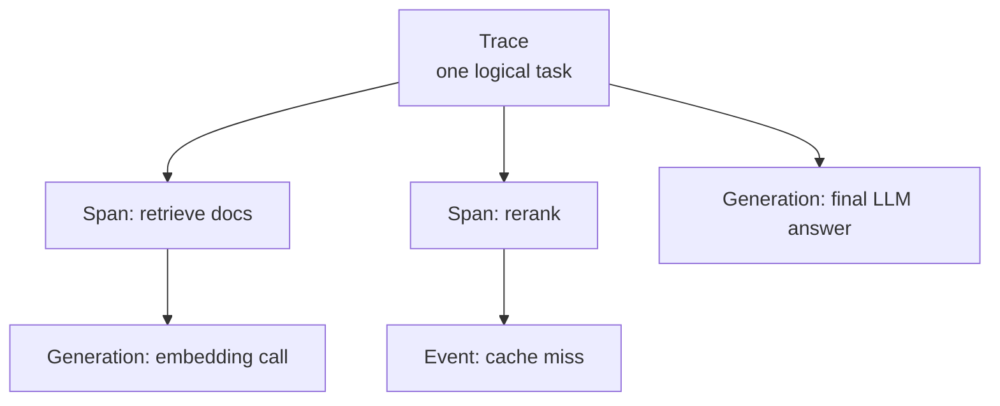
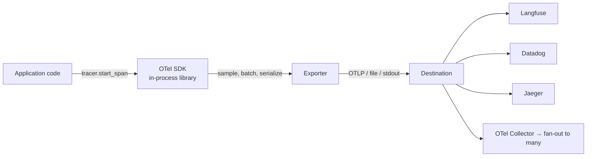
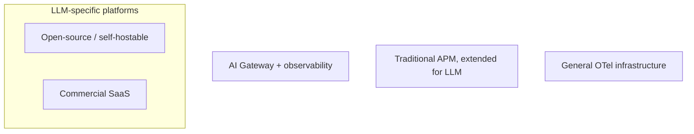

These are notes from a few days of poking at Langfuse for the first time. The starting point was a very ordinary setup — a custom AI agent talks to a LiteLLM proxy, and LiteLLM forwards traces to Langfuse. The interesting part was how much of the LLM-observability landscape unfolded once I started pulling on the thread of *"why am I only seeing one trace and one generation per call?"*.

## The setup, and what shows up



In this layout, **only LiteLLM emits telemetry**. The agent process itself does not. Every LLM call therefore appears in Langfuse as exactly one Trace containing exactly one Generation — nothing else. Not the agent's planning step, not its tool calls, not its retrieval, not its memory bookkeeping. Those events happen in a process that has no idea Langfuse exists.

Once that clicked, the rest of the questions answered themselves. So this post walks through them in the order they make sense, not the order I asked them.

## The Langfuse data model

The Tracing page shows two icons in the **Type** column. They look similar but mean different things:

- A double arrow → the row is a **Trace**
- A flower / pinwheel → the row is an **Observation** (specifically a Generation)

So a row is *either* a Trace *or* an Observation. Observations come in three subtypes:

| Type | Meaning | Has duration? | Typical use |
|---|---|---|---|
| **Generation** | An LLM call (input/output/model/tokens/cost) | Yes | `litellm.completion(...)`, OpenAI SDK call |
| **Span** | Any non-LLM unit of work | Yes | Retrieval, a tool call, a function execution |
| **Event** | A point-in-time event | No | "Cache hit", "guardrail tripped" |

The hierarchy:



A Trace is a container; observations live inside it and can nest. So the answer to *"can a Trace be understood as the user typing a question and seeing a final answer?"* is **yes for chat apps, but the boundary is yours to define.** Trace = whatever you call "one complete unit of work":

- Chat bot → one round of Q&A is one Trace; multi-turn dialogue is glued together with a `session_id`
- Agent task → one Trace covers the user's instruction plus dozens of internal LLM and tool calls
- Batch job → one Trace per processed document, with no live user
- Cron pipeline → one Trace per scheduled run

Multi-turn chat is Langfuse's argument for **Sessions**: each turn is its own Trace, but they share a `session_id`, so the Sessions page reassembles the conversation.

## The realization that demystifies everything

When you first see Langfuse, the feature list looks like sorcery — session replay, agent step timelines, tool-call visualisation, cost attribution. It feels like the platform is *reconstructing* what your agent did from the API calls.

It is not. **Langfuse is a structured-log database with a slick frontend.** What it can show you is exactly what was sent to it. The same is true of LangSmith, Arize, Phoenix, and every competitor.

- Send only LLM calls → see only LLM calls.
- Send a `trace_id` that ties multiple calls together → see a multi-step Trace.
- Send tool-call spans → see the agent's execution timeline.
- Send nothing → see an empty shell.

The "magic" lives in two non-obvious places:

1. **A good data model.** Trace / Observation / Generation / Span / Event is general enough to express almost any LLM workflow, supports nesting, and aggregates cleanly.
2. **Ecosystem integrations.** LangChain, LlamaIndex, OpenAI Agents SDK, LiteLLM all ship Langfuse instrumentation, so framework users feel like it's automatic. It isn't — the framework is doing the instrumentation on their behalf.

A useful mental model:

> Observability platform = an empty container waiting to be filled.
> Framework / SDK = the thing that fills it for you.
> Your code = the source of truth.

Once that lands, every observability tool stops feeling impressive in the abstract. The only two questions that matter become: *how does it want me to instrument?* and *how expensive is that instrumentation?*

## Why "one trace, one generation" happens

Two ways to send data to Langfuse:

1. **LiteLLM's `metadata` field** — *not* HTTP headers. Stuff like `trace_id`, `session_id`, `user_id`, `tags`, `generation_name` are passed in the request body's `metadata`. This is the lightweight option: no Langfuse SDK required, but you can still group multiple LLM calls under a shared `trace_id` so they show up as one Trace with N Generations.

   ```python
   response = client.chat.completions.create(
       model="gpt-4",
       messages=[...],
       extra_body={
           "metadata": {
               "trace_id": "agent-task-abc123",
               "trace_name": "research-task",
               "generation_name": "planning-step",
               "session_id": "user-session-xyz",
               "user_id": "user-001",
               "tags": ["agent", "production"],
           }
       },
   )
   ```

2. **Langfuse SDK with `@observe`** — turns an arbitrary function into a Span and lets you nest LLM calls, retrievals, tool calls under a single Trace.

   ```python
   from langfuse.decorators import observe

   @observe()
   def run_agent(query):
       result = retrieve(query)        # becomes a Span
       answer = call_llm(...)          # LiteLLM call auto-attaches as Generation
       return answer

   @observe()
   def retrieve(query):
       ...
   ```

The decorator works because `@observe` writes the active `trace_id` into a Python `contextvar`, and the in-process Langfuse instrumentation reads it from there.

**This breaks across process boundaries.** If the agent runs in process A and LiteLLM proxies in process B, the contextvar in A is invisible to B. The proxy will create a fresh Trace per request because nothing told it which Trace it belongs to. The fix is to *explicitly* pass `trace_id` (and friends) through the OpenAI-compatible request body, as in option (1) above. That's the only channel between the two processes.

So in the original setup, the wall is structural: Langfuse can only know what crosses the proxy boundary, and what crosses is one LLM call at a time.

## The custom-agent paradox

A natural next thought: *"Just add a framework, then. LangChain, LlamaIndex, Agents SDK — they all have Langfuse plug-ins."*

Look at the OpenRouter top agents and you find the opposite. The serious ones — Claude Code, Hermes Agent, Roo Code, Kilo Code, OpenClaw, pi — are all hand-written. None of them sits on a popular framework.

A few honest reasons:

1. **The agent loop is genuinely simple.** Pseudocode:

   ```python
   while not done:
       response = llm.call(messages, tools=tools)
       if response.tool_calls:
           results = execute_tools(response.tool_calls)
           messages.extend([response, *results])
       else:
           done = True
   ```

   Pulling in a hundred-thousand-line framework to wrap that often costs more than it saves.

2. **Framework abstractions fight production needs.** Real agents need byte-level prompt control, custom tool-call parsing (LLMs are creative about malformed JSON), streaming with mid-flight cancellation, multi-provider fallback, prompt-caching nuances per vendor, context compression, memory, persistence. Once a framework's abstractions diverge from those, escaping is harder than starting from scratch.

3. **Tool calling is already standardised at the API layer.** OpenAI's function-calling schema has become the de facto standard; Anthropic, Google, and most open models follow it. The framework's portability story is much smaller than it looks.

4. **Demo and production needs differ by ~100×.** Frameworks are great for the demo. The other 99% of the work — error handling, performance, observability, robustness — is exactly what frameworks are weakest at.

The uncomfortable consequence for the observability industry: **the agents that produce the most tokens are precisely the ones that don't use the frameworks observability vendors integrate with.** A tutorial that says "one line of code to plug LangChain into Langfuse" is irrelevant to the people who actually need observability the most.

This is also why hand-written agents tend to ship without observability for a long time. Without a framework picking the vendor for them, every agent project faces a paralysing question: *which vendor do we lock in to?* Many simply punt.

## OpenTelemetry: the actual answer

OpenTelemetry (**OTel**) is an open standard, maintained by CNCF, for telemetry data — *not* just logs. The pitch is the standardisation of how applications emit observability data and how backends consume it. The plug analogy is the right one: OTel is to observability what HTTP is to web or SQL is to databases.

Three kinds of data are in scope:

| Pillar | What it answers | LLM example |
|---|---|---|
| **Logs** | What happened? | `[ERROR] tool X returned malformed JSON` |
| **Metrics** | How is the system doing overall? | tokens/min, p95 latency, error rate |
| **Traces** | How did this one request flow through the system? | The agent's full step-by-step timeline |

For LLM observability, **Traces are the centre of gravity.** Everything you see in Langfuse's "session replay" or "agent steps" view is a tree of OTel-compatible spans, even if Langfuse historically used its own format.

What OTel actually standardises:

- **Data model** — what fields a Trace/Span must have (`trace_id`, `span_id`, `parent_span_id`, timestamps, attributes).
- **API** — how application code calls into instrumentation. `tracer.start_span("...")` looks the same across Python, Java, Go, JS.
- **SDK** — official implementations that handle sampling, batching, exporting.
- **Wire protocol (OTLP)** — over HTTP (port 4318) or gRPC (port 4317).
- **Semantic Conventions** — naming. HTTP is `http.response.status_code`, not `status`. The GenAI semantic conventions (still stabilising) cover `gen_ai.system`, `gen_ai.request.model`, `gen_ai.usage.input_tokens`, etc.

### How it actually runs



A few practical points:

- The SDK is **async and batched** by default — `start_span` is essentially "append to an in-memory queue". A backend outage won't stall the request path.
- The **OTel Collector** is a separate process that sits between apps and backends. Your app sends to a local collector; the collector handles retry, batching, sampling, and can fan out to multiple backends simultaneously (Langfuse + Datadog from the same source, for instance). Switching backends becomes a collector-config change, not a code change.
- **Sampling** is configurable — by ratio, by rule, by tail (only export traces that errored). Production deployments almost always sample.
- **Cross-process context** is propagated via the `traceparent` HTTP header, automatically. This is how a single Trace can span service boundaries.

A minimal Python setup:

```python
from opentelemetry import trace
from opentelemetry.sdk.trace import TracerProvider
from opentelemetry.sdk.trace.export import BatchSpanProcessor
from opentelemetry.exporter.otlp.proto.http.trace_exporter import OTLPSpanExporter

provider = TracerProvider()
exporter = OTLPSpanExporter(endpoint="https://<your-langfuse-host>/api/public/otel/v1/traces")
provider.add_span_processor(BatchSpanProcessor(exporter))
trace.set_tracer_provider(provider)

tracer = trace.get_tracer(__name__)
with tracer.start_as_current_span("agent.run") as span:
    span.set_attribute("user.id", "123")
    # ... business logic ...
```

Notice the business code says nothing about Langfuse. Switching to Datadog or Jaeger is one URL change.

## State of OTel support across platforms

Throughout 2025 and into 2026, OTel has effectively become the default for LLM observability. Not all platforms moved at the same speed:

| Platform | OTel posture |
|---|---|
| **Langfuse** | OTel-native — recent SDK is a thin wrapper over the official OTel client. Provides an OTLP endpoint. Active contributor to the GenAI SemConv. Explicitly anti-lock-in (you can fan out to other backends in parallel). |
| **LangSmith** | Added end-to-end OTel support relatively late — both ingestion and emission. Their proprietary format is still recommended for best performance, OTel is the compatibility option. |
| **Datadog** | Native support for the OTel GenAI SemConv. Before that, LLM Observability required Datadog's own SDK or hand-annotated spans, so OTel users had to maintain two instrumentation paths. |
| **Elastic (ELK)** | Heavy investment via **EDOT** (Elastic Distributions of OpenTelemetry) — their own collector and language SDKs, with LLM Observability now GA covering OpenAI, Azure OpenAI, Bedrock, Vertex AI. |
| **OpenLLMetry** (Traceloop) | Auto-instrumentation library, not a backend. Wraps 40+ LLM providers/frameworks and emits OTel spans to *anywhere*. Apache 2.0. |

The GenAI Semantic Conventions are still settling — different tools may still emit slightly different attribute names (`gen_ai.prompt` vs `gen_ai.input.messages`), and backends paper over the gaps. Expect another round of convergence in the near future.

## The full landscape, by camp

LLM observability is not one market. It splits into four camps with very different goals:



### 1. LLM-specific, open-source / self-hostable

For teams that need data sovereignty, refuse vendor lock-in, and can run their own infra.

| Tool | License | Niche |
|---|---|---|
| **Langfuse** | MIT | Most complete OSS option — tracing + prompt management + evaluation + datasets |
| **Arize Phoenix** | Elastic License 2.0 | RAG debugging, vector visualisation, drift detection; OSS sibling of Arize AX |
| **Lunary** | Apache 2.0 | Lighter-weight Langfuse alternative; smaller community |
| **OpenLLMetry** | Apache 2.0 | Auto-instrumentation library, not a backend |
| **OpenLIT** | Apache 2.0 | Same niche as OpenLLMetry |

Langfuse is the de facto leader of this camp.

### 2. LLM-specific, commercial SaaS

Differentiation here is usually evaluation, collaboration, or CI integration.

- **LangSmith** — first-party for LangChain / LangGraph stacks; zero-config when you're all-in.
- **Braintrust** — evaluation-driven development; CI checks that block regressing PRs.
- **Confident AI** — evaluation-first, ships dozens of built-in quality metrics (hallucination, faithfulness…).
- **Arize AX** — enterprise commercial sibling of Phoenix; mature ML monitoring DNA.
- **Maxim AI** — simulation + eval + observation, "agent lifecycle" framing.
- **Comet Opik** — Apache 2.0 with hosted option, claims strong write performance.
- **HoneyHive** — enterprise compliance (SOC 2, HIPAA, GDPR) ready out of the box.
- **Galileo** — strong on real-time guardrails and pre-response interception.
- **W&B Weave** — natural fit for teams already deep in Weights & Biases.
- **Fiddler** — extension of a long-standing ML monitoring product into LLMs.

### 3. AI Gateways with observability as a side-effect

These are primarily routing/proxy products. Observability is "free" because they're already in the request path.

- **Helicone** — gateway with caching and failover; HTTP-level logs.
- **Portkey** — routing, load balancing, fallback; multi-provider management.
- **LiteLLM Proxy** — what most of us probably touched first; forwards to Langfuse/LangSmith via callbacks.

The architectural ceiling: **gateways can only see API calls.** They cannot see the agent's internal state, tool calls, or planning. That's exactly the "1 trace, 1 generation" experience.

### 4. Traditional APMs extending into LLM

Good fit when the company already standardised on an APM and doesn't want a second observability product.

- **Datadog** — native GenAI SemConv support; unifies infra + LLM monitoring.
- **Elastic (ELK)** — EDOT + LLM Observability, dashboards for the major hosted providers.
- **New Relic** — added an AI monitoring module; OTel-compatible.
- **Splunk** — slower start, but accelerating.
- **Dynatrace** — has an AI Observability product, enterprise-leaning.
- **Grafana** — does not store data itself; pair with Tempo + Loki + Mimir, ingest OTel.

Common limitation across this camp: **operational metrics are strong, evaluation is weak.** They tell you whether the LLM ran and what it cost; they don't tell you whether the answer was any good. Many teams pair an APM with an LLM-specific platform for that reason.

### 5. General OTel infrastructure

Not LLM-specific, but absorbs LLM data because OTel is universal.

- **SigNoz** — OSS OTel-native APM.
- **Jaeger** — old-school distributed tracing.
- **Grafana Tempo** — trace backend.
- **Honeycomb** — high-cardinality query specialist; usage-based pricing.

## A simplified decision tree

- Just want to see LLM API calls, fastest path → Helicone or LiteLLM Proxy
- Want to see *inside* the agent, want to own the data → ⭐ **Langfuse self-hosted** (where this post started)
- All-in on LangChain/LangGraph → LangSmith with zero config
- Doing RAG, vector debugging is the pain → Phoenix
- Evaluation matters more than tracing → Braintrust or Confident AI
- Already running Datadog/Elastic → use their LLM module, don't add a new tool
- Long-horizon research, never want lock-in → OpenLLMetry instrumentation + any OTel backend

## Trends worth holding on to

1. **OTel is unifying the market.** Through 2025, every major platform either added or strengthened OTel support. Switching backends gets cheaper every quarter.
2. **The market is splitting along three sub-axes.** Pure tracing (Langfuse, SigNoz), evaluation-first (Braintrust, Confident AI), gateway-as-observability (Helicone, Portkey). No single tool wins all three; many teams run two or three in parallel.
3. **Traditional APMs are credible LLM contenders.** Datadog and Elastic have the technical pieces; what they lack is product polish in the LLM-specific UX. Their enterprise relationships and compliance posture make them hard to beat in big accounts.
4. **Pure-SaaS LLM-observability startups are squeezed.** Open source pulls from below, hyperscale APMs push from above. Some of the loudest names from a couple of years back have gone quiet.

## What this means in practice

For a custom agent calling out via LiteLLM today:

- The "1 trace, 1 generation" view is structural, not a misconfiguration. Until the agent itself emits telemetry, that's the ceiling.
- The cheapest improvement is to thread a stable `trace_id` (or `session_id`) through the OpenAI-compatible `metadata` field, so multi-call agent runs collapse into a single Trace in the Sessions view.
- The right long-term move is **OTel instrumentation in the agent itself** — not a Langfuse SDK. That choice keeps every backend on the table forever; Langfuse, by virtue of being OTel-native, would still receive everything if you keep it as the backend.
- For agent projects on GitHub that haven't done this yet, the most useful contribution is *not* "add Langfuse SDK" — it's "emit OTel spans". One PR; every observability backend benefits.

The summary line, if you want one:

> Langfuse is a database with a frontend. OpenTelemetry is the cable. The agent is the only thing that knows what's actually happening.
