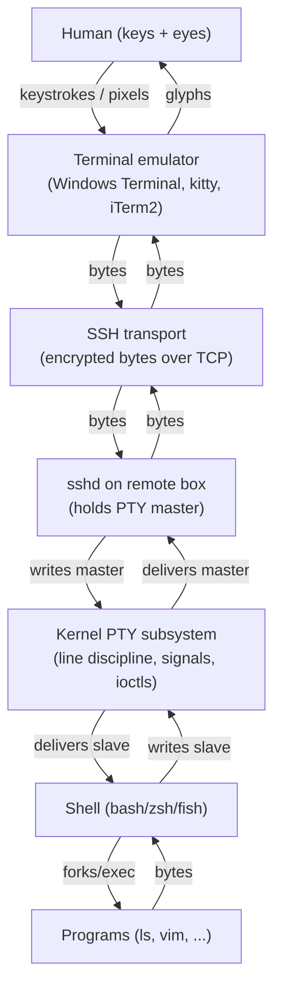

These terms get thrown around interchangeably, but they refer to genuinely different things stacked on top of each other. This post walks the stack from the human end to the program end, then shows how the pieces compose for a real SSH session.

## The stack at a glance



Every adjacent layer talks via **bytes**. The endpoints (human ↔ shell) are the only places where bytes turn into meaning.

## CLI vs TUI

There is no formal standards body that defines these. They are conventions. But the convention is consistent enough to be useful.

### CLI — Command-Line Interface

A program that takes arguments / stdin, writes to stdout / stderr, and exits. Line-oriented, non-visual. You can pipe it, redirect it, script it. It does not "take over" the terminal — it just produces text.

Examples: `ls`, `grep`, `cat`, `git log`, `curl`.

### TUI — Text / Terminal User Interface

A program that takes control of the terminal screen and draws an interactive UI using text characters. It uses ANSI escape codes (or a library like ncurses, Bubble Tea, Ink) to position the cursor, redraw regions, and handle keystrokes in raw mode. Full-screen, keyboard-driven, often modal. You generally cannot pipe into them meaningfully — they want a real TTY.

Examples: `vim`, `htop`, `tmux`, `less`, `lazygit`, `nano`, `mc`.

### The fuzzy middle

| Program type | Behavior | Typical label |
|---|---|---|
| REPL (`python`, `psql`) | Interactive, line-oriented | CLI |
| Pipeline widgets (`fzf`, `gum`) | TUI widget inside a pipeline | TUI-ish |
| Claude Code interactive mode | Redraws input box, captures keys | TUI |
| Claude Code `-p` print mode | Args in, text out | CLI |

### A rough test

> Does the program take over the screen and require a TTY?
>
> - Yes → TUI.
> - No, just reads args and streams text → CLI.

## Terminal emulator

A GUI application whose only jobs are:

1. Draw characters in a window.
2. Capture keystrokes and send them somewhere.
3. Interpret ANSI escape codes (colors, cursor moves, clear screen) in the byte stream coming back.

It "emulates" a 1970s hardware terminal — usually a DEC VT100 or an `xterm` superset. It does **not** execute commands itself. Examples: Windows Terminal, kitty, iTerm2, Alacritty, gnome-terminal.

## Shell vs bash

Shell is the **category**; bash is one **implementation**. The browser analogy works cleanly:

| Category | Implementations |
|---|---|
| Web browser | Chrome, Firefox, Safari, Edge |
| Shell | bash, zsh, fish, dash, PowerShell |
| Terminal emulator | Windows Terminal, kitty, iTerm2, Alacritty |
| Text editor | vim, emacs, nano, VS Code |

A shell is a program whose job is: read command lines, parse them, run other programs. The loop is *prompt → read → parse → fork+exec → wait → repeat.*

### POSIX is the loose "spec"

Browsers implement HTML/CSS/JS specs. Unix shells implement **POSIX sh** — a standard that defines core syntax and built-ins. bash, zsh, dash, ksh are all POSIX-compatible supersets, so a basic script works in all of them. Each adds its own extras (bash arrays, zsh globbing, fish's nicer interactive UX). PowerShell is a shell too but is a different family entirely.

### `sh` is special

`/bin/sh` is "the POSIX shell" — a role, not a specific program.

- Debian/Ubuntu → `dash`
- Older Linux → bash in POSIX mode
- Alpine → busybox

So `#!/bin/sh` means "any POSIX shell," while `#!/bin/bash` means "specifically bash."

### Defaults today

- bash — default login shell on most Linux distros.
- zsh — default on macOS since 2019.
- fish — gaining ground for interactive use because of its ergonomics, but not POSIX-compatible. People often script in bash and *use* fish.

## TTY — what it actually is

**TTY** = "teletypewriter." The name is a historical fossil — it referred to physical electromechanical typewriter terminals from the 1960s connected to mainframes over serial lines. The kernel device abstraction kept the name.

Today a TTY is the kernel's abstraction for an **interactive terminal device** — something that:

- Has a notion of a screen (rows × columns) you can query and resize.
- Supports raw vs. cooked input modes (line-buffered + echo, or character-by-character).
- Handles signals: Ctrl-C → SIGINT, Ctrl-Z → SIGTSTP, Ctrl-\ → SIGQUIT.
- Has a controlling process group, so the kernel knows who to signal.

On Linux you'll see two flavors of device file:

- `/dev/tty1`, `/dev/tty2`… — real **virtual consoles** (Ctrl-Alt-F1…F6).
- `/dev/pts/0`, `/dev/pts/1`… — **pseudo-terminals** (PTYs), what your terminal emulator and SSH actually use.

### Why it matters

Programs ask "am I attached to a TTY?" with `isatty(fd)` to decide how to behave:

- `ls` adds colors and columns when stdout is a TTY; plain output when piped.
- `git log` auto-pages on a TTY; streams raw when piped.
- TUIs like vim *require* a TTY — they need raw mode and the screen-size ioctls. That's why `vim < file.txt` misbehaves and why TUIs run in CI without a PTY hang or crash.

### Quick checks

```bash
tty            # path of your current terminal, e.g. /dev/pts/3 — or "not a tty"
stty -a        # current TTY settings (raw/cooked, baud, flow control...)
echo $TERM     # which terminal type the emulator claims to be (e.g. xterm-256color)
```

## The hardware-terminal era

Before TTYs were software, they were a real thing on a desk.

```
┌──────────────┐                          ┌────────────────┐
│   Mainframe  │   serial cable (RS-232)  │  Hardware      │
│   / minicomp │ ◄──────────────────────► │  terminal      │
│   running    │   typically 9600 baud    │  (VT100 etc.)  │
│   Unix       │   one wire each way      │  CRT + keyboard│
└──────────────┘                          └────────────────┘
```

- Not the internet — a **serial line** (RS-232). A big computer might have dozens of serial ports, one per logged-in user. The names `tty1`, `tty2` are direct descendants.
- 9600 baud ≈ 960 chars/second. Every character cost real time. That is why classic Unix tools have such terse output.

### The terminal itself wasn't dumb

A VT100 (DEC, 1978) was its own little computer:

- 8080 CPU, ROM with firmware, a few KB of RAM.
- A character generator chip that drew ASCII glyphs to the CRT.
- A keyboard scanner.

Its firmware ran a loop:

1. Read a byte from the serial port.
2. If printable → put its glyph at the cursor, advance.
3. If a control byte (CR, LF, BS, BEL) → handle it.
4. If the start of an **escape sequence** (`ESC [ … letter`) → parse and execute (move cursor, clear region, change color).

So when the host wrote `\x1b[2J\x1b[H`, the terminal's firmware interpreted it as "clear screen, home cursor." The host never touched pixels. It just sent bytes.

### Why escape codes are weird

Different vendors invented different escape sequences. DEC VT100, Wyse 50, ADM-3A, IBM 3270 — all incompatible. Unix's answer was **termcap** (later **terminfo**): a database describing each terminal's quirks, plus the `TERM` environment variable so programs could look up the right codes. That is why `echo $TERM` today still says `xterm-256color` — your modern emulator is *pretending to be* a specific historical terminal model so the database lookup works.

The DEC VT100 dialect won the standards war (later codified as ANSI X3.64 / ECMA-48), which is why "ANSI escape codes" today are mostly VT100 codes with extensions.

### Two flavors of "real" terminal

- **Printing terminals** (true teletypes, e.g. ASR-33): no screen — printed each character on a roll of paper. This is why `\n` and `\r` are *separate* characters: `\r` returned the print head, `\n` advanced the paper. BEL (Ctrl-G) actually rang a bell.
- **Glass TTYs / video terminals** (VT100 and friends): CRT screen, cursor, escape codes. "Glass" because the paper got replaced with glass.

## PTY vs TTY

> TTY is the abstraction. PTY is the specific kind you actually use today.

```
TTY (the abstraction: "a terminal device")
├── Real TTY  → backed by hardware (serial line, virtual console)
└── PTY      → backed by software (another process pretends to be the hardware)
```

A PTY *is* a TTY. It implements the same kernel interface. The difference is only what's on the *other end*.

### Real TTY

The "real" end is hardware or kernel-owned:

- `/dev/ttyS0` — physical serial port (modems, embedded devices, Cisco console cables).
- `/dev/tty1`…`tty6` — Linux **virtual consoles**. The kernel itself draws characters to the framebuffer.

### PTY (pseudo-TTY)

A **pair** of device files the kernel creates on demand: a **master** and a **slave**.

```
┌─────────────┐        ┌──────────────┐        ┌──────┐
│  emulator/  │ ◄────► │   PTY pair   │ ◄────► │ bash │
│  sshd/tmux  │ master │ /dev/ptmx +  │ slave  │      │
│  (driver)   │        │  /dev/pts/N  │        │      │
└─────────────┘        └──────────────┘        └──────┘
```

- The **slave** (`/dev/pts/N`) looks exactly like a real TTY to bash. bash has no idea it's fake.
- The **master** (`/dev/ptmx`) is the back door — whatever process holds it gets to play the role of the hardware terminal. It feeds bytes in (keystrokes) and reads bytes out (program output).

The driver process is whatever wants to *be* a terminal:

- A terminal emulator (kitty, Windows Terminal via WSL).
- `sshd` on the remote box when you log in over SSH.
- `tmux` / `screen` (which is why nesting works — tmux holds masters for each pane, while running inside another PTY).
- `expect`, `script`, CI runners that want to drive an interactive program.

### What the kernel PTY actually does

It is **more than just byte-shuffling** — but it does **no drawing at all**.

- **Allocates the master/slave pair** when something opens `/dev/ptmx`.
- **Line discipline (`n_tty`)**: in cooked mode, buffers a line until Enter, handles backspace, echoes typed characters back. In raw mode, passes bytes through.
- **Signal generation**: Ctrl-C on input → SIGINT to the foreground process group. Ctrl-Z → SIGTSTP. Ctrl-\ → SIGQUIT.
- **Job control**: tracks the foreground process group on this TTY.
- **`ioctl`s**: window size (`TIOCGWINSZ`), terminal modes (`termios`). When your emulator resizes, the master process calls `TIOCSWINSZ` and the kernel notifies the program via SIGWINCH.

What it does **not** do: parse escape codes, choose colors, render glyphs, manage a screen. Those bytes (`\x1b[31m`, `\x1b[2J`) pass through the PTY untouched — they are just data.

### One asterisk: kernel virtual consoles

The kernel **does** have drawing code, but in a *different* subsystem: the virtual consoles (`/dev/tty1`–`tty6`). There the kernel itself parses VT100 escape codes and draws glyphs to the framebuffer — it plays the terminal-emulator role because there is no userspace emulator yet (this is what you see before X/Wayland starts, or after Ctrl-Alt-F1). That is separate from the PTY subsystem. Outside of those virtual consoles, the kernel never draws.

## Worked example: SSH from Windows Terminal to Linux

### Physical / logical layout

```
[ Human ]
   │  keystrokes / pixels
   ▼
┌─────────────────────────────────────┐
│ Windows Terminal  ← terminal emulator (a Windows GUI app)
└─────────────────────────────────────┘
   │  bytes over TCP (encrypted)
   ▼
┌─────────────────────────────────────┐
│ sshd on the Linux box  ← creates a PTY for your session, holds the master
└─────────────────────────────────────┘
   │  reads/writes /dev/pts/N  via the kernel PTY
   ▼
┌─────────────────────────────────────┐
│ bash  ← the shell, a normal Linux process, sees a TTY
└─────────────────────────────────────┘
   │  forks child processes (ls, vim, …)
   ▼
   programs you run
```

### What happens when you type a key

1. Windows Terminal captures the keystroke and sends a byte over the encrypted SSH connection.
2. `sshd` on the remote box decrypts it and writes it to the **master** end of its PTY.
3. The kernel's PTY driver delivers it out the **slave** end.
4. bash, reading from its stdin (the slave), sees the byte.

### What happens when bash prints output

1. bash writes bytes (possibly including escape codes) to the slave.
2. The kernel delivers them to the master.
3. `sshd` reads the master, encrypts, and ships back over SSH.
4. Windows Terminal receives the bytes, parses any escape codes, and draws characters on screen.

### sshd is a proxy, not a terminal

`sshd` holds the master end purely to shuttle bytes:

```
            ┌─ reads master ──► encrypts ──► sends over TCP ─────┐
sshd loop:  │                                                     │
            └─ receives TCP ──► decrypts ──► writes to master ◄──┘
```

It never draws anything. It has no screen, no font, no idea what color "red" looks like.

### Division of labor

| Component | Job | Has pixels? |
|---|---|---|
| Windows Terminal | Draw screen, capture keys, parse ANSI codes | ✅ |
| SSH (transport) | Encrypt and ship bytes both ways | ❌ |
| sshd | Bridge SSH socket ↔ PTY master | ❌ |
| Kernel PTY | Pretend to be a terminal to bash | ❌ |
| bash | Run commands, write output as bytes | ❌ |

Only the endpoints know about humans:

- bash thinks it is talking to a terminal.
- Windows Terminal thinks it is talking to a person.
- Everything in between — sshd, the network, the PTY — is just a pipe.

### Why this layering matters

You can swap any middle layer without breaking things:

- Replace the emulator (use Alacritty instead of Windows Terminal) — bash does not notice.
- Replace SSH with `mosh` — bash and Windows Terminal do not notice.
- Insert `tmux` (which adds *another* PTY layer) — endpoints still do not notice.
- Replace bash with zsh (`exec zsh`) — emulator and PTY do not notice.

That independence is exactly why the four concepts feel tangled at first: they are separate pieces that happen to always show up together.

## A useful mental shorthand

> The PTY master is "the side a human would be on, if there were one." Whoever holds it stands in for the human.
>
> - Terminal emulator: emulator process stands in for the human, forwarding to/from a real human at the keyboard and screen.
> - sshd: stands in for the human, forwarding to/from a real human across the network.
> - tmux: stands in for the human, forwarding to/from another PTY (the one your emulator gave you).
> - `expect` / CI: a *script* stands in for the human, sending pre-programmed input.

The PTY does not care who is on the master side — human, network, script, another PTY. It just delivers bytes.

## Glossary recap

| Term | What it is |
|---|---|
| **CLI** | Program style: args in, text out, no screen takeover. |
| **TUI** | Program style: takes over the screen, needs a TTY, key-driven. |
| **Terminal emulator** | GUI app that draws glyphs, captures keys, parses escape codes. |
| **Shell** | Category: program that reads commands and runs other programs. |
| **bash** | One specific shell — POSIX-compatible, default on most Linux distros. |
| **TTY** | Kernel abstraction for "interactive terminal device." |
| **Real TTY** | TTY backed by hardware (serial port) or kernel framebuffer (virtual console). |
| **PTY** | Software TTY: a master/slave pair where userspace plays the hardware. |
| **sshd** | Daemon that bridges an encrypted socket to a PTY master on the remote box. |
| **Escape codes** | Byte sequences (mostly VT100/ANSI) that tell a terminal to move the cursor, change color, clear regions, etc. |
| **`TERM`** | Env var naming the terminal type, used to look up escape codes in terminfo. |
