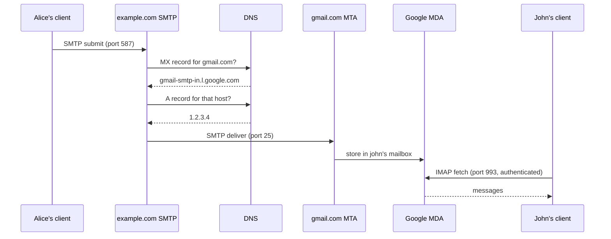

Email feels obvious until you try to explain it. This is a concept walkthrough of what email actually is at the protocol level — what's standardized, what's proprietary, and how the pieces fit together from sender to recipient.

## What Email Is

Email (electronic mail) is a method of exchanging digital messages over a network. At its core, email has two players:

- A **mail server** — software that sends, receives, and stores email
- A **mail client** — software a user uses to read and compose email

The server speaks open standards. The client connects to the server using those same standards. Everything else (UI, spam filtering, labels, search) is built on top.

## The Three Core Protocols

```
SMTP   — Simple Mail Transfer Protocol      (sending / server-to-server)
IMAP   — Internet Message Access Protocol   (client reads mail on server)
POP3   — Post Office Protocol               (client downloads mail)
```

| Protocol | Direction | Purpose | Default Ports |
|----------|-----------|---------|---------------|
| SMTP | client → server, server → server | send / relay | 25, 465, 587 |
| IMAP | client ↔ server | sync mail (mail stays on server) | 143, 993 |
| POP3 | client ← server | download mail (typically removes from server) | 110, 995 |

These are the universal standards. Any mail server in the world can send to any other because they all speak SMTP.

## How a Message Travels

When `alice@example.com` sends an email to `john@gmail.com`, here's what happens.



Two DNS lookups happen back-to-back: first an **MX query** to find the recipient's mail server hostname, then an **A query** to resolve that hostname to an IP. Then SMTP delivery, then storage, then the recipient's client fetches it via IMAP.

## MX Records

MX (Mail Exchanger) records are DNS records that say "deliver mail for this domain to this server."

```bash
$ dig MX gmail.com

gmail.com.  MX  5   gmail-smtp-in.l.google.com.
gmail.com.  MX  10  alt1.gmail-smtp-in.l.google.com.
gmail.com.  MX  20  alt2.gmail-smtp-in.l.google.com.
```

The number is **priority** (lower = tried first). Multiple MX records give failover — if the primary is down, sending servers try the next one automatically.

A neat consequence: MX records can point anywhere. A small company can own `company.com` but set their MX records to Google's servers — that's exactly how **Google Workspace** works. The company owns the domain; Google runs the mail infrastructure.

```
company.com  MX  1  aspmx.l.google.com
company.com  MX  5  alt1.aspmx.l.google.com
```

The user logs into Gmail to read mail addressed to `someone@company.com`. The MX record decides where mail is delivered — what comes before the `@` is irrelevant to routing.

## What's Standardized vs Proprietary

This is the key mental model:

```
Standardized (open, interoperable):
  - SMTP — server-to-server transfer
  - IMAP / POP3 — client mailbox access
  - RFC 5322 — message format (headers + body)
  - MIME — attachments and HTML

Proprietary (each provider's own):
  - internal storage (databases, sharding, etc.)
  - spam filtering / ML models
  - search indexing
  - labels, stars, categories (Gmail extensions)
  - Smart Reply, summaries, etc.
```

So Gmail's spam detection, labels, and category tabs are **not** part of email — they're features Google built on top. Outlook does it differently. Yahoo does it differently. The underlying mailbox protocol stays the same.

### Labels vs Folders

Standard IMAP only allows a message to live in **one folder**. Gmail uses **labels**, where one email can have multiple labels. To stay IMAP-compatible, Gmail maps each label to an IMAP folder and the same email appears in multiple folders simultaneously when accessed via IMAP.

## The Message Format (RFC 5322)

An email is plain text with two parts separated by a blank line:

```
HEADERS
(blank line)
BODY
```

Example:

```
From: alice@example.com
To: john@example.com
Date: Mon, 27 Apr 2026 10:00:00 +0000
Subject: Hello
Message-ID: <abc123@example.com>
MIME-Version: 1.0
Content-Type: text/plain; charset=UTF-8

Hi John,

This is the body of the email.

Alice
```

### Header Fields by Category

**Set by the sender's client:**

| Header | Purpose |
|--------|---------|
| `From` | Author of the message |
| `To` | Primary recipient(s) — informational, doesn't control delivery |
| `Cc` | Carbon copy, visible to all |
| `Bcc` | Blind carbon copy, stripped before delivery |
| `Subject` | Free-text summary |
| `Date` | When the message was composed |
| `Message-ID` | Globally unique ID for this message |
| `Reply-To` | Where replies should go (overrides `From`) |
| `In-Reply-To` | Message-ID of the email being replied to |
| `References` | Full chain of Message-IDs in the thread |

`In-Reply-To` and `References` are how clients build conversation threads.

**MIME headers (for attachments and HTML):**

| Header | Purpose |
|--------|---------|
| `MIME-Version` | Always `1.0`, declares MIME use |
| `Content-Type` | Body format: `text/plain`, `text/html`, `multipart/mixed`, `multipart/alternative` |
| `Content-Transfer-Encoding` | `7bit`, `base64`, `quoted-printable` |
| `Content-Disposition` | `inline` (display in body) or `attachment` (save as file) |

**Added by servers in transit:**

| Header | Purpose |
|--------|---------|
| `Received` | Trace line — every server adds one as the mail passes through |
| `Return-Path` | Bounce address (from SMTP envelope) |
| `DKIM-Signature` | Cryptographic signature proving the email came from the claimed domain |
| `Authentication-Results` | Receiving server's record of SPF / DKIM / DMARC checks |

A long chain of `Received:` headers shows the full delivery path — useful for debugging or tracing spam.

### MIME for Attachments

SMTP only carries ASCII. MIME (RFC 2045) extends it to support HTML, attachments, images, and non-ASCII text — by encoding everything as text:

```
Content-Type: multipart/mixed; boundary="boundary123"

--boundary123
Content-Type: text/html

<h1>Hello John</h1>

--boundary123
Content-Type: application/pdf
Content-Disposition: attachment; filename="doc.pdf"
Content-Transfer-Encoding: base64

JVBERi0xLjQK...

--boundary123--
```

Even binary attachments are transmitted as base64-encoded text. The whole email, top to bottom, is just text.

## Mailbox Structure (IMAP)

IMAP defines a mailbox as a **named container for messages**, organized hierarchically:

```
INBOX
INBOX/Work
INBOX/Work/Projects
Sent
Drafts
Trash
Spam
```

Each message has:

- **UID** — permanent integer ID within the mailbox
- **Flags** — state markers
- **Envelope** — parsed header summary
- **Body** — the full message

Standard flags:

```
\Seen       — read
\Answered   — replied to
\Flagged    — starred / marked
\Deleted    — marked for deletion (not yet removed)
\Draft      — not yet sent
\Recent     — newly arrived
```

### Deletion Is Two Steps

This surprised me: in IMAP, deleting an email doesn't actually remove it.

1. Set `\Deleted` flag on the message (still in the folder, just marked)
2. Send `EXPUNGE` — server removes all `\Deleted`-flagged messages

The `Trash` folder is just a regular folder with a conventional name. Most clients implement "delete" as **move to Trash**, then expunge later when the user empties trash.

```
User clicks delete    →  client moves email to Trash folder
User empties trash    →  client marks all in Trash with \Deleted, sends EXPUNGE
```

Folder names like `Trash`, `Sent`, `Drafts`, `Spam` carry no special meaning at the protocol level — they're conventions. RFC 6154 adds optional special-use attributes (`\Trash`, `\Sent`, etc.) to help clients auto-detect roles, but the folders themselves behave identically.

## Authentication

IMAP has authentication built into the protocol. The auth methods evolved over time:

```
LOGIN       — plaintext username/password (oldest)
PLAIN       — similar to LOGIN
CRAM-MD5    — challenge-response, password not sent in plaintext
OAUTH2      — modern token-based auth
```

Gmail no longer accepts plain passwords for IMAP. It requires **OAuth2**, which is why adding Gmail to a third-party client opens a browser window — that's the OAuth flow, not a password prompt.

```
Plain password   →  client knows your actual password
OAuth2           →  client only holds a temporary token
                    token can be revoked without password change
                    provider controls scope of access
```

## How Clients Find the Server

The client has to know which server to connect to. Two paths:

**Manual configuration** — the user enters server details:

```
Incoming (IMAP):  imap.gmail.com  port 993
Outgoing (SMTP):  smtp.gmail.com  port 587
Username:         user@gmail.com
```

**Auto-discovery** — the client extracts the domain and looks up:

- DNS SRV records like `_imaps._tcp.gmail.com`
- Mozilla autoconfig URLs like `https://autoconfig.gmail.com/mail/config-v1.1.xml`

Provider-native apps (Gmail app, Outlook) often skip IMAP entirely and use proprietary APIs. IMAP/SMTP settings are mainly relevant for third-party clients connecting across providers.

## Email Clients

### Most Widely Used

| Category | Clients |
|----------|---------|
| Desktop | Thunderbird, Outlook, Apple Mail |
| Mobile | Gmail app, Outlook mobile, Apple Mail, Spark, K-9 Mail |
| Webmail | Gmail, Outlook.com, Yahoo Mail, ProtonMail |
| Terminal | Mutt / NeoMutt, aerc, alpine, Himalaya |

Rough segmentation: Gmail and Apple Mail dominate consumer; Outlook dominates enterprise; developers and Linux users gravitate to Mutt or Thunderbird.

### Linux CLI Clients

The classic stack on Linux is composed of small tools rather than one monolithic client:

```
mbsync / isync   — sync IMAP mailbox to local Maildir
NeoMutt          — read / compose mail from local Maildir
msmtp            — send mail via SMTP
notmuch          — fast indexed search across all mail
```

Other notable CLI clients:

- **NeoMutt** — actively maintained Mutt fork, the default choice for terminal email
- **aerc** — modern TUI in Go, cleaner config, optional inline image support via sixel/kitty
- **alpine** — menu-driven, easier than Mutt, successor to Pine
- **Himalaya** — Rust, CLI-first (not TUI-first), scriptable with JSON output

Himalaya is interesting because it leans more into the unix philosophy than Mutt or aerc:

```bash
himalaya list                # list emails
himalaya read 42             # read by ID
himalaya write               # compose
himalaya reply 42            # reply
himalaya move 42 Trash       # move
```

Pipeable, scriptable, shell-friendly. The trade-off is a smaller community and less mature TUI compared to NeoMutt.

### Can CLI Clients Handle HTML and Attachments?

Yes — but differently than a GUI.

- **HTML body** → piped through a converter (`w3m`, `lynx`, `elinks`) to render as readable plain text. Most senders include a plain-text version anyway in `multipart/alternative`, so the HTML part is often skipped entirely.
- **Attachments** → can be saved or opened in an external program via `mailcap`:

```
application/pdf;  zathura %s
image/*;          feh %s
```

What CLI clients **cannot** do well: render full HTML email layout (CSS, embedded images, fancy newsletter design). For 99% of real email workflows that doesn't matter — the missing 1% is marketing email you probably don't want to read anyway.

## Mental Model Summary

```
The internet has agreed on:
  - how to transport mail              → SMTP
  - how to format a message            → RFC 5322 + MIME
  - how a client reads a mailbox       → IMAP / POP3
  - how to authenticate                → OAuth2 / SASL
  - how to find a domain's server      → MX records in DNS

Each provider builds on top:
  - storage, search, spam, labels, UI

Each user picks a client:
  - GUI, web, mobile, or CLI — all speak the same protocols
```

That's email. Old protocols, surprisingly elegant separations of concerns, and decades of proprietary features layered on top.
