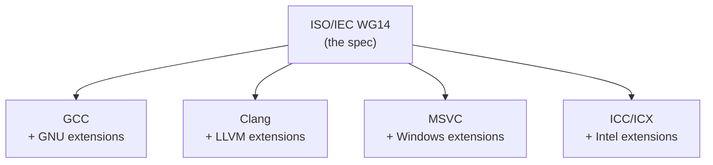

Unlike Python or Rust — which have a single authoritative website, a reference implementation, and official documentation — C is governed by a **paid ISO specification** with no official website, no single compiler, and no single standard library. Understanding why requires looking at both history and governance.

## Why There Is No "Official" C Website

Python has [docs.python.org](https://docs.python.org). Rust has [doc.rust-lang.org](https://doc.rust-lang.org). C has nothing equivalent. The reason is structural:

- **C is a standard, not a product.** It is governed by ISO/IEC WG14 — a committee of volunteers from companies like AMD, IBM, and Microsoft. They publish a specification document, not a website.
- **No single owner.** The Python Software Foundation owns Python. The Rust Foundation owns Rust. Nobody owns C in that sense.
- **C predates documentation culture.** Created in 1972 at Bell Labs — before the web, before open-source norms, before languages were expected to have docs sites.
- **The spec is a paid document.** ISO charges ~$200 for the official specification. Free drafts exist (e.g. N3220 for C23) that are nearly identical, but there is no official free resource.

The community filled the gap with **[cppreference.com](https://en.cppreference.com/w/c)** (unofficial but de facto standard) and `man` pages (implementation-specific).

## The C Standard

The standard is maintained by **ISO/IEC JTC1/SC22/WG14** and covers two things in a single document:

1. **The language** — syntax, types, operators, undefined behavior, memory model.
2. **The standard library** — required headers, function signatures, and guaranteed behavior.

Everything from `printf` and `malloc` to `<stdio.h>` and `<stdlib.h>` is specified in the same ISO document. The spec defines:

- What headers must exist
- What each function must accept and return
- What behavior is guaranteed
- What is implementation-defined or undefined

It does **not** define how the library is implemented internally, what binary format it ships in, or performance characteristics.

### C Standard Versions

| Version | Year | Notes |
|---|---|---|
| K&R C | 1978 | Original book by Kernighan & Ritchie |
| C89 / ANSI C | 1989 | First standardized version |
| C99 | 1999 | `//` comments, `stdint.h`, VLAs |
| C11 | 2011 | Threading, atomics, `_Generic` |
| C17 | 2018 | Bug fixes only |
| C23 | 2024 | `bool`, `nullptr`, attributes |

## The Relationship Between Spec and Implementation

Each compiler independently reads the spec and implements it, then adds its own extensions on top. Code written using only the standard is **portable**. Code using extensions is not.

The analogy is SQL: ISO defines SQL, but MySQL, PostgreSQL, and SQLite all implement it differently and add their own features. There is no "official MySQL that is SQL."

## C Compiler Implementations

| Compiler | Owner | Notes |
|---|---|---|
| GCC | GNU Project | Most widely used on Linux |
| Clang | LLVM / Apple | Default on macOS, widely used on Linux |
| MSVC | Microsoft | Default on Windows |
| ICC / ICX | Intel | Optimized for Intel CPUs |
| TCC (Tiny C) | Fabrice Bellard | Minimal, extremely fast compilation |
| PCC | Community | Based on original AT&T portable C compiler |
| SDCC | Community | Targets embedded/microcontrollers |
| CompCert | INRIA | Formally verified compiler |

## C Standard Library Implementations

The compiler and the standard library are **independent** — you can mix and match them. For example, Clang on Linux typically uses glibc, but can be paired with musl instead.

| Library | Used by | Notes |
|---|---|---|
| glibc | Linux (most distros) | Most feature-complete, large footprint |
| musl | Alpine Linux, embedded | Small, clean, strict spec compliance |
| UCRT | Windows (modern) | Replaced MSVCRT in recent Windows |
| MSVCRT | Windows (legacy) | Old Microsoft runtime, still common |
| Apple libc | macOS / iOS | Based on FreeBSD libc |
| FreeBSD libc | FreeBSD | Also the base for macOS version |
| newlib | Embedded systems | Common in bare-metal / RTOS |
| picolibc | Embedded systems | Smaller than newlib |
| dietlibc | Embedded / minimal Linux | Very small footprint |

All implement the same spec, so `printf` behaves the same across all of them — but the underlying code is completely different.

## Where to Find Documentation

Since there is no official site, these are the practical alternatives:

| Resource | What it covers |
|---|---|
| [cppreference.com/w/c](https://en.cppreference.com/w/c) | Best all-around reference; covers standard + notes on extensions |
| ISO draft PDFs (e.g. N3220) | The actual spec; authoritative but dense |
| `man 3 <function>` | glibc behavior on Linux |
| GCC manual (`gcc.gnu.org/onlinedocs`) | GNU extensions and compiler flags |
| Clang docs (`clang.llvm.org/docs`) | Clang-specific behavior |
| K&R book | Classic reference; covers C89 only |
