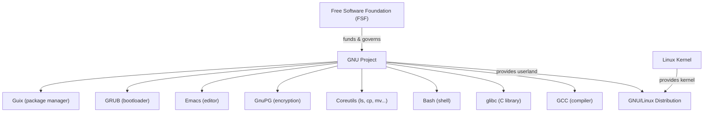

## What Is the GNU Project?

The GNU Project is a free software initiative launched by Richard Stallman in 1983. Its goal is to create a completely free (as in freedom) Unix-like operating system — one where users can run, study, modify, and redistribute the software.

The name is a recursive acronym: **GNU's Not Unix**.

GNU also produced the **GPL (GNU General Public License)**, the most widely used free software license. The project is maintained by the **Free Software Foundation (FSF)**, which Stallman also founded. The philosophical core is that software freedom is a matter of ethics, not just convenience.

### GNU + Linux

The Linux kernel combined with GNU userland tools forms what is commonly called "Linux" — but more precisely **GNU/Linux**. Stallman insists on this distinction because GNU components (glibc, Bash, Coreutils, etc.) are essential to most Linux distributions.

---

## Major GNU Software

### Compilers & Build Tools

| Package | Description |
|---|---|
| GCC | GNU Compiler Collection — C, C++, Fortran, Ada, Go, and more |
| Make | Build automation |
| Autoconf / Automake / Libtool | Build system generation tools |
| Bison | Parser generator (yacc replacement) |
| Flex | Lexical analyzer generator |

### Core Utilities

| Package | Description |
|---|---|
| Bash | Shell |
| Coreutils | `ls`, `cp`, `mv`, `rm`, `cat`, `echo`, `sort`, and many more |
| Findutils | `find`, `xargs` |
| Grep | Pattern search |
| Sed | Stream editor |
| Gawk | Text processing (GNU awk) |

### Libraries

| Package | Description |
|---|---|
| glibc | GNU C Library — the standard C library on Linux |
| GMP | Arbitrary precision arithmetic |
| libmicrohttpd | HTTP server library |

### Editors

- **Emacs** — extensible text editor with an active community
- **Ed** — classic line editor

### Networking & System

- **Wget** — file downloader (Wget2 in development)
- **Inetutils** — network utilities (`ftp`, `telnet`, `ping`, etc.)
- **GRUB** — bootloader
- **Shepherd** — init and service manager

### Privacy & Security

- **GnuPG (GPG)** — encryption and signing
- **GnuTLS** — TLS library

### Other Notable Projects

- **Octave** — numerical computation, MATLAB alternative
- **Guix** — package manager and Linux distribution
- **GNU Hurd** — the official GNU kernel (still incomplete)

> The full list exceeds 400 official GNU packages at [gnu.org/software](https://www.gnu.org/software/).

---

## Development Activity

Not all GNU packages are equally active. Here is a rough breakdown:

**Actively developed** ✅

- GCC, glibc, GnuPG, GnuTLS, GRUB, Guix, Bash, Emacs, Octave — frequent releases, ongoing work

**Maintained but slow-moving** 🔧

- Coreutils, Grep, Sed, Findutils — mostly feature-complete; occasional maintenance updates
- Autoconf/Automake — slow, partly superseded by CMake and Meson in modern projects

**Stagnant or superseded** ⚠️

- GNU Hurd — development crawls; Linux won the kernel race decades ago
- Ed — no new features; considered done
- Inetutils — largely superseded by OpenSSH and modern network tools
- Flex — maintained but rarely updated

The foundational tools (GCC, glibc, Bash, GPG) remain actively maintained because the entire Linux ecosystem depends on them.

---

## Contributor Demographics — Are Young Engineers Joining?

The honest answer: **fewer than you might expect**, especially compared to modern open source ecosystems.

### Why GNU Struggles to Attract New Contributors

- **Old codebases** — GCC, glibc, and Emacs internals are notoriously complex and intimidating
- **Dated workflow** — many GNU projects still use mailing lists instead of GitHub pull requests
- **Slow review cycles** — patches can take weeks or months to be reviewed
- **Copyright assignment** — GNU requires contributors to sign copyright over to the FSF, which many find off-putting
- **C dominance** — most GNU tools are written in C, which fewer new developers start with today

### Where Young Engineers Go Instead

- The Linux kernel (more prestige, more corporate backing)
- GitHub-hosted projects with modern tooling (Rust, Python, Go ecosystems)
- Corporate-backed open source (VS Code, Kubernetes, React, etc.)

### Where GNU Does Get Fresh Contributors

- **Guix** attracts younger, academically-inclined contributors — it is a modern project using Scheme/Guile
- **GCC** and **glibc** receive contributors via Google Summer of Code
- **Emacs** has a devoted community that still brings in new people

---

## Who Gets Paid?

Most GNU contributors are **volunteers**. Here is how the funding actually works:

### Paid Indirectly by Employers (most common)

Companies like **Red Hat, Intel, IBM, Google, and ARM** employ engineers whose job responsibilities include contributing to GCC, glibc, Binutils, and other GNU projects. The engineer is paid by the company — not by GNU or the FSF — but their work hours go toward GNU software. Red Hat has historically been the largest corporate contributor to GCC and glibc.

### FSF Staff (small, paid)

The FSF employs roughly 10–15 people. Most handle operations, legal work, and campaigns — very few are paid to write GNU software directly.

### Grants and Fellowships

- Google Summer of Code stipends reach some contributors
- The FSF has offered fellowships occasionally, but these are rare

### The Sustainability Problem

Critical infrastructure like glibc and GCC is partly maintained by volunteers or by people whose employers happen to fund it. If major corporate sponsors pulled their engineers, some GNU projects would be in serious trouble. This is a known and unresolved sustainability problem — not unique to GNU, but acute here given how foundational the software is.

---

## Architecture Overview

---

## Summary

| Dimension | State |
|---|---|
| Core tools (GCC, glibc, Bash, GPG) | Actively maintained |
| Niche/older tools | Stagnant or superseded |
| New contributor flow | Below modern open source norms |
| Contributor pay | Mostly indirect via employers; FSF employs very few |
| Long-term sustainability | Partly dependent on corporate goodwill |

GNU's influence on computing is immense — nearly every Linux system runs GNU software — but the project faces real challenges around contributor pipeline and funding that remain unresolved.
