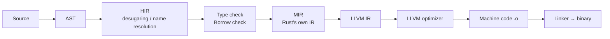

LLVM is a compiler infrastructure project — a collection of reusable libraries for building compilers, language runtimes, and related tools. Despite its original name "Low Level Virtual Machine," it is not a virtual machine. The name is considered misleading today and the project is simply called LLVM.

## Core Idea: The Universal IR

The central concept of LLVM is its **intermediate representation (IR)** — a platform-independent assembly-like language that code gets compiled *to* before being compiled *into* machine code. LLVM IR is the glue that lets many different language frontends share a single optimizing backend.

```
Source code → Frontend → LLVM IR → Optimizer → LLVM Backend → Machine code
```

Because the optimizer works on IR, every language that targets LLVM gets all backend optimizations and all target architectures for free.

## Components

| Component | Role |
|-----------|------|
| **LLVM IR** | Platform-independent intermediate representation |
| **LLVM optimizer** | Transforms IR into more efficient IR |
| **LLVM backend** | Emits machine code for a target (x86, ARM, RISC-V, …) |
| **Clang** | C / C++ / Objective-C frontend that uses LLVM |
| **LLD** | LLVM's linker |
| **LLDB** | LLVM's debugger |

## How Rust Uses LLVM

Rust's compiler (`rustc`) does more than just emit LLVM IR — it has its own internal pipeline before handing off to LLVM.



**MIR (Mid-level IR)** is Rust-specific and sits between HIR and LLVM IR. Rust-specific concerns — borrow checking, drop elaboration, const evaluation, monomorphization — are handled at the MIR level, because LLVM IR has no concept of ownership or lifetimes. By the time LLVM sees the code, all of that has already been resolved.

Rust also supports alternative codegen backends that consume MIR and bypass LLVM entirely:

- **`rustc_codegen_cranelift`** — uses Cranelift, faster debug builds
- **`rustc_codegen_gcc`** — uses GCC's backend, for targets LLVM supports poorly

## GCC vs. Clang/LLVM

Both GCC and Clang produce high-quality machine code. The difference is in the path and ecosystem.

**GCC path:**
```
C source → GIMPLE / RTL (GCC's internal IRs) → machine code
```

**Clang path:**
```
C source → LLVM IR → machine code
```

| | GCC | Clang / LLVM |
|---|---|---|
| **Runtime performance** | Slightly ahead in some numeric/scientific workloads | Within 1–5%; often comparable |
| **Compilation speed** | Slower in many cases | Faster in many cases |
| **Error messages** | Adequate | Significantly clearer |
| **Tooling ecosystem** | Weaker | Strong (clangd, clang-tidy, clang-format, sanitizers) |
| **Cross-compilation** | More complex | Easier — one install, many targets |
| **License** | GPL | MIT/Apache (more permissive) |
| **Architecture support** | Stronger for niche/older targets | Excellent for mainstream targets |

The performance gap is small and shrinking. In practice, most projects choose Clang for its **tooling** — the IDE integration (clangd), linters, formatters, and sanitizers (AddressSanitizer, UBSanitizer) are excellent. GCC remains the default on many Linux systems and is still preferred for the Linux kernel, though kernel Clang builds are now supported.

## History

**2000–2003 — Research origins**

Chris Lattner started LLVM as a PhD research project at the University of Illinois at Urbana-Champaign. The goal was a modern, SSA-based compilation system built as reusable libraries — a deliberate contrast to GCC's monolithic design. LLVM 1.0 released in 2003.

**2005 — Apple hires Lattner**

Apple needed a C/C++/Objective-C compiler it could tightly integrate into proprietary tools like Xcode. GCC's GPL license made that difficult. Apple hired Lattner and funded the creation of **Clang** as a new frontend for LLVM, under a more permissive license.

**2007–2011 — Clang matures**

Clang rapidly became competitive with GCC. Its dramatically better error messages won over developers. The LLVM 2.x and 3.x series brought major optimizer improvements and new target backends. In 2011, LLVM and Clang won the **ACM Software System Award**.

**2010–2015 — Industry adoption explodes**

- 🦀 **Rust** (2010) — adopted LLVM as its backend from early on
- 🍎 **Apple** (2010) — made Clang the default compiler in Xcode
- 🐦 **Swift** (2014) — built on LLVM from day one
- 📊 **Julia** — uses LLVM for JIT compilation
- 📱 **Android NDK** — switched from GCC to Clang

**2017 — Lattner leaves Apple**

Lattner left for Tesla, then Google Brain, then co-founded Modular (makers of Mojo). LLVM continued under community governance — the project had grown far beyond any single contributor or company.

**LLVM Foundation**

The LLVM Foundation was established to handle governance, the annual LLVM Dev Meeting, and legal ownership, fully decoupling the project from any one company.

## Who Uses LLVM Today

LLVM is arguably the most influential compiler infrastructure ever built. It underpins:

- Clang (C / C++ / Objective-C)
- Rust (`rustc`)
- Swift
- Julia
- Kotlin/Native
- Zig
- CUDA (Nvidia's compiler toolchain)
- WebAssembly toolchain (wasm-pack, Emscripten)
- Most modern GPU shader compilers (Metal, SPIR-V)

Nearly every new programming language started in the last 15 years targets LLVM rather than building its own backend. The alternative — writing a full optimizing backend from scratch — is years of work. LLVM makes that unnecessary.