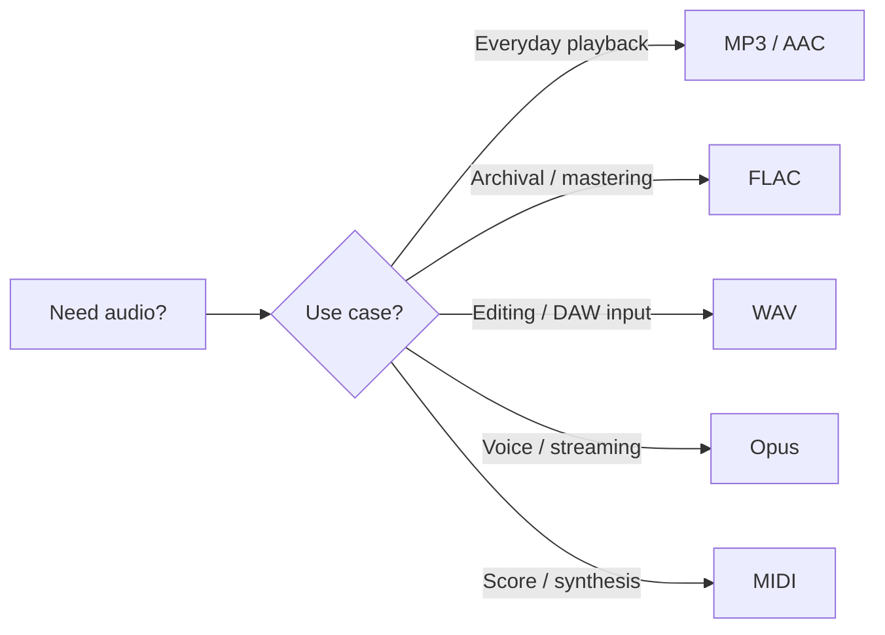
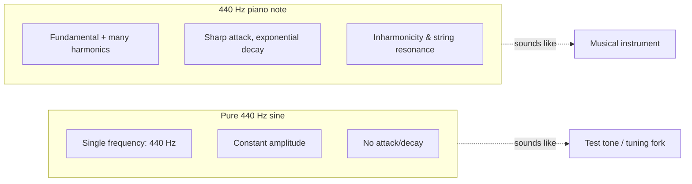

Two related questions: **what audio file formats exist**, and **how do you actually create one** — say, a 1-second 440 Hz tone, first as a pure sine and then as something piano-like? This note collects both.

## Common audio file formats

Audio formats split cleanly along two axes: **lossless vs lossy** (does compression discard information?) and **container vs codec** (how the bytes are wrapped vs. how the samples are encoded). For day-to-day purposes, the format families below are what you'll meet.

### Lossless

| Format    | Extension     | Notes                                                  |
| --------- | ------------- | ------------------------------------------------------ |
| **WAV**   | `.wav`        | Microsoft/IBM, uncompressed PCM, large, universal      |
| **AIFF**  | `.aiff`/`.aif`| Apple's WAV equivalent, uncompressed                   |
| **FLAC**  | `.flac`       | Free Lossless Audio Codec, ~50% the size of WAV, open  |
| **ALAC**  | `.m4a`        | Apple Lossless — FLAC's counterpart in Apple's world   |

### Lossy

| Format          | Extension       | Notes                                                  |
| --------------- | --------------- | ------------------------------------------------------ |
| **MP3**         | `.mp3`          | Most universally supported; ubiquitous                 |
| **AAC**         | `.aac`/`.m4a`   | Successor to MP3; default for YouTube, iTunes, streaming |
| **OGG Vorbis**  | `.ogg`          | Open source; used by Spotify, games                    |
| **Opus**        | `.opus`         | Modern, excellent at low bitrates; WhatsApp, Discord, YouTube |
| **WMA**         | `.wma`          | Microsoft, mostly legacy                               |

### Other / niche

- **MIDI** (`.mid`) — *not* actual audio. It's a score: instructions for synthesizers (which note, when, how loud, on which instrument).
- **DSD** (`.dsf`, `.dff`) — high-resolution audio used by SACD.
- **AMR** (`.amr`) — speech codec, older mobile voice recordings.

### Quick rule of thumb



## Generating a pure 440 Hz tone

440 Hz is **A4** (concert A) — the standard tuning reference. Generating one second of it is a one-liner in several tools.

### FFmpeg (most universal)

```bash
ffmpeg -f lavfi -i "sine=frequency=440:duration=1" tone.wav
```

Switch to MP3 by changing the output extension. Add `-ar 44100` to set sample rate, `-b:a 192k` for MP3 bitrate.

### SoX (audio Swiss-army knife)

```bash
sox -n tone.wav synth 1 sine 440
```

`-n` means "no input file"; everything is synthesized.

### Python (only `numpy` + stdlib `wave`)

```python
import numpy as np, wave

sr = 44100
t = np.linspace(0, 1, sr, endpoint=False)
samples = (0.5 * np.sin(2 * np.pi * 440 * t) * 32767).astype(np.int16)

with wave.open("tone.wav", "w") as w:
    w.setnchannels(1)
    w.setsampwidth(2)        # 16-bit
    w.setframerate(sr)
    w.writeframes(samples.tobytes())
```

### Audacity (GUI)

`Generate → Tone → 440 Hz, 1 s → Export`.

## Generating a 440 Hz piano note

A pure sine sounds nothing like a piano. A piano tone needs:

1. **Harmonics** — multiples of the fundamental, with characteristic amplitudes.
2. **An ADSR envelope** — sharp attack, then exponential decay (no sustain on a real piano without the pedal).
3. Ideally, a **real piano sample** — synthesis approximations only get you so far.

Options, easiest to most realistic:

### 1. MIDI + soundfont via FluidSynth (best result)

A4 is MIDI note 69. With a free General MIDI soundfont:

```bash
sudo apt install fluidsynth fluid-soundfont-gm
# create a tiny MIDI file with one note (see Python below), then:
fluidsynth -ni -F piano.wav /usr/share/sounds/sf2/FluidR3_GM.sf2 input.mid
```

### 2. Python with `pretty_midi` (writes MIDI + renders in one go)

```python
import pretty_midi, soundfile as sf

pm = pretty_midi.PrettyMIDI()
inst = pretty_midi.Instrument(program=0)  # 0 = Acoustic Grand Piano
inst.notes.append(pretty_midi.Note(velocity=100, pitch=69, start=0, end=1))
pm.instruments.append(inst)

audio = pm.fluidsynth(fs=44100)           # requires fluidsynth installed
sf.write("piano.wav", audio, 44100)
```

### 3. Synthesized approximation (no soundfont, just math)

Sum a few harmonics and apply an exponential decay envelope. Sounds *vaguely* piano-ish, not convincing — useful when you can't depend on a soundfont.

```python
import numpy as np, wave

sr = 44100
t = np.linspace(0, 1, sr, endpoint=False)

# (harmonic number, relative amplitude)
harmonics = [(1, 1.0), (2, 0.5), (3, 0.25), (4, 0.15), (5, 0.1)]
wave_sum = sum(a * np.sin(2 * np.pi * 440 * n * t) for n, a in harmonics)

env = np.exp(-3 * t)                      # piano-like decay
samples = (wave_sum * env / np.max(np.abs(wave_sum)) * 0.8 * 32767).astype(np.int16)

with wave.open("piano.wav", "w") as w:
    w.setnchannels(1)
    w.setsampwidth(2)
    w.setframerate(sr)
    w.writeframes(samples.tobytes())
```

### 4. FFmpeg can't do this directly

`ffmpeg -f lavfi` only generates basic waveforms (sine, square, sawtooth). For piano timbre you need either a soundfont engine (FluidSynth) or your own synthesis.

## Pure tone vs. piano: what actually differs



The fundamental frequency is the same — what makes it sound like a piano is **everything else**: the spectrum of overtones, how those overtones decay at different rates, the strike transient at the start, and (for a real piano) sympathetic resonance from undamped strings. Synthesis approximations capture some of this; sampling captures all of it.

## Cheat sheet

- **Just need a beep / tuning reference?** `ffmpeg -f lavfi -i "sine=frequency=440:duration=1" tone.wav`
- **Need a piano-ish note?** Use FluidSynth + a GM soundfont, with MIDI note 69 for A4.
- **Want full control?** Generate samples in Python with `numpy`, write with `wave` or `soundfile`.
- **Picking a format to save in?** WAV for editing, FLAC for archival, MP3/AAC for sharing, Opus for voice.
