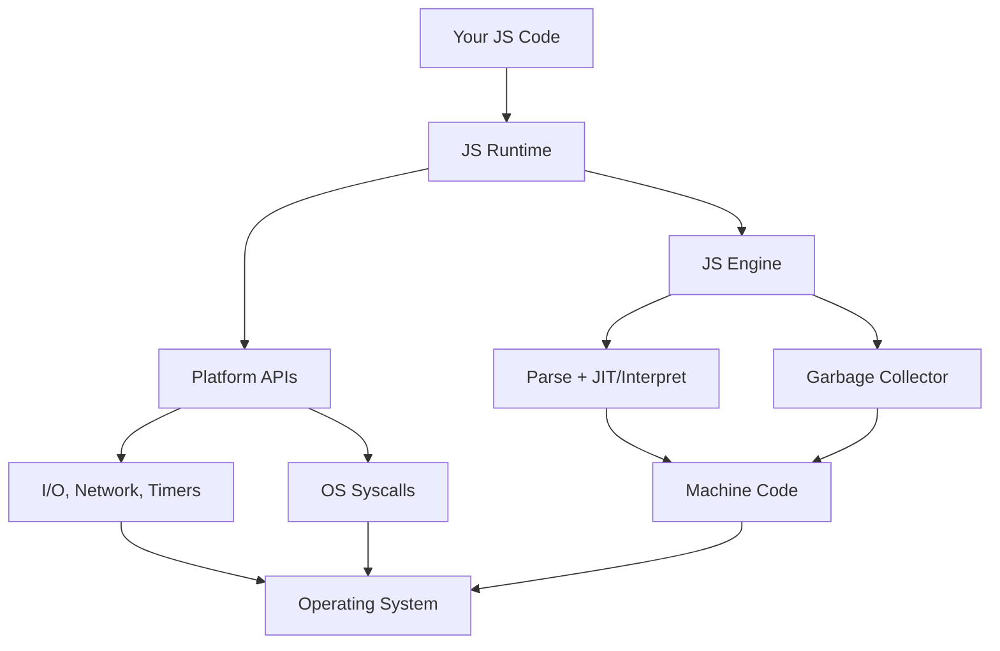

## What is a language runtime?

A **language runtime** is the environment that executes a program written in a particular language — the layer between your code and the operating system that provides the services the language needs to actually run.

It typically includes:

- **Execution engine** — interprets bytecode (JVM, CPython) or runs JIT-compiled code (V8, .NET CLR). For "compiled-to-native" languages like Go or Rust, the runtime is a smaller library linked into the binary.
- **Memory management** — garbage collector, allocator, stack management.
- **Concurrency primitives** — goroutine scheduler (Go), event loop (Node.js), green threads.
- **Standard library bindings** — I/O, networking, OS syscalls exposed in language-native form.
- **Type system support** — reflection, dynamic dispatch, exception handling.

Compare with:

- **Compiler/interpreter** — translates source code; the runtime is what executes the result.
- **Standard library** — APIs you call; the runtime is what makes those calls work.
- **OS** — the runtime sits on top, abstracting OS differences for the language.

## Engine vs runtime — the key distinction

In the JavaScript world this distinction matters a lot:

- **JS engine** — knows the *language*. Parses, compiles, executes ECMAScript. Manages the JS heap and GC. Knows nothing about files, networks, or timers.
- **JS runtime** — knows the *environment*. Embeds an engine + adds everything you need to actually do useful work (I/O, timers, networking, modules).

> **Mental model:** engine = the language; runtime = the engine + the world it runs in.

A useful analogy: an engine is an engine block. Chrome is one car built around it; Node.js is a different car built around the same engine.

## Layered view of Node.js

Node.js is a clean example of how a runtime stacks on top of an engine.

| Layer | Provides |
|---|---|
| **V8** (engine) | The JS language: syntax, `Array`, `Promise`, GC, JIT |
| **libuv** | Event loop, async I/O, thread pool, timers |
| **Node core C++ bindings** | Bridges V8 ↔ libuv ↔ OS syscalls |
| **Node standard library** | `fs`, `net`, `http`, `process`, `Buffer`, `stream`, etc. |
| **Module system** | CommonJS (`require`), ES modules, `node_modules` resolution |

Without Node, V8 alone can run `[1,2,3].map(x => x*2)` but can't open a file or listen on a port.

The browser is also a JS runtime — just one whose "standard library" is **Web APIs** (DOM, `fetch`, `localStorage`, `window`) instead of `fs` and `net`.

## Popular JavaScript engines

| Engine | Maintainer | Used By |
|---|---|---|
| **V8** | Google | Chrome, Edge, Node.js, Deno, Electron, Cloudflare Workers |
| **JavaScriptCore (JSC)** *aka Nitro* | Apple | Safari, Bun, iOS WebViews, React Native (default) |
| **SpiderMonkey** | Mozilla | Firefox, Thunderbird, GNOME Shell |
| **Hermes** | Meta | React Native (optimized for mobile) |
| **QuickJS** | Fabrice Bellard | Embedded systems, small runtimes (e.g. txiki.js) |
| **ChakraCore** | Microsoft *(archived 2021)* | Legacy Edge, Node-ChakraCore |

Quick notes:

- **V8** dominates server-side and most desktop browsers. JIT-heavy, fastest at peak throughput.
- **JSC** is the main competitor — also high-performance JIT, more memory-efficient than V8 in many workloads.
- **SpiderMonkey** is the oldest (Brendan Eich's original 1995 engine, continuously evolved).
- **Hermes** skips JIT entirely — precompiles to bytecode for fast startup on mobile.
- **QuickJS** is tiny (~210 KB), interpreter-only, embeddable in C projects.
- **ChakraCore** is dead — Edge switched to Chromium/V8 in 2020.

Honorable mentions: **Boa** (Rust), **engine262** (spec reference), **Moddable XS** (microcontrollers), **Duktape** (small ES5-ish embeddable engine).

## Popular JavaScript runtimes

### Server-side / general-purpose

| Runtime | Engine | Notes |
|---|---|---|
| **Node.js** | V8 | The default. Huge ecosystem, npm, libuv-based event loop. |
| **Deno** | V8 | By Node's creator Ryan Dahl. Secure-by-default, TS built-in, Web APIs (`fetch`, `Request`). |
| **Bun** | JavaScriptCore | Fast startup, built-in bundler/test runner/package manager. Node-compatible. |

### Browsers (each is a JS runtime)

| Runtime | Engine |
|---|---|
| **Chrome / Chromium / Edge** | V8 |
| **Safari** | JavaScriptCore |
| **Firefox** | SpiderMonkey |

### Edge / serverless

| Runtime | Engine | Notes |
|---|---|---|
| **Cloudflare Workers** | V8 (isolates, not processes) | Sub-ms cold start. Web APIs, no Node built-ins by default. |
| **Vercel Edge Runtime** | V8 isolates | Built on Cloudflare's model. |
| **Deno Deploy** | V8 | Deno's serverless platform. |
| **AWS Lambda@Edge / Fastly Compute** | V8 / WasmTime | Fastly uses Wasm, not pure JS. |

### Desktop / hybrid

| Runtime | Engine | Notes |
|---|---|---|
| **Electron** | V8 + Chromium + Node.js | VS Code, Slack, Discord. |
| **Tauri** | System WebView (varies) | Rust backend, lighter than Electron. |
| **NW.js** | V8 + Chromium + Node.js | Older Electron alternative. |

### Mobile

| Runtime | Engine | Notes |
|---|---|---|
| **React Native (Hermes)** | Hermes | Default since RN 0.70. Bytecode precompiled. |
| **React Native (JSC)** | JavaScriptCore | Legacy default. |
| **NativeScript** | V8 / JSC | Direct native API access from JS. |

### Embedded / IoT

| Runtime | Engine | Notes |
|---|---|---|
| **Espruino** | Custom | Microcontrollers (ESP32, etc.). |
| **Moddable XS** | XS | Tiny devices. |
| **Low.js** | Duktape | Node-like for ESP32. |

### Niche / historical

- **Rhino** — JS on the JVM (Mozilla).
- **Nashorn** — JVM JS engine (deprecated in JDK 15).
- **GraalJS** — modern JVM JS runtime, replaces Nashorn.
- **txiki.js** — tiny runtime on QuickJS + libuv.
- **WinterJS** — SpiderMonkey-based, WinterCG-compliant.

## Node.js vs Deno vs Bun

The big three on the server.

### Foundations

| | **Node.js** | **Deno** | **Bun** |
|---|---|---|---|
| **First release** | 2009 | 2020 (1.0) | 2022 (1.0 in 2023) |
| **Creator** | Ryan Dahl | Ryan Dahl (again) | Jarred Sumner / Oven |
| **Language** | C++ | Rust + V8 | Zig + JavaScriptCore |
| **JS engine** | V8 | V8 | JavaScriptCore (Safari's) |
| **Event loop** | libuv | Tokio (Rust) | Custom (Zig) |
| **License** | MIT | MIT | MIT |

### Performance (rough)

| Workload | Winner | Notes |
|---|---|---|
| **Cold startup** | Bun | ~4× faster than Node |
| **HTTP throughput** | Bun | Often 2–3× Node; Deno close to Node |
| **Peak CPU (long-running)** | Node ≈ Deno | V8 JIT matures; JSC competitive but different tradeoffs |
| **Package install** | Bun | `bun install` is dramatically faster than `npm`/`pnpm` |
| **Memory** | JSC (Bun) often lighter | V8 is throughput-tuned, JSC memory-tuned |

> Benchmarks vary wildly by workload — don't pick a runtime on benchmarks alone.

### Developer experience

| Feature | Node | Deno | Bun |
|---|---|---|---|
| **TypeScript** | External (`tsx`, `ts-node`, build step) | Built-in, first-class | Built-in, transpiles on run |
| **JSX/TSX** | Build step | Built-in | Built-in |
| **Bundler** | External (esbuild, webpack, vite) | `deno bundle` (deprecated → `deno compile`) | Built-in (`bun build`) |
| **Test runner** | `node --test` (basic) | `deno test` | `bun test` (Jest-compatible) |
| **Package manager** | npm/yarn/pnpm | URL imports + `npm:` specifiers | `bun install` (npm-compatible) |
| **Watch mode** | `node --watch` | `deno run --watch` | `bun --hot` |
| **REPL** | ✅ | ✅ | ✅ |
| **Single-file executable** | `node --experimental-sea-config` | `deno compile` | `bun build --compile` |

### Module system

| | Node | Deno | Bun |
|---|---|---|---|
| **CommonJS (`require`)** | ✅ (legacy default) | Limited interop | ✅ |
| **ES Modules** | ✅ | ✅ (default) | ✅ |
| **`node_modules`** | ✅ | ✅ (via `npm:`) | ✅ |
| **URL imports** | ❌ | ✅ (`import x from "https://..."`) | ❌ |
| **`package.json`** | Required | Optional | ✅ |

### APIs

| | Node | Deno | Bun |
|---|---|---|---|
| **Node built-ins** (`fs`, `path`, `http`) | Native | Via `node:` prefix or polyfill | Native (compatibility layer) |
| **Web APIs** (`fetch`, `Request`, `Response`) | ✅ (since 18) | ✅ (primary API) | ✅ |
| **WebSocket client** | ✅ (since 21) | ✅ | ✅ |
| **`Bun.serve` / `Deno.serve`** | — | ✅ | ✅ (very fast) |

### Security model

| | Node | Deno | Bun |
|---|---|---|---|
| **Default permissions** | Full access | **None** — must opt-in | Full access |
| **Permission flags** | `--permission` (experimental) | `--allow-net`, `--allow-read`, etc. | None |

Deno is the only one designed sandbox-first.

### Ecosystem & maturity

| | Node | Deno | Bun |
|---|---|---|---|
| **npm compatibility** | Native | Good (via `npm:`) | Excellent |
| **Production deployment** | Universal | Growing (Deno Deploy, Fly, etc.) | Growing |
| **Corporate backing** | OpenJS Foundation | Deno Land Inc. | Oven (VC-funded) |
| **LTS / stability** | Strong LTS cadence | Stable, smaller surface | Fast-moving, occasional breakage |

## When to pick which

- **Node.js** — default for anything production-critical. Largest ecosystem, deepest tooling, every cloud platform supports it natively.
- **Deno** — greenfield projects valuing security, modern Web APIs, built-in TS, no `node_modules` mess. Good for scripts, edge functions, internal tools.
- **Bun** — when you want speed: faster installs, faster tests, faster dev loop. Drop-in for many Node apps. Still maturing — verify your dependencies work before betting production on it.

## TL;DR

- An **engine** runs the JS language. A **runtime** runs the engine + an environment (I/O, timers, modules).
- **V8** is the dominant engine, embedded by Chrome, Node.js, Deno, Cloudflare Workers, Electron.
- **JavaScriptCore** powers Safari and Bun; **SpiderMonkey** powers Firefox.
- On the server: **Node** is the safe default, **Deno** is the secure standards-aligned reset, **Bun** is the speed-focused replacement.
- All three converge on Web APIs (`fetch`, `Request`, `Response`), so well-written modern JS increasingly runs on any of them.
