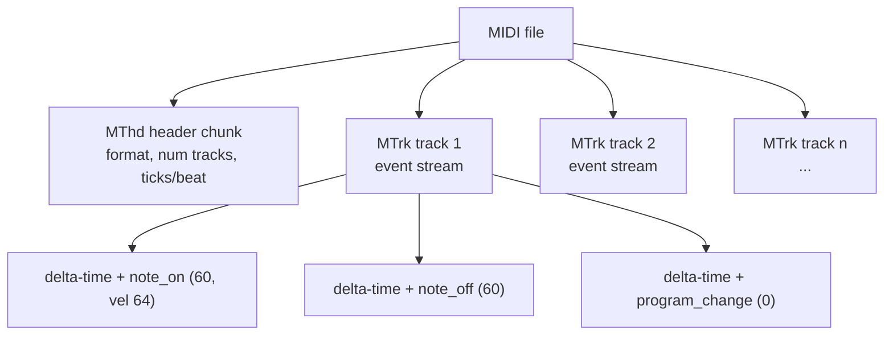

A MIDI file is one of those formats that surprises people the first time they look inside: it weighs a few kilobytes, plays for three minutes, and contains *no audio at all*. This note walks through what's actually in there, how to author one, and how to turn it back into sound.

## What MIDI actually is

A MIDI file (`.mid` / `.midi`, **M**usical **I**nstrument **D**igital **I**nterface) is **sheet music for computers**. Unlike WAV or MP3, it stores no recorded sound — only the *instructions* describing how a piece should be played.

Think of the contrast like this:

| | Audio file (WAV/MP3) | MIDI file |
|---|---|---|
| Contents | Sampled waveform | Note events + timing |
| Size | ~10 MB / minute (WAV) | A few KB for a full song |
| Sound source | Baked into the file | Depends on synth/soundfont |
| Editable per note? | No (it's a recording) | Yes |
| Use case | Playback, distribution | Composition, scores, games |

### What's inside a `.mid`

Four broad categories of data:

- **Note events** — which pitch, when it starts and stops, how hard it's struck (velocity 0–127)
- **Channel / instrument** — e.g. channel 1 = piano, channel 10 = drums (the General MIDI convention)
- **Timing** — tempo, time signature, ticks per beat (resolution)
- **Control data** — pitch bend, sustain pedal, modulation, volume, pan, etc.

### File structure

The bytes are organized into **chunks**:



Each event in a track carries a **delta-time** (ticks since the previous event), so the file is fundamentally a *timeline of differential instructions*, not a sampled signal.

### Why this matters in practice

- ✅ Tiny files — a full song often fits in a few KB
- ✅ Easy to edit per-note in a DAW or notation program
- ⚠️ The same `.mid` can sound like a cheap Windows synth or a full orchestra — playback quality lives in the **synthesizer + soundfont**, not the file
- 🎯 Common uses: sheet-music export, retro/game music, karaoke (`.kar`), the lingua franca between hardware instruments

## Creating a MIDI file

There are roughly four routes, depending on whether you want to draw notes, write code, or compile from a textual score.

### 1. GUI / DAW — easiest

- **MuseScore** (free) — write traditional notation, export as MIDI
- **LMMS, Reaper, Ableton, FL Studio** — piano-roll editing
- **Online**: `onlinesequencer.net`, signal (`signal.vercel.app`)

### 2. Python — `mido` (most popular)

```bash
pip install mido
```

```python
from mido import Message, MidiFile, MidiTrack

mid = MidiFile()
track = MidiTrack()
mid.tracks.append(track)

# C major chord arpeggio: C E G
for note in [60, 64, 67]:
    track.append(Message('note_on',  note=note, velocity=64, time=0))
    track.append(Message('note_off', note=note, velocity=64, time=480))

mid.save('chord.mid')
```

### 3. Python — `pretty_midi` (higher-level, time in seconds)

```python
import pretty_midi

pm = pretty_midi.PrettyMIDI()
inst = pretty_midi.Instrument(program=0)  # Acoustic Grand Piano
inst.notes.append(pretty_midi.Note(velocity=100, pitch=60, start=0.0, end=0.5))
pm.instruments.append(inst)
pm.write('note.mid')
```

`mido` works in raw ticks; `pretty_midi` works in seconds and is friendlier for analysis or quick sketches.

### 4. Command-line / textual scores

- **`abc2midi`** — write music in ABC notation, compile to MIDI
- **`lilypond`** — typeset a score, also emits MIDI as a side output
- **`timidity`** — primarily a player, but ships utilities for conversion

### Key concepts when coding MIDI

- **Note number**: 60 = middle C, +12 per octave (so 72 is the C above)
- **Velocity**: 0–127, governs loudness/intensity
- **Time / delta-time**: ticks since the previous event; `ticks_per_beat` (default 480) sets resolution
- **Program**: 0–127 General MIDI instrument (0 = piano, 40 = violin, etc.)
- **Channel 10 (index 9)** is reserved for drums — programs there map to percussion, not pitched instruments

## Playing a MIDI file

Because the file has no audio, playback always means **synthesizer + soundfont**. On Linux:

### Quick CLI players

**`timidity`** — simplest, ships its own soundfont:

```bash
sudo apt install timidity
timidity chord.mid
```

**`fluidsynth`** — better quality, takes an explicit `.sf2` soundfont:

```bash
sudo apt install fluidsynth fluid-soundfont-gm
fluidsynth -a alsa /usr/share/sounds/sf2/FluidR3_GM.sf2 chord.mid
```

**`vlc`** — works once the MIDI plugin is installed:

```bash
sudo apt install vlc-plugin-fluidsynth
vlc chord.mid
```

### Programmatic playback in Python

```bash
pip install pygame
```

```python
import pygame
pygame.mixer.init()
pygame.mixer.music.load('chord.mid')
pygame.mixer.music.play()
while pygame.mixer.music.get_busy():
    pygame.time.wait(100)
```

### Convert to audio — the practical move for sharing

Recipients shouldn't need a synth installed, so render once to WAV/MP3:

```bash
# MIDI -> WAV
fluidsynth -ni /usr/share/sounds/sf2/FluidR3_GM.sf2 chord.mid -F chord.wav -r 44100

# WAV -> MP3
ffmpeg -i chord.wav chord.mp3
```

### GUI options

- **VLC** (with the plugin above)
- **QSynth** — GUI front-end for FluidSynth
- **MuseScore** — opens a `.mid` as a notated score and plays it

### A note on soundfonts

Default soundfont quality varies wildly. `FluidR3_GM` is a decent free baseline; `GeneralUser GS` is another common free option; commercial soundfonts can be enormous (hundreds of MB to multi-GB) and are what gives high-end MIDI rendering its realism. Swapping the soundfont is the single biggest lever on how a `.mid` actually sounds.

## Mental model to take away

A `.mid` is a **score**, not a recording. Authoring tools write the score; soundfonts and synthesizers perform it. Once you internalize that split, the rest of the ecosystem — `mido`, `pretty_midi`, FluidSynth, MuseScore, soundfonts — slots into place as either a *score editor* or a *performer*.
