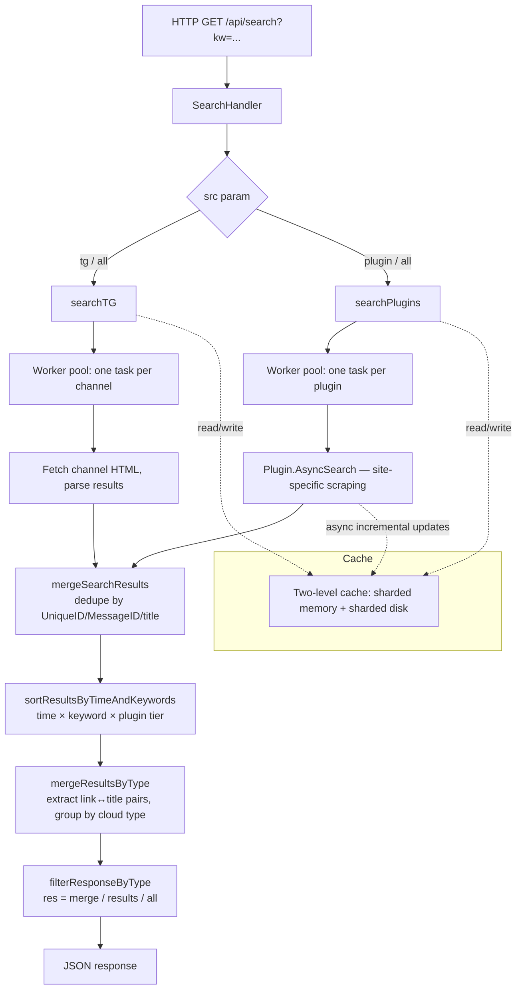

PanSou is an open-source Go service that exposes one HTTP endpoint — `/api/search?kw=...` — and behind it aggregates resource search across **Telegram channels** and **80+ site-specific scraping plugins**. Despite the marketing line "movie search," it is really a generic 网盘 (Chinese cloud-drive) link aggregator: it returns whatever Baidu / Quark / Aliyun / Tianyi / 115 / magnet / etc. links the underlying sources publish for a given keyword.

This note walks through the architecture, the plugin model, and produces a full inventory of the bundled sources.

## 🧭 High-level flow



The HTTP handler (`api/handler.go`) parses query params, then `service.SearchService.Search()` (`service/search_service.go`) fans out to the two sources in parallel goroutines and merges the results.

## ⚙️ The two sources in parallel

`Search()` runs **two concurrent goroutines** under a `sync.WaitGroup`:

1. **Telegram channel search** — `searchTG()`
   - Builds a search URL per channel (`util.BuildSearchURL`), GETs the HTML, parses it with `util.ParseSearchResults`.
   - All channels are fetched concurrently via a worker pool (`util/pool.ExecuteBatchWithTimeout`).
   - 4-second per-channel context timeout.

2. **Plugin search** — `searchPlugins()`
   - Iterates every registered async plugin and dispatches `plugin.AsyncSearch(keyword, ...)`.
   - Plugins run concurrently in a worker pool, capped by the `concurrency` parameter (default = `channels + plugins + 10`).
   - Honors a `forceRefresh` flag and a `plugins=` filter to enable a subset.

Both sources return `[]model.SearchResult`, which contains `Title`, `Content`, `Links` (URL + cloud type), `Datetime`, and source identifiers (`Channel` for TG, `UniqueID` for plugins).

## 🧩 The plugin system

Each source is a self-contained package under `plugin/<name>/`. A single shared file `plugin/plugin.go` defines the interface and registry:

```go
type AsyncSearchPlugin interface {
    Name() string
    Priority() int
    AsyncSearch(keyword string, searchFunc ..., mainCacheKey string, ext map[string]interface{}) ([]model.SearchResult, error)
    SetMainCacheKey(key string)
    SetCurrentKeyword(keyword string)
    Search(keyword string, ext map[string]interface{}) ([]model.SearchResult, error)
    SkipServiceFilter() bool
}
```

### 🔌 Auto-registration via blank imports

Plugins register themselves in their own `init()` functions. The top-level `main.go` blank-imports each one to fire those `init()`s:

```go
import (
    _ "pansou/plugin/ahhhhfs"
    _ "pansou/plugin/javdb"
    _ "pansou/plugin/panzun"
    // ...80+ more
)
```

Adding a new source = create `plugin/<name>/`, implement the interface, and add one line to `main.go`. No central registry edit needed.

### ⏱️ "Async" pattern

Each plugin call returns whatever it has within `AsyncResponseTimeout` (~4s) and continues refining results in the background, writing to a shared cache via an injected `cacheUpdater`. Subsequent identical queries pick up the latest snapshot.

## 🏆 Scoring & ranking

After both sources return, `sortResultsByTimeAndKeywords` computes a composite score:

| Component | Source | Range |
|---|---|---|
| **Time score** | `calculateTimeScore(result.Datetime)` | 0 – 500 (≤1 day = 500, ≤3d = 400, ≤1w = 300, …) |
| **Keyword score** | `getKeywordPriority(title)` | 0 – 490 — boosts titles containing 合集 / 系列 / 全 / 完 / 最新 / 附 / complete |
| **Plugin tier score** | `getPluginLevelScore(source)` | 1000 / 500 / 0 / −200 for tiers 1 / 2 / 3 / 4+ |

`Total = Time + Keyword + PluginTier`, sorted descending.

Plugin tier also affects **filtering**: even results without a timestamp are kept in the `Results` array if they come from a tier-1 or tier-2 plugin, or contain a priority keyword.

## ☁️ Cloud-type classification

`mergeResultsByType` walks every link in every result and:

1. Extracts (link → title) pairs from message text via `extractLinkTitlePairs` — handles both newline-separated formats and inline "标题：链接 标题：链接 …" formats by sliding a position cursor over precise per-cloud-pattern regexes (`util.BaiduPanPattern`, `util.QuarkPanPattern`, etc.).
2. Filters out links whose specific title doesn't contain the search keyword (unless the plugin sets `SkipServiceFilter() == true`, which magnet-search plugins do to keep broad results).
3. Groups by `link.Type`, producing `MergedByType: { baidu: [...], quark: [...], magnet: [...], ... }`.

Recognized types (from `README.md` and `util/regex_util.go`):

`baidu`, `aliyun`, `quark`, `guangya`, `tianyi`, `uc`, `mobile`, `115`, `pikpak`, `xunlei`, `123`, `magnet`, `ed2k`, `others`.

## 🗄️ Caching

Two-level cache (sharded memory + sharded disk) under `util/cache`, keyed on keyword + source set:

- `cache.GenerateTGCacheKey(keyword, channels)`
- `cache.GeneratePluginCacheKey(keyword, plugins)`

Async plugins update the cache as more results arrive in the background. The main flow's `cacheUpdater` merges new results with existing cache via `mergeSearchResults` (using `selectBetterResult` / `calculateCompletenessScore` to pick the more complete record on duplicates).

A separate `DelayedBatchWriteManager` batches disk writes — the memory layer updates synchronously for immediate visibility while disk writes are deferred and prioritized (final results = high, intermediate = medium).

## 📋 Bundled plugin inventory

The repository ships ~85 source plugins. Priority is the value passed to `NewBaseAsyncPlugin` (lower = higher trust). "many (all-types)" means the plugin code references most of the 14 known cloud types — typically a generic parser rather than a specialist.

### ⭐ Tier 1 — high trust

| Plugin | Site | Cloud types |
|---|---|---|
| ddys | ddys.pro | many (all-types) |
| erxiao | erxiaofn.click | many (all-types) |
| hdr4k | 4khdr.cn | many (all-types) |
| jutoushe | 1.star2.cn | many (all-types) |
| labi | xiaocge.fun | quark |
| libvio | libvio.mov | 115, 123, aliyun, baidu, others, quark, tianyi, uc, xunlei |
| lou1 | 1lou.me | 123, aliyun, baidu, ed2k, magnet, pikpak, quark, uc, xunlei |
| panta | 91panta.cn | 115, 123, aliyun, baidu, mobile, others, pikpak, quark, tianyi, xunlei |
| susu | susuifa.com | many (all-types) |
| wanou | woog.nxog.eu.org | many (all-types) |
| xuexizhinan | xuexizhinan.com | magnet, quark |
| zhizhen | xiaomi666.fun | many (all-types) |

### ⭐⭐ Tier 2 — good quality

| Plugin | Site | Cloud types |
|---|---|---|
| ahhhhfs | ahhhhfs.com | many (all-types) |
| alupan | aliupan.com | aliyun, quark |
| ash | so.allsharehub.com | baidu, quark, uc, xunlei |
| clxiong | cilixiong.org | magnet |
| djgou | duanjugou.top | quark |
| duoduo | tv.yydsys.top | many (all-types) |
| dyyj | bbs.dyyjmax.org | many (all-types) |
| dyyjpro | dyyjpro.com | 123, aliyun, baidu, magnet, quark, uc, xunlei |
| hdmoli | hdmoli.pro | baidu, quark |
| huban | dm.xueximeng.com | many (all-types) |
| jsnoteclub | jsnoteclub.com | 123, aliyun, baidu, ed2k, magnet, mobile, pikpak, quark, uc, xunlei |
| kkmao | kuakemao.com | quark |
| leijing | leijing.xyz | tianyi |
| lingjisp | web5.mukaku.com | 123, aliyun, baidu, magnet, quark, uc, xunlei |
| meitizy | video.451024.xyz | many (all-types) |
| mikuclub | mikuclub.uk | 123, aliyun, baidu, magnet, mobile, pikpak, quark, uc, xunlei |
| muou | 666.666291.xyz | many (all-types) |
| nsgame | nsthwj.com | baidu, quark, uc |
| ouge | woog.nxog.eu.org | many (all-types) |
| panyq | panyq.com | many (all-types) |
| panzun | panzun.cc | 115, 123, aliyun, baidu, guangya, others, quark, tianyi, uc, xunlei |
| quarktv | quarktv.com | aliyun, baidu, magnet, quark, uc, xunlei |
| shandian | (闪电) | uc |
| xinjuc | xinjuc.com | baidu |
| ypfxw | ypfxw.com | 123, aliyun, baidu, quark, xunlei |
| yunsou | yunsou.xyz | aliyun, baidu, others, quark, uc, xunlei |

### ⭐⭐⭐ Tier 3 — standard

| Plugin | Site | Cloud types |
|---|---|---|
| bixin | bixbiy.com | mobile |
| cldi | wvmzbxki.1122132.xyz | magnet |
| clmao | 8800492.xyz | magnet |
| cyg | cyg.app / h5.acgn.my | many (all-types) |
| daishudj | daishuduanju.com | 123, aliyun, baidu, magnet, mobile, pikpak, quark, uc, xunlei |
| duanjuw | sm3.cc | 123, aliyun, baidu, pikpak, quark, uc, xunlei |
| feikuai | feikuai.tv | magnet |
| fox4k | 4kfox.com | many (all-types) |
| gaoqing888 | gaoqing888.com | aliyun, baidu, magnet, quark, uc, xunlei |
| gying | gying.net | magnet |
| haisou | haisou.cc | aliyun, baidu, others, quark, tianyi, xunlei |
| hunhepan | hunhepan.com / kuake8 / qkpanso | many (all-types) |
| jikepan | jikepan.xyz | many (all-types) |
| jupansou | pan.dyuzi.com | aliyun, baidu, quark, uc, xunlei |
| kkv | kkv.q-23.cn | many (all-types) |
| miaoso | miaosou.fun | 115, 123, aliyun, baidu, others, quark, tianyi, uc, xunlei |
| mizixing | mizixing.com | 123, aliyun, baidu, ed2k, magnet, mobile, pikpak, quark, uc, xunlei |
| nyaa | nyaa.si | magnet |
| pan666 | pan666.net | aliyun, baidu, tianyi |
| panlian | pinglian.lol | many (all-types) |
| pansearch | pansearch.me | aliyun |
| panwiki | panwiki.com | 115, 123, aliyun, baidu, mobile, pikpak, quark, tianyi, uc, xunlei |
| pianku | btnull.pro | others |
| qingying | revohd.com | 123 |
| qqpd | pd.qq.com | many (all-types) |
| quark4k | quark4k.com | quark |
| quarksoo | quarksoo.cc | quark |
| qupanshe | qupanshe.com | many (all-types) |
| qupansou | pan.funletu.com | many (all-types) |
| sdso | sdso.top | aliyun, baidu, others, quark, xunlei |
| sousou | sousou.pro | many (all-types) |
| thepiratebay | thpibay.xyz | magnet |
| weibo | m.weibo.cn | 115, 123, aliyun, baidu, pikpak, quark, tianyi, xunlei |
| wuji | xcili.net | magnet |
| xb6v | xb6v.com / 66ss.org | magnet |
| xdpan | xiongdipan.com | baidu |
| xdyh | ys.66ds.de | many (all-types) |
| xiaoji | xiaojitv.com | many (all-types) |
| xiaozhang | xzys.fun | 115, 123, aliyun, baidu, quark, tianyi, xunlei |
| xys | yunso.net | many (all-types) |
| yiove | bbs.yiove.com | 123, aliyun, baidu, ed2k, magnet, mobile, pikpak, quark, tianyi, uc, xunlei |
| yuhuage | iyuhuage.fun | magnet, others |
| yulinshufa | yulinshufa.cn | many (all-types) |
| zxzj | zxzjhd.com | aliyun, baidu, quark, xunlei |

### ⭐⭐⭐⭐⭐ Tier 5 — low priority

| Plugin | Site | Cloud types |
|---|---|---|
| javdb | javdb.com | magnet |
| u3c3 | u3c3u3c3.…com | magnet |

`discourse/` is a shared base for forum-style plugins — not a standalone source.

## 🔍 Specialist vs. generalist plugins

Two clear archetypes emerge from the inventory:

- **Specialists** emit one or two cloud types — magnet-only (`gying`, `nyaa`, `thepiratebay`, `clxiong`, `cldi`, `clmao`, `feikuai`, `wuji`, `xb6v`, `javdb`, `u3c3`), `quark`-only (`labi`, `kkmao`, `quark4k`, `quarksoo`, `djgou`), `baidu`-only (`xdpan`, `xinjuc`), `tianyi`-only (`leijing`), `uc`-only (`shandian`), etc. These usually scrape a single-vendor site.
- **Generalists** ("many (all-types)") parse arbitrary forum posts and detect link types via regex, so the type list is whatever the site's posters happened to share. Most TG-style indexers (`hunhepan`, `huban`, `qqpd`, `meitizy`, `dyyj`, `xys`, `panyq`, `cyg`, `jutoushe`, …) sit here.

This shape matters operationally: if you only care about Quark links, enabling 80 generalists gives you noisier, more duplicated results than enabling the four Quark specialists plus a couple of generalists.

## 🛠️ Operational notes

- **Selecting plugins**: the `ENABLED_PLUGINS` env var (comma-separated) controls which plugins load. The default loads none — you must opt in explicitly.
- **Per-request override**: the API's `plugins=` query param can further narrow it to a subset.
- **Cloud-type filter**: `cloud_types=quark,baidu` returns only those buckets in `MergedByType`.
- **Force refresh**: `refresh=true` bypasses the cache for both TG and plugin paths.
- **Result type**: `res=merge` (default) returns grouped-by-type, `res=results` returns the flat ranked list, `res=all` returns both.

## 🪞 Reflections

What stood out reading the codebase:

1. **The plugin folder layout is the API for contributors** — adding a source is a localized change (one folder + one import line), which is why the project has accumulated 80+ sources.
2. **Async cache updates per plugin** is a smart way to deal with slow scrapers without making the user wait — fast plugins land in the response, slow ones land in the cache for the next query.
3. **Composite scoring with a hard plugin tier** is more pragmatic than pure freshness: a fresh garbage post from a tier-4 source gets buried under a year-old curated post from a tier-1 source, which is the right call when sources have very uneven quality.
4. **Cloud-type detection by precise per-vendor regex** (rather than a generic URL parser) avoids mis-classifying disguised or shortened links — important for a domain where URL formats are heavily branded.
