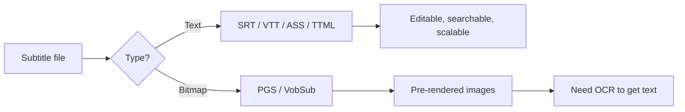

Subtitles come in a surprising number of formats. Most of the time you only ever
see `.srt`, but as soon as you rip a Blu-ray, embed a video on a website, or
open a fansub, you run into something different. This note walks through the
formats you're likely to meet, what makes each one different, and how to turn a
subtitle file into plain text with a small script.

## The landscape

| Format | Type | Styling | Common use |
| --- | --- | --- | --- |
| **SRT** (SubRip) | Text | None (some `<i>`/`<b>`) | Universal default — players, downloads |
| **VTT** (WebVTT) | Text | CSS-like, positioning, regions | Web video (HTML5 `<track>`) |
| **ASS / SSA** | Text | Full: fonts, colors, position, karaoke, animation | Anime, fansubs, stylized subs |
| **SUB** (MicroDVD) | Text, frame-based | Minimal | Legacy; breaks if framerate differs |
| **SUB** (SubViewer) | Text, time-based | Minimal | Legacy |
| **SBV** | Text | None | YouTube uploads (older) |
| **TTML / DFXP** | XML | Rich (CSS-style) | Netflix, BBC, broadcast/streaming |
| **SCC** | Binary-ish | CEA-608 codes | US broadcast TV captions |
| **EBU-STL** | Binary | Limited | European broadcast TV |
| **IDX + SUB** (VobSub) | Bitmap | N/A (image) | DVD rips |
| **PGS** (`.sup`) | Bitmap | N/A (image) | Blu-ray rips |

A short version: **SRT** = simple/universal, **VTT** = web, **ASS** = pretty,
**TTML** = broadcast/streaming, **PGS / VobSub** = pre-rendered images from
discs.

## How they really differ

### Text vs bitmap



- **Text formats** (SRT, VTT, ASS, TTML, SBV) are editable, searchable, small,
  and scale cleanly with the player.
- **Bitmap formats** (PGS, VobSub) are pre-rendered images. You can't edit the
  text or resize without quality loss, but they preserve the exact original
  look. To get text out, you need OCR.

### Time vs frame based

- Most formats use timestamps (`HH:MM:SS`) — framerate-independent.
- **MicroDVD `.sub`** uses frame numbers, so it desyncs the moment the
  framerate changes.

### Styling power, low to high

- **SRT / SBV** — plain text only.
- **VTT** — CSS, positioning, vertical text. Good for the web.
- **TTML** — XML with rich styling, regions, animation. Favored by streaming
  platforms.
- **ASS / SSA** — the most expressive: fonts, outlines, shadows, rotation,
  karaoke timing, fades, transforms. This is why anime fansubs use it.

### Where you actually meet each one

- Download a movie sub → **SRT**
- Embed on a website → **VTT**
- Anime / heavy typesetting → **ASS**
- Netflix / Disney+ / BBC → **TTML** internally, often delivered as **WebVTT**
- DVD rip → **VobSub** (`.idx` + `.sub`)
- Blu-ray rip → **PGS** (`.sup`)
- US TV broadcast → **SCC** (CEA-608/708)

### Conversion notes

- Text → text is easy. SRT ↔ VTT is nearly trivial. Tools: `ffmpeg`,
  SubtitleEdit, Aegisub.
- Bitmap → text needs OCR (SubtitleEdit, VobSub2SRT) and is error-prone.
- Going from a styled format (ASS) down to SRT loses styling.

## Converting a subtitle file to plain text

Yes, this is easy — for any **text-based** format. Bitmap formats need OCR
first.

### Best source format: SRT ✅

Why:

- Dead simple structure: 4-line blocks of index, timestamps, text, blank line.
- No styling tags to strip in most files.
- Every library handles it; trivial even with plain regex.

If your file isn't SRT, convert it first.

Runner-up: **VTT** — almost identical to SRT, just a `WEBVTT` header and `.`
instead of `,` in millisecond timestamps.

Avoid as a source:

- **ASS / SSA** — override tags like `{\pos(...)}`, `{\b1}` are everywhere.
- **TTML** — XML with namespaces.
- **PGS / VobSub** — they're images.

### What an SRT file looks like

```srt
1
00:00:01,000 --> 00:00:03,500
Hello, world.

2
00:00:04,000 --> 00:00:06,200
This is a second cue.
```

To get plain text, you keep the third line of each block and throw away the
rest.

### Minimal Python script (regex-only)

```python
import re
import sys

with open(sys.argv[1], encoding="utf-8-sig") as f:
    text = f.read()

lines = []
for line in text.splitlines():
    if line.strip().isdigit():           # cue index
        continue
    if "-->" in line:                    # timestamp line
        continue
    lines.append(line)

plain = "\n".join(lines)
plain = re.sub(r"<[^>]+>", "", plain)    # strip <i>, <b>, <font>...
plain = re.sub(r"\{[^}]+\}", "", plain)  # strip ASS-style {\...} if leaked in
plain = re.sub(r"\n{2,}", "\n\n", plain).strip()

print(plain)
```

Run it:

```bash
python sub2txt.py movie.srt > movie.txt
```

Notes:

- `utf-8-sig` quietly strips a leading BOM if the file has one — common with
  SRTs from Windows tools.
- The `<...>` regex handles the basic HTML-style tags some SRTs sneak in.
- The `{...}` regex is a defensive cleanup in case ASS overrides survived a
  conversion.

### Even shorter, with a library

```bash
pip install srt
```

```python
import srt, sys

subs = srt.parse(open(sys.argv[1], encoding="utf-8-sig").read())
print("\n".join(s.content for s in subs))
```

The `srt` library handles edge cases like odd line endings, missing blank
lines, and nested tags more gracefully than a hand-rolled parser.

### If your file isn't SRT, convert first

```bash
ffmpeg -i input.ass    output.srt
ffmpeg -i input.vtt    output.srt
ffmpeg -i input.ttml   output.srt
```

Then run the script above.

For bitmap formats (PGS `.sup`, VobSub `.idx`/`.sub`), use SubtitleEdit's OCR
or `vobsub2srt` — accuracy depends on font and language, and you'll usually
need to spot-check the result.

## Cheat sheet 📋

- [x] **Just want the dialog as text?** Convert to SRT, then use the script
      above.
- [x] **Multiple formats to handle?** Convert everything to SRT first; keep the
      downstream script simple.
- [x] **Heavy styling matters?** Don't go through SRT — work in ASS or TTML
      directly.
- [x] **Source is a Blu-ray / DVD sub?** Run OCR before any of this.

## References

- [WebVTT specification][webvtt]
- [SubRip / SRT format overview][srt-wiki]
- [Advanced SubStation Alpha (ASS) tags][ass-wiki]
- [TTML for subtitling and captioning][ttml]
- [`ffmpeg` subtitle handling][ffmpeg-subs]

[webvtt]: https://www.w3.org/TR/webvtt1/
[srt-wiki]: https://en.wikipedia.org/wiki/SubRip
[ass-wiki]: https://en.wikipedia.org/wiki/SubStation_Alpha
[ttml]: https://www.w3.org/TR/ttml2/
[ffmpeg-subs]: https://trac.ffmpeg.org/wiki/ExtractSubtitles
