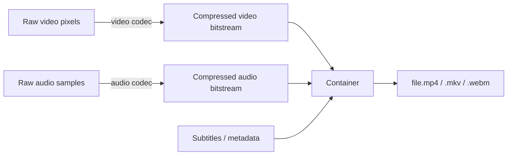

When you save a video as `.mp4` or `.mkv`, two very different things are happening at once: **compression** (the codec) and **packaging** (the container). Confusing them is the source of most "why doesn't this file play?" frustration. This note untangles the two.

## Common video file formats

What you usually see is the **container** — the file extension. The actual compressed bytes inside are the **codec's** output.

### Containers (file wrappers)

| Extension | Name | Typical use |
|-----------|------|-------------|
| `.mp4` | MPEG-4 Part 14 | Universal — web, mobile, streaming |
| `.mkv` | Matroska | Movies, anime; supports many tracks/subs |
| `.mov` | QuickTime | Apple ecosystem, video editing |
| `.webm` | WebM | Web video, open-source (YouTube/HTML5) |
| `.avi` | Audio Video Interleave | Older Windows files |
| `.flv` | Flash Video | Legacy streaming (mostly dead) |
| `.wmv` | Windows Media Video | Older Windows/Microsoft |
| `.m4v` | iTunes video | Apple-specific MP4 variant |
| `.ts` / `.m2ts` | MPEG transport stream | Broadcast, Blu-ray |
| `.3gp` | 3GPP | Old mobile phones |
| `.ogv` | Ogg | Open-source, less common |

### Video codecs (inside containers)

- **H.264 / AVC** — most widely supported
- **H.265 / HEVC** — better compression, newer hardware
- **AV1** — modern open codec (YouTube, Netflix)
- **VP9** — Google's codec, used in WebM
- **MPEG-2** — DVDs, broadcast
- **ProRes / DNxHD** — editing/mastering codecs

### Audio codecs paired with video

**AAC** (MP4), **Opus** (WebM), **MP3**, **AC-3 / E-AC-3** (Dolby), **FLAC** (lossless).

A `.mp4` file usually means H.264 video + AAC audio, but the container can hold many combinations. Use `ffprobe file.mp4` to see what's actually inside.

## What a codec actually does

**Codec** = **co**der + **dec**oder. It's the algorithm that:

- **Encodes**: turns raw pixel/sample data into a compact binary bitstream
- **Decodes**: reverses that bitstream back into pixels/samples for playback

### Why compression is essential

1080p @ 30fps, uncompressed:

```
1920 × 1080 × 3 bytes × 30 fps ≈ 187 MB/s
```

That's roughly **11 GB per minute**. A codec like H.264 can squeeze that to ~0.5–1 MB/s with little visible loss — a 100–300× ratio.

### How video codecs achieve that

1. **Spatial compression** (within one frame) — similar to JPEG: transform pixel blocks (DCT), quantize, entropy-code.
2. **Temporal compression** (across frames) — store *differences* between frames instead of full frames:
   - **I-frame**: full picture (keyframe)
   - **P-frame**: "what changed since the last frame"
   - **B-frame**: "what's between the previous and next frame"
3. **Motion estimation** — detect that a block of pixels just *moved* and encode the motion vector instead of re-sending pixels.
4. **Entropy coding** — pack remaining data with CABAC/Huffman/arithmetic coding.

Most video compression is **lossy** — it discards detail the human eye barely notices. Lossless codecs (FFV1, HuffYUV) exist but produce much larger files.

## The pipeline: codec then container

Think of it as two independent stages:



You make **two independent choices**:

1. **Which codec(s)** for video and audio (the compression)
2. **Which container** to wrap them in (the file format)

### A concrete `ffmpeg` example

```bash
# raw video → H.264 video + AAC audio, wrapped in MP4
ffmpeg -i raw.yuv -c:v libx264 -c:a aac out.mp4

# same streams, wrapped in MKV instead — no re-encoding
ffmpeg -i out.mp4 -c copy out.mkv
```

The second command **remuxes** — moves the already-compressed streams into a different container. Fast, lossless, no quality change.

### Not every codec fits every container

Containers have rules about what they'll carry:

| Container | Codec support |
|-----------|--------------|
| `.mp4` | H.264, H.265, AV1, AAC, MP3 — *not* Vorbis, FLAC (officially) |
| `.mkv` | Almost anything — most permissive |
| `.webm` | Only VP8/VP9/AV1 + Opus/Vorbis (strict) |
| `.mov` | Similar to MP4, plus ProRes |
| `.avi` | Older codecs; struggles with H.265, B-frames |

`.mkv` is the "universal sack." `.webm` is the strictest. `.mp4` is the most widely *playable*.

## Does the container matter if quality is identical?

This is the right question to ask. If you don't re-encode, the pixels coming out of the decoder are bit-for-bit the same whether wrapped in `.mp4` or `.mkv`. **The picture is identical.** What changes is everything *around* the pixels.

### 1. Compatibility — where it plays

- `.mp4` — plays almost everywhere: browsers, phones, smart TVs, hardware players
- `.mkv` — great on PCs and modern TVs, but iOS Safari, many smart TVs, and some hardware players won't open it
- `.webm` — browsers love it; desktop players handle it; phones/TVs are hit-or-miss
- `.mov` — Apple ecosystem first-class; Windows occasionally needs extra codecs
- `.avi` — old; chokes on modern codecs (H.265, AV1)

This is the **biggest practical difference** in day-to-day use.

### 2. Features the container can carry

| Feature | mp4 | mkv | webm | mov |
|---|---|---|---|---|
| Multiple audio tracks | ✅ | ✅ | ✅ | ✅ |
| Soft subtitles (SRT/ASS) | limited | ✅ | ❌ | limited |
| Chapters | ✅ | ✅ | ✅ | ✅ |
| Attachments (fonts, covers) | ❌ | ✅ | ❌ | ❌ |
| 3D / HDR metadata | ✅ | ✅ | partial | ✅ |
| Streaming / fast start | ✅ | weak | ✅ | ✅ |

This is why anime releases use `.mkv` — they pack multiple audio tracks, ASS subtitles, and embedded fonts into one file.

### 3. Streaming behavior

- `.mp4` with `+faststart` → starts playing before fully downloaded (good for web)
- `.mkv` → designed for local playback, not progressive streaming
- `.webm` → designed for streaming over HTTP

### 4. File size

Containers add a tiny overhead (metadata, indexing). Usually <1% — negligible.

### 5. Editability and seeking

`.mkv` and `.mp4` both seek well. `.avi` and raw `.ts` streams seek poorly. Editors often prefer `.mov` or `.mp4`.

### 6. Subtitle / metadata handling

`.mkv` stores subtitles as **soft tracks** you can toggle on/off. `.mp4` technically supports this but tooling is patchier — many people end up burning subtitles into the video instead.

## Practical rule of thumb

| Goal | Pick |
|------|------|
| Send to anyone, play anywhere | **mp4** |
| Web embedding / HTML5 `<video>` | **mp4** (or webm fallback) |
| Personal library, multiple audio/subs | **mkv** |
| Apple-only workflow / editing | **mov** |
| YouTube-style web video | **webm** |

## Mental model summary

- **Codec** = how the bytes are *compressed* (determines visual quality and file size)
- **Container** = how the bytes are *packaged* (determines who can play it, what extra tracks come along, how it streams)

You can swap containers without touching the codec (**remux** — fast, lossless), or swap codecs without touching the container (**re-encode** — slow, lossy). They're orthogonal decisions.

For a short clip you're sending to a friend, the container barely matters. For a movie you want to keep with multiple audio tracks and subtitles, it matters a lot.
