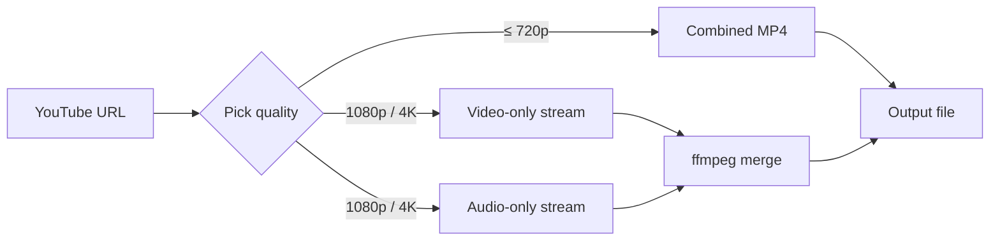

## What is yt-dlp?

`yt-dlp` is a command-line tool for downloading videos and audio from YouTube and 1000+ other sites. It is a fork of the older `youtube-dl` project with more active development, bug fixes, and additional features. It became the de facto replacement for `youtube-dl` after `youtube-dl` development stalled.

Key capabilities:

- Download videos in various formats and quality levels (4K, 1080p, etc.)
- Extract audio only (MP3, AAC, etc.)
- Download entire playlists or channels
- Supports YouTube, Twitch, Twitter/X, Reddit, and many more
- Embed subtitles, thumbnails, and metadata
- Rate limiting, proxy support, cookie-based auth for age-gated/private content

## Choosing a build: Python script vs. standalone binary

yt-dlp ships in two main flavors on Linux:

| File | Type | Dependencies |
| --- | --- | --- |
| `yt-dlp` | Python script | Requires Python 3.10+ (CPython) or 3.11+ (PyPy) installed |
| `yt-dlp_linux` | Standalone binary | None — Python is bundled inside |

If you don't already maintain a Python environment, `yt-dlp_linux` is the simpler choice — it's a single self-contained executable that runs anywhere.

## Installing on Ubuntu

### Option 1: apt (simplest, but lags behind)

```bash
sudo apt install yt-dlp
```

The apt package can be several releases behind upstream, which matters because YouTube frequently changes its internals and yt-dlp pushes fixes quickly.

### Option 2: Standalone binary (recommended)

```bash
sudo curl -L https://github.com/yt-dlp/yt-dlp/releases/latest/download/yt-dlp_linux -o /usr/local/bin/yt-dlp
sudo chmod a+rx /usr/local/bin/yt-dlp
```

Breaking down the first command:

- `sudo` — run as administrator (needed to write to `/usr/local/bin/`)
- `curl` — download files from the internet
- `-L` — follow redirects (GitHub redirects to the actual file)
- `https://github.com/.../yt-dlp_linux` — the URL of the file
- `-o /usr/local/bin/yt-dlp` — save the file to this path, named `yt-dlp` (so it's in `$PATH`)

Breaking down the second command:

- `chmod` — change file permissions
- `a` — applies to **a**ll users (owner, group, others)
- `+` — **add** the following permissions
- `r` — permission to **r**ead the file
- `x` — permission to e**x**ecute (run) the file

Without `chmod a+rx`, Linux refuses to run the downloaded file as a program.

### Verify install

```bash
yt-dlp --version
```

If a version number prints (e.g. `2024.12.13`), the install worked. If you get `command not found`, something went wrong with the PATH or the file is missing.

## Recommended dependencies

The yt-dlp README calls out a few "strongly recommended" dependencies. Here is what each one does and whether you need it.

### ffmpeg + ffprobe — strongly recommended

```bash
sudo apt install ffmpeg
```

yt-dlp uses ffmpeg to:

- Merge separate video and audio streams into a single file (essential for high-quality YouTube downloads — see the next section)
- Convert formats (e.g. extract audio as MP3)
- Embed subtitles, thumbnails, and metadata

`ffprobe` ships in the same package as `ffmpeg`, so one install gets both.

⚠️ **Important:** what you need is the `ffmpeg` *binary*, not the Python package called `ffmpeg`. They are unrelated.

### Custom ffmpeg builds (optional but better)

The yt-dlp project ships custom ffmpeg builds with patches that fix bugs causing issues when used alongside yt-dlp. They are at [`yt-dlp/FFmpeg-Builds`](https://github.com/yt-dlp/FFmpeg-Builds).

To download and extract:

```bash
curl -L https://github.com/yt-dlp/FFmpeg-Builds/releases/download/latest/ffmpeg-master-latest-linux64-gpl.tar.xz -o ffmpeg-master-latest-linux64-gpl.tar.xz
tar -xf ffmpeg-master-latest-linux64-gpl.tar.xz
```

`tar -xf` flags:

- `-x` — extract
- `-f` — the next argument is the filename

After extraction you'll have a folder containing `bin/ffmpeg` and `bin/ffprobe`.

### yt-dlp-ejs + JavaScript runtime — required for full YouTube support

YouTube ships some logic as JavaScript (e.g. signature/cipher resolution). To run it, yt-dlp delegates to `yt-dlp-ejs`, which is a JavaScript file that needs a JS runtime to actually execute.

The README recommends `deno` (also supports `node.js`, `bun`, `QuickJS`):

```bash
curl -fsSL https://deno.land/install.sh | sh
```

Then download `yt-dlp-ejs` from the yt-dlp releases page (same place `yt-dlp_linux` lives).

Without these, some YouTube videos may fail to download.

## How YouTube serves video, and why ffmpeg is needed

A common point of confusion: why does yt-dlp need ffmpeg at all?

YouTube serves video in two patterns:

| Quality tier | How it's served |
| --- | --- |
| Low / medium (≤ 720p) | Combined files — video + audio in one MP4 |
| High (1080p, 1440p, 4K, 8K) | **Separate** video-only and audio-only streams |

This is called **adaptive streaming** (DASH). When you watch a 1080p YouTube video in your browser, the player is actually playing two streams in sync.

Why YouTube does this:

- **Quality switching** — the player swaps just the video stream when bandwidth changes, audio keeps playing smoothly
- **Codec flexibility** — same audio reused with VP9, AV1, H.264 video without duplication
- **Bandwidth efficiency** — only re-download the changing portion

For yt-dlp this means: to get the best quality, it must download two files and merge them. That's what ffmpeg is for.



## Format selection

### List available formats

```bash
yt-dlp -F https://www.youtube.com/watch?v=XXXXXXXXXXX
```

`-F` (`--list-formats`) prints a table without downloading anything. Columns include format ID, extension, resolution, filesize, codec, bitrate.

### Pick a specific format by ID

```bash
yt-dlp -f 137 https://www.youtube.com/watch?v=XXXXXXXXXXX
```

Where `137` is one of the IDs from the `-F` listing (e.g. 1080p video-only).

### The default format selector explained

yt-dlp's default behavior (when `-f` is not specified) is equivalent to:

```bash
-f "bestvideo*+bestaudio/best"
```

Two parts separated by `/`:

**Part 1: `bestvideo*+bestaudio`** — try this first

- `bestvideo*` — best format that contains video; the `*` means audio is *optional*, not required to be absent
- `+bestaudio` — plus the best audio-only format
- Merge them with ffmpeg

**Part 2: `best`** — fallback if part 1 fails

- best single file containing both video and audio

The `*` is the critical detail vs. plain `bestvideo`:

- `bestvideo` — strictly **video-only** (no audio)
- `bestvideo*` — any format with video, audio optional

`bestvideo*` is more flexible because some sites only offer combined files and have no video-only stream — plain `bestvideo` would fail on those.

### A common misconception

> "If a single combined file with the best video and audio exists, yt-dlp downloads just that; otherwise it downloads two files and merges them."

❌ This is **not** how `bestvideo+bestaudio` works.

`bestvideo` and `bestaudio` already mean video-only and audio-only — they never refer to a combined file. So `-f bestvideo+bestaudio` always downloads two files and merges them, regardless of whether a combined file exists.

To get the "use combined when available, otherwise merge" behavior, use the fallback form:

```bash
yt-dlp -f "bestvideo+bestaudio/best" <url>
```

…which, again, is the default if you omit `-f` entirely.

## Cheat sheet

```bash
# Basic download (best quality, default selector)
yt-dlp https://www.youtube.com/watch?v=XXXXXXXXXXX

# Audio only, as MP3
yt-dlp -x --audio-format mp3 <url>

# Best quality explicit
yt-dlp -f "bestvideo+bestaudio" <url>

# List all formats (resolutions, codecs, sizes)
yt-dlp -F <url>

# Pick a specific format ID
yt-dlp -f 137 <url>

# List all subtitles (manual + auto-generated)
yt-dlp --list-subs <url>

# List manual subtitles only
yt-dlp --list-subs --no-write-auto-subs <url>

# Download with English subtitles embedded
yt-dlp --write-subs --sub-lang en <url>
```

## Summary

- For Ubuntu, prefer the `yt-dlp_linux` standalone binary — no Python dependency.
- Install `ffmpeg` via apt for merging high-quality YouTube streams; consider the yt-dlp custom ffmpeg builds if you hit ffmpeg-related issues.
- For full YouTube support, also install a JS runtime (deno) and download `yt-dlp-ejs`.
- Default `yt-dlp <url>` already does the right thing — it picks the best video-only and audio-only streams, merges them with ffmpeg, and falls back to the best combined file if separate streams aren't available.
