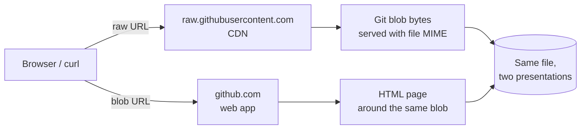

GitHub serves the same file under two very different URLs. Once you can read the parts, you can tell at a glance whether a link is a download, a viewer, or a stable archival pointer.

## The two URL shapes

Take a single file in a public repo and you'll see both forms in the wild:

```
https://raw.githubusercontent.com/<owner>/<repo>/refs/heads/main/<path>
https://github.com/<owner>/<repo>/blob/main/<path>
```

Both resolve to **the same file content** at the tip of `main`. The difference is in *how* GitHub serves it — one as raw bytes, the other wrapped in the GitHub web UI.

## URL 1 — raw

```
https://raw.githubusercontent.com/<owner>/<repo>/refs/heads/main/<path>
```

| Part | Meaning |
|---|---|
| `https://` | TLS-encrypted HTTP |
| `raw.githubusercontent.com` | GitHub's CDN host for raw file bytes — no HTML chrome |
| `<owner>` | GitHub user or organization |
| `<repo>` | Repository name |
| `refs/heads/main` | Full Git ref. `refs/heads/<name>` is a branch; `refs/tags/<name>` is a tag |
| `<path>` | File path inside the repo |

The CDN responds with the file's actual `Content-Type` (e.g., `text/plain` for a YAML file), so `curl`, `wget`, or `Invoke-WebRequest` get the bytes verbatim. Browsers usually display it as plain text — no syntax highlighting, no buttons, no header.

The shorter form `raw.githubusercontent.com/<owner>/<repo>/main/<path>` also works — GitHub accepts the bare ref name as a shortcut for `refs/heads/main`.

## URL 2 — blob view

```
https://github.com/<owner>/<repo>/blob/main/<path>
```

| Part | Meaning |
|---|---|
| `https://` | Same |
| `github.com` | The web app — not the CDN |
| `<owner>` / `<repo>` | Same repo |
| `blob` | UI route for "show a single file." Siblings include `tree` (directory), `commit`, `commits`, `raw`, `blame` |
| `main` | Branch (or tag, or commit SHA) — bare name only, no `refs/heads/` prefix |
| `<path>` | Same path |

This URL returns an HTML page: syntax-highlighted source, line numbers, blame/history links, copy/download buttons, and so on. It's built around the same underlying Git blob, but presented for humans.

## How a request flows



## Key differences at a glance

| Dimension | Raw URL | Blob URL |
|---|---|---|
| Host | `raw.githubusercontent.com` | `github.com` |
| Canonical ref form | `refs/heads/main` (full) | `main` (short) |
| Response | File bytes with native MIME | HTML page |
| Use case | Download, scripted fetch, embed | Browse, share, link in docs |
| Syntax highlighting | ❌ | ✅ |
| Line numbers / blame | ❌ | ✅ |

Both hosts accept either ref form (full or short), but the canonical convention is what GitHub itself emits.

## Branch refs are not stable

A URL with `main` (or any branch name) is a **moving pointer**. The branch tip changes over time, so the same URL can return different content tomorrow.

For an immutable link — what you want in commit reports, blog posts, audit trails — substitute a commit SHA for the branch name:

```
# Permalink (immutable)
https://github.com/<owner>/<repo>/blob/<full-sha>/<path>
https://raw.githubusercontent.com/<owner>/<repo>/<full-sha>/<path>

# Branch link (drifts as the branch moves)
https://github.com/<owner>/<repo>/blob/main/<path>
```

A few habits that follow from this:

- ✅ Use the full 40-character SHA in permalinks. The short hash is fine for humans but not for tooling.
- ✅ For tags, you can use the tag name (`v1.2.3`) — tags are usually immovable, but technically a tag *can* be force-moved.
- ❌ Never paste a `blob/main/...` link into something that needs to age well (a commit message, a blog post, a runbook).

## Quick conversion

You can hand-translate between the two forms by swapping host, route, and (optionally) ref-prefix:

```
github.com/<o>/<r>/blob/<ref>/<path>
              ⇕ swap host & drop "blob"
raw.githubusercontent.com/<o>/<r>/<ref>/<path>
```

If the ref happens to be a branch or tag name, optionally expand to `refs/heads/<name>` or `refs/tags/<name>` on the raw side to be explicit. If it's a commit SHA, it works as-is on either side.

## Takeaways

- 🪞 Same file, two presentations: raw CDN bytes vs. HTML viewer.
- 🌿 `main` in either URL is a **moving** branch pointer.
- 🔒 Replace `main` with a full commit SHA for a real permalink.
- 🧭 The route segment after the repo (`blob`, `tree`, `commit`, `raw`, `blame`) tells you what view GitHub is rendering.
