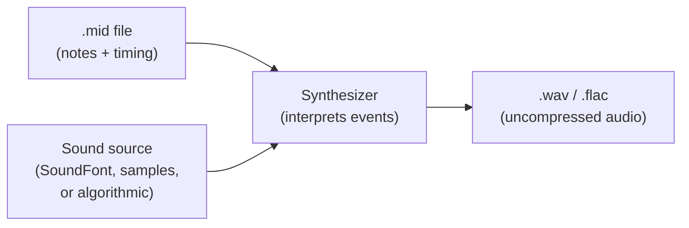

A `.mid` file does not contain audio. It contains a sequence of events — "play note 60 on channel 1 at velocity 100, now stop it" — plus tempo and timing metadata. To turn that into something you can listen to (or save as a WAV), two things have to happen:

1. A **synthesizer** reads the MIDI events and decides what audio to generate.
2. A **sound source** tells the synth what each instrument should sound like. A SoundFont is one common form of sound source.

This post walks through both, lists the popular options, and points to the combinations most people actually use in practice.

## The pipeline



The synth is the engine. The sound source is the "voice" it uses. Swap the SoundFont and the same MIDI file sounds completely different — string-quartet, 8-bit chiptune, Roland SC-55 game soundtrack — without changing a single note in the score.

## What can act as a sound source

SoundFonts (`.sf2`, `.sf3`) are the most common because they are an open format, but they are not the only option:

| Source type | Examples | Notes |
|---|---|---|
| SoundFont | `.sf2`, `.sf3` | Sample-based, GM-compatible banks are the norm. |
| SFZ | `.sfz` | Open text-based sampler format, more flexible than SF2. |
| Proprietary samplers | Kontakt, EXS24 | Used in DAWs, not for plain MIDI rendering. |
| Algorithmic synthesis | FM, subtractive, physical modeling | No samples — sound is computed from scratch (DX7, Moog-style synths). |

For "I have a `.mid` and I want a `.wav`" workflows, SoundFont is what almost everyone reaches for.

## Popular synthesizers

### For MIDI rendering (free / open source)

- **FluidSynth** — SoundFont-based, scriptable, the de facto Linux default. Can render straight to WAV.
- **TiMidity++** — older but still around; supports SoundFonts and the older GUS patch format.
- **Munt** — emulates a Roland MT-32, useful for old DOS game MIDIs.

### For music production (VST / AU plugins)

- **Serum** (Xfer) — wavetable, near-ubiquitous in modern EDM.
- **Vital** — free, Serum-style wavetable synth.
- **Native Instruments Massive / Massive X** — wavetable, big in EDM.
- **Sylenth1** — virtual analog.
- **Arturia V Collection** — emulations of classic hardware (Minimoog, DX7, Jupiter-8, etc.).
- **Spectrasonics Omnisphere** — hybrid synth/sample engine.
- **u-he Diva / Zebra2** — high-quality analog modeling.
- **Surge XT** — free and open-source, very capable hybrid synth.

### Classic hardware (often emulated today)

- **Moog Minimoog / Moog One** — analog mono / poly.
- **Roland Juno-106, Jupiter-8, TB-303, TR-808/909** — analog poly and drum machines.
- **Yamaha DX7** — FM synthesis, defined the '80s.
- **Korg M1, MS-20, Wavestation** — workstation and analog classics.
- **Sequential Prophet-5** — analog poly classic.
- **Access Virus** — virtual analog, '90s/'00s mainstay.

## Popular SoundFonts

### General-purpose GM banks (free)

These cover all 128 General MIDI instruments, so they will play any standard `.mid`.

- **FluidR3_GM** — ships with FluidSynth on most Linux distros (~140 MB).
- **GeneralUser GS** (S. Christian Collins) — high-quality GM/GS, only ~30 MB, often recommended as a default.
- **Arachno SoundFont** — polished GM set (~150 MB).
- **Timbres of Heaven** (Don Allen) — large, lush GM bank (~400 MB+).
- **Musyng Kite** — popular for game / anime MIDI covers.
- **Masquerade 55** — another high-quality GM bank.

### Retro / game / nostalgia

- **SGM-V2.01** — favorite of MIDI YouTube covers.
- **Roland SC-55 / SC-88 SoundFonts** — recreate the classic Sound Canvas sound used in '90s games and many old MIDI files.
- **Yamaha S-YXG50** — emulates Yamaha's old software synth, common for older Japanese MIDIs.
- **AWE32 / SB16** — early-Windows / DOS feel.
- **8bitsf** — chiptune-style.

### Specialized (single instrument or genre)

- **Salamander Grand Piano** — free, high-quality sampled grand.
- **Sonatina Symphonic Orchestra** — orchestral, free.
- **Nice-Keys / Equinox Grand Pianos** — piano-focused.
- **HQ Orchestral / HQ Drum Kits** — niche but well-regarded.

## Which combination do most people actually use?

There is no single dominant pair — it varies by community.

| Use case | Synth | SoundFont |
|---|---|---|
| Linux, generic `.mid` → `.wav` | FluidSynth | FluidR3_GM |
| Windows casual playback | VirtualMIDISynth | GeneralUser GS or SGM-V2.01 |
| YouTube MIDI covers | VirtualMIDISynth / FluidSynth | SGM-V2.01, Arachno, or Musyng Kite |
| Authentic '90s game MIDI | FluidSynth or BASSMIDI | Roland SC-55 SoundFont |
| Black MIDI / extreme polyphony | OmniMIDI (KDMAPI) | Custom large SoundFont |

If you want the single safest default — small, clean, free, cross-platform — it is **FluidSynth + GeneralUser GS**.

## A minimal command-line example

On Linux, once `fluidsynth` and a SoundFont are installed, rendering a MIDI file to an uncompressed WAV is one line:

```bash
fluidsynth -F out.wav /usr/share/sounds/sf2/FluidR3_GM.sf2 input.mid
```

- `-F out.wav` writes audio to a file instead of the speakers.
- The SoundFont path comes before the MIDI path — that is the order FluidSynth expects.
- The output is 16-bit stereo PCM at 44.1 kHz by default.

That single command is the entire pipeline from the diagram above: MIDI in, SoundFont as the voice, synthesizer in the middle, WAV out.

## Takeaways

- MIDI is a score, not a recording — you always need a synth + sound source to hear it.
- SoundFonts are the dominant sound source for MIDI rendering because they are open, GM-compatible, and easy to swap.
- The "right" synth and SoundFont depend on what you are trying to recreate. For modern generic playback, FluidSynth + GeneralUser GS is hard to beat as a starting point. For retro game music, reach for an SC-55 SoundFont instead.
