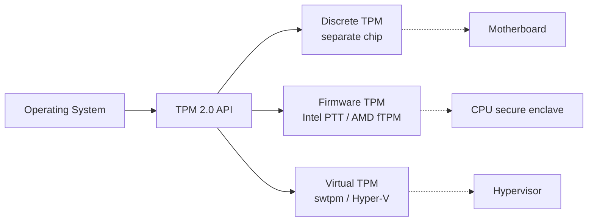

"TPM" gets thrown around a lot whenever someone tries to install Windows 11 on an older machine. It's worth understanding what it actually *is*, what shape it takes in real hardware, and why Microsoft made it a hard requirement when the OS plainly runs without one.

## What is a TPM?

**TPM** stands for **Trusted Platform Module** — not "Manager," which is a common misreading. It's a dedicated cryptographic component that provides hardware-level security functions on top of which higher-level features (disk encryption, secure boot, credential storage) are built.

What it does, in concrete terms:

- **Stores secrets in tamper-resistant storage.** Encryption keys, passwords, certificates live inside the TPM and can't be extracted by software, even if the OS is fully compromised.
- **Generates keys on-chip.** The private half of a key pair never leaves the hardware — there's no point in time where it sits in normal RAM.
- **Measures boot integrity.** Each stage of the boot process (firmware → bootloader → kernel) gets hashed into Platform Configuration Registers (PCRs). If anything in the chain changes, the hashes change, and any secret "sealed" to the previous values refuses to unseal.
- **Provides a hardware root of trust** for everything built above it.

## Is a TPM hardware?

Yes — but the word "hardware" hides a useful distinction. There are three forms in the wild:

| Type | What it is | Threat model |
|------|------------|--------------|
| **dTPM** (discrete) | A separate physical chip soldered to the motherboard (Infineon, Nuvoton, STMicro, etc.). Has its own CPU, RAM, and non-volatile storage. Talks to the host CPU over LPC, SPI, or I²C. | Strongest — resists physical / bus-snooping attacks best. |
| **fTPM** (firmware) | Code running inside a secure execution environment of the main CPU. Examples: **Intel PTT** (runs in the ME/CSME), **AMD fTPM** (runs in the PSP), ARM equivalents in TrustZone. | Hardware-isolated from the OS, but shares silicon with the main CPU. Cheaper, "good enough" for most consumer threat models. |
| **vTPM** (virtual) | A pure-software TPM emulated by a hypervisor. Used in VMs — `swtpm` for QEMU, Hyper-V vTPM, VMware, VirtualBox 7+. | No hardware guarantee against the host; trust is bounded by the hypervisor. |

All three speak the same TPM 2.0 interface to the OS, so software like BitLocker doesn't care which it's talking to. The difference matters for the threat model, not for compatibility.



## Common uses

A TPM is rarely interesting on its own — it's the foundation other features lean on:

- **Disk encryption** — BitLocker on Windows, LUKS with TPM unlock on Linux. The encryption key is *sealed* to the TPM and only released when boot-state PCRs match expected values.
- **Windows Hello** — biometric / PIN credentials backed by TPM-stored keys.
- **SSH / certificate stores** — private keys generated and held in the TPM.
- **Secure Boot attestation** — proving to a remote service that the machine booted a known-good chain.
- **Credential Guard, Device Guard, Pluton-based scenarios** on Windows.

On Linux you can poke at it with:

```bash
ls /dev/tpm*           # device nodes
tpm2_getcap properties-fixed   # from tpm2-tools
```

## Does Windows 11 require a TPM?

Officially: **yes — TPM 2.0 is a hard requirement.** The Windows 11 installer checks for it and refuses to proceed if it's missing, disabled, or only TPM 1.2.

A few practical points:

- **TPM 1.2 doesn't count.** Must be 2.0.
- **Most modern machines already have one** as fTPM (Intel PTT / AMD fTPM) — it's just often disabled in UEFI by default. Flipping a single firmware setting is usually all that's needed.
- **CPU support is a separate gate.** Even with a TPM, Microsoft also requires a supported CPU (roughly 8th-gen Intel / Ryzen 2000 and newer). A TPM alone isn't enough on older silicon.
- **VMs need a vTPM enabled** in the hypervisor for a supported install.

### The well-known bypasses

Because the OS itself doesn't actually depend on a TPM, several unsupported workarounds exist:

- Registry tweak during install: `HKLM\SYSTEM\Setup\LabConfig\BypassTPMCheck=1`.
- Modified install media — Rufus has a "remove TPM/Secure Boot requirement" toggle when writing the ISO.
- These produce a working install. Microsoft's official line is that such systems are *"not entitled to receive updates,"* though in practice they usually still get them. There's no guarantee that stays true.

## Why does Windows 11 require it, then?

This is the interesting question, because the OS clearly *can* run without a TPM — the bypasses prove it, and Windows Server 2022 (same NT kernel) has no TPM requirement at all.

So the requirement is a **policy decision, not a technical necessity**. Microsoft's reasoning, roughly:

1. **Raise the security baseline.** With TPM 2.0 guaranteed on every Win11 box, features like measured boot, BitLocker, Windows Hello, and Credential Guard can be assumed to work consistently. On Windows 10 these were optional, so OEMs and enterprises configured them inconsistently.
2. **Defend against specific attack classes.** Credential theft (pass-the-hash), offline disk attacks, bootkits, firmware tampering — all are mitigated more effectively when keys live in hardware.
3. **Force the ecosystem forward.** The TPM line doubles as a proxy for "modern enough CPU." Pre-2016 chips that lack fTPM also lack other modern security primitives (MBEC, virtualization-based security building blocks).
4. **Enable future features.** Passkeys, device attestation, DRM, Pluton-based scenarios — Microsoft wanted a clean baseline before building on it.

The honest tradeoff: the requirement is genuinely about security posture, but it also conveniently obsoleted millions of working Windows 10 PCs in a way that pleased OEMs. The bypass continuing to work suggests the line is drawn somewhere between "principled" and "stricter than the security argument alone justifies."

## TL;DR

- A TPM is a hardware-rooted secure element — discrete chip, firmware-on-CPU, or virtualized.
- It stores keys, generates keys, measures boot state, and provides a root of trust.
- Windows 11 *requires* TPM 2.0, but doesn't *technically need* it — the requirement is a baseline-raising policy, not a kernel dependency.
- Most machines from the last ~8 years already have an fTPM; you may just need to enable it in UEFI.
