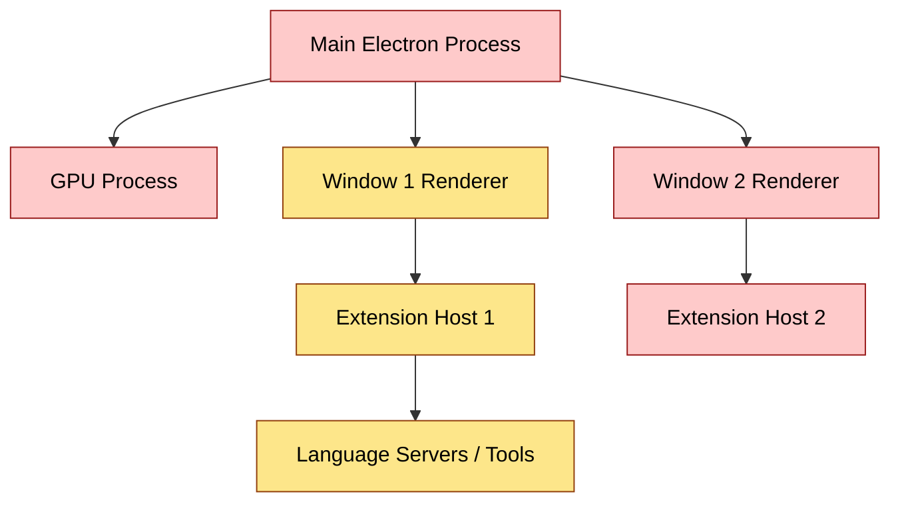

VS Code is an Electron app, which means it has more than one process and more than one layer of state. "Restarting" can therefore mean two very different things:

- **Close + start** — kill the whole app, launch it fresh.
- **Reload Window** (`Ctrl+R` / `Cmd+R`, or *Developer: Reload Window* in the command palette) — refresh just the current window in place.

Most "did you try restarting it?" advice for VS Code really means the second one. They look similar but reset different layers.

## What each one actually does

### Close + start

A full quit kills the entire process tree:

- Main Electron process
- All renderer (window) processes
- All extension host processes
- Embedded terminals
- Language servers and other extension-spawned subprocesses
- The GPU process and shell-integration helpers

On the next launch, every layer boots from scratch — settings are reread from disk, extensions re-activated, workspace storage reloaded, native modules re-linked.

### Reload Window

`Reload Window` only restarts the **renderer + extension host for one window**. The main Electron process keeps running underneath. It's an in-place refresh:

- Re-runs extension activation
- Re-reads `settings.json`
- Re-initializes the workbench UI
- Other windows are untouched
- Electron itself, the GPU process, and native modules are not reset

## Process model at a glance

🟡 Reload Window resets the yellow nodes for the active window only.
🔴 Close + start resets everything — yellow and red.

## Side-by-side

| Aspect | Close + start | Reload Window |
|---|---|---|
| Speed | Slower (full app boot) | Faster (just the window) |
| Scope | All windows | Current window only |
| Picks up VS Code updates | ✅ | ❌ |
| Picks up new / updated extensions | ✅ | ✅ |
| Picks up `settings.json` changes | ✅ | ✅ (most apply live anyway) |
| Clears stuck extension host / LSP | ✅ | ✅ |
| Resets native modules / Electron itself | ✅ | ❌ |
| Reinitializes GPU process / shell integration | ✅ | ❌ |

## When to use which

- **Reload Window — 90% of the time.**
  Extension misbehaving, TypeScript server stuck, a setting not applying, just installed an extension, want to reset workbench UI state.

- **Close + start — when Reload isn't enough.**
  After a VS Code update, GPU/rendering glitches, native module issues, or anything that "feels" like the app itself is unhealthy rather than a single window.

### Rule of thumb

> Try Reload Window first. If the symptom survives a reload, it probably lives in a layer Reload Window can't touch — so do a full close + start.

## Quick reference

- 🔁 **Reload Window**: `Ctrl+R` (Linux/Windows) · `Cmd+R` (macOS) · or *Developer: Reload Window* from the command palette.
- ❌ **Close + start**: quit from the OS (`Ctrl+Q` / `Cmd+Q` / window close), then relaunch.
