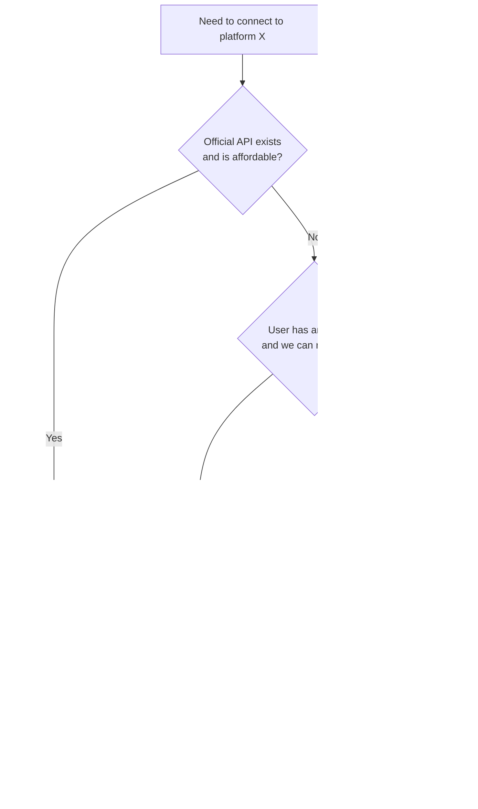

# Connecting AI Agents to Hostile Platforms

When you start designing an AI agent that connects to many sources, you quickly notice an asymmetry: tools like **GitHub, Notion, Figma, Linear** all ship MCP servers, OAuth APIs, and SDKs eagerly. Social platforms like **X (Twitter), Facebook, Instagram, TikTok, Xiaohongshu (RedNote), Weibo, Zhihu, Douyin** do the opposite — limited APIs, expensive paid tiers, aggressive bot detection, no MCP in sight.

This post explains *why* the gap exists, then walks through the four practical methods for integrating with the hostile side anyway.

## Why the Asymmetry Exists

The split isn't accidental — it's structural, driven by how each kind of platform makes money:

| Platform type | Business model | What an AI agent represents |
|---|---|---|
| Productivity tools (GitHub, Notion, Figma) | Paid seats, B2B SaaS | A reason to *stay subscribed* — integrations make the tool stickier |
| Social media (X, IG, TikTok, Xiaohongshu) | Attention → ads | A *threat* — agents read content without showing ads, and content is the moat |

For productivity tools, integration is a growth lever. For social platforms, integration is an existential risk: their content is what advertisers pay to reach, and an agent that lets users consume that content elsewhere directly undermines the ad business.

Expect this gap to **persist or widen** as platforms add anti-bot measures (Cloudflare bot management, behavioral fingerprinting, mobile-app-only features).

## Four Methods for Social Connectors

Roughly ordered from most legitimate to most pragmatic:

---

### 1. Official APIs

**What it is:** The platform's own developer endpoints — REST/GraphQL with OAuth, documented and supported.

**How it works:** Register an app, user grants scopes via OAuth, you call endpoints with their token. Rate-limited and audited.

**Per-platform reality:**

- **X (Twitter):** Free tier is essentially write-only (post tweets). Reading timelines/search starts at Basic ($200/mo) and gets serious at Pro ($5k/mo). Effectively dead for hobby agents.
- **Meta (FB/IG):** Graph API exists but is heavily gated. Instagram only exposes Business/Creator accounts via the Instagram Graph API — personal feeds are off-limits. App Review required for most scopes.
- **TikTok:** Display API + Content Posting API. Read access is narrow (the user's own videos, not the For You feed).
- **Weibo / Zhihu / Douyin / Xiaohongshu:** Developer programs exist but most require a Chinese business entity (营业执照) and ICP filing. Practically inaccessible to individuals or non-Chinese companies. Xiaohongshu has no meaningful public API.

**Use when:** Anything you ship as a product. The cost and pain is the price of not getting your account nuked.

---

### 2. User-authorized Browser Automation

**What it is:** Drive a real browser (Playwright, Puppeteer, Chrome DevTools Protocol) using the user's own logged-in session.

**How it works:** Either attach to the user's existing Chrome profile or run a headed browser they've authenticated in. The agent navigates pages and reads the DOM the same way the user would.

> **Key distinction:** This is the user automating *their own* viewing. Legally much stronger ground than a backend scraper hitting public endpoints from a datacenter IP — but ToS clauses against automation still technically apply.

| ✅ Pros | ⚠️ Cons |
|---|---|
| Works on every platform with a web UI | Slow (full page renders), brittle (DOM changes break selectors) |
| Sees exactly what the user sees (logged-in, personalized) | Anti-bot detection (Cloudflare, Akamai, fingerprinting) |
| No API quotas | Account risk — shadowbans, suspensions |
| | Hard to scale — runs on the user's machine, not a server farm |

**Use when:** Personal agents, internal tools, or "bring your own session" products.

---

### 3. RSS Bridges / Public Mirrors

**What it is:** Third-party services that re-expose platform content as RSS, JSON, or another open format.

**Examples:**

- **RSSHub** — community project with hundreds of routes (Weibo, Zhihu, Bilibili, Xiaohongshu, Twitter via Nitter, etc.)
- **Nitter** — Twitter front-end that emits RSS (most public instances are dead post-2023, but self-hosted still works sporadically)
- **Bibliogram / Proxitok** — same idea for Instagram/TikTok, mostly defunct now

**How it works:** The bridge does the scraping (or uses leaked mobile API keys, or a logged-in account), normalizes the output, and you consume it like any RSS feed.

**Trade-offs:**

- ✅ Zero auth, easy to integrate, read-only by design
- ⚠️ Extremely fragile — every platform tightening breaks half the routes for weeks
- ⚠️ Public instances get rate-limited or blocked
- ⚠️ You're trusting a third party with whatever the bridge sees
- ❌ Not viable for a production product

**Use when:** Personal dashboards, prototypes, "follow this creator across platforms" hobby projects. Self-host RSSHub if you actually depend on it.

---

### 4. Deep Links Instead of Integration

**What it is:** Don't try to integrate. Have the agent prepare context, then hand off to the platform's native app/web with a URL.

**How it works:** Agent says "I drafted this post — opening Twitter compose now" and fires `https://twitter.com/intent/tweet?text=...`. Or "here are 3 Xiaohongshu posts matching your query" as links the user clicks, with the platform doing the actual rendering and auth.

| ✅ Pros | ⚠️ Cons |
|---|---|
| Zero ToS risk, zero maintenance, zero auth complexity | Agent can't *read back* what the user did |
| Always works — the platform's own app handles everything | Can't follow up, can't close the loop |
| Honest about the boundary | One-way escape hatch |

**Use when:** As a fallback for every platform you can't otherwise integrate, and as the *primary* mode for write actions where you want a human in the loop anyway (don't auto-post — draft and hand off).

## A Tiered Connector Architecture

A reasonable way to organize all this in an agent's connector layer:

| Tier | Method | Example platforms |
|---|---|---|
| First-class | MCP / official API | GitHub, Notion, Figma, Linear |
| Second-class | OAuth API with limits | X (paid), Meta Graph, TikTok Display |
| Best-effort | Browser automation | Xiaohongshu, Weibo, Zhihu (logged-in user session) |
| Read-only feed | RSS bridge | Public creators, news-like content |
| Escape hatch | Deep-link handoff | Anything write-side, anything else broken |

The architectural point: **make the tier visible to the agent's planner**. The planner needs to know "I can read X reliably but can only draft-and-handoff on Y" — otherwise the agent will confidently promise things it can't deliver on the hostile platforms, and users will lose trust the first time it silently fails.

## Takeaways

- 🧭 The friendly-vs-hostile split tracks business models, not technical capability — and won't fix itself.
- 💸 For social platforms, "official API" usually means *expensive*, *narrow*, or *gated by jurisdiction*.
- 🖥️ User-authorized browser automation is the most powerful fallback, but doesn't scale to a hosted product.
- 🪝 Deep-link handoff is underrated — it's honest, free, unbreakable, and pairs naturally with human-in-the-loop write flows.
- 🏗️ Bake the connector tier into your agent's planner so it can degrade gracefully instead of overpromising.
