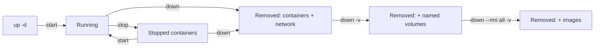

A walkthrough of what volumes do in a Docker Compose file, how they interact with the container lifecycle, and the commands to start, stop, and reset a stack cleanly.

## What is a volume?

A **volume** is Docker's way of giving a container persistent storage that survives the container itself.

Containers are throwaway — when you `docker compose down` and recreate them, anything written inside the container's filesystem is **gone**. A volume lives outside that lifecycle, so the data sticks around.

## Anatomy of a volume in a compose file

A typical use looks like this:

```yaml
services:
    redis:
        image: redis:alpine
        volumes:
            - redis-data:/data       # mount the named volume at /data inside the container

volumes:
    redis-data:                      # declare the named volume
```

Two parts working together:

1. **The top-level `volumes:` block** declares a named volume called `redis-data`. Docker creates and manages it (stored under `/var/lib/docker/volumes/` on the host).
2. **The `volumes:` key inside the service** mounts that volume at `/data` inside the container. If Redis is configured to write its dump/AOF files to `/data`, all cached data lands on the volume.

Result: after `docker compose down` + `docker compose up`, Redis comes back with its previous data intact. Without the volume, every restart starts empty.

## Volume vs. bind mount

There are two common ways to mount storage into a container:

| | Named volume | Bind mount |
|---|---|---|
| Syntax | `redis-data:/data` | `./mydata:/data` |
| Managed by | Docker | You |
| Lives at | Docker's internal dir | A path you choose on the host |
| Best for | App data you don't need to poke at directly | Config files, source code during dev |

A named volume is the right pick when the data is just internal app state — you never need to open it from the host.

## When you don't need a volume

Not every service needs persistence. A service is a good candidate for *no* volume when:

- It's **stateless** (a feed generator, an API gateway, a worker) — anything it produces is regenerated on demand.
- It's **ephemeral** (a headless browser, a CI sandbox) — each run is a fresh session by design.

Only services holding state worth keeping need a volume.

## Lifecycle: which command does what



The full spectrum:

```bash
docker compose stop      # stop containers, keep them (fastest restart with `start`)
docker compose down      # stop + remove containers + remove network
docker compose down -v   # ↑ plus remove named volumes (full data wipe)
docker compose down --rmi all -v   # ↑ plus remove the images too (full reset)
```

What `docker compose down` removes by default:

| Thing | Removed by `down`? | Flag to also remove |
|---|---|---|
| Containers | ✅ yes | — |
| Networks created by compose | ✅ yes | — |
| **Named volumes** | ❌ no | `-v` or `--volumes` |
| **Images** | ❌ no | `--rmi all` (or `--rmi local`) |
| Anonymous volumes attached to containers | ❌ no | `-v` |

## How to wipe data between launches

Three options, picked by how clean you want the slate:

### Option 1: Remove the volume (full wipe)

```bash
docker compose down -v
```

The `-v` flag tells compose to delete the named volumes too. Next `docker compose up` starts with empty storage.

You can also target one volume specifically:

```bash
docker compose down
docker volume ls                         # find the exact name (project-prefixed)
docker volume rm <project>_<volume>      # e.g. rsshub_redis-data
```

The volume name is prefixed with the project/directory name.

### Option 2: Flush data without restarting

If the stack is running and you just want to drop the data in place — e.g. clear a Redis cache:

```bash
docker compose exec redis redis-cli FLUSHALL
```

No container restart needed. Faster than option 1 for a quick reset.

### Option 3: Make it ephemeral by default

If you *always* want a fresh state on every launch, drop the volume from the compose file entirely:

```yaml
services:
    redis:
        image: redis:alpine
        restart: always
        # no volumes: block
        healthcheck:
            test: ['CMD', 'redis-cli', 'ping']
            interval: 30s
            timeout: 10s
            retries: 5
            start_period: 5s

# no top-level volumes: block either
```

The service writes to its own container filesystem, which gets discarded on every `docker compose down`. Once the volume is removed from the file, plain `docker compose down` is equivalent to a clean slate — no `-v` needed.

## Picking between the three

- **One-off wipe, keep config as-is** → `docker compose down -v`
- **Wipe without stopping** → an in-container flush command
- **Never persist in the first place** → remove the volume from the file

For a pure cache layer, ephemeral-by-default is reasonable: losing the cache only means it gets rebuilt on the next request. For databases or anything else with state you'd be sad to lose, keep the volume and use option 1 only when you really mean it.

## Starting and verifying a stack

From the directory containing the compose file:

```bash
docker compose up -d
```

- `up` creates and starts all services.
- `-d` runs them detached (in the background). Without it, logs stream to your terminal and Ctrl+C stops everything.

First run pulls images — takes a minute or two depending on the connection.

Verify:

```bash
docker compose ps                # show running services + health status
docker compose logs -f <service> # tail logs (Ctrl+C to stop tailing)
```

Useful follow-ups:

```bash
docker compose stop              # stop containers (keeps them around)
docker compose start             # start them again
docker compose restart <service> # restart just one service
docker compose pull              # fetch newer image versions
```

## Heads-up

- If the host port in `'1200:1200'` is already taken, change the **left** side (e.g. `'1300:1200'` exposes it on 1300 instead). The right side is the container's port and stays put.
- If `docker compose` (v2, with a space) isn't found, try `docker-compose` (v1, hyphenated) — same arguments.
- `docker compose down` does **not** remove images. They stay cached on disk so the next `up` is fast.

## Summary

| You want to… | Run this |
|---|---|
| Start the stack in the background | `docker compose up -d` |
| Stop but keep containers around | `docker compose stop` |
| Stop and remove containers (data kept if volume declared) | `docker compose down` |
| Stop, remove containers, **and** wipe named volumes | `docker compose down -v` |
| Nuke everything including images | `docker compose down --rmi all -v` |
| Drop data in a running container | exec an in-container flush command |
| Never persist in the first place | remove `volumes:` from the compose file |
