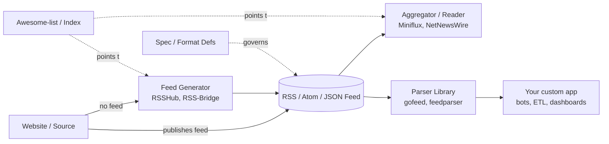

The RSS ecosystem on GitHub looks sprawling at first, but almost every project falls into one of five buckets. Knowing the buckets makes it much easier to pick the right tool: do you want to *read* feeds, *create* one for a site that doesn't have one, *write code* that consumes feeds, *understand the format*, or *browse what exists*?

## Categories at a glance

| Category | What it does | When you reach for it |
|---|---|---|
| Aggregators / Readers | Poll feeds, store items, present an inbox UI | You want to *read* feeds |
| Feed generators | Scrape sites and emit a valid feed | The site you want has no native feed |
| Libraries / parsers | Handle messy XML/JSON feed formats in code | You're *building* something that ingests feeds |
| Specs / tooling | Define what a valid feed is | You're implementing a parser or generator |
| Awesome-lists | Curated indexes of everything else | You're shopping, not building |

## 📖 Aggregators / readers

The apps you actually read in. They poll a list of feed URLs on a schedule, store new items, track read/unread state, and present a unified inbox. Self-hosted ones run on your own server so reading state isn't tied to a vendor; desktop and mobile ones run locally or sync via a backend.

- [`miniflux/v2`](https://github.com/miniflux/v2) — minimalist self-hosted reader (Go)
- [`FreshRSS/FreshRSS`](https://github.com/FreshRSS/FreshRSS) — popular self-hosted PHP aggregator
- [`Ranchero-Software/NetNewsWire`](https://github.com/Ranchero-Software/NetNewsWire) — open-source macOS/iOS reader
- [`yang991178/fluent-reader`](https://github.com/yang991178/fluent-reader) — cross-platform desktop reader (Electron)
- [`nkanaev/yarr`](https://github.com/nkanaev/yarr) — tiny single-binary self-hosted reader
- [`RSSNext/Folo`](https://github.com/RSSNext/Folo) — modern reader (Follow app)

## 🛠️ Feed generation / scraping

Tools that *create* RSS for sites that don't publish one. They scrape HTML (or hit private APIs) and emit a standards-compliant feed. You point them at, say, a Twitter profile or a shop's product page, and you get back an `.xml` URL your reader can subscribe to. This category exists because most modern sites killed their native feeds.

- [`DIYgod/RSSHub`](https://github.com/DIYgod/RSSHub) — generates RSS for thousands of sites that don't offer one
- [`RSS-Bridge/rss-bridge`](https://github.com/RSS-Bridge/rss-bridge) — PHP equivalent of RSSHub
- [`damoeb/rss-proxy`](https://github.com/damoeb/rss-proxy) — turns any HTML page into a feed
- [`zedeus/nitter`](https://github.com/zedeus/nitter) — Twitter/X frontend that exposes RSS as a side effect
- [`rss2email/rss2email`](https://github.com/rss2email/rss2email) — adjacent: converts feeds to email rather than generating them

## 🧩 Libraries / parsers

Code you `import` when *building* something that consumes feeds. They handle the messy parts: RSS 2.0 vs Atom vs RSS 1.0/RDF vs JSON Feed, broken XML, weird date formats, encoding issues. Reach for these when writing your own reader, a notification bot, or an ETL pipeline that ingests feeds.

- [`mmcdole/gofeed`](https://github.com/mmcdole/gofeed) — Go parser (RSS / Atom / JSON Feed)
- [`kurtmckee/feedparser`](https://github.com/kurtmckee/feedparser) — classic Python parser
- [`rbren/rss-parser`](https://github.com/rbren/rss-parser) — popular Node.js parser

## 📜 Specs / format definitions

The format definitions themselves — what a valid feed *is*. You read these when you need to know exactly what tags are allowed, how `<guid>` should behave, or what JSON Feed adds over Atom. Mostly relevant if you're implementing a parser or generator from scratch.

- [`w3c/rss`](https://github.com/w3c/rss) — historical RSS spec material
- [`brentsimmons/JSONFeed`](https://github.com/brentsimmons/JSONFeed) — JSON Feed specification

## 🗺️ Awesome-lists / curated indexes

Curated indexes that catalog the whole ecosystem. Good entry points when you're shopping for a tool rather than building one.

- [`AboutRSS/ALL-about-RSS`](https://github.com/AboutRSS/ALL-about-RSS) — the most comprehensive RSS index on GitHub

## How the categories fit together

A typical RSS workflow chains the categories:

1. A **generator** like RSSHub fills the gap when a site has no feed.
2. The resulting feed flows into a **reader** like Miniflux for human consumption — or into your own app via a **parser library** like gofeed.
3. The **specs** govern what those feeds are allowed to look like.
4. The **awesome-lists** are how you discover any of this in the first place.

If you only remember one repo from this list, make it [`AboutRSS/ALL-about-RSS`](https://github.com/AboutRSS/ALL-about-RSS) — from there, every other category is one click away.
