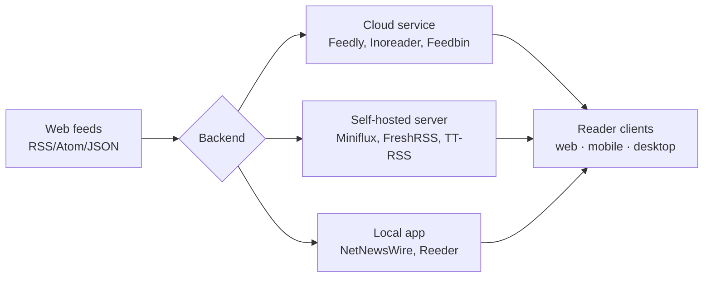

## The landscape

RSS readers come in four broad shapes:

- **Cloud / sync services** — sign up, feeds sync everywhere
- **Desktop / native apps** — local-first, often gorgeous UX
- **Mobile-focused apps** — usually pair with a sync backend
- **Self-hosted servers** — you run the backend, read in a browser or compatible app
- **Terminal** — keyboard-driven, minimal

The right pick depends on **where you read**, **whether you want to own your data**, and **how much you want to tinker**.

## By use case

### Free & open source

| Reader | Platform | Notes |
| --- | --- | --- |
| NetNewsWire | macOS / iOS | Fully free, no upsell |
| FreshRSS | self-hosted (PHP) | Most popular self-hosted option |
| Tiny Tiny RSS | self-hosted (PHP) | Older, more features, heavier |
| Miniflux | self-hosted (Go) | Minimal, fast, single binary |
| QuiteRSS / Liferea | desktop Linux | Native GTK/Qt clients |
| Newsboat | terminal | Keyboard-driven, vi-like |

### Self-hosted (you control the data)

- **Miniflux** — lightweight, single binary, great API
- **FreshRSS** — most popular, plugin ecosystem
- **Tiny Tiny RSS** — older, more features, heavier
- **CommaFeed** — Java-based
- **Stringer** — Ruby

### Privacy-focused

- NetNewsWire (local, no account needed)
- Miniflux (self-host, no telemetry)
- Newsboat (terminal, local)
- BazQux (paid, no ads/tracking)

### Cross-device sync

- **Feedly** — biggest ecosystem, integrates with most apps
- **Inoreader** — most powerful filtering/rules, generous free tier
- **Feedbin** — clean, plays well with Reeder/Unread
- **NewsBlur** — open source backend, training filter
- Self-hosted Miniflux/FreshRSS + Reeder/Unread (via Fever / Google Reader API)

### Best free tier

| Service | Free limit |
| --- | --- |
| Inoreader | 150 feeds (with ads) |
| Feedly | 100 feeds |
| The Old Reader | 100 feeds |
| NewsBlur | 64 sites |

### Power users / heavy filtering

- **Inoreader** — rules, search, monitoring keywords
- **NewsBlur** — intelligence trainer
- **Tiny Tiny RSS** — filters, plugins

### Minimalist / fast

- Miniflux (server)
- NetNewsWire (client)
- Newsboat (terminal)

### Best polish (paid)

- **Reeder** — gold standard on Apple platforms
- **Unread** — reading-focused, beautiful typography
- **Fiery Feeds** — heavy customization

## A concrete pick: self-hosted, Docker, read in a browser

If the constraints are *self-host*, *run in Docker*, and *read in a browser*, three options stand out:

### Miniflux ⭐

- Single Go binary, very low resources (~30 MB RAM)
- Clean, minimal web UI — works great in Chrome
- Official image: `miniflux/miniflux`
- Needs PostgreSQL (one extra container)
- Built-in feed scraping, full-text extraction, keyboard shortcuts
- API-compatible with Fever / Google Reader (mobile clients work later)

### FreshRSS

- PHP-based, official image: `freshrss/freshrss`
- Works with SQLite (no DB container needed) or PostgreSQL/MySQL
- Plugins, themes, multi-user, OPML import/export
- Heavier UI but more configurable

### Tiny Tiny RSS

- More setup friction, older codebase
- Skip unless you specifically need its plugin ecosystem

### Why Miniflux wins for this setup

Minimal moving parts and you'll have it running in five minutes. The UI is built around fast keyboard navigation in a browser, which is exactly the target use case. FreshRSS is the better pick if you want plugins, themes, or multi-user from day one.

## Decision shortcuts

- ✅ **Just want to read in Chrome, self-hosted, Docker** → Miniflux
- ✅ **Same, but want plugins/themes/multi-user** → FreshRSS
- ✅ **Apple-only, no server** → NetNewsWire (free) or Reeder (paid)
- ✅ **Cross-device, don't want to host** → Feedly or Inoreader
- ✅ **Heavy filtering / keyword monitoring** → Inoreader
- ✅ **Terminal** → Newsboat
