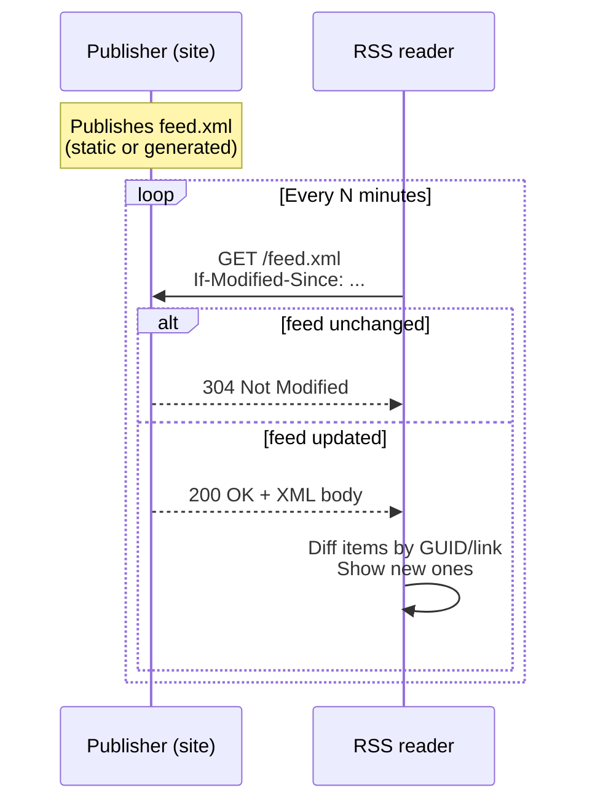

## What is RSS?

**RSS** (Really Simple Syndication) is a web feed format that lets you subscribe to updates from websites — blogs, news sites, podcasts — without visiting them directly.

A site publishes an XML file (typically `feed.xml` or `rss.xml`) listing recent posts with titles, summaries, links, and timestamps. You point an RSS reader at that URL and the reader shows you new items in one unified inbox.

### Why people use it

- 📥 One place to read many sites — no algorithmic feed, no ads, no tracking
- 🕒 Chronological ordering — no "the algorithm decided you don't care"
- 🔓 Works without an account on the source site

> **Atom** is a similar, slightly newer format. Readers handle both, and people often say "RSS" loosely to mean either.

## How it works

The model is simple: the site hosts a file, the client polls it.



### Step by step

1. **Site publishes a feed URL** — e.g. `https://example.com/feed.xml`. It's just a static XML file (or dynamically generated, but served as XML) listing recent posts.
2. **Client polls that URL** — your RSS reader fetches it on a schedule (every 15 min, every hour, whatever you configure). It's a plain HTTP GET, same as loading any web page.
3. **Client diffs against what it saw last time** — each item has a unique ID (a `<guid>` or `<link>`). New IDs = new posts to show you.

### Pull, not push

The server doesn't push anything. There's no subscription registered server-side — the publisher doesn't even know who's reading. It just hosts the file; clients pull on their own schedule.

This is why RSS scales well and respects privacy: the publisher has no list of subscribers.

To be polite, clients send conditional request headers so the server can reply `304 Not Modified` when nothing has changed, saving bandwidth:

| Header | Purpose |
|---|---|
| `If-Modified-Since` | Compare against `Last-Modified` timestamp |
| `If-None-Match` | Compare against `ETag` value |

## Specifications

| Spec | URL | Notes |
|---|---|---|
| **RSS 2.0** | https://www.rssboard.org/rss-specification | Maintained by the RSS Advisory Board. What most people mean by "RSS." |
| **Atom 1.0** | https://datatracker.ietf.org/doc/html/rfc4287 | IETF standard (RFC 4287). Stricter, properly namespaced, generally considered better-designed. |
| RSS 1.0 (RDF-based) | https://web.resource.org/rss/1.0/spec | Mostly historical. |
| RSS 0.9x | — | Superseded by 2.0. |

### Practical extras

- **W3C Feed Validator** — https://validator.w3.org/feed/ — paste a feed URL to check it parses
- **Autodiscovery** — clients find a site's feed via a `<link>` tag in HTML `<head>`:
  ```html
  <link rel="alternate" type="application/rss+xml" href="/feed.xml" />
  ```

## Which should you publish?

If you're generating a feed for a blog or static site:

- ✅ **Atom 1.0** is the cleaner choice — stricter spec, fewer ambiguities
- ✅ **RSS 2.0** has wider tooling familiarity

Either works. Pick one, validate it, and link it from your `<head>`. Most static site generators (Jekyll, Hugo, Astro, etc.) can emit one out of the box.
