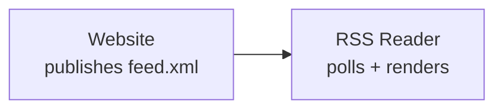
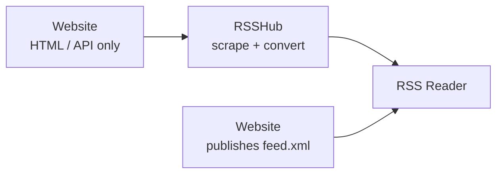
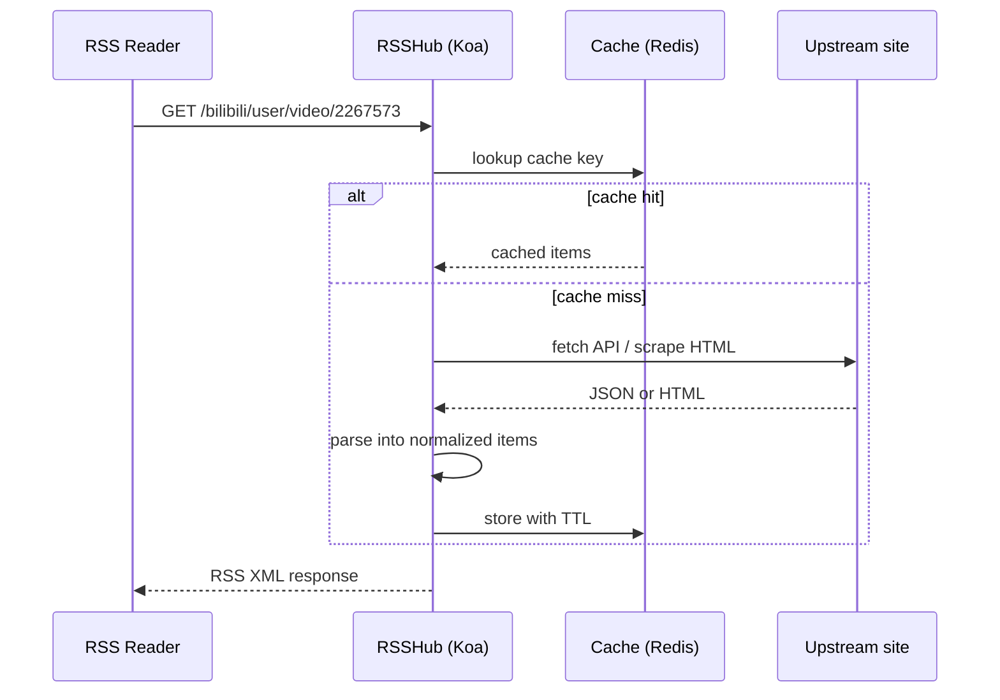
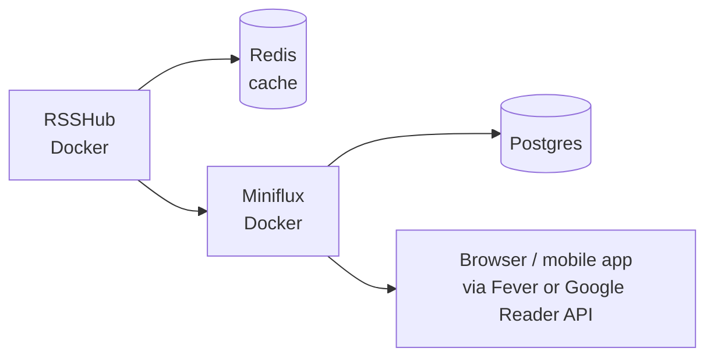

## What RSSHub is

[RSSHub](https://github.com/DIYgod/RSSHub) is an open-source project that generates RSS feeds for sites and services that don't provide them natively. It's a Node.js app with hundreds of community-contributed *routes* — small modules that know how to pull data from a specific site (Twitter/X, Bilibili, Weibo, GitHub trending, news sites, etc.) and reshape it into RSS.

You can self-host it or point your reader at a public instance.

## Where it fits in the RSS architecture

In a standard RSS setup, the website itself publishes the feed and the reader polls it directly:

The problem: many modern sites never implemented RSS, removed it (Twitter killed RSS in 2013, Facebook in 2018), or only expose data via APIs and JS-rendered pages.

RSSHub slots in as a **shim layer** that pretends to be the missing `feed.xml` endpoint:

From the reader's perspective nothing is unusual — it just sees another RSS URL like `https://your-rsshub.example.com/twitter/user/someone` and polls it like any other feed. Your subscription list ends up being a mix of direct feeds (blogs, news sites, GitHub releases) and RSSHub-generated feeds for everything else.

## How a request flows through RSSHub

Step by step:

1. **Route match** — a Koa router maps the path to a route module under `lib/routes/<namespace>/`.
2. **Fetch** — the handler hits the official API if one exists, otherwise scrapes HTML with `cheerio` + `got`. JS-heavy pages may use a headless browser (`puppeteer`).
3. **Normalize** — the handler returns `{ title, link, item: [...] }` where each item has fields like title, link, pubDate, description, author.
4. **Cache** — middleware stores route output in Redis (or in-memory) with a short TTL so repeated polls don't hammer the source.
5. **Render** — a central renderer serializes the object to RSS / Atom / JSON Feed XML.

## Practical features

| Feature | What it does |
| --- | --- |
| ⚡ Caching layer | Short TTLs on route output, longer TTLs on per-item enrichment |
| 🛡️ Anti-bot handling | Proxies, rotating UAs, cookies passed via env vars or query params for sites that need auth |
| 📄 Full-text fetching | `?mode=fulltext` fetches each linked article and inlines content via Mozilla Readability |
| 🔍 Filters | `?filter=`, `?filterout=`, `?limit=` do server-side filtering before serialization |

## Why you still need a reader

RSSHub only emits XML at URLs. You still need a reader to subscribe, poll, deduplicate, mark items read/unread, and render a UI. The two halves are complementary:

- **RSSHub** → feed *producer*
- **Reader** → feed *consumer*

### Common pairings

**Self-hosted readers** (good match for self-hosted RSSHub):

- **Miniflux** — minimal, single Go binary + Postgres, clean web UI, supports filters/rules.
- **FreshRSS** — PHP/MySQL, more features, plugin ecosystem, mobile-friendly.
- **Tiny Tiny RSS** — older, more configurable, heavier.

**Hosted readers** — Feedly, Inoreader, NewsBlur, Feedbin all work fine; just point them at your RSSHub URL.

**Desktop / mobile clients** — Reeder, NetNewsWire, Readwise Reader, FluentReader sync via the reader above or run standalone.

### A typical self-hosted stack

## A nuance worth flagging

If you self-host, set RSSHub's cache TTL sensibly and have your reader poll at reasonable intervals (e.g., 1 hour). Otherwise you'll hit upstream sites hard and risk getting your RSSHub instance blocked.

## TL;DR

RSSHub is essentially **scrapers + a normalizer + an RSS renderer + a cache**, and the value sits in the ~1000 community-maintained route modules. It doesn't replace your RSS reader — it sits *behind* it, filling in the gap for sites that never gave you a feed in the first place.
