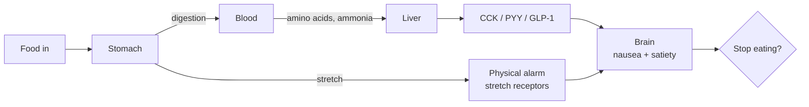

## A puzzle to start with

You constantly hear that **too many carbs cause diabetes** and **too much fat causes obesity**. But you almost never hear "too much milk, eggs, or lean meat causes X disease." Why?

It isn't that protein-rich foods are magically harmless. It's that the body has a remarkably honest alarm system for them, and modern food engineering has spent decades figuring out how to bypass that system — but only for sugar and fat.

This post pulls together the core ideas: why protein is nearly impossible to overeat, how processed food hijacks the signaling pathways evolution gave us, and what happens when you simply stop feeding the hijack.

## The body has two satiety alarms

Think of fullness as **two independent alarm systems** wired in parallel:

| Alarm | Triggered by | What you feel |
| :--- | :--- | :--- |
| 🧪 Biochemical | Hormones (CCK, PYY, GLP-1), blood ammonia, leptin | Nausea, loss of appetite, "I can't take another bite" |
| 🎈 Physical | Stomach stretch receptors | Bloating, pressure, "I'm physically packed" |

A healthy diet trips **both** alarms long before you've harmed yourself. The cleverness of modern food engineering is in selectively muting the biochemical one.

## Why protein is almost impossible to overeat

### 1. The biochemical brake fires early

Protein digestion strongly stimulates **CCK** and **PYY**, hormones that act directly on the brain's satiety and vomiting centers. The natural endpoint isn't a polite "I'm done" — it's a hard, queasy "no more."

There's a historical name for the extreme version: **rabbit starvation**. Early explorers living on only very lean wild game (rabbits) reported feeling sick and starving no matter how much meat they ate. The body actively rejects pure-protein loading.

### 2. Metabolism doesn't favor storage

- **Carbs** in excess → blood glucose → insulin → eventually insulin resistance and type 2 diabetes
- **Fat** in excess → 9 kcal/g, easily stockpiled as adipose tissue
- **Protein** in excess → mostly deaminated to urea and excreted, or burned for energy

Protein's main job is **building material**, not stored fuel. The body has no efficient pipeline for "save this amino acid for next winter."

### 3. The thermic effect of food (TEF) is brutal

| Macronutrient | Energy spent on digestion |
| :--- | :--- |
| Carbs | 5–10% |
| Fat | 0–3% |
| **Protein** | **20–30%** |

Eat 100 kcal of lean meat, lose ~25 kcal just digesting it. Combined with low energy density, this makes overeating to a caloric surplus genuinely hard.

### 4. There *are* edge cases — they're just rare

For completeness, extreme protein intake isn't risk-free:

- **Kidney burden** — a real concern for people who already have kidney disease
- **Red meat and colorectal cancer** — WHO classifies red meat as group 2A
- **Dairy at very high volumes** — some studies link to prostate cancer risk and acne (IGF-1 mediated)
- **Egg yolk cholesterol** — debated, more relevant to people with metabolic dysfunction

In practice, a normal person can't reach these thresholds via appetite alone.

## Why the food industry can't sell "addictive protein"

Walk through a supermarket and notice: the truly hyperpalatable, eat-the-whole-bag products are almost all carb + fat. There's a structural reason.

- **Cost** — flour, sugar, and palm oil are pennies per calorie. Milk, eggs, lean meat are several times more expensive per calorie. Adding real protein to processed food blows up the price.
- **Texture** — pure protein is dry, fibrous, and slightly bitter when chewed. To make it palatable at scale you have to add fat, sugar, and salt — at which point it's no longer "high protein," it's a calorie bomb.
- **Shelf life** — protein-rich foods spoil faster, demanding cold chain and preservatives.
- **Maillard reaction shortcut** — starch + fat at high heat produces irresistible brown-toasted flavors. Pure protein doesn't reach the same "bliss point."

The "high-protein" snacks that *do* exist — protein bars, flavored milks, soy jerky — usually meet protein targets by piggybacking sugar, oil, and sodium. The bar that delivers 20 g protein often also delivers 300 kcal, half from fat and refined carbs.

> **Corollary**: bodybuilders chasing surplus protein aren't enjoying themselves. They drink whey shakes and blend chicken with broccoli into a slurry precisely *because* solid lean meat in target volumes is unbearable. It's manual labor against a biological ceiling.

## How processed food bypasses the biochemical alarm

This is the heart of it. Take a familiar contrast:

- You can drink several cans of cola in one sitting.
- Two large glasses of milk and most people feel queasy — and are fine again the next morning.

Both deliver substantial calories. Why the asymmetry?

### Milk trips the biochemical alarm

- **Casein** clots in stomach acid into a tofu-like solid mass — liquid in, brick in.
- Slow gastric emptying → strong CCK / PYY release.
- Lactose load → osmotic shifts in the gut → mild nausea.
- Result: **early, hard stop**.

### Cola sails through

- Sugar water barely engages the stomach; absorption happens fast in the small intestine.
- Glucose + fructose flood → dopamine reward → insulin spike.
- Insulin actively **suppresses** satiety signaling while transporting glucose.
- No CCK trigger. No nausea. The only remaining brake is physical stretch.

### Cake, fried chicken, chips — same trick, different vector

Ultra-processed foods are engineered around the **bliss point** (a specific fat-to-sugar ratio near 1:2) and the **vanishing caloric density** effect: light, melt-in-the-mouth textures convince the brain you barely ate anything. Complex flavoring defeats **sensory-specific satiety** (the mechanism that bores you of a single taste). The biochemical alarm never gets the data it needs to fire.

So you keep eating until the **stomach-stretch** alarm trips — and that one trips ~20 minutes late, which is why all-you-can-eat regret hits the moment you stand up.

## How cooking hijacks the protein brake

If pure lean meat is so self-limiting, why can people demolish a plate of pork belly or BBQ?

Because traditional cuisine independently discovered the same hijack pattern as Big Food:

- **Fat as dilution** — adding fat to protein lowers the per-bite protein concentration, delaying CCK and ammonia signaling. You can eat 500 g of pork belly long before you could choke down 500 g of plain lean beef.
- **Seasoning as masking** — salt, sugar, MSG, and spices cover the faint bitter/metallic notes of plain protein and keep the brain registering "novelty, keep going."
- **Maillard reaction as reward** — searing protein with sugars produces aromatic compounds that hit dopamine pathways directly. Even a sated diner salivates at grill smoke.

A small, telling experiment: at your next BBQ, eat three pieces of unseasoned, plain-cooked meat (lean or fatty) before touching any sauce. Notice how fast the "enough" signal arrives compared to dipping every bite in a sweet, salty, oily glaze.

## The protein leverage hypothesis

If you eat *only* boiled or steamed lean meat with a little salt, you don't have to count anything. The body shuts you down before you reach a caloric surplus.

Why this works:

- No fat dilution → CCK fires on schedule
- No flavor complexity → sensory-specific satiety kicks in fast
- High TEF → ~25% of intake burned in digestion
- Low energy density → physical volume runs out before calories do

The catch isn't physiology, it's psychology. Plain meat fatigues the palate within days. Without the dopamine hit, the brain compensates: a single trigger food can flip you into a binge. The diet is "free" only as long as you don't break it.

A few low-cost optimizations that don't reintroduce the hijack:

- **Air-fry / dry-sear** for a touch of Maillard without oil
- **Dry spices** (pepper, cumin, chili powder) for variety; avoid sauces that bundle sugar and oil
- **Bulk with leafy vegetables** to fill physical volume early

## Whole-food carbs play the same trick

The same pattern repeats for carbohydrates. Steamed potatoes, boiled corn, sweet potatoes — these are carbs, but they self-regulate the way plain protein does.

The classic data point is the **Satiety Index** study (Holt et al., University of Sydney, 1995). Across 38 isocaloric foods (240 kcal each), test subjects rated fullness for two hours afterward.

| Food | Satiety Index (white bread = 100) |
| :--- | :--- |
| **Boiled potato** | **323** |
| Fish | 225 |
| Oatmeal | 209 |
| Apple | 197 |
| Brown pasta | 188 |
| White bread | 100 |
| **Croissant** | **47** |
| **Cake** | **65** |

Boiled potato topped the chart — over **three times** more filling per calorie than white bread, ~7× a croissant.

Why whole-food carbs hold the line:

- **Fiber** physically expands and slows gastric emptying
- **Resistant starch** (especially after cooling) bypasses small-intestine digestion → no glucose spike
- **70–80% water content** forces volume before calories
- **Low energy density** means the stretch alarm fires before the calorie ledger does

Same food, processed: French fries (potato + oil + salt), sugared cornflakes, sweetened yam fries — fiber milled out, energy density 3–5×, alarms muted. The protection isn't in the *food*, it's in the *form*.

## Set point theory: the "natural" body composition

Here's where it gets interesting. If you eat only whole-food protein and whole-food carbs to satiety — no measuring, no restriction — the body doesn't drift toward "as thin as possible." It drifts toward a **set point**: an evolved equilibrium between energy reserves, immune function, and reproductive viability.

Rough genetic ranges:

| | Body fat | Why |
| :--- | :--- | :--- |
| **Adult men** | 12–20% | Energy reserve for exertion; testosterone support |
| **Adult women** | 20–28% | Below ~17–20%, the body assumes famine and shuts down ovulation |

Two failure modes the body fights against:

- **Too lean** (men <10%, women <17%) — thyroid drops, cortisol rises, sex hormones fall. The body interprets it as famine and ramps up hunger drives. Sustainable only with constant willpower.
- **Too fat** (>30% sustained) — chronic inflammation in expanded adipose tissue induces **leptin resistance**. The hypothalamus stops "hearing" the I'm-full signal even though stores are abundant. You feel hungry while obese.

The set point is genetically tuned (FTO and related variants nudge it) but is *also* dependent on **environmental signal quality**. Ultra-processed food doesn't just add calories — it corrupts the signaling machinery itself. Remove the corruption and the system re-converges, often without conscious dieting.

The phenomenology of arriving at your set point: stable energy, normal libido, good sleep, no obsessive food thoughts. Not magazine-cover lean, but quietly capable.

## Why this isn't the standard public-health message

The biology is uncontroversial. The reason it's not the dominant cultural prescription is structural:

- **Food industry economics** — a population satisfied by potatoes and plain meat is a low-margin disaster for processed-food revenue and tax bases
- **"Boring food = punishment"** — for many people, hyperpalatable food is the cheapest available coping mechanism for stress; "just eat steamed lean meat" reads as removing the only daily reward
- **Social cost** — eating differently than your peers at every shared meal is genuinely isolating
- **Perceived time cost** — even though raw ingredients are cheap, *processing them* takes minutes that takeaway and packaged food don't
- **Industry incentive misalignment** — meal-replacement products, weight-loss drugs, premium gyms, and complex programs all depend on the problem staying complex

That said, governments are quietly nudging in this direction:

- **Sugar taxes** (UK, Mexico) — raise the price of the hijack
- **Front-of-pack labels** (Nutri-Score, traffic lights) — annotate the hijack
- **School meal mandates** — re-train the next generation's palate

### The cultural lever: Japan vs. the West

Japan's **食育 (shokuiku, "food education")** was codified in the 2005 Basic Law on Shokuiku. Every public-school child eats a nutritionist-designed lunch (kyūshoku) of whole-food staples. Subtler still: Japanese culinary aesthetics treat **umami and the natural taste of ingredients** as refined, and heavy oil/sugar/salt as crude. Eating whole food becomes high-status, not punitive. Body composition becomes a marker of self-discipline.

The Western pattern is roughly inverse: hyperpalatable food is associated with freedom and pleasure; whole-food eating is associated either with privilege (it's literally more expensive in food deserts) or with deprivation. The same biochemistry, opposite cultural framing, opposite outcomes.

Cost isn't the bottleneck — culture is. A government that wants to reduce chronic-disease load can do worse than treating "make whole food the default high-status choice" as an explicit policy goal: subsidize raw ingredients, tax engineered hyperpalatability, retrain palates in school, surface food-industry hijack mechanics in public education.

## Practical takeaways

- ✅ The body's biochemical satiety alarm is reliable. It only fails when the food is engineered to mute it.
- ✅ Protein and whole-food carbs are nearly impossible to overeat by appetite alone.
- ✅ "Boring" cooking — boiling, steaming, dry-roasting, simple seasoning — preserves the alarm system. Heavy fat + sugar + complex sauces dismantle it.
- ✅ Calorie counting fights biology with willpower. Food selection lets biology do the work.
- ⚠️ The cost of this approach is **flavor monotony**, not money or hunger. That cost is real, but it shrinks: 2–4 weeks of plain eating recalibrates the palate, after which sweet/salty processed food starts to taste excessive rather than rewarding.
- ⚠️ This isn't medical advice for people with kidney disease, eating disorders, or specific clinical needs. The set-point story describes a healthy baseline, not every individual case.

## In one line

Modern food doesn't make you fat by being too caloric — it makes you fat by being too **quiet**. Whole foods are loud. Eat loud food and the body will mostly run itself.
