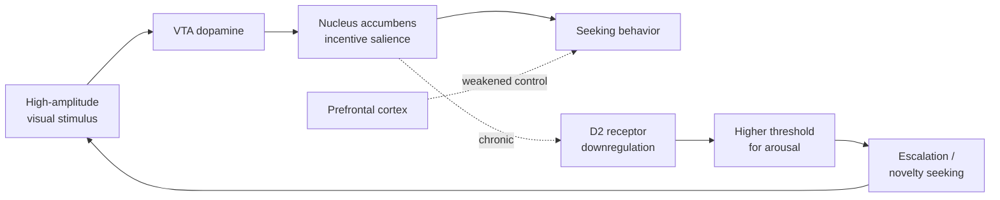
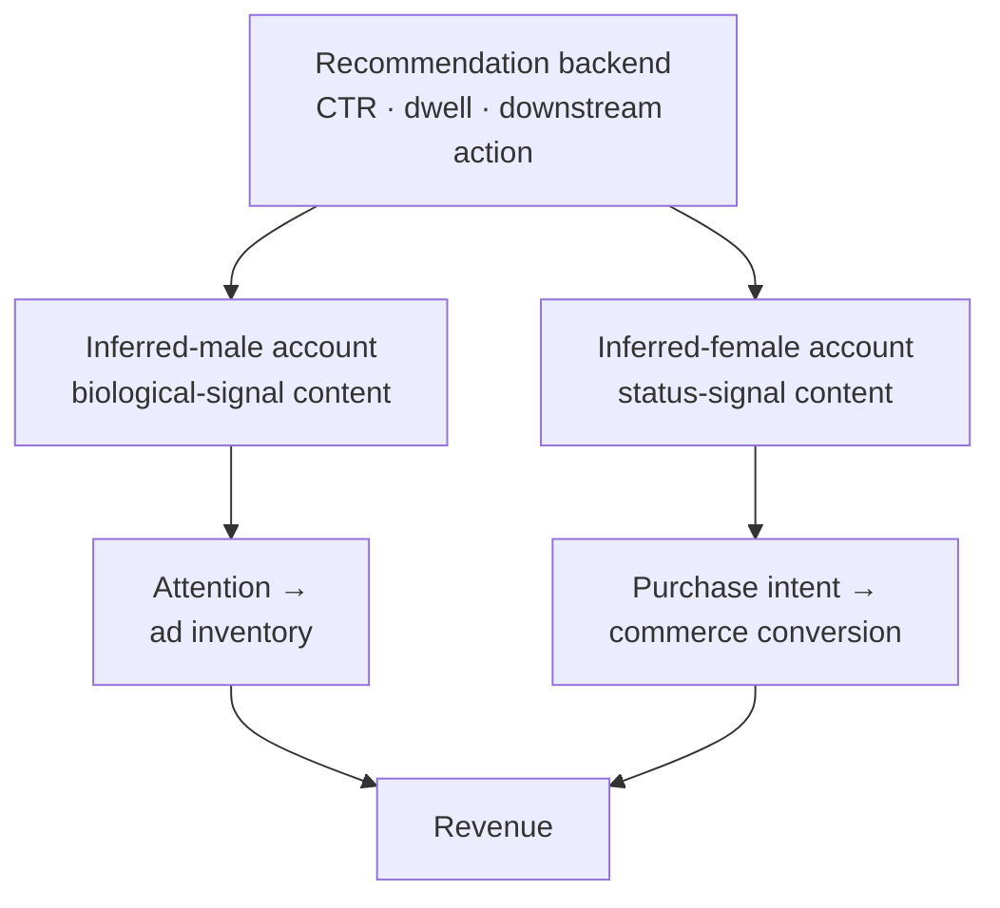

## Why this is a biology question, not a culture-war question

Most public writing about porn, filters, and "objectification" lands quickly in ethics or politics. That layer is real, but it sits on top of a much older substrate: an evolved sexual signaling system that is now being fed inputs it never encountered in 300,000 years of human prehistory.

This post stays inside the substrate. Neuroscience, evolutionary psychology, signal theory. No moralizing — just the mechanism.

## 1. What "pornography" actually means

Definitions matter, because the same stimulus gets classified differently across disciplines.

| Lens | Working definition | What it focuses on |
| :--- | :--- | :--- |
| ⚖️ Legal | "Obscene material" — e.g., the **Miller test** in U.S. case law (community standards, patently offensive depiction, no serious literary/artistic/scientific value) | Lawfulness of distribution |
| 🩺 Clinical | **Compulsive Sexual Behavior Disorder (CSBD)** in WHO ICD-11; **Problematic Pornography Use (PPU)** in research literature | Loss of control, functional impairment |
| 🧬 Sociological | Material whose primary function is sexual arousal via depicted bodies | Content + context |
| 📱 Practical | Anything that delivers a strong sexual or quasi-sexual signal — including filtered, sexualized social-media content | Effect on the viewer |

The clinical move from "porn addiction" → **CSBD/PPU** is important. It sidesteps the unresolved question of whether porn is "addictive" in the formal sense, and reframes the construct around **failure of behavioral control despite negative consequences**. That is what the evidence actually supports.

It also widens the relevant stimulus set. Once you stop arguing about category labels, filtered "lifestyle" content on Instagram, TikTok, Rednote (Xiaohongshu), and Douyin clearly sits on the same continuum as explicit material — it's softer, but it carries sexualized visual signals and consumes the same neural circuitry.

## 2. The brain on porn — what's actually happening

The neurobiology is well-trodden:

- **Dopaminergic reward.** The mesolimbic pathway (VTA → nucleus accumbens) fires for novel, high-salience sexual stimuli. ~~"Pleasure"~~ — more precisely, *wanting* / incentive salience.
- **Receptor downregulation.** Chronic high-amplitude reward leads to reduced D2 receptor density. Baseline rewards feel flatter; escalation is the predictable response.
- **Striatal volume changes.** A Max Planck study (Kühn & Gallinat, 2014) found an inverse correlation between hours of pornography use per week and gray-matter volume in the right caudate, plus reduced functional connectivity to the prefrontal cortex.
- **Prefrontal control weakens.** The same circuits that regulate other appetitive behaviors take the hit — top-down inhibition gets noisier.
- **Porn-induced erectile dysfunction (PIED).** A clinical pattern: arousal that depends on screen-mediated supernormal stimuli fails to transfer to a real partner. The mechanism is not mysterious; it's conditioning + receptor adaptation.

The fMRI work from Cambridge (Voon et al., 2014) on individuals with compulsive sexual behavior found cue-reactivity patterns in the ventral striatum, dorsal anterior cingulate, and amygdala that closely resemble the reactivity seen in substance-use disorders. Not identical, but structurally analogous.

## 3. Supernormal stimuli — the core concept

Everything else in this post flows from one idea, formalized by Konrad Lorenz and **Niko Tinbergen** in the 1940s–50s:

> An organism's sensory system is tuned to a *signal*, not to the *thing the signal usually correlates with*. If you can fabricate a stronger signal than nature ever produces, the organism prefers the fabrication.

Tinbergen's classics:

- 🥚 Greylag geese roll an oversized fake egg back to the nest in preference to their real eggs.
- 🦋 Male butterflies attempt to mate with cardboard cutouts whose markings are exaggerated beyond any real female.
- 🐦 Herring gull chicks peck harder at a stick painted with a redder, more contrast-y "beak spot" than at an actual parent gull's beak.

The cardboard butterfly isn't winning a beauty contest. It's exploiting a sensory rule that worked perfectly well in the wild because nothing *better than reality* used to exist.

**Beauty filters are the cardboard butterfly.** A filtered face on a phone screen is not "an enhanced photograph." Functionally, it is a **synthetic supernormal cue**: skin texture optimized below what dermatology produces, eye-to-face ratio nudged toward neoteny, waist-to-hip ratio liquefied toward the ~0.7 attractor, lip saturation pushed past ovulatory baseline. Each parameter pulls a slider that evolution wired into the visual system as a proxy for **health, youth, and reproductive value**.

The brain stem and limbic circuits that respond to these features cannot tell whether the signal arrived via 300,000 years of selection or via a 30 ms GPU shader. Stimulus is stimulus.

## 4. The contrast effect — why the women you actually meet stop looking attractive

Douglas Kenrick's lab, in a now-classic series of experiments (Kenrick & Gutierres, 1980; Kenrick, Gutierres & Goldberg, 1989), showed that men who had just viewed images of highly attractive women rated **their own current partners as less attractive** and reported **lower commitment** to the relationship — relative to controls who had seen neutral images.

This is not a moral effect. It's how the **mate-evaluation module** is built: it grades candidates *relative to the locally sampled distribution*. Mess with the local sample and the grader recalibrates.

In a feed where the sampled distribution consists of a thousand filtered "12s" per day, the recalibration is brutal:

- Real human faces (with pores, asymmetry, ordinary hydration) are scored down toward "below average."
- The threshold for "worth approaching" drifts upward into a region that contains essentially no actual humans.
- Existing partners drop in subjective desirability without any change to their actual properties.

Kenrick's point, in modern terms: the brain doesn't have a fixed reference. Feed it a fabricated reference, and you've broken the comparator.

## 5. The Coolidge effect, applied to infinite scroll

In rodent and primate work, the **Coolidge effect** describes a sharp dopaminergic re-arousal when a sexually satiated male is presented with a *novel* receptive partner. Not a new behavior — a new individual.

Infinite scroll on a feed of attractive faces is a Coolidge effect machine. Every swipe is a "novel partner" presentation, a few hundred milliseconds apart. There has never, in mammalian history, been a delivery system this dense.

What follows is predictable:

1. Dopamine release per stimulus drops as the system adapts.
2. The threshold for "novel enough to fire" rises.
3. The behavior persists because *some* swipes still trigger reward (variable-ratio reinforcement — the same schedule slot machines use).
4. Real-world partners — slow, repeating, bounded by a single body — become subthreshold.

You don't need an "addiction" frame. Plain operant conditioning explains the behavior.

## 6. The high-arousal / no-feedback loop

There's a piece of this that doesn't get enough attention: **the loop never closes**.

In an evolved sexual interaction, a strong arousing signal eventually maps onto physical contact, behavioral response, and (sometimes) reproduction. Signal → motor program → consummation → satiety. The biology is built around that closure.

A filtered face on a phone:

- ✅ Triggers limbic activation (real)
- ✅ Triggers approach motivation (real)
- ❌ Provides no possibility of physical contact
- ❌ Provides no behavioral feedback from the "partner"
- ❌ Provides no satiety

The result is **chronic high-arousal, zero-closure** state. Energetically, this is not free. The autonomic and endocrine systems were not designed to spend hours per day in a primed-but-unconsummated configuration. Irritability, restlessness, escalation to more extreme stimuli to chase closure — all expected outputs of a dysregulated loop.

## 7. The other side — why women filter

A common framing is "women are filtering for the male gaze." On the data, this is a poor model. The male visual-attention system, in eye-tracking and engagement studies, is roughly *indifferent* to the markers women optimize hardest for: handbags, plating, interior decor, OOTD details, brand semiotics. Engagement metrics on feeds with mostly-male viewers collapse around body geometry, skin, and direct gaze — not around whether someone's coffee shop has good light.

The better model is **intrasexual competition**.

Evolutionary biology distinguishes two selection pressures:

| | Inter-sexual selection | Intra-sexual selection |
| :--- | :--- | :--- |
| **Direction of signal** | Toward potential mates | Toward same-sex rivals |
| **What it optimizes** | Cues of mate value to the opposite sex | Cues of dominance / status / resource access to peers |
| **Cost structure** | Whatever the opposite sex finds attractive | Often **costly signaling** — visibly expensive items |

Filtered, status-laden lifestyle content — the bag, the hotel, the curated meal, the precisely-chosen filter preset — reads almost perfectly as intrasexual signaling. It's expensive (so it can't be faked cheaply), it's legible to in-group peers (who can identify the brand and the venue), and it's mostly invisible to the out-group (men, on whom the signal is largely wasted).

Christopher Ferguson, Maryanne Fisher, and others have shown that exposure to attractive same-sex peers reliably elevates self-reported anxiety, body-image dissatisfaction, and cortisol response in women — the threat is read as a status threat from peers, not as a desirability threat to potential mates.

This is also why the **Pornhub aesthetic and the Instagram aesthetic diverge sharply**, despite both being sexualized:

| Axis | Pornhub-style content | Filtered lifestyle content |
| :--- | :--- | :--- |
| Selection pressure being addressed | Inter-sexual (male arousal) | Intra-sexual (female status) |
| Subject framing | Body-large, background-minimal | Person + objects + environment |
| Lighting | Direct, clinical | Atmospheric, curated |
| Core fabricated cue | Reproductive-value markers | Resource-access markers |
| Optimal viewer response | Arousal | Envy / aspiration / imitation |

If filtered lifestyle content were primarily aimed at male arousal, it would converge on the first column. It conspicuously doesn't.

## 8. The platform sees both sides — and serves them differently

Recommendation systems learn from CTR, dwell time, and downstream engagement. The aggregate signal is enormous and gendered. Reports from inside multiple major platforms (and external audits — e.g., AlgorithmWatch's TikTok studies, the WSJ's "Inside TikTok's Algorithm" investigation) consistently show that **search and recommendation results for "attractive women" diverge by inferred viewer gender**:

- Accounts inferred as male: closer-cropped subjects, body-geometry-forward, less environmental context, faster pacing.
- Accounts inferred as female: wider compositions, fashion/beauty/lifestyle metadata, products in frame, slower aesthetic pacing.

The platform isn't deciding what a "beautiful woman" is. It's running A/B tests on what each viewer actually watches to completion, and serving more of that. The bifurcation is an emergent property of two different evolved attention systems being optimized against in parallel.

The commercial logic falls out naturally:

- **Male feed** → harvest **attention** (sell ads against time-on-platform).
- **Female feed** → harvest **purchase intent** (drive cosmetics, fashion, travel, skincare conversion).

This is also why the popular "men pressure women into looking like this" frame is hard to defend on the data. Men, in aggregate, don't engage with the content women actually optimize for. Women optimize hardest along the axes that matter to **other women**. The feed simply makes that visible.

## 9. The mismatch — why nothing changes

Why isn't there a regulatory response, given that the biology is well-described? The structural answer is **evolutionary mismatch** plus **incentive capture**, in roughly equal measure.

- 🧬 **Mismatch.** Cognitive and reproductive systems calibrated for low-density, slow-moving, embodied signals are now exposed to high-density, instant, fabricated signals. There is no built-in defense; one has to be installed by deliberate effort.
- 💰 **Incentive capture.** The supernormal-cue economy is enormous: cosmetics, dermatology, plastic surgery, fashion, smartphone hardware (cameras and on-device beauty pipelines are a feature line item), social platforms themselves, the creator economy on top. Removing the cues would collapse a multi-trillion-dollar stack.
- 🐢 **Slow harms.** Tobacco-style harms (lung cancer, cirrhosis) are eventually undeniable. Cognitive harms — mate-perception drift, social withdrawal, reward-system dysregulation — are diffuse, lagged, and easy to dismiss as "just life." Public-health machinery is poor at this regime.
- 🏛️ **Definitional fog.** "Obscenity" can be regulated; "a 7%-stronger jawline filter on a fashion blogger" cannot.

The closest historical analog is processed food: an evolved appetite system (sweet, fatty, salty) being fed industrial supernormal versions of those cues. The harms were real, the science was clear by the 1970s, and the regulatory response took 50+ years and is still incomplete. There is no reason to expect attention/sexual-cue regulation to move faster.

## 10. The elite tell — they don't eat their own cooking

A small but striking data point: many of the people who designed these systems impose stringent technology limits on their own children.

- ✅ Steve Jobs, in a 2010 *NYT* interview, on whether his children loved the iPad: "They haven't used it. We limit how much technology our kids use at home."
- ✅ Bill Gates restricted his children's smartphone access until age 14.
- ✅ Chamath Palihapitiya, formerly of Facebook: stated publicly that his children are not allowed to use "this shit."
- ✅ A persistent Silicon Valley pattern of enrolling children in **Waldorf schools** — explicitly low-tech curricula, no screens in early grades.

The honest read is that the people closest to the dopamine loops know exactly what they are. The framing in this post — supernormal stimuli, reward dysregulation, mate-perception drift — isn't fringe inside the industry. It's just not what the marketing department says.

This is consistent with how dual markets work in general: the people who refine the cocaine don't snort it.

## 11. Putting it together

The science-only summary, stripped of any moral framing:

1. ✅ Human sexual perception is a **signal-detection system** tuned to evolutionarily reliable cues.
2. ✅ Modern image manipulation produces **supernormal versions** of those cues at near-zero cost.
3. ✅ The brain cannot distinguish fabricated cues from natural ones at the limbic level.
4. ✅ Chronic exposure produces **receptor downregulation, contrast-effect drift in mate evaluation, and uncloseable arousal loops** — all standard, predictable outputs of well-characterized circuitry.
5. ✅ Female-targeted feeds are running a **different game** — intra-sexual status competition via costly signals, not inter-sexual attraction.
6. ✅ Recommendation systems have, in effect, **separated the two games** and optimized each independently.
7. ✅ The political framing ("men pressure women" / "women objectify themselves") is a poor model of who is signaling what to whom; the **selection-pressure framing** fits the data better.
8. ✅ Regulation lags because the harms are slow, the definitions are fuzzy, and the economics are too good.

None of this requires assigning blame. It does require acknowledging that the visual environment a phone delivers in 2026 is, to the underlying biology, a **chronic dose of pharmacologically-active stimuli** — and treating it accordingly.

## Pointers for further reading

- Tinbergen, N. *The Study of Instinct* (1951) — the original supernormal-stimuli framework.
- Kühn, S. & Gallinat, J. (2014). "Brain structure and functional connectivity associated with pornography consumption." *JAMA Psychiatry* 71(7).
- Voon, V. et al. (2014). "Neural correlates of sexual cue reactivity in individuals with and without compulsive sexual behaviours." *PLoS ONE* 9(7).
- Kenrick, D. T. & Gutierres, S. E. (1980). "Contrast effects and judgments of physical attractiveness." *JPSP*.
- Kenrick, D. T., Gutierres, S. E., & Goldberg, L. L. (1989). "Influence of popular erotica on judgments of strangers and mates." *JESP*.
- WHO ICD-11 entry on **6C72 Compulsive Sexual Behaviour Disorder**.
- Fisher, M. L. (ed.) *The Oxford Handbook of Women and Competition* (2017).
- Search terms that surface the empirical literature: `Problematic Pornography Use (PPU)`, `Compulsive Sexual Behaviour Disorder`, `supernormal stimuli AND social media`, `intrasexual competition AND digital appearance`, `filter dysmorphia`, `Snapchat dysmorphia`.
