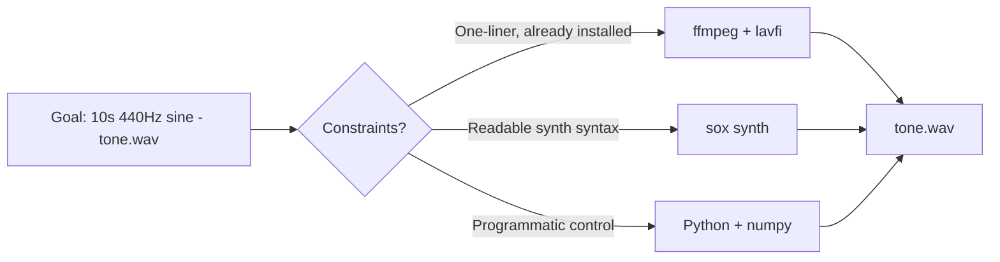

A 440 Hz sine wave is the canonical "concert A" reference tone — handy for testing audio pipelines, calibrating gear, or just making sure your speakers work. There are several easy ways to synthesize one. This post compares three: **ffmpeg**, **sox**, and a small **Python** script.

The goal in every case: a 10-second, mono, 440 Hz sine tone written to `tone.wav`.

## At a glance

| Option  | Install footprint | Readability | Flexibility            | Best when                        |
| ------- | ----------------- | ----------- | ---------------------- | -------------------------------- |
| ffmpeg  | Usually preinstalled | Dense    | Good (full filter graph) | You want one line, no extra deps |
| sox     | Needs `apt install sox` | Clean | Excellent for synth   | You generate tones often         |
| Python  | Needs numpy       | Verbose     | Total control          | You want to tweak the waveform   |



## Option 1 — ffmpeg with the `lavfi` virtual input

```bash
ffmpeg -f lavfi -i "sine=frequency=440:duration=10" -c:a pcm_s16le tone.wav
```

What each flag does:

- `-f lavfi` — the input isn't a file; it's **libavfilter**, ffmpeg's built-in filter graph engine.
- `-i "sine=frequency=440:duration=10"` — invokes the `sine` source filter: a 440 Hz sine wave for 10 seconds. Default sample rate is 44100 Hz, mono.
- `-c:a pcm_s16le` — sets the audio codec to 16-bit signed little-endian PCM, the standard uncompressed WAV payload.
- `tone.wav` — output file; ffmpeg picks the WAV container from the extension.

✅ **Pros:** ffmpeg is everywhere; one line; no extra dependencies.
⚠️ **Cons:** lavfi syntax is dense if you've never seen it before.

## Option 2 — sox (Sound eXchange)

```bash
sox -n tone.wav synth 10 sine 440
```

Reading it left to right:

- `-n` — the **null** input. sox generates audio instead of reading a file.
- `tone.wav` — output (format inferred from extension).
- `synth 10 sine 440` — the `synth` effect: 10 seconds long, waveform `sine`, frequency 440 Hz.

✅ **Pros:** the most readable of the three; sox is purpose-built for this and includes rich effects (fade, vibrato, chords).
⚠️ **Cons:** not preinstalled on most systems — requires `apt install sox` or equivalent.

## Option 3 — Python (numpy + the `wave` stdlib)

```python
import numpy as np
import wave

sr = 44100
t = np.linspace(0, 10, sr * 10, endpoint=False)
samples = (0.5 * np.sin(2 * np.pi * 440 * t) * 32767).astype(np.int16)

with wave.open("tone.wav", "wb") as w:
    w.setnchannels(1)
    w.setsampwidth(2)
    w.setframerate(sr)
    w.writeframes(samples.tobytes())
```

How it works:

1. Build a time array `t` with `sr * 10` evenly spaced samples — one per audio frame.
2. `0.5 * sin(2π · 440 · t)` produces the waveform at half amplitude (avoids clipping and excessive loudness).
3. Multiply by `32767` to map the `[-1, 1]` float range into 16-bit signed integer range.
4. `wave.open` writes a standard WAV: 1 channel, 2 bytes per sample, 44100 Hz.

✅ **Pros:** total control — trivial to add fade-in/out, harmonics, stereo, envelopes, or pipe samples into further processing.
⚠️ **Cons:** more code; requires numpy.

## Choosing among them

- [x] Just want the file as fast as possible → **ffmpeg**.
- [x] You generate tones often and want clean, memorable syntax → **sox**.
- [x] You want to manipulate the waveform programmatically → **Python**.

All three produce an interchangeable 10-second 440 Hz mono WAV. The decision is mostly about what's already installed and how much you expect to extend the script later.
