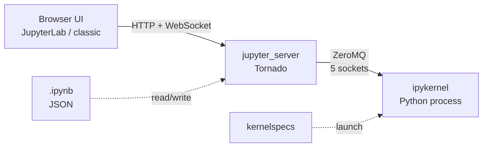
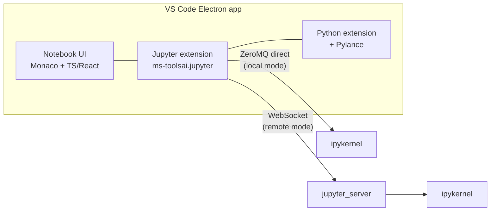

A short tour of what Jupyter actually is under the hood, what changes when you move it into VS Code, and the minimum setup you need with a `uv`-managed project.

## 1. What Jupyter Notebook actually is

Jupyter is not one thing — it's a stack of independently-replaceable parts glued together by a wire protocol.

### File format

- `.ipynb` is JSON: an ordered list of cells (code / markdown / raw) plus outputs and metadata.
- That JSON shape is why notebooks diff badly in git — output blobs and execution counts churn on every run.

### Frontend

- Browser-based UI. Classic Notebook served HTML/JS via Tornado; **JupyterLab** is a TypeScript app built on React + Lumino.
- Renders Markdown (marked), math (MathJax / KaTeX), and rich outputs (HTML, images, JS widgets) using a **MIME-bundle** system: the kernel returns multiple representations of a value and the frontend picks the best one it can render.

### Server

- A Python web server (classic `notebook` on Tornado, or modern `jupyter_server` powering JupyterLab).
- Handles HTTP for file I/O and bridges the browser to kernels over **WebSocket**.

### Kernels

- Separate processes that actually execute code. Default `ipykernel` runs Python; ~100+ kernels exist for other languages (IRkernel, IJulia, etc.).
- Frontend ↔ kernel communication uses the **Jupyter messaging protocol** over **ZeroMQ**, with five sockets:

  | Socket    | Purpose                              |
  | --------- | ------------------------------------ |
  | shell     | execute requests, code completion    |
  | iopub     | stdout / results broadcast           |
  | stdin     | input prompts                        |
  | control   | interrupts / shutdown                |
  | heartbeat | liveness check                       |

- Messages are JSON, signed with HMAC.
- Kernel discovery uses **kernelspecs** — JSON files telling the server how to launch each kernel.

### Execution model

- Each cell run is an `execute_request`; the kernel keeps a persistent namespace between cells.
- That persistence is why cell **ordering** matters and why hidden state bites you.
- IPython adds the REPL flavor on top: `%magics`, `!shell`, `?help`, display hooks, autoreload.

### Ecosystem layers

- **JupyterHub** — multi-user spawner (often via Kubernetes / Docker).
- **nbconvert** — notebook → HTML / PDF / script.
- **nbformat** — schema and validator for `.ipynb`.
- **ipywidgets** — bidirectional widgets via Comms (a side-channel on the messaging protocol).
- **Papermill** — parameterize and run notebooks programmatically.

**Short version:** JSON file + browser app + ZeroMQ/WebSocket bridge + language-agnostic kernel processes.



## 2. What changes inside VS Code

VS Code replaces Jupyter's **frontend + server** halves, but keeps the **kernel** half intact.

### VS Code side (frontend + server replacement)

- **Editor shell** — Electron app (Chromium + Node.js), UI in TypeScript / React.
- **Notebook UI** — VS Code's native notebook editor, a generic component that renders any `.ipynb`-shaped document. Cells live in the editor like any other text buffer (Monaco editor for code cells), so you get IntelliSense, refactoring, multi-cursor, etc.
- **Jupyter extension** (`ms-toolsai.jupyter`) — the bridge. Reads/writes `.ipynb` (still JSON via `nbformat`), discovers kernels, handles cell execution, renders outputs.
- **Pylance / Python extension** — language server (LSP) for type checking, completion, go-to-def. Things classic Jupyter doesn't really do.
- **Output renderers** — VS Code's notebook renderer API plus a built-in renderer extension that handles Jupyter MIME bundles (HTML, images, ipywidgets, Plotly, etc.). Widgets run in a sandboxed webview.

### Kernel side (unchanged)

- Same `ipykernel` (or any other Jupyter kernel) running as a separate process.
- Same **Jupyter messaging protocol over ZeroMQ** — VS Code speaks it directly via a Node.js ZMQ binding (`zeromq.js`). No browser, no Tornado server in between.
- Kernel discovery still uses **kernelspecs**; VS Code also auto-detects conda / venv environments and can install `ipykernel` on demand.

### Two connection modes

1. **Local kernels** — VS Code launches `python -m ipykernel` itself and talks ZeroMQ to it directly.
2. **Remote Jupyter server** — point VS Code at a running `jupyter server` URL + token; it then uses the standard Jupyter REST + WebSocket API (same as JupyterLab would). Same messaging protocol, just tunneled over WebSocket instead of raw ZMQ.

### What's gone vs. classic Jupyter

- No Tornado / `jupyter_server` process when running locally.
- No browser — everything is in Electron's webview.
- Classic notebook extensions (nbextensions, JupyterLab extensions) don't work; you use VS Code extensions instead.



**Short version:** VS Code is a drop-in replacement for the *frontend + server* (Electron + TS extension talking ZeroMQ), while the kernel half (ipykernel + Jupyter wire protocol + kernelspecs + nbformat) is identical.

## 3. Minimum setup with `uv` + VS Code

If your project is managed by [uv](https://github.com/astral-sh/uv), the bar is delightfully low.

### Project side

```bash
uv add --dev ipykernel
```

- `--dev` because it's tooling, not a runtime dependency — keeps it out of your published package.
- That's it. No `jupyter`, no `jupyter-server`, no `python -m ipykernel install` to register a kernelspec. VS Code auto-discovers the `.venv` and launches the kernel directly from it.

### VS Code side

- [x] **Jupyter extension** (`ms-toolsai.jupyter`)
- [x] **Python extension** (`ms-python.python`) — required; the Jupyter extension depends on it. Usually pulls in Pylance automatically.

### Workflow

1. Open the project folder in VS Code.
2. Create or open an `.ipynb`.
3. Click **Select Kernel** → pick the `.venv` interpreter (VS Code labels it with the project name).
4. Run cells.

### Gotchas

- If you forget `ipykernel`, VS Code will prompt to install it — but it'll use pip into the venv, bypassing uv's lockfile. Better to `uv add --dev ipykernel` upfront so `uv.lock` stays the source of truth. ⚠️
- For extras, add them the same way:

  ```bash
  uv add --dev matplotlib pandas ipywidgets
  ```

  `ipywidgets` needs to live in the same venv as the kernel for interactive widgets to work.
- If you ever want a browser frontend too:

  ```bash
  uv add --dev jupyterlab
  uv run jupyter lab
  ```

## TL;DR

| Layer        | Classic Jupyter            | VS Code                                       |
| ------------ | -------------------------- | --------------------------------------------- |
| File format  | `.ipynb` JSON              | `.ipynb` JSON (same)                          |
| Frontend     | Browser (JupyterLab / TS)  | Electron notebook editor + Jupyter extension  |
| Server       | `jupyter_server` (Tornado) | Jupyter extension speaks ZMQ directly         |
| Kernel       | `ipykernel` over ZeroMQ    | `ipykernel` over ZeroMQ (same)                |
| Discovery    | kernelspecs                | kernelspecs + venv auto-detection             |
| Min setup    | `pip install jupyter`      | `uv add --dev ipykernel` + 2 extensions       |
