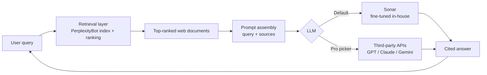

## What Perplexity is

Perplexity AI (founded 2022) is an **AI-powered answer engine**. Instead of returning a list of links like a traditional search engine, it returns a conversational, cited answer synthesized by an LLM from live web results. It is, at its core, a productized **retrieval-augmented generation (RAG)** system.

The product surface includes:

- A free tier and a **Pro** subscription that lets users pick the underlying model (GPT-4, Claude, Gemini, etc.).
- **Spaces** — collaborative collections of threads and sources.
- **Comet** — their browser.

## The common claim: "Perplexity is just a wrapper"

A frequent characterization is:

> Perplexity doesn't develop its own LLM. It's an AI agent built on top of LLM APIs and a web search API.

This is **mostly true, with important caveats**. Let's break it apart.

## What's accurate

✅ Perplexity's main consumer product relies heavily on **third-party LLM APIs** — OpenAI, Anthropic, Google. The Pro model picker makes this explicit.

✅ The fundamental architecture is RAG: retrieve relevant documents from the web, stuff them into the LLM's context, and have the model write a grounded, cited answer.

## What the "wrapper" framing misses

❌ **They do train models** — branded as **Sonar** (e.g., Sonar Large, Sonar Huge). These are not foundation models trained from scratch; they're typically fine-tuned from open-weight bases (such as Llama) and optimized for search-grounded answering. That's still meaningful model work, just not foundation-model R&D.

❌ **They run their own retrieval infrastructure**, not a thin reseller of a search API. They operate their own crawler (**PerplexityBot**) and ranking layer. They don't compete with Google's index in scale or maturity, but it's their own pipeline rather than a Bing/Google API call.

## The honest one-line summary

| Capability | Perplexity does this? |
|---|---|
| Trains foundation LLMs from scratch | ❌ No |
| Fine-tunes open-weight models (Sonar) | ✅ Yes |
| Operates a web crawler & ranking layer | ✅ Yes |
| Resells third-party LLM APIs in product | ✅ Yes (especially Pro) |
| Builds a search-grounded answering UX | ✅ Yes — this is the product |

So Perplexity is **not a foundation-model lab** like OpenAI or Anthropic, but it's **more than a thin wrapper** — it owns fine-tuned models and retrieval infrastructure, and the integration of those layers is the actual product.

## How the pieces fit together

## Why the distinction matters

Calling Perplexity "just an API wrapper" understates the engineering: building a crawler, a ranker, a fine-tuning pipeline, and a citation-grounded UX is non-trivial. Calling it a "model company" overstates it: they don't sit on the foundation-model frontier and depend on the labs that do. The accurate frame is **a search-grounded answer product with its own retrieval stack and fine-tuned models on top of (mostly) third-party foundation models**.
