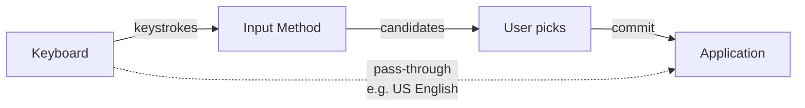
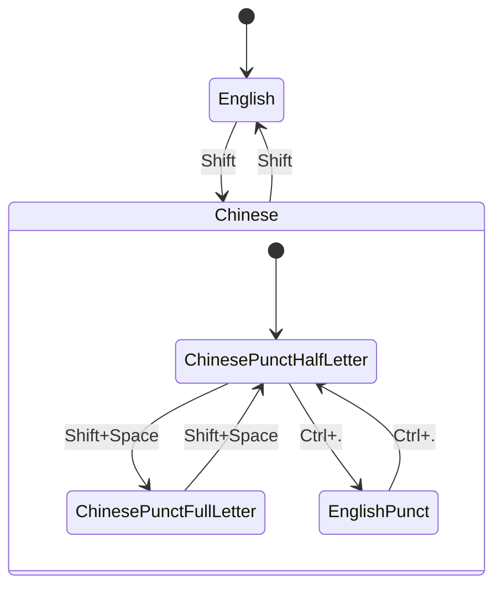

# Input Methods, Unicode, and the Full/Half-Width Story

## The keyboard problem

A physical keyboard has roughly 100 keys. Unicode defines over 150,000 characters. The gap between these two numbers is the reason **input methods** exist.

An input method (IM) is a software layer that sits between your keystrokes and the focused application. It intercepts what you type, optionally interprets it as a sequence (e.g., `nihao`), shows candidate characters, and commits the chosen string to the app.



Common uses:

- **CJK languages** — Pinyin → 中文, romaji → 日本語, Hangul jamo → 한국어
- **Indic scripts** — transliteration → Devanagari, Tamil, etc.
- **Emoji and symbols** — `:smile:` → 😄
- **Compose keys** — combining strokes for accented characters (é, ñ, ü)

On Linux you typically run an **input method framework** (IBus, Fcitx, SCIM) that hosts specific **engines** (Mozc for Japanese, Pinyin for Chinese, etc.). On macOS and Windows, the OS provides input methods natively, switchable from the menu bar or taskbar.

## What counts as an input method?

The strict answer: any layer that transforms input. The looser answer: the part of that transformation that is *non-trivial*.

| Mechanism | Usually called |
|---|---|
| Pinyin → 中文 | Input method |
| Romaji → 日本語 | Input method |
| Dvorak / Colemak | Keyboard layout |
| Compose key for `é` | Borderline — both terms used |
| Mobile autocomplete / swipe | Input method (broad sense) |

### What about plain US English?

For American English on a US keyboard, what the app receives equals what you press. Functionally there is "no input method." Technically there is *always* an input method layer in the pipeline — it just operates in pass-through mode:

- Linux with IBus/Fcitx: an engine is active but commits keystrokes as-is.
- macOS: "U.S." is itself an input source.
- Windows: the default English keyboard is registered as an IME-less input.

So the user-facing rule of thumb — *if keystroke equals received character, no IM is doing meaningful work* — holds in practice.

## Simplified Chinese: many ways to type

Chinese has more input methods than any other language. They cluster into a few families.

### Phonetic (most common)

- **Pinyin** — type romanized pronunciation (`nihao` → 你好). The default for most mainland users.
  - Implementations: Sogou Pinyin, Google Pinyin, Microsoft Pinyin, RIME, Fcitx Pinyin.
  - **Double Pinyin (双拼)**: 2 keystrokes per syllable instead of full spelling — faster once learned.
- **Zhuyin / Bopomofo (注音)** — uses ㄅㄆㄇㄈ symbols. Mostly Taiwan, but works for Simplified.

### Shape-based

- **Wubi (五笔)** — decompose characters by stroke shapes. Very fast, no homophone ambiguity, but takes weeks to learn.
- **Cangjie (倉頡)** — similar shape-decomposition approach. Common in Hong Kong/Taiwan.
- **Zhengma, Sijiao** — other shape systems, less common.

### Stroke-based

- **Stroke (笔画)** — type the stroke sequence (横竖撇捺折). Common on phones for older users.

### Hybrid / handwriting / voice

- **Handwriting** — draw with mouse/trackpad/touchscreen.
- **Voice input** — speech-to-text, increasingly common on phones.

For a beginner, **Pinyin** in any flavor is the de facto standard.

## Full-width vs. half-width

A central concept in CJK input is the distinction between **half-width (半角)** and **full-width (全角)** characters.

| Form | Examples | Visual width |
|---|---|---|
| Half-width (半角) | `A 1 , ( "` | 1 column (standard ASCII) |
| Full-width (全角) | `Ａ １ ， （ "` | 2 columns (matches CJK character) |

### Why full-width exists

Two reasons, one historical and one typographic:

1. **Historical: fixed-grid encodings.** Early CJK encodings (JIS, GB, Big5) used 2 bytes per character and 2 display columns per character. To embed Latin letters cleanly in that fixed grid, 2-column "full-width" Latin forms were added. ASCII (1-column) was kept alongside as the "half-width" form for compatibility and compactness.

2. **Typographic: visual rhythm.** Chinese characters are square and roughly twice the width of Latin letters. Mixing half-width Latin punctuation with Chinese characters disrupts the visual grid. Full-width punctuation aligns:

   ```
   Half-width punctuation in CJK:  你好,世界.
   Full-width punctuation in CJK:  你好，世界。
   ```

Today, with Unicode and proportional fonts, the *technical* need has largely faded — but the **visual preference for full-width punctuation** remains the standard.

### CJK has its own punctuation glyphs

Chinese punctuation isn't just "ASCII at 2× width." Several marks have distinct glyphs:

| Half-width | Full-width Chinese |
|---|---|
| `,` | `，` |
| `.` | `。` |
| `?` | `？` |
| `!` | `！` |
| `;` | `；` |
| `:` | `：` |
| `(` `)` | `（` `）` |
| `"` `"` | `"` `"` |
| `'` `'` | `'` `'` |

### Unicode codepoints

Full-width forms live in the **Halfwidth and Fullwidth Forms** block, `U+FF00–FFEF`.

- `A` = `U+0041`, `Ａ` = `U+FF21`
- They are **different characters**. Copy-pasting matters for code, filenames, regex, and shell commands.

A classic gotcha:

```python
# Looks fine, but the parenthesis is full-width — Python explodes.
print（"hello"）
#    ^             ^
#    U+FF08        U+FF09
```

## What is mainstream in modern CJK text?

Practice today is split:

| Element | Mainstream choice | Example |
|---|---|---|
| Chinese/Japanese punctuation | **Full-width** | `，。「」？` |
| Latin letters in CJK text | **Half-width** | `使用 Python 编程` |
| Digits in CJK text | **Half-width** (usually) | `2024年3月15日` |
| ASCII punctuation in Latin words/code | Half-width | `e.g.`, `foo()` |

Full-width *letters* (`Ｐｙｔｈｏｎ`, `２０２４`) look dated today — they evoke 1990s-era typography or are used for retro/vaporwave stylistic effect. Modern CJK text embeds English words and numbers as half-width.

So the modern rule:

> **Full-width punctuation + half-width Latin/numbers.**

## Microsoft Pinyin: how the modes fit together

Microsoft Pinyin (and similar IMEs) presents the user with **two main modes** plus a few orthogonal toggles inside Chinese mode.

### Two main modes

| Mode | Behavior |
|---|---|
| **English (英文)** | Pass-through. Keystroke = character received. Punctuation half-width. Used for English, code, URLs, passwords. |
| **Chinese (中文)** | Pinyin → candidate characters. Punctuation auto-converts to full-width. |

Toggle: **Shift**. The status indicator shows `中` or `英`.

### Independent sub-toggles inside Chinese mode

| Toggle | Options | Default shortcut |
|---|---|---|
| Letter width | 半角 / 全角 letters | `Shift+Space` |
| Punctuation style | 中文标点 / 英文标点 | `Ctrl+.` |



For everyday use, most people only ever touch `Shift`. The other toggles exist for edge cases.

## How smart are modern IMEs about full/half-width?

Modern IMEs handle the full-width/half-width decision well enough that most users never think about it.

### Done automatically

✅ **Punctuation conversion based on mode.** Chinese mode → `,` becomes `，`, `.` becomes `。`, `(` becomes `（`. English mode → punctuation stays half-width.

✅ **Smart quote pairing.** First `"` becomes `"`, second becomes `"`. Same for `'` / `'`.

✅ **Context-aware punctuation.** Sogou, Microsoft Pinyin, and well-configured RIME often detect numeric context: `3.14` keeps `.` half-width (decimal), while `今天.` converts to `今天。`.

✅ **Latin letters stay half-width by default.** Typing `Python` in Chinese mode commits half-width `Python`, not `Ｐｙｔｈｏｎ`.

### Still requires a manual toggle

- [ ] Switching between Chinese and English input — usually `Shift`.
- [ ] Forcing half-width punctuation mid-Chinese-sentence (e.g., `e.g.` inside Chinese prose) — toggle punctuation mode (`Ctrl+.`) or briefly switch to English.
- [ ] Full-width digits (rare, for formal/stylistic use) — explicit toggle.

### Quality varies

- **Sogou Pinyin, Microsoft Pinyin, Google Pinyin**: very smart, handle most cases well.
- **RIME**: highly configurable, reasonable defaults.
- **Older/simpler IMs**: may convert too aggressively, requiring more manual switching.

In practice, modern IMEs match the mainstream convention — full-width punctuation, half-width letters and digits — without explicit user intervention 95% of the time. The remaining 5% (code, URLs, mixed technical text) is what `Shift` is for.

## Summary

- An **input method** translates keystrokes into characters that the keyboard cannot directly produce. It's a layer between hardware and application.
- For US English on a US keyboard, the IM is effectively a pass-through.
- Simplified Chinese has many input methods; **Pinyin** is the de facto standard.
- **Full-width** characters fill a 2-column CJK grid cell; **half-width** characters are standard ASCII width. The distinction is part historical (fixed-grid encodings) and part typographic.
- Modern CJK text uses **full-width punctuation + half-width letters/digits**.
- Microsoft Pinyin has two main modes (Chinese / English) plus orthogonal toggles for letter width and punctuation style. Modern IMEs handle the full/half-width decision intelligently, so users rarely need to touch the sub-toggles.
