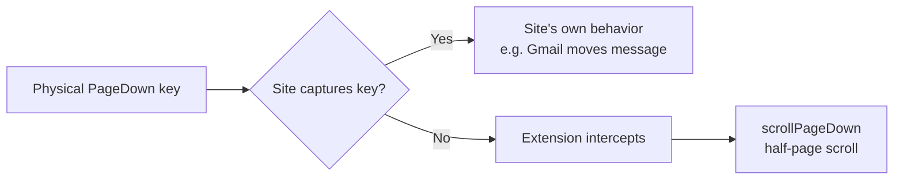

## Chrome's built-in scroll shortcuts

Chrome ships with a small set of keyboard shortcuts for scrolling a page:

| Key | Action |
|---|---|
| `Space` / `Shift+Space` | Page down / page up |
| `PageDown` / `PageUp` | Same as above |
| `↓` / `↑` | Line scroll |
| `Home` / `End` | Top / bottom of page |
| `Ctrl+F` | Find on page |
| `F7` | Toggle Caret Browsing (arrow keys move a text cursor) |

What's missing: a **half-page** scroll, like Vim's `Ctrl+D` / `Ctrl+U`. That's the sweet spot for reading — full-page jumps lose your place; line scroll is too slow.

To get half-page scroll in Chrome, you need an extension.

## Vimium vs SurfingKeys

The two well-known Vim-style navigation extensions for Chrome are **Vimium** and **SurfingKeys**. Both can do half-page scrolls; they differ in philosophy.

| | **Vimium** | **SurfingKeys** |
|---|---|---|
| **Philosophy** | Minimal — "Vim bindings for Chrome" | Maximalist — power-user toolkit |
| **Learning curve** | Gentle, small command set | Steeper, many features |
| **Configuration** | Options page, simple keymap edits | JavaScript config file, deeply customizable |
| **Link hints** | `f`, `F` | Multiple modes (multi-select, hover, copy URL) |
| **Search/find** | Basic find (`/`) | Search engines bound to keys (`og` Google, `ow` Wikipedia) |
| **Tab management** | Basic (`t`, `J`/`K`, `x`) | Rich (tab tree, move, detach, sort) |
| **Visual mode** | `v` | Plus richer text-object selection |
| **Mouse emulation** | Limited | Full — scroll any element, click, hover |
| **Clipboard** | Basic yank | Yank as Markdown link, save pages |
| **Performance** | Very lightweight | Slightly heavier |
| **Half-page scroll** | `d` / `u` | `d` / `e` (configurable) |

**Pick Vimium** if you want clean Vim-like navigation and don't want to fiddle.

**Pick SurfingKeys** if you live in the keyboard, want custom search shortcuts and an omnibar-style command palette, and don't mind editing a JS config.

For just half-page scroll, Vimium is the easier choice.

## Remapping PageDown to half-page scroll

The common goal: hit the physical `PageDown` key and have it scroll a half page instead of a full one.

### In Vimium

1. Click the Vimium icon in Chrome's toolbar → **Options**.
2. In the **Custom key mappings** text box, add:
   ```
   map <pageDown> scrollPageDown
   map <pageUp> scrollPageUp
   ```
3. Click **Save Changes** and reload open tabs.

The naming is confusing but correct: in Vimium, `scrollPageDown` / `scrollPageUp` are the **half-page** commands (the same ones bound to `d` / `u`). The full-page versions are `scrollFullPageDown` / `scrollFullPageUp`, which Space and Shift+Space already use.

Key names are case-insensitive — `<pageDown>`, `<pagedown>`, `<PageDown>` all work.

### In SurfingKeys

In its JS config:

```js
mapkey('<PageDown>', 'Half page down', () => Normal.scroll('pageDown'));
mapkey('<PageUp>',   'Half page up',   () => Normal.scroll('pageUp'));
```

SurfingKeys is designed for this kind of remap and exposes the scroll primitives directly.

### Caveat for both

Some sites (Gmail, Google Docs, in-browser editors) capture `PageUp` / `PageDown` before the extension can. On those pages the remap silently won't fire. This is a browser-level limitation, not an extension bug — extensions can't reliably override page-controlled key handlers. On plain content pages it works fine.

## Mental model



The extension only sees keys the page hasn't already consumed. That's why the remap works on a blog post but not inside a Google Doc.

## Takeaways

- ✅ Chrome has no native half-page scroll shortcut.
- ✅ Vimium and SurfingKeys both add it — `d` / `u` in Vimium by default.
- ✅ Remapping `PageDown` / `PageUp` to half scroll is a two-line config change in either extension.
- ⚠️ Web apps that capture these keys themselves will override the remap.
