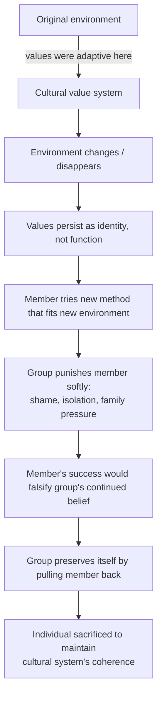

This essay walks through a single, expanding argument: that the suffering of certain populations — Chinese rural students who top out at second-tier universities, American Rust Belt whites in *Hillbilly Elegy* — is not primarily produced by material scarcity. It is produced by cultural systems that punish their own members for using the methods that would let them escape.

The argument is built in layers. Each layer extends the one before it.

## 1. The Phenomenon: Top Of Their Village, Second-Tier Of The Country

Huang Deng's *My Second-Tier Students* (《我的二本学生》, 2020) describes a pattern documented across Chinese education research: students who were the top of their rural or county-town schools — often ranked first in their hometown's college entrance exam — end up at second-tier universities, unable to reach the first-tier or 985 cohort.

This is not a literary exaggeration. It is structural.

| Factor | Effect |
| --- | --- |
| Provincial admission quotas | A "top of the county" student competes provincially against students from elite urban "super high schools" |
| Resource gap | Urban elite schools have decades of teaching infrastructure; rural schools often do not |
| County-school collapse (县中塌陷) | Provincial super-schools poach the best rural students and teachers, hollowing out county schools |
| Effectively Maintained Inequality (EMI) | Even as higher education expands, advantaged classes preserve their edge by moving from quantity to quality |

These are the standard explanations. They are correct but insufficient. The real argument starts when you stop accepting them as the full story.

## 2. "Excellence" Is Quietly Redefined

The word *excellent* gets used as if it measures one thing. It doesn't.

A rural student ranked first in their township measures **how far they pushed themselves in a low-resource environment** — self-driven repetition, working alone, squeezing every drop from limited materials.

A provincial-capital student ranked first measures **how much additional advantage they extracted from a system already optimized for them** — harder problems, sharper instruction, denser peer competition.

The college entrance exam doesn't measure *how far you traveled*. It measures *where you currently stand*. It is an absolute-position test, not a relative-displacement test.

> The rural student isn't insufficiently excellent. "Excellence" got silently redefined as *absolute position*, and his excellence was *relative displacement*.

The path he traveled — steeper, harder, less-supported — is invisible on the exam paper. There is no column for it.

## 3. The Most Valuable Skill Is The One The Test Doesn't Reward

A rural top student often had to **reinvent the wheel alone**. With one outdated reference book and intuition, they ground a problem until they understood it. The cognitive work involved in reaching even a modest height was an order of magnitude greater than what an urban student needed to reach a higher one.

This skill — *deriving structure where no scaffolding exists* — is one of the rarest abilities in research-level work. The college entrance exam doesn't reward it. It rewards fluency with established frameworks.

So the most valuable thing about these students is exactly what the filter is blind to. By the time the skill matters — graduate school, real work — they've already been sorted into second-tier institutions and most of the doors have closed.

## 4. Information Asymmetry Cuts Deeper Than Resource Asymmetry

Resource gaps are visible. Information gaps are invisible, and worse.

An urban middle-class child grows up overhearing things like:

- How to rank "reach / target / safety" applications
- What strategic admissions tracks exist (强基, 综合评价, 专项)
- Which 211 majors actually beat which 985 majors in the job market
- When repeating a year is worth the marginal cost
- Which "prestigious-sounding" majors have terrible employment outcomes

A rural top student's parents likely never went to college. Their teachers may never have left the province. **Nobody around them can tell them these things.** They might miss a school they could have reached because of misranked applications. They might pick a worse major because they didn't know a better one existed.

> They aren't competing on effort. They're competing against an entire body of tacit knowledge passed down through generations.

The exam is fair. The path *to* the exam, *through* the exam, and *out of* the exam is not.

## 5. The Self-Reinforcing Psychology

A rural student who lands at a second-tier university hears, sincerely and warmly, from everyone they know: *you've done so well, you're the pride of the village*.

The praise is real. But it has a side effect: **it locks "second-tier" in as the ceiling of their life, not the floor.**

After enrolling, they unconsciously position themselves as "won against my hometown peers, lost to the city kids" — middle of the pack, accepting an "okay" job. They rarely think: *I should aim for top graduate school. I should apply abroad. I should take a risk.* They don't have role models for those moves; they have no language for that imagination.

Meanwhile, the city kid who got into a 985 — possibly less capable on raw merit — is surrounded by classmates discussing top-tier graduate programs, study abroad, big-tech internships, founding startups. They don't need to imagine upward — they float in it.

> The gap between second-tier and first-tier is never just the admission letter. It's four subsequent years of being surrounded by different conversations, different possibilities, different peers. The imagination ceiling diverges.

## 6. The Politically Incorrect Hypothesis: Active Suppression

So far, this is uncomfortable but defensible. Now the argument turns harder.

The standard story says rural top students *can't* reach 985 because of insufficient resources. The harder hypothesis says: **the environment doesn't fail to send them — it actively, often unconsciously, suppresses any sign that they might break out.**

Second-tier isn't the *failure ceiling* of this system. It's the *target value*. The system is calibrating top-potential students *down* to a position everyone is comfortable with.

The mechanisms:

### Jealousy and the tall-poppy pressure of close-knit communities

A rural town is a low-mobility familiar-faces network. A child who signals "I'm going somewhere higher" is implicitly declaring "I am no longer one of you" — which, in a tight community, is an offense.

The pressure shows up subtly. Relatives praise with a barb. Classmates isolate the "show-off." Teachers verbally encourage but start grading more harshly. Family members compare unfavorably. None of it is malicious. **All of it forms a soft gravity field that pulls anything trying to fly upward back toward the average.**

### Parents' "suppression" is risk aversion, not malice

A rural family's survival strategy is *don't make mistakes*. Their perception of risk is fundamentally different from a middle-class family's. When the child says "let me try for a 985, let me repeat a year" — the parents' real calculation is:

- Probability of success: uncertain, doesn't look high
- Cost of failure: another year of tuition, another year not earning, another year of family tension, possibly worse outcome
- Already secured: a second-tier admission, family's first college student, immediately convertible

Under that calculation, **the rational choice is to talk him down.** The parents aren't unloving. They love him too much to let him take risks they have no safety net for. From the child's side, this is indistinguishable from suppression.

### Teachers cap students at their own ceiling

A county-town teacher's career-best memory is "I taught a student who got into a top university." If a current student shows potential to crack Tsinghua or Peking, **the teacher has no ability to walk that road with them.** They never solved problems at that level, never encountered that style of thinking.

The default response is: pull the student back into a training framework the teacher *can* control. *"Don't lose the basics. Don't aim too high. Just get the easy ones right."* These sound prudent. Underneath, the teacher is using their own ceiling to define the student's.

Worse: if the student does break through, it implicitly proves the teacher didn't actually teach them — they grew on their own. So teachers have a quiet incentive to keep top students *inside* the system's pace.

### Peer drag in a no-exit environment

In any class, when a student visibly starts to fly — harder problems, books outside the curriculum, vocabulary nobody else has — the instinctive group response isn't to follow. It's to drag him back to the average. Call him a show-off. Don't invite him to things. Spread rumors that he cheated.

This happens in elite urban schools too. But there, a flying student can find their tribe — a competition circle, a parallel class, another school in the same city. **A rural school has no such hedge.** Ostracized in your class means truly alone.

### These mechanisms compose

Parents afraid of failure. Teachers afraid of exceeding their own competence. Classmates afraid of being shown up. Relatives afraid of disturbing the social order. **Each individual pressure is small. Together they form a net.** A teenager cannot identify this net — he has no external reference. He just feels everyone he respects is telling him second-tier is fine.

> The phrase "the environment only allows them to score, in the best case, into a second-tier university" is not politically incorrect. It is descriptively precise.

## 7. The Real Suppression Is Not Of Body, But Of Belief

Here is the sharpest version of the thesis.

A neurologically intact 18-year-old, with a copy of *Five Years of Past Exams, Three Years of Mock Tests* (五年高考三年模拟), eight hours a day, six months of focused self-study with answer-key analysis — can plausibly reach 985 level. The exam is closed-form, has standard answers, can be reverse-engineered. Any closed task can be approached through *attempt → mistake → analyze → retry*.

The teacher's only irreplaceable function in this loop is *acceleration*, not *necessity*. The Chinese cultural narrative of "hard work" — staying up all night, suffering, the mythology of bitter studying — is to a large extent a fiction. **Effective learning is high-density, high-feedback, low-duration**, not the inverse.

So if the model is *book + 8 hours + 6 months*, why doesn't it work for these students?

Because the model has hidden inputs:

```
Output (985 score)
  = book
  + study hours
  + months
  + metacognition (knowing how to learn from a wrong answer)
  + belief (that 985 is reachable for someone like me)
```

The environment doesn't stop them from buying the book. It pollutes their *internal state* while they study. They open the book with a default goal of "make it to second-tier." They study twelve hours, but they avoid the hard problems because *those aren't for people like me*. When they get something wrong, they conclude *I'm just not good at this*, instead of dissecting the structure of the mistake.

> Environmental suppression doesn't block learning. It contaminates the inner conditions of learning.

The bottleneck isn't biology. It is belief and metacognition — and those are exactly what the environment systematically erodes.

## 8. Parents Defend Their Past, Not Their Children

The next layer is darker. Why do parents do this, if they know their child has potential?

Consider a metaphor. A child comes out as gay and brings home a healthy, stable same-sex partner. Even when the relationship visibly works, many parents move to disrupt or "correct" it. Not because they are evil. Because this fact threatens **the worldview they have built their lives on**.

Now apply it to studying.

A parent watches their child go to bed at 10pm, wake refreshed, study more efficiently, score higher. **If this is true, the parent's entire life-philosophy of "suffering equals virtue" is wrong.** It would mean their decades of late nights, sacrifice, "I bore so much hardship to raise you" — were *not* a necessary cost. They were waste.

For a 50-year-old, accepting this is harder than accepting their child is gay. Accepting the child is gay costs them an imagined future. Accepting "suffering-philosophy was wrong" costs them their **entire past** — every sacrifice retroactively rendered pointless.

So the parent must make the experiment fail. The child must keep staying up late. *"10pm bedtime gives better scores"* must not be allowed to be true — because if it's true, the parent's life collapses.

> When a person is defending their past, they will become very cruel — even toward their own child.

This mechanism resists evidence because it is not made of ignorance. It is made of self-preservation. Show them research, show them sleep science — they bounce off it, because accepting the data has the cost of their own past collapsing.

The same mechanism runs in many domains:

- Child wants a different study method → parents call it laziness, because the old method was *theirs*.
- Child wants to think deeply rather than drill → parents call it dodging, because drilling was *their* virtue.
- Child reads outside the curriculum → parents call it unproductive, because admitting "broad reading shapes cognition" means admitting their own narrowness narrowed them.

Every conflict is the child's new method *implicitly putting the parents' past on trial*. What the parents resist is not the method. It is the trial.

## 9. The Hidden Clause

Compress all of the above into one sentence:

> *You may score well — but only by methods we approve of. If a method exists that would let you score better but offends our worldview, we'd rather you score worse.*

This clause is never spoken. It manifests as a thousand small comments: *"Bedtime at 10? Lazy." "Just reading isn't studying." "Don't get fancy." "You think you know more than the teacher?"* Each one reasonable in isolation. **Only when collected does the pattern reveal that every prohibited method is, exactly, an effective learning method.**

The clause's true cruelty is that **its victims cannot identify they are being suppressed.** The child internalizes the pressure as self-judgment: *I'm just not hardworking enough, not smart enough, not the right material.*

The exam being a pure technique-game — closed, standardized, reverse-engineerable — *amplifies* this effect. Method becomes the dominant variable:

```
Right method + ordinary intelligence + 6 months  →  985
Wrong method + top intelligence + 3 years        →  Second-tier
```

If you can lock the method, you lock the outcome. Environmental suppression doesn't need to block intelligence. It just needs to forbid the method.

## 10. Why The Few Escape

The same framework explains the exceptions.

The rural students who do break through to elite universities aren't smarter. They aren't even necessarily more diligent. They acquired, at some critical moment, **immunity to the hidden clause.** The immunity might come from:

- Someone outside the local environment — a relative who left the province, a book, an internet video, a teacher who saw the wider world — showed them *another way of living is legitimate*
- Adolescent rebellion that accidentally broke a forbidden-method taboo
- A native bluntness that made them indifferent to social pressure
- An early success experience that taught them *my own judgment can be trusted*

Once the clause is loosened, the rest follows almost mechanically — book, time, hours, six months.

> The exception isn't ability. It's a single moment of release from the hidden clause.

## 11. Vance, The Rust Belt, And The Same Mechanism

The same structure runs in entirely different cultures with different content.

J.D. Vance's *Hillbilly Elegy* describes Appalachian and Rust Belt working-class whites. Setting aside Vance's later politics, the book as a sociological document is honest — and honest in a particular direction: their suffering is **disproportionate to their objective material conditions**.

By global standards, what Vance calls "poverty" is strange:

- They have houses, cars, refrigerators with food, schooling, health insurance (imperfect but present), churches and schools in their communities.
- The problems he describes — alcoholism, opioids, domestic violence, dropping out, teen pregnancy, chronic illness — are **not symptoms of absolute poverty**. They are symptoms that require enough surplus to appear. A person genuinely scrambling for the next meal does not have time to drink themselves to death.

This is not "too poor to cope." This is **persistent self-destruction within relative abundance.**

### Why their values became a self-punishing machine

The values — toughness, never showing weakness, fighting with fists, distrust of institutions, never asking for help, men don't cry, family business stays family — were **adaptive at one point**. When their grandparents were lumbermen, coal miners, steel workers, those values helped them survive a world of physical labor and mutual aid.

Then the factories closed. The mines emptied. The steel jobs left. **The environment that made the values functional disappeared. The values stayed.** They became cultural baggage — still running, no longer mapping to any survival task, increasingly biting the people who hold them.

Like an immune system attacking the body when no pathogen is present. The system isn't broken. Its environment changed, and it doesn't know.

### This is the same pattern, scaled up

The family-level pattern: parents suppress a child with an outdated "hard work" philosophy, because admitting it's wrong invalidates their past.

The cultural-level pattern: an entire Rust Belt community suppresses itself and its next generation with an outdated "tough hillbilly" philosophy, because admitting it doesn't fit today's world means **their whole lineage's history loses meaning.**

A Rust Belt kid who wants to read, leave, speak standard English, dress differently, marry someone who doesn't drink or fight — **every move is implicitly putting the family's whole way of life on trial.** The family's response is not to bless them but to pull them back. Vance escaped because his grandmother was an internal heretic who gave him an exemption. Most kids don't get that.

## 12. The Universal Structure

| Domain | The values | Once functional in | Now produces |
| --- | --- | --- | --- |
| Rural Chinese towns | Suffering = virtue, drilling = learning | Pre-reform scarcity | Top students stuck at second-tier |
| Rust Belt USA | Toughness, suspicion of institutions | Industrial-era manual labor | Drugs, dropouts, despair |
| Some immigrant enclaves | "Never bow to the dominant culture" | Initial protective phase | Children unable to integrate productively |
| Conservative religious communities | "Never question authority" | Defensive cohesion | Suppressed individual reasoning |



The contents differ. The structure is identical:

1. Values were once adaptive in a specific environment
2. The environment vanished or transformed
3. The values persist because they have become *identity*, not *function*
4. Anyone trying to depart is softly punished — not exiled, just dragged back
5. Their successful escape would falsify the group's collective story
6. So the group must make them fail to preserve itself

**This is collective self-preservation purchased with individual sacrifice — especially of the members with the most potential to leave.**

## 13. Silicon Valley Is Full Of East Asians For The Same Reason

A useful concrete test.

The opportunity asymmetry between groups is enormous. An Indian small-town kid needs IIT, a PhD, a visa, English fluency, cultural translation to land a Silicon Valley offer. A Chinese small-town kid needs 985, a master's abroad, hundreds of LeetCode problems, the H1B lottery. A Rust Belt white kid is **born with**: U.S. citizenship, native English, default cultural fit, no visa hurdle, no need to prove they belong. To become a junior software engineer, they need: community college and some Python.

But they don't.

Why? Several layers:

**Class pride.** In Rust Belt working-class culture, coding is "soft work, office work, sweatless work." Their fathers worked with their hands. Becoming a coder is a *downward* identity move, not an upward one — even when income triples. In an Indian village's value system, **escaping manual labor IS the definition of upward mobility.** Same act, opposite cultural valence.

**Geographic pride.** Leaving the town for the coast is, in their culture, *betrayal*. "Those people who went to the city" is a slur. An Indian kid leaving the village makes the village proud. A Rust Belt kid leaving makes the town call him a traitor.

**Victim-identity pride.** The deepest layer. The Rust Belt working class has constructed a narrative: *we were the backbone, we built this country, then globalization / elites / immigrants / government betrayed us.* The narrative is *emotionally functional*. It explains pain, assigns blame, provides an outlet for anger, preserves dignity in objective failure: *we didn't lose to competition, we were robbed.*

But the narrative has a fatal side effect: **it requires its holders to remain in the failure state to remain valid.** If a Rust Belt kid learns Python and lands a $150K Silicon Valley job, **he falsifies the entire group narrative.** He proves: the path was always there, others walked it, you could walk it too — *your suffering has been, in part, self-chosen*.

The group cannot survive this falsification. So the group must make him not try in the first place. **His existence becomes an indictment.**

This is why federal aid, churches, social programs are *refused*. Refusal isn't about the substance of help. It's about the *narrative*: accepting help means admitting help was always available, means admitting prior refusal was a choice, means admitting **part of the suffering is self-maintained**. That admission costs more than continued suffering.

> Silicon Valley is full of East Asians not because East Asians are smarter or harder-working. It's because **East Asian culture allows its members to go to Silicon Valley, and Rust Belt culture forbids it.**

The pressure mechanism is identical. Only the content of the prohibition differs.

## 14. The Hardest Conclusion

Push the entire argument to its limit, and a strange conclusion emerges:

> Once a population crosses a basic material threshold, almost all of human suffering becomes **cultural, psychological, narrative — not material.**

The Chinese rural second-tier student already has enough food, the right textbook, an internet connection. The Rust Belt white person already has more material security than 80% of humanity. **Both produce suffering on the scale of objectively poor populations.** The suffering is real. But its source is no longer scarcity. The source is the cultural system itself — running on autopilot, eating its members.

And humans, out of identity, belonging, and the fear that *if I'm not loyal to my group I'm nothing* — defend the system that is consuming them. They prefer continuous concrete suffering to a one-time collapse of meaning.

The ultimate question this points to:

> *Why does humanity invent cultural systems that perpetuate the suffering of their own members, and defend them so fiercely?*

Cultural systems are not designed to make their members happy. They are designed to **continue themselves.** They shape their members' identities, value hierarchies, and pride in such a way that the system is reproduced — even when reproduction costs members their potential.

Members internalize the system's continuation as their own continuation. So they defend it, even as it harms them. **They are also victims — but they are victims who pass victimhood to the next generation.**

## 15. Escape Is An Existential Operation

The metaphor of escape, in this framework, is not about merit or grit. It's about ontological separation: **realizing that your life is not a continuation of your parents' life, that you have the right to live by a different logic.**

This is rarer than test scores. Most people who do escape, look forward and don't look back — because looking back lets the gravity reach them again. Vance himself eventually re-embraced the value system he'd left, because total separation extracted a guilt he couldn't bear.

To look back, name the mechanism, and not be pulled in — that is what's hard. Not because there is a textbook for it. Because there isn't.

---

## What This Whole Essay Is Actually About

The starting question — *why do top rural Chinese students top out at second-tier universities?* — is a small question. The actual subject of this essay is a much larger one:

**How do human groups use cultural mechanisms to keep their members in place, and how does an individual identify and exit such a mechanism?**

Material scarcity, intelligence, and effort are not the binding constraints for the populations described. The binding constraint is a soft, distributed, low-intensity, often well-meaning suppression — administered by the very people who love the suppressed person most.

The constraint cannot be solved by adding resources, because resources were not the bottleneck. **It can only be dissolved when the suppressed person identifies the hidden clause and chooses to no longer obey it.**

Naming the clause is the first step. Once it has a name, it loses some of its power, because its strength came from being invisible.
