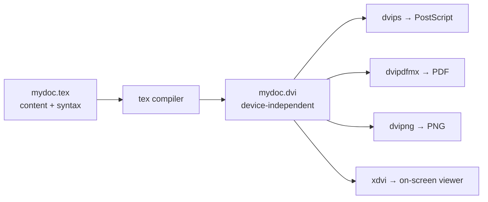
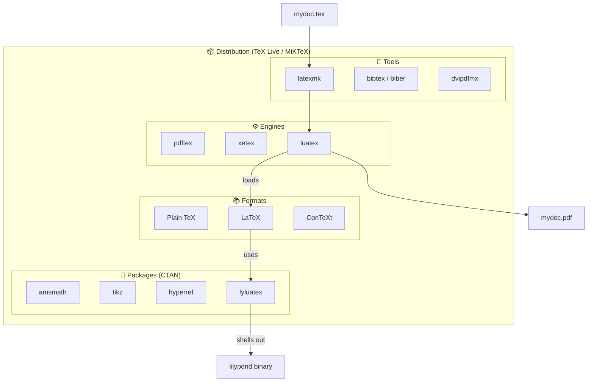

TeX, LaTeX, TeX Live, packages, engines, formats — the names blur together if you've never built a mental model of how they relate. This post walks the layers from the bottom up: what TeX actually is, what LaTeX adds, what a distribution bundles, and what changes when you start integrating external tools like LilyPond.

## 1. What is TeX?

TeX is a typesetting system created by Donald Knuth in 1978, designed for high-quality technical and mathematical documents. It is famous for precise layout control and superb math typesetting.

In its **original** form, TeX has essentially two parts:

1. **A syntax (the language)** — primitives like `\def`, `\hbox`, `\vbox`, `\par`, math mode with `$...$`, conditionals `\if...`, counters, and so on. Plain TeX also ships a small set of basic macros (`plain.tex`) so the language is usable, but the core syntax is just the primitives.
2. **A compiler (the engine)** — the `tex` program Knuth wrote (in WEB/Pascal) that reads `.tex` files and produces `.dvi` (device-independent) output.

### The original pipeline



The point of DVI was to keep the compile step device-agnostic; a separate tool then handled device-specific rendering. Modern engines like `pdftex` and `xetex` collapse those two stages and emit PDF directly, but the original two-stage design is still the cleanest way to understand the system.

### TeX is Turing complete

TeX's macro expansion, combined with conditionals, assignments, and arithmetic (`\count`, `\advance`), is powerful enough to compute anything computable. People have implemented Conway's Game of Life in pure TeX. This matters because it means **the language can grow itself** — and that is exactly how the ecosystem evolved.

## 2. Macros: the "library" mechanism

In the TeX world, the unit of code reuse is the **macro** (defined with `\def\name{...}` or, in LaTeX, `\newcommand`). Bundles of macros are usually called:

| Term | Where it's used | Example |
|------|----------------|---------|
| **Format** / **macro package** | Large foundational sets | LaTeX, ConTeXt, Plain TeX |
| **Package** / **style file (`.sty`)** | LaTeX-world libraries | `amsmath`, `tikz`, `hyperref` |
| **Module** | ConTeXt | — |

The package repository is **CTAN** (Comprehensive TeX Archive Network) — analogous to npm or PyPI for the TeX world.

Because everything is macro expansion rather than a "real" programming language, TeX programming is notoriously arcane. That is why newer engines like LuaTeX embed Lua: so authors of complex packages can write extensions in a sane language instead of wrestling with TeX macros.

## 3. What LaTeX is, really

LaTeX is essentially a large macro package written in TeX — a "library" (or framework) sitting on top of the TeX language. Leslie Lamport wrote it in the early 1980s so authors could focus on **structure** rather than **presentation**.

| Layer | What you get |
|-------|--------------|
| **TeX primitives** | `\hbox`, `\vbox`, `\def`, `\hskip` — powerful but tedious |
| **LaTeX commands** | `\section{}`, `\cite{}`, `\ref{}`, `\begin{figure}...\end{figure}`, `\documentclass{article}` |

When you write `\section{Intro}`, that ultimately expands into TeX primitives that draw the heading. The document class then decides how that structure looks.

> **Nuance.** Calling LaTeX a "third-party library" is technically right but practically misleading. LaTeX is so dominant that distributions ship it preloaded, and most users treat it as the standard library of the TeX world — closer to how Python users treat NumPy than how they treat a random PyPI package.

## 4. Engines vs. formats vs. distributions

A common confusion: when you run `pdflatex`, what is actually happening?

- **Engine**: the `pdftex` binary.
- **Format**: the LaTeX macro set, preloaded into memory for speed.
- **Distribution**: the bundle that ships both, plus thousands of packages, fonts, and tools.

So `pdflatex` ≈ "the `pdftex` engine, started with the LaTeX format already loaded."

### The major distributions

| Distribution | Notes |
|---|---|
| **TeX Live** | Most common; cross-platform (Linux, macOS, Windows). Default on most Linux distros. |
| **MacTeX** | TeX Live repackaged for macOS, with a native installer and TeXShop. |
| **MiKTeX** | Popular on Windows; auto-installs missing packages on demand. |
| **Overleaf** | Browser-based; runs TeX Live on a server — no local install. |

## 5. What's actually inside TeX Live?

A full TeX Live install is around 7–8 GB. It includes:

**🛠️ Engines (the actual compilers)**
- `tex` — original Knuth TeX
- `pdftex` — outputs PDF directly
- `xetex` — Unicode + system fonts (OpenType/TrueType)
- `luatex` — embeds Lua; the modern successor
- `ptex`, `uptex` — Japanese typesetting

**📦 Formats (preloaded macro sets)** — Plain TeX, LaTeX, ConTeXt, AMSTeX

**📚 Macro packages (~4,000+ from CTAN)**
- Math: `amsmath`, `mathtools`, `amssymb`
- Graphics: `tikz`/`pgf`, `pgfplots`, `graphicx`
- Bibliography: `biblatex`, `natbib`
- Fonts: `fontspec`, `microtype`
- Layout: `geometry`, `fancyhdr`, `titlesec`
- Cross-refs/links: `hyperref`, `cleveref`
- Document classes: `article`, `book`, `memoir`, `beamer` (slides), and templates for many universities and journals (IEEE, ACM, Springer…)

**🔤 Fonts** — Computer Modern (Knuth's originals), Latin Modern, TeX Gyre family, Libertine, STIX, and many more.

**🔄 Conversion tools** — `dvips`, `dvipdfmx`, `dvipng`, `dvisvgm`, plus `ps2pdf`/`pdftops` via Ghostscript.

**🧰 Build / workflow tools**
- `latexmk` — runs the right compiler the right number of times for cross-refs/bibliographies
- `bibtex`, `biber` — bibliography processors
- `makeindex`, `xindy` — index generators
- `texcount` — word counting
- `texdoc` — opens documentation for any installed package

**📥 Package manager** — `tlmgr` (install/update/remove, switch repositories)

**🎨 Auxiliary languages** — MetaPost, MetaFont, Asymptote (vector graphics).

## 6. Day-to-day usage

Despite the gigabytes of tooling, daily usage is almost trivially simple.

### The 90% case: `latexmk`

```bash
latexmk -pdf mydoc.tex
```

`latexmk` figures out which engine to call, runs it the right number of times to resolve cross-references and citations, runs `bibtex`/`biber` if needed, and stops when the output stabilizes. Editors like TeXstudio, VS Code's LaTeX Workshop, and Overleaf just call this under the hood when you click "Build."

### One level down: pick an engine

```bash
pdflatex mydoc.tex     # most common; outputs PDF
xelatex  mydoc.tex     # if you need system fonts / non-Latin scripts
lualatex mydoc.tex     # for Lua scripting or modern font features
```

Run it 2–3 times manually to settle cross-references — which is exactly what `latexmk` automates.

### Choosing an engine

- Default to **`pdflatex`**. Fast and handles 95% of documents.
- Switch to **`xelatex`** for system OpenType fonts or non-Latin scripts (CJK, Arabic, etc.).
- Switch to **`lualatex`** for very large documents, programmatic typesetting, or if a package requires it.

### What about all those flags?

Engines have many flags (`-interaction=nonstopmode`, `-output-directory`, `-shell-escape`, …), but you almost never set them by hand. You either let the editor pass sensible defaults, or put options *inside* the `.tex` file:

```latex
\documentclass[12pt,a4paper]{article}
\usepackage{amsmath}
\usepackage{hyperref}
```

The TeX file declares what it needs; the engine just compiles it.

> **Mental model.** Compiling LaTeX is like compiling C with `gcc`. Yes, `gcc` has hundreds of flags, but most people just type `gcc hello.c` (or let `make` handle it). `latexmk -pdf file.tex` is the `make` of the TeX world.

## 7. Adding capabilities with `\usepackage`

The whole point of the system is that adding a feature is one line:

```latex
\usepackage{amsmath}      % advanced math
\usepackage{tikz}         % graphics
\usepackage{hyperref}     % clickable links
```

At compile time, the engine finds the package on disk via `kpathsea` (the search library), loads its macros, and makes the new commands available. No separate install step per document, no `npm install`, no import paths to configure.

### Where the packages come from

- **Already installed?** With TeX Live or MiKTeX, almost certainly yes — they ship thousands of packages preloaded.
- **Missing?**
  - **MiKTeX** — offers to download on the fly.
  - **TeX Live** — run `tlmgr install <packagename>` once.
  - **Overleaf** — everything is preinstalled server-side.

## 8. When `\usepackage` isn't enough: external tools

Some packages are wrappers around *external programs*. In that case, `\usepackage{}` is necessary but not sufficient — you also need to install the external binary, and often pass `-shell-escape` so TeX is allowed to invoke it.

| Package | External program needed | Notes |
|---------|-------------------------|-------|
| `minted` | Python's `pygments` | Syntax-highlighted code listings |
| `gnuplot` integration | `gnuplot` | Plotting |
| `lyluatex` / `lilypond-book` | `lilypond` | Music notation |

### Case study: LilyPond for music notation

LilyPond is a standalone program that produces sheet music as PDF/PNG/EPS. To embed music in LaTeX:

**1. Install LilyPond itself**

```bash
# Linux
apt install lilypond
# macOS
brew install lilypond
# Windows: installer from lilypond.org
```

Verify with `lilypond --version`.

**2. Pick an integration approach**

- **`lyluatex`** (modern, recommended) — a LaTeX package that requires the **LuaLaTeX** engine and calls LilyPond automatically during compilation.

  ```latex
  \documentclass{article}
  \usepackage{lyluatex}

  \begin{document}
  \begin{lilypond}
  \relative c' { c d e f g a b c }
  \end{lilypond}
  \end{document}
  ```

  Compile with:
  ```bash
  lualatex -shell-escape mydoc.tex
  ```

- **`lilypond-book`** (older preprocessor) — a two-step build:

  ```bash
  lilypond-book --output=out --pdf mydoc.lytex
  cd out && pdflatex mydoc.tex
  ```

  It extracts music snippets, runs LilyPond on each, and rewrites the file with `\includegraphics{}` calls.

**3. The `-shell-escape` caveat**

`lyluatex` shells out to the `lilypond` binary at compile time. TeX engines refuse to run arbitrary external commands by default (security), so you must pass `-shell-escape`. Editors need this configured in their build settings.

**4. Recommended setup**

For new projects: `lyluatex` + `lualatex` + `latexmk`.

```bash
latexmk -lualatex -shell-escape mydoc.tex
```

Drop a `latexmkrc` into the project so you don't have to remember the flags:

```perl
$pdf_mode = 4;          # use lualatex
$lualatex = 'lualatex -shell-escape %O %S';
```

Then it's just `latexmk` again, and music notation Just Works.

## 9. The mental model in one picture



- **TeX-only ecosystem** (`\usepackage{amsmath}`, etc.) is self-contained.
- The moment you cross into things TeX can't natively typeset — music notation, syntax-highlighted code, plots from external tools — you're orchestrating *two* programs, and you need to (a) install the other program, (b) tell TeX to allow shell-out, and often (c) pick a specific engine.

For everything else, `latexmk -pdf file.tex` is genuinely all you need.
