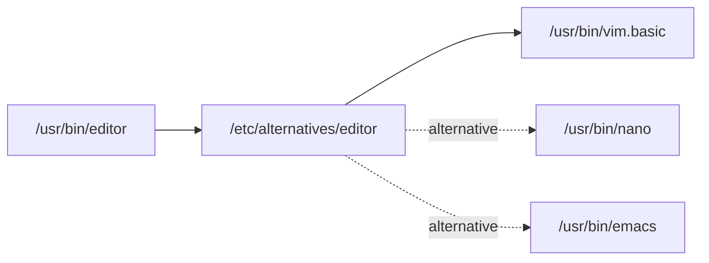

On Debian-derived systems, several packages often provide the same kind of functionality — multiple text editors, multiple Java runtimes, multiple browsers. The **alternatives system** is the mechanism that lets them coexist, and lets you (or the package manager) choose which one acts as the default.

## The Idea in One Sentence

A "generic" name in `/usr/bin` is a symlink that ultimately resolves, through `/etc/alternatives`, to whichever real binary you've selected as the default for that role.

## The Symlink Chain



Concretely:

```
/usr/bin/editor → /etc/alternatives/editor → /usr/bin/vim.basic
```

Programs that want to launch "an editor" call the generic name. The system follows the symlinks and ends up at whichever real binary is currently selected.

## How a Program Picks an Editor

When a program like `git commit` or `crontab -e` needs an editor, it usually does this:

1. Check the `$VISUAL` environment variable.
2. Fall back to `$EDITOR`.
3. Fall back to `/usr/bin/editor` (or `sensible-editor`, which itself consults the alternatives system).

So the alternatives system sets the **system-wide default**, while `$EDITOR` is a **per-user override**. If your shell exports `EDITOR=vim`, switching the alternative to Emacs won't change anything for you — your shell's preference wins.

## Common Generic Names

| Generic name      | Role                       |
|-------------------|----------------------------|
| `editor`          | Default text editor        |
| `x-www-browser`   | Default graphical browser  |
| `java` / `javac`  | JDK runtime / compiler     |
| `python3`         | Python 3 interpreter       |
| `gcc`             | C compiler                 |

## Common Commands

```bash
# See all alternatives for a name and which one is selected
update-alternatives --display editor

# Interactively pick one (numbered menu)
sudo update-alternatives --config editor

# Register a new alternative with a priority
sudo update-alternatives --install /usr/bin/editor editor /usr/bin/nano 50

# Remove one
sudo update-alternatives --remove editor /usr/bin/nano

# Set non-interactively (handy for scripts)
sudo update-alternatives --set editor /usr/bin/emacs
```

## Auto Mode vs Manual Mode

Each alternative has a **priority** declared by the package that registered it. The system has two modes:

- **Auto** — the highest-priority alternative wins. When packages are installed or upgraded, the symlink may be silently re-pointed.
- **Manual** — you've explicitly chosen one with `--config` or `--set`. Your choice sticks across upgrades.

Running `--config` or `--set` flips the role into manual mode and records your selection.

## ⚠️ Don't Repoint the Symlink by Hand

It's tempting to just run `ln -sf /usr/bin/emacs /etc/alternatives/editor`. **Don't.** Two reasons:

1. **It's not recorded.** `update-alternatives` keeps its bookkeeping in `/var/lib/dpkg/alternatives/editor` (priorities, mode, slave links). If your symlink isn't recorded as a manual choice, the next package operation may run `update-alternatives` in auto mode and overwrite it.
2. **Slave links get skipped.** Many alternatives bundle related symlinks. For example, choosing `vim` as `editor` also repoints the man page `editor.1.gz` to `vim.1.gz`. A manual `ln` only touches the one link you named; the man page (and any other slaves) stays out of sync.

The safe equivalent of "just point editor at emacs":

```bash
sudo update-alternatives --set editor /usr/bin/emacs
```

The end state of the symlink is the same — but it's recorded, slave links follow, and upgrades won't undo it.

## Summary

- ✅ A chain of symlinks (`/usr/bin/<name>` → `/etc/alternatives/<name>` → real binary) lets multiple programs share one role.
- ✅ Use `update-alternatives --config <name>` to switch defaults.
- ✅ Remember `$EDITOR` / `$VISUAL` override the system default per user.
- ❌ Don't `ln -sf` the symlink directly — let `update-alternatives` manage it.
