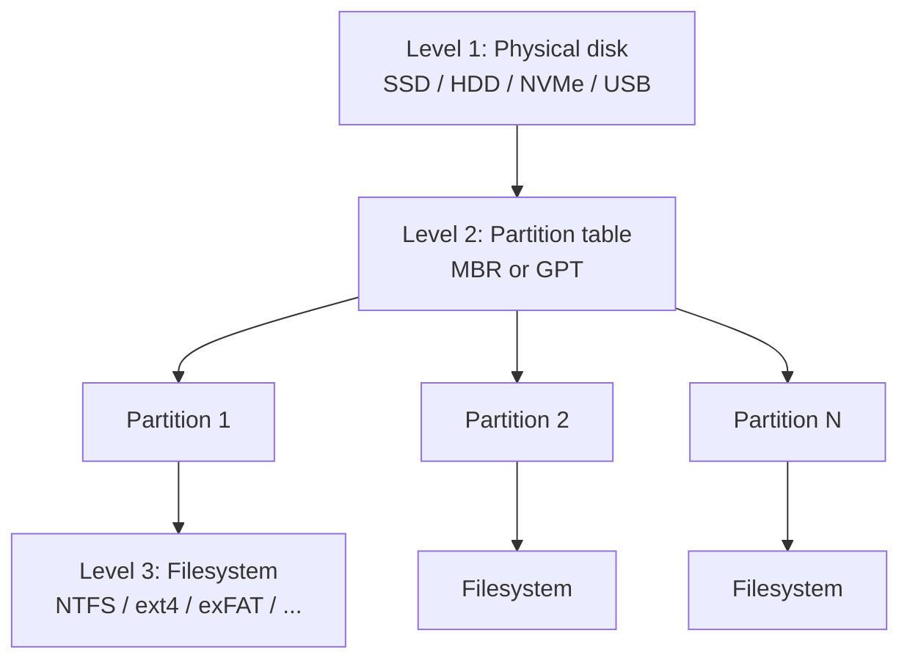
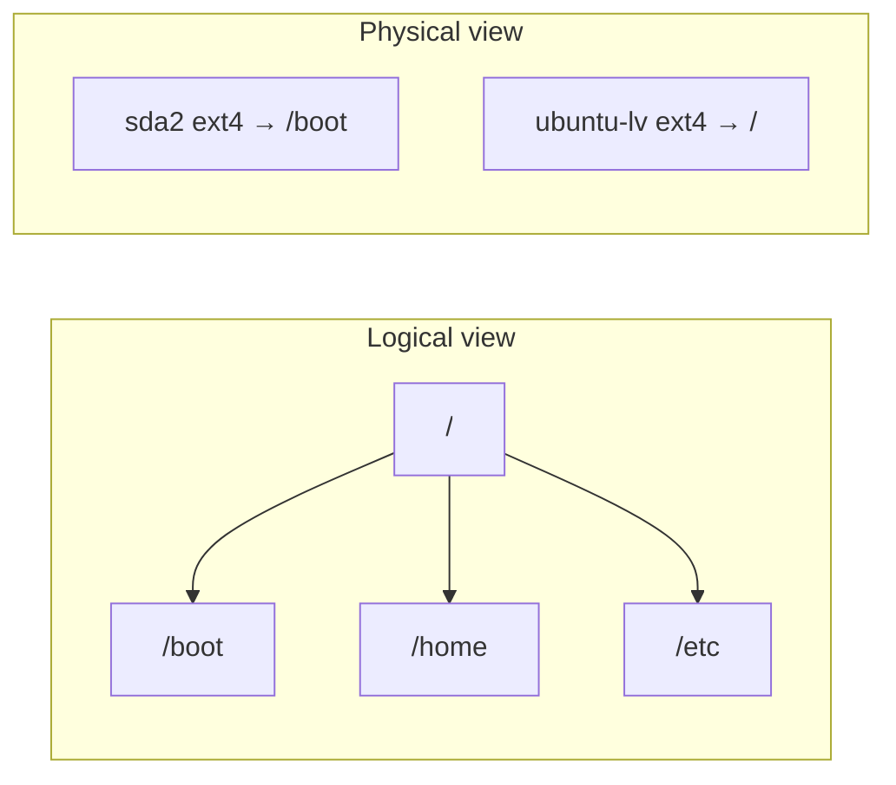

## The three-level mental model

Both Linux and Windows view storage as a strict hierarchy, just with different names and different amounts of flexibility:



### Level 1 — Physical disk

The hardware itself, with a fixed sector size (typically 512 B or 4 KiB).

- **Windows** labels disks as `Disk 0`, `Disk 1`, ...
- **Linux** exposes them as block devices in `/dev`: `/dev/sda`, `/dev/sdb` (SATA/USB), `/dev/nvme0n1` (NVMe), `/dev/vda` (virtio).

### Level 2 — Partition table

A few sectors at the start of the disk that describe how the disk is carved up. Same standards on both OSes:

| Type | Max disk size | Max partitions | Notes |
|---|---|---|---|
| **MBR** | 2 TiB | 4 primary (or 3 + extended) | Legacy BIOS systems |
| **GPT** | No practical limit | 128 by default | Required for UEFI boot; backup copy at end of disk |

### Level 3 — Filesystem

The structure inside a partition that organizes files, directories, permissions, and metadata.

- **Windows-native**: NTFS (default), ReFS (server), FAT32 (still used for the EFI system partition), exFAT (USB drives).
- **Linux-native**: ext4 (default), btrfs, xfs, f2fs, zfs.
- **Cross-platform reads**: Linux can read NTFS / exFAT / FAT32; Windows mostly cannot read ext4 without third-party tools.

## How the two OSes present this hierarchy to users

This is where the philosophies diverge.

### Windows: drive letters expose the seams

Each filesystem gets its own letter — `C:`, `D:`, `E:`, ... — and the letter is part of every path.

- `C:` is conventionally the system partition, but the letters are just labels — they don't correspond to physical disks.
- `C:` and `D:` might be two partitions on **one** disk, or two separate disks, or a USB stick, or a network share, or a mounted ISO. The letter alone doesn't tell you.
- Disk Management (`diskmgmt.msc`) shows each physical disk as a row with its partitions laid out horizontally. Same row = same disk.

The user-visible consequence: **storage boundaries are obvious in the path**. Copying `C:\file` to `D:\file` is plainly cross-volume.

### Linux: one tree, mounts hide the seams

Linux mounts every filesystem into a single unified tree starting at `/`. There are no drive letters.

- `/dev/sda2` might be mounted at `/`, another partition at `/home`, a USB stick at `/mnt/usb`.
- Configured persistently in `/etc/fstab`, or ad hoc with `mount`.
- The path `/home/alice/file` doesn't tell you which filesystem holds it.

This is the **VFS (Virtual File System)** layer doing the stitching: each filesystem doesn't know where it's mounted; the kernel maintains a path-to-filesystem table and routes file operations transparently.

## A concrete example: Ubuntu in a VM

Running `lsblk -o NAME,SIZE,TYPE,FSTYPE,MOUNTPOINT` on a stock Ubuntu install:

```
NAME                       SIZE TYPE FSTYPE      MOUNTPOINT
sda                         64G disk
├─sda1                       1M part
├─sda2                       2G part ext4        /boot
└─sda3                      62G part LVM2_member
  └─ubuntu--vg-ubuntu--lv   62G lvm  ext4        /
sr0                        3.1G rom
```

Reading top-to-bottom:

- **`sda`** — the 64 GB disk, GPT-partitioned into three.
- **`sda1`** (1 MB) — a **BIOS boot partition**. GPT requires a tiny dedicated area for the bootloader's stage-2 code in legacy BIOS mode. No filesystem; GRUB writes raw bytes.
- **`sda2`** (2 GB, ext4) — `/boot`. Holds kernel images and initramfs. Kept separate so the bootloader can read it without understanding LVM.
- **`sda3`** (62 GB, `LVM2_member`) — handed over to LVM as raw storage.
- **`ubuntu--vg-ubuntu--lv`** — a **logical volume** carved from the LVM volume group `ubuntu-vg`, holding the ext4 root filesystem.

Linux's stack is one layer deeper than Windows' here:

```
disk (sda)
  └─ partition (sda3)
      └─ LVM volume (ubuntu-vg/ubuntu-lv)
          └─ filesystem (ext4)
              └─ mount point (/)
```

LVM sits between the partition and the filesystem, letting you resize `/`, add disks to the volume group, or take snapshots without touching the partition table.

## The mount illusion: `/boot` is *not* inside `/`

A subtle but important point: in `lsblk` output, `/boot` and `/` look like parent and child in the directory tree, but on disk they are **peers** — independent filesystems on independent partitions.



What happens at boot:

1. Kernel mounts `ubuntu-lv` at `/`. At this moment `/boot` is just an empty directory inside the root filesystem.
2. Kernel mounts `sda2` *at the directory `/boot`*. This **covers** the empty directory, and `sda2`'s contents now appear there.

So `/boot` the **directory** belongs to the root filesystem; `/boot` the **mount point** exposes a different filesystem. Verify it:

```bash
df /        # → ubuntu-lv
df /boot    # → sda2
mount | grep boot
```

## Tradeoffs of hidden mounts

The transparency is powerful — but it also hides things that matter.

### Power

- Move `/home` to a bigger disk overnight; no application reconfiguration needed.
- `/` on fast NVMe, `/var/log` on slower HDD; apps don't care.
- Network filesystems (NFS, SSHFS) appear as ordinary paths in the tree.
- An encrypted LUKS volume looks like any other directory once unlocked.

### Surprises

| Surprise | What happens |
|---|---|
| **Performance** | A "local" path may actually be a slow network mount. |
| **Atomicity** | `mv /home/file /tmp/file` is a cheap rename if same filesystem, but a full **copy + delete** if cross-filesystem. Same command, very different cost. Windows makes this obvious by drive letter. |
| **Hardlinks** | Cannot span filesystems. `ln /home/a /tmp/b` fails if they're separate mounts. |
| **Disk full** | `/` has 50 GB free but `/var` is its own partition and full — programs writing to `/var/log` fail while `df /` looks fine. |
| **Backups** | `tar --one-file-system /` skips other mounts; you might think you backed up everything when you didn't. |

## Checking free space on Linux

The natural workflow is two questions:

1. **Which filesystem is full?** → `df`
2. **What inside it is taking space?** → `du` or `ncdu`

### Step 1: `df -h`

```
Filesystem                         Size  Used Avail Use% Mounted on
tmpfs                              790M  1.7M  788M   1% /run
/dev/mapper/ubuntu--vg-ubuntu--lv   61G   17G   41G  30% /
tmpfs                              3.9G     0  3.9G   0% /dev/shm
tmpfs                              5.0M     0  5.0M   0% /run/lock
/dev/sda2                          2.0G  195M  1.6G  11% /boot
tmpfs                              790M   24K  790M   1% /run/user/1000
```

Each row is one mounted filesystem. Two are real disk storage; four are RAM-backed pseudo-filesystems (`tmpfs`).

| Mount | What it holds |
|---|---|
| `/` | Root filesystem (LVM logical volume). The big one — 41 GB free. |
| `/boot` | Kernel images and initramfs on `sda2`. Small; can fill up over time as old kernels accumulate. |
| `/run` | Runtime state — PID files, sockets. RAM-backed, wiped on reboot. |
| `/dev/shm` | Shared memory for IPC. Sized at ~half of physical RAM. |
| `/run/lock` | Tiny lock file area, prevents daemons stepping on each other. |
| `/run/user/<UID>` | Per-user runtime dir. Created at login, destroyed at logout. |

✅ Useful filters:

```bash
df -h -x tmpfs -x devtmpfs -x squashfs   # only real storage
df -hT                                     # include filesystem type
df -hi                                     # show inode usage instead of bytes
```

A partition can be "full" by running out of inodes even with bytes free — `df -hi` catches that case.

### Step 2: `du` or `ncdu`

Once you know which filesystem is full, drill in:

```bash
du -h --max-depth=1 /var | sort -h         # top-level subdirectory sizes
sudo find / -xdev -type f -size +500M      # largest files on one filesystem
ncdu /                                      # interactive TUI browser
```

`-xdev` keeps `find` on a single filesystem so it doesn't wander across mounts.

## Counting and inspecting physical disks (Linux)

```bash
lsblk -d -o NAME,SIZE,MODEL,TYPE | awk '$NF=="disk"'
```

Field by field:

- `lsblk` — list block devices.
- `-d` — top-level only, skip partitions.
- `-o NAME,SIZE,MODEL,TYPE` — pick output columns.
- `awk '$NF=="disk"'` — keep rows whose **last** field is exactly `disk` (filters out `loop`, `rom`, `crypt`, `lvm`).

Other useful tools:

| Command | Purpose |
|---|---|
| `lsblk` | Tree of disks, partitions, mountpoints |
| `fdisk -l` | Detailed partition tables (needs sudo) |
| `lshw -class disk -short` | Vendor / model / bus (needs sudo) |
| `nvme list` | NVMe-specific (needs `nvme-cli`) |
| `findmnt` | Full mount table |

## The deeper design philosophy

> **Unix**: "Everything is a file, and the filesystem is one tree." Hiding storage layout is the point — it lets the system evolve underneath without breaking userspace.

> **Windows** (inherited from DOS / CP/M): Drives are user-visible objects. The user knows their floppy from their hard disk.

Both are coherent designs that describe the same underlying reality (multiple filesystems on multiple partitions on multiple disks). They optimize for different things:

- **Linux** → administrative flexibility. Sysadmins move storage around without applications noticing.
- **Windows** → user-facing clarity. End users always know which volume they're on.

Neither is universally better. Pick the philosophy that fits the system you're operating: a server farm benefits from Linux's invisibility, while a desktop user benefits from Windows' explicitness.
