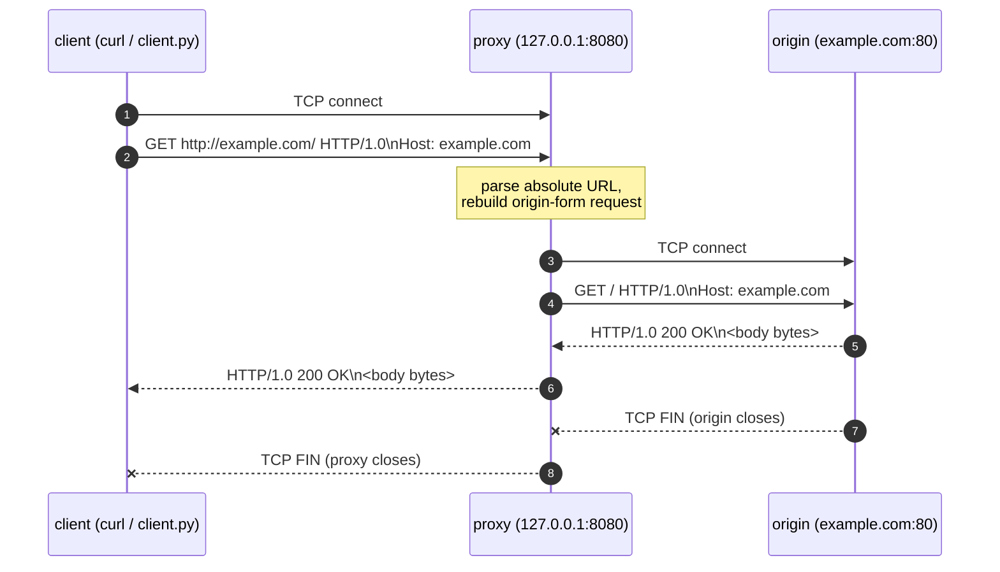
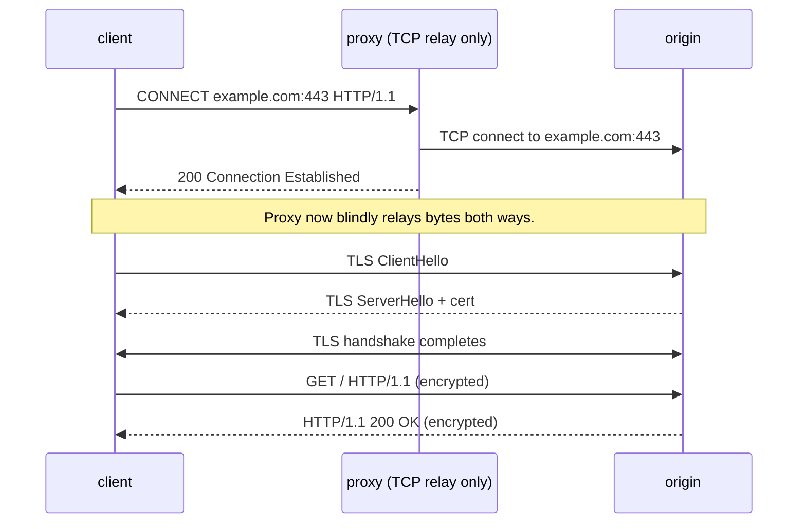

A forward proxy is one of those things that sounds mysterious until you write one — at which point you realize it's about thirty lines of "open a socket on someone else's behalf." These are notes from working through the concept, building a minimal proxy in Python, and pinning down what actually goes on the wire.

## Table of contents

- [What is a proxy?](#what-is-a-proxy)
- [Why a forward HTTP proxy is the easiest entry point](#why-a-forward-http-proxy-is-the-easiest-entry-point)
- [The one detail that makes a proxy a proxy](#the-one-detail-that-makes-a-proxy-a-proxy)
- [A 45-line proxy](#a-45-line-proxy)
- [A raw-socket client](#a-raw-socket-client)
- [End-to-end flow](#end-to-end-flow)
- [HTTPS: the proxy becomes a dumb pipe](#https-the-proxy-becomes-a-dumb-pipe)
- [Can an HTTP proxy carry SSH or SMTP?](#can-an-http-proxy-carry-ssh-or-smtp)
- [Going deeper: watch it on Wireshark](#going-deeper-watch-it-on-wireshark)
- [What to learn next](#what-to-learn-next)

## What is a proxy?

A network proxy is an intermediary that sits between a client and a destination, forwarding requests and responses. Three flavours show up in practice:

| Type            | Who configures it             | Typical use                                       |
| --------------- | ----------------------------- | ------------------------------------------------- |
| **Forward**     | Client (`HTTP_PROXY`, SOCKS5) | Corporate egress, content filtering, debugging    |
| **Reverse**     | Server operator               | Load balancing, TLS termination, caching (nginx)  |
| **Transparent** | Network operator              | Captive portals, ISP-level interception           |

For learning, the **forward HTTP proxy** is the right starting point — it's the most intuitive of the three.

## Why a forward HTTP proxy is the easiest entry point

Three reasons:

1. **The mental model is one sentence.** The client says *"fetch me example.com"*; the proxy fetches it; the proxy hands the response back. That's it.
2. **It's easy to observe.** Set `http_proxy=http://localhost:8080` and every request flows through one place you control.
3. **You can read the implementation.** Real production proxies (Squid, HAProxy, nginx) are huge. But the *core* is small enough to fit in a single screen of code.

Tools worth knowing about while learning:

- **mitmproxy** — interactive TUI proxy that shows requests and responses live. Best for *seeing* what a proxy does.
- **tinyproxy** — small C implementation you can read end-to-end.
- **a 45-line Python script** — what we'll build below.

## The one detail that makes a proxy a proxy

Take the bytes a client sends in two scenarios.

**Direct to origin (no proxy):**

```http
GET / HTTP/1.0
Host: example.com
```

The client opens a TCP connection to `example.com:80`. The path on the request line is just `/` — the server already knows it's itself.

**Through a proxy:**

```http
GET http://example.com/ HTTP/1.0
Host: example.com
```

The client opens a TCP connection to `127.0.0.1:8080` (the proxy). The request line carries the **full URL** — that's the proxy's signal: "I'm not your destination. Please fetch this for me."

These two forms have names in the spec:

- **origin-form** — `GET /path HTTP/1.1` — used when talking directly to the server.
- **absolute-form** — `GET http://host/path HTTP/1.1` — used when talking to a proxy.

A non-proxy server receiving an absolute-form request will usually reject it. A proxy receiving an origin-form request can't do anything useful — it doesn't know which host to forward to. **The request line is the protocol's tiny but crucial difference.**

What the proxy then does is rewrite absolute-form back to origin-form before sending the request to the origin:

```text
client → proxy:    GET http://example.com/foo HTTP/1.0
                            │ rewrite
                            ▼
proxy  → origin:   GET /foo HTTP/1.0
```

## A 45-line proxy

Here is a single-threaded, plain-`http://`-only forward proxy in Python with no third-party dependencies. One client at a time. No HTTPS, no `CONNECT`, no threads. The point is to keep everything except the core idea out of the way.

```python
"""Minimal single-threaded HTTP forward proxy — for learning.

Plain http:// only. No HTTPS, no CONNECT, no threads. One client at a time.

Run:    python proxy.py
Use:    curl -x http://localhost:8080 http://example.com
"""

from __future__ import annotations

import socket
from http.server import BaseHTTPRequestHandler, HTTPServer
from urllib.parse import urlsplit


class ProxyHandler(BaseHTTPRequestHandler):
    # HTTP/1.0 keeps things simple: no chunked encoding, no keep-alive —
    # every response just streams until the origin closes the socket.
    protocol_version = "HTTP/1.0"

    def do_GET(self) -> None:
        # In proxy mode, self.path is an absolute URL like "http://host/p?q=1".
        url = urlsplit(self.path)
        if url.scheme != "http":
            self.send_error(400, "Only http:// supported")
            return

        host = url.hostname
        port = url.port or 80
        path = (url.path or "/") + (f"?{url.query}" if url.query else "")

        # Build a clean origin-form request for the upstream server.
        request = (
            f"GET {path} HTTP/1.0\r\n"
            f"Host: {host}\r\n"
            f"Connection: close\r\n"
            f"\r\n"
        ).encode("latin-1")

        # Connect to origin, send the request, stream bytes straight back.
        with socket.create_connection((host, port), timeout=10) as upstream:
            upstream.sendall(request)
            while True:
                chunk = upstream.recv(65536)
                if not chunk:
                    break
                self.wfile.write(chunk)


def main() -> None:
    server = HTTPServer(("127.0.0.1", 8080), ProxyHandler)
    print("HTTP proxy listening on 127.0.0.1:8080")
    print("Try:  curl -x http://localhost:8080 http://example.com")
    server.serve_forever()


if __name__ == "__main__":
    main()
```

The whole proxy is one method, `do_GET`, which performs four steps:

1. **Parse** — extract `host`, `port`, `path` from the absolute URL `self.path`.
2. **Rebuild** — assemble a fresh origin-form request with a `Host` header.
3. **Forward** — open a TCP socket to the origin and send the rebuilt request.
4. **Stream back** — read bytes from the origin and write them straight to the client until EOF.

That's a forward proxy. Everything else (threading, CONNECT, hop-by-hop header sanitization, header rewriting, caching, blocklists) is layered on top of this skeleton.

> 💡 Why HTTP/1.0 here? It implies `Connection: close` and forbids chunked transfer encoding, so the response simply streams until the socket closes. HTTP/1.1 adds keep-alive and chunked encoding — both worth knowing, neither central to the lesson.

## A raw-socket client

You don't need a special client to use the proxy — `curl -x` works, and so does Python's `urllib.request.ProxyHandler`. But to *see* the absolute-form request line as bytes on the wire, it's worth speaking the proxy protocol by hand:

```python
"""Send an HTTP request through the proxy at 127.0.0.1:8080.

Speaks the proxy protocol by hand on a raw TCP socket so you can see the
exact bytes on the wire. The key thing: the request line carries the
*absolute* URL — that's how the proxy knows where to forward.
"""

from __future__ import annotations

import socket

PROXY_HOST = "127.0.0.1"
PROXY_PORT = 8080
URL = "http://example.com/"


def main() -> None:
    request = (
        f"GET {URL} HTTP/1.0\r\n"   # absolute-form URL on the request line
        f"Host: example.com\r\n"
        f"Connection: close\r\n"
        f"\r\n"
    ).encode("latin-1")

    with socket.create_connection((PROXY_HOST, PROXY_PORT), timeout=10) as s:
        s.sendall(request)
        chunks: list[bytes] = []
        while True:
            chunk = s.recv(65536)
            if not chunk:
                break
            chunks.append(chunk)
    response = b"".join(chunks)

    head, _, body = response.partition(b"\r\n\r\n")
    status = head.split(b"\r\n", 1)[0].decode("latin-1", errors="replace")
    print(f"{URL} -> {status}, body {len(body)} bytes")


if __name__ == "__main__":
    main()
```

## End-to-end flow

When `python client.py` runs against `python proxy.py`, two TCP conversations happen, stacked:



The proxy is a translator and courier: it translates the client's "fetch this URL for me" into a normal HTTP request the origin understands, carries it over, and carries the reply back.

## HTTPS: the proxy becomes a dumb pipe

The proxy above can't proxy `https://` URLs — TLS is encrypted, and the proxy doesn't have `example.com`'s private key. So how do real HTTP proxies handle HTTPS?

They support a special method called **`CONNECT`**. The client sends:

```http
CONNECT example.com:443 HTTP/1.1
Host: example.com:443
```

The proxy:

1. Opens a raw TCP socket to `example.com:443`.
2. Replies `HTTP/1.1 200 Connection Established`.
3. From that point on, **stops parsing**. It just shovels bytes both directions.

The client then performs the **TLS handshake directly with `example.com`**, through the tunnel. The proxy sees only encrypted bytes flowing past — it knows the hostname (from the CONNECT line) but not the URL path, headers, or body.



This asymmetry — readable for HTTP, opaque for HTTPS — is why corporate "TLS-inspecting" proxies have to install a custom root CA on every device. The only way to actually see HTTPS plaintext is to terminate TLS at the proxy with a cert the client trusts, i.e. perform a sanctioned man-in-the-middle.

## Can an HTTP proxy carry SSH or SMTP?

This question has two layers:

### In theory, yes

Once the proxy implements `CONNECT`, it's just "open a TCP socket to host:port and pipe bytes." Nothing about that is HTTP-specific. So in principle:

```http
CONNECT github.com:22 HTTP/1.1     ← SSH
CONNECT mail.example.com:25 HTTP/1.1   ← SMTP
```

…would happily tunnel SSH or SMTP through the proxy.

### In practice, no — operators clamp it down

Almost every real HTTP proxy restricts `CONNECT` to a small port whitelist, usually just **443** (HTTPS) and sometimes **80**. Two reasons:

1. **Deployment context.** HTTP proxies live where web traffic is shaped — corporate egress, content filters, caching layers. Their job is "control web access." Letting them tunnel SSH defeats that job.
2. **Open relays are dangerous.** A proxy that allows `CONNECT host:any-port` becomes an open TCP tunnel — useful for bypassing firewalls, hiding source IPs, and relaying spam (`CONNECT mail-server:25`).

So when people say "HTTP proxy" they really mean **"HTTP + HTTPS proxy"** — the HTTPS part is implied because every real proxy supports `CONNECT :443`.

| Protocol     | Plain HTTP proxy | HTTP proxy + CONNECT     | SOCKS5 |
| ------------ | ---------------- | ------------------------ | ------ |
| HTTP         | ✅ (parsed)      | ✅                       | ✅     |
| HTTPS        | ❌               | ✅ (tunneled)            | ✅     |
| SSH          | ❌               | only if port allowed     | ✅     |
| SMTP         | ❌               | only if port allowed     | ✅     |
| Anything TCP | ❌               | only if port allowed     | ✅     |

For protocol-agnostic forwarding, the right tool is **SOCKS5**, which was designed from day one to be a generic TCP (and UDP) proxy and doesn't carry HTTP's web-centric baggage. The code is also smaller — there's no HTTP parsing at all.

## Going deeper: watch it on Wireshark

Reading code tells you what should happen; a packet capture tells you what actually did. The clarifying experiment:

1. Start the proxy.
2. Open Wireshark, capture on the **loopback interface** (`lo` on Linux).
3. Filter: `tcp.port == 8080 or tcp.port == 80`.
4. Run `curl -x http://localhost:8080 http://example.com/`.

You will see two TCP conversations stacked: one between curl and the proxy on port 8080, one between the proxy and `example.com` on port 80. Right-click any packet → **Follow → TCP Stream** to read the conversation as text.

The lesson lands when you put the two request lines side by side:

- `GET http://example.com/ HTTP/1.0` — what the client sent the proxy (absolute-form).
- `GET / HTTP/1.0` — what the proxy sent the origin (origin-form).

Repeat the capture with HTTPS and you will see the `CONNECT` request, the `200 Connection Established` reply, and then a wall of unreadable TLS records. That visceral *"I can't read it anymore"* is when CONNECT clicks.

> ⚠️ One pitfall on loopback: Linux uses a 65535-byte MTU instead of 1500, so a whole HTTP response often fits in a single TCP segment. You won't see fragmentation/reassembly the way you would over a real network. Don't be surprised — it's not a bug, just a loopback peculiarity.

## What to learn next

In rough order of value:

- [ ] Handle `POST` (read `Content-Length` bytes from the client and forward the body).
- [ ] Add per-host request logging or a simple hostname blocklist.
- [ ] Bring threads back so multiple clients can use the proxy at once (`ThreadingHTTPServer` from `http.server`, or a `socketserver.ThreadingMixIn`).
- [ ] Add `CONNECT` to support `https://` (the proxy becomes a dumb TCP tunnel; needs a bidirectional pump to relay bytes both ways).
- [ ] Strip hop-by-hop headers (`Connection`, `Transfer-Encoding`, `Proxy-Authorization`, etc., per RFC 7230 §6.1) when forwarding.
- [ ] Read a real implementation: `tinyproxy` (C) or `mitmproxy` (Python).
- [ ] Write a SOCKS5 proxy and notice how much *less* parsing it needs.

Each step is a single concept layered onto the same skeleton. The 45-line proxy is enough to internalize the core idea — every other feature is a focused addition on top.

---

**One sentence to keep:** A forward proxy is a program that opens a socket on your behalf — for HTTP it can read and rewrite the request, for HTTPS it can only blindly pipe encrypted bytes.
