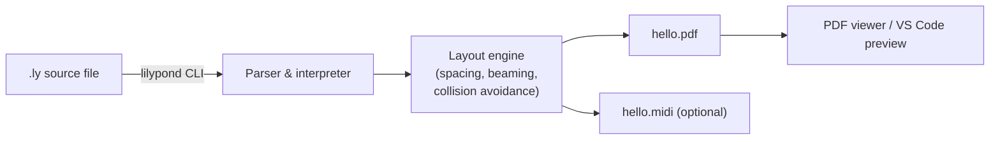

LilyPond is to sheet music what LaTeX is to documents: a text-based engraving system that produces beautifully typeset output from a plain `.ly` source file. This post covers what it is, how to install it on Ubuntu, and how to compile a first score.

## Table of contents

## What is LilyPond?

LilyPond is a free, open-source **music engraving program**. You write notes, rhythms, dynamics, and markup in a `.ly` text file, then compile it into a PDF, PNG, or SVG score.

Key characteristics:

- 📝 **Text-based input** — `{ c'4 d' e' f' }` renders four quarter notes.
- 🎼 **High-quality output** — default engraving rivals professionally typeset scores: careful spacing, slur shapes, beaming, automatic collision avoidance.
- 🔁 **Scriptable & reproducible** — scores diff cleanly in git, can be generated programmatically, and integrate with build systems.
- 🧩 **Extensible** — written largely in C++ and Scheme (GUILE); the Scheme layer lets you customize almost anything.

The mental model:

| Domain | WYSIWYG | Text-based |
| --- | --- | --- |
| Documents | Word, Pages | LaTeX |
| Music notation | Sibelius, MuseScore, Dorico | **LilyPond** |

WYSIWYG tools win on casual entry speed; LilyPond wins on reproducibility, version control, and typographic quality.

## Is it really a GNU project?

Yes — LilyPond is an official GNU package, listed in the GNU software directory.

- Started in **1996** by Han-Wen Nienhuys and Jan Nieuwenhuizen.
- Joined GNU shortly after.
- Licensed under **GPLv3**.
- Source hosted at `gitlab.com/lilypond/lilypond`.

In practice, "GNU" status mostly means it follows GNU coding/licensing standards and is endorsed by the FSF. Day-to-day, it operates like any open-source project with its own maintainers and release cadence.

## Installing on Ubuntu

There are two reasonable paths.

### Option 1: apt (easy, but older)

```bash
sudo apt update
sudo apt install lilypond
```

Ubuntu's repos typically lag a major version or two behind upstream. Fine for learning or simple scores.

### Option 2: Official binary (latest)

Download the self-contained tarball from the [LilyPond download page][lilypond-download].

```bash
tar -xf lilypond-<version>-linux-x86_64.tar.gz
```

Then run `~/lilypond-<version>/bin/lilypond` directly, or add that `bin/` directory to your `PATH`.

### Recommendation

Start with `apt`. Switch to the official binary only if you hit a missing feature or a bug fixed upstream.

### Optional companions

- `sudo apt install frescobaldi` — a dedicated LilyPond editor with live preview.
- VS Code with the [vscode-pdf][vscode-pdf] extension and a LilyPond extension (e.g. `lhl2617.vslilypond`) for an integrated workflow.

## Verifying the install

```bash
lilypond --version
```

Expected output (apt on a recent Ubuntu):

```
GNU LilyPond 2.24.3 (running Guile 2.2)
Copyright (c) 1996--2023 by
  Han-Wen Nienhuys <hanwen@xs4all.nl>
  Jan Nieuwenhuizen <janneke@gnu.org>
  and others.
```

`2.24.x` is a recent stable release — perfectly fine for general use.

## Hello, World

Save this as `hello.ly`:

```lilypond
\version "2.24.0"

\header {
  title = "Hello, World!"
  composer = "LilyPond test"
}

\relative c' {
  c4 d e f | g a b c | c b a g | f e d c \bar "|."
}
```

What each piece does:

- `\version` — declares the syntax version. LilyPond uses this to migrate older files via `convert-ly`.
- `\header { ... }` — metadata that drives the title block on the score.
- `\relative c' { ... }` — note entry mode where each pitch is interpreted as the closest octave to the previous one (starting near middle C).
- `c4 d e f` — four quarter notes (the `4` sets the duration; subsequent notes inherit it).
- `|` — bar checks, optional but catch rhythm errors at compile time.
- `\bar "|."` — final barline.

## Compile to PDF

```bash
lilypond hello.ly
```

Sample output:

```
Processing `hello.ly'
Parsing...
Interpreting music...
Preprocessing graphical objects...
Finding the ideal number of pages...
Fitting music on 1 page...
Drawing systems...
Converting to `hello.pdf'...
Success: compilation successfully completed
```

You'll get `hello.pdf` (~44 KB) in the same directory. Open it with any PDF viewer:

```bash
xdg-open hello.pdf
```

Adding a `\midi { }` block alongside `\layout { }` would also emit `hello.midi` for audio playback.

## End-to-end flow



## Viewing the PDF in VS Code

VS Code has no native PDF viewer, so you need an extension.

### vscode-pdf (general purpose)

The most popular option:

```bash
code --install-extension tomoki1207.pdf
```

Click any `.pdf` file in the explorer — it opens in an editor tab and **auto-refreshes** when the file changes on disk. So re-running `lilypond hello.ly` instantly updates the preview.

### LilyPond-specific extension

For tight integration (compile + preview in one step):

```bash
code --install-extension lhl2617.vslilypond
```

Provides syntax highlighting, compile commands, and preview shortcuts.

### Recommended combo

`vscode-pdf` for the viewer + `vslilypond` for editing support gives a workflow close to Frescobaldi but inside VS Code.

## Why text-based engraving matters

A few practical wins that are hard to get from WYSIWYG tools:

- ✅ **Diffable history** — `git diff` on a score shows musically meaningful changes.
- ✅ **Reproducible builds** — same input + same version = byte-identical PDF.
- ✅ **Programmatic generation** — scripts can produce hundreds of exercises, transposed parts, or generative compositions.
- ✅ **Long-term archival** — plain text outlives proprietary file formats.

The trade-off is the learning curve: LilyPond's syntax must be learned, and quick edits aren't as fast as drag-and-drop. For studio work or one-off arrangements, that's a real cost. For teaching material, hymnals, exercise books, or any score you'll maintain over years — it pays off quickly.

## Further reading

- [LilyPond official site][lilypond-site]
- [LilyPond Learning Manual][lilypond-learning] — the recommended starting point
- [LilyPond Notation Reference][lilypond-notation] — exhaustive syntax reference
- [Frescobaldi editor][frescobaldi]

[lilypond-site]: https://lilypond.org/
[lilypond-download]: https://lilypond.org/download.html
[lilypond-learning]: https://lilypond.org/doc/v2.24/Documentation/learning/index.html
[lilypond-notation]: https://lilypond.org/doc/v2.24/Documentation/notation/index.html
[frescobaldi]: https://www.frescobaldi.org/
[vscode-pdf]: https://marketplace.visualstudio.com/items?itemName=tomoki1207.pdf
