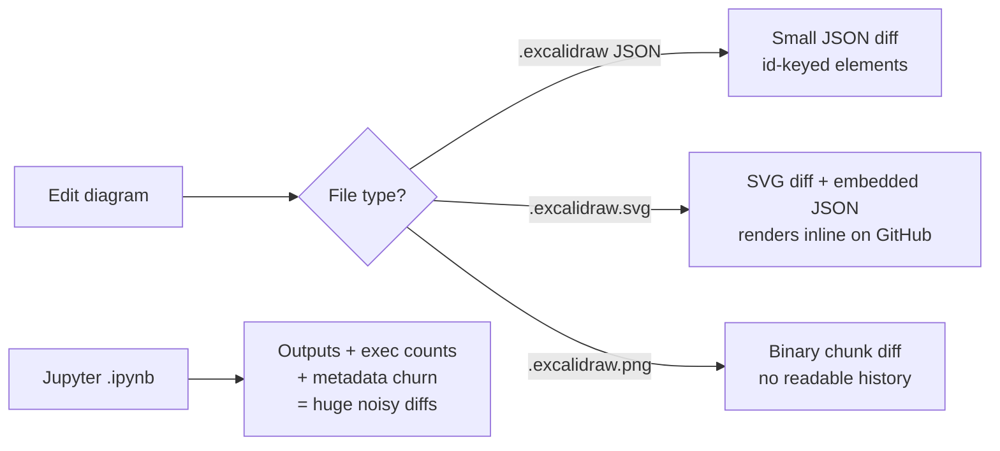

Excalidraw is the hand-drawn-style whiteboarding tool at [excalidraw.com](https://excalidraw.com) — open source, browser-first, popular for architecture sketches and tutorial illustrations. The rough aesthetic signals "this is a sketch, not a final spec," which is why it shows up in so many engineering blogs.

A reasonable question once you start using it for serious work: **do you commit the files to git, or treat them like binary artifacts?** The short answer is yes, commit them — but the format you commit matters.

## The file format

`.excalidraw` files are plain UTF-8 JSON. You can open one in any editor, diff it in git, and hand-edit it if you really want to:

```json
{
  "type": "excalidraw",
  "version": 2,
  "source": "https://excalidraw.com",
  "elements": [ /* shapes, arrows, text, etc. */ ],
  "appState": { /* view settings */ },
  "files": { /* embedded images, base64 */ }
}
```

Two related formats wrap that JSON:

| Format | Wrapper | Re-editable? | Renders in GitHub? |
|---|---|---|---|
| `.excalidraw` | raw JSON | ✅ | ❌ |
| `.excalidraw.svg` | SVG with JSON in a metadata element | ✅ | ✅ |
| `.excalidraw.png` | PNG with JSON in a `tEXt` chunk | ✅ | ✅ as image |

So the native format is text. Only the `.png` variant is binary, and even then the scene data is preserved — you can drag the PNG back into Excalidraw and keep editing.

## "Isn't this like Jupyter?"

Both are JSON, so the worry is reasonable: Jupyter notebooks are also JSON, and they are notoriously painful in git. The good news is Excalidraw avoids almost every reason Jupyter is painful.

**Why Jupyter hurts in git**

- Cells store **outputs** alongside code. Re-running a notebook rewrites base64-encoded images, execution counts, and stderr text — a one-line code change can show as a 2,000-line diff full of binary-ish noise.
- **Execution counters** (`"execution_count": 7`) bump on every run.
- **Metadata churn**: kernel info, trusted flags, and widget state mutate on open/save.

**Why Excalidraw is mostly fine**

- No execution model. The file holds only what you drew. Open and save without changes ≈ identical bytes.
- Elements have stable `id`s and a per-element `version` counter that increments only on real edits, so diffs roughly match what changed.
- Embedded images live in a separate `files` dict keyed by hash, so reusing an image doesn't re-encode it.

**Where Excalidraw still bites**

- **Element ordering** in the array shuffles when you change z-index, producing diffs that look bigger than the visual change.
- **`appState`** stores viewport, zoom, and scroll, which mutate constantly. Many people gitignore or strip this field.
- **Pasted screenshots** become base64 blobs and inflate the file. Prefer linking external images.
- `version` and `versionNonce` add line noise on every edit — still vastly less than Jupyter outputs.



## The modern default

The rough consensus across docs sites, design-system repos, and engineering blogs:

| Use case | What to commit | Why |
|---|---|---|
| Diagram displayed in a README, docs site, or blog | `.excalidraw.svg` | Renders inline on GitHub/GitLab, still re-editable, text-diffable |
| Source-of-truth diagram you'll keep editing | `.excalidraw` (JSON) | Smallest, cleanest diffs, no SVG render layer to drift |
| Quick throwaway sketch | don't commit | Use the public app and export when needed |
| Diagrams with pasted screenshots | reconsider | Base64 blobs bloat the repo — link external images |

Things to avoid:

- ❌ Committing `.excalidraw.png` to track edits. Git treats it as binary; you lose diff history.
- ❌ Committing both `.excalidraw` and an exported image of the same diagram without a build step keeping them in sync — they will drift.

## Practical pattern for a static-site blog

For a Jekyll/Hugo/Astro-style blog, the common pattern:

- [ ] Save the diagram as `diagram.excalidraw.svg` next to the post.
- [ ] Reference it like any other image: ``.
- [ ] When you need to edit, drag the SVG back into [excalidraw.com](https://excalidraw.com) — it reopens with every element intact.

That gives you one file that is simultaneously the rendered image *and* the editable source, with sensible git diffs along the way.

## Takeaway

Excalidraw files are git-manageable. Treat them like source files, not like notebook artifacts. The JSON-with-execution-state problems that make Jupyter awkward simply don't apply here — there's no runtime, no outputs, no kernel metadata, just shapes you drew.
