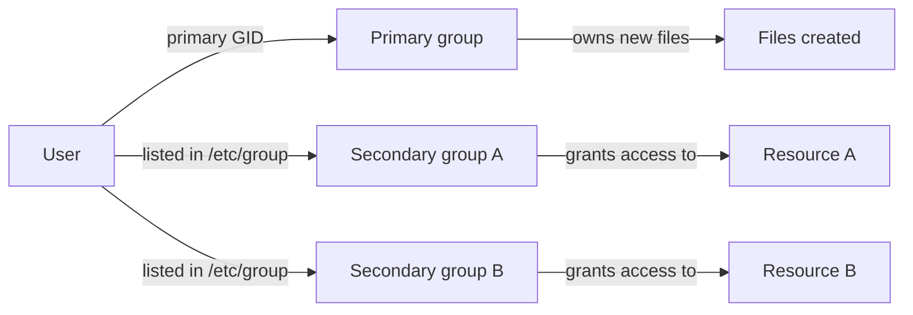

A short tour of how Linux groups work in practice, anchored on three things that come up constantly: reading `id`, the `docker` group, and the `wireshark` group. The latter two follow the same pattern — a package creates a group, hands it a privileged resource, and leaves it to you to add users.

## Primary vs. secondary groups

Every Linux user has:

- **One primary group** — used as the default group of files the user creates.
- **Zero or more secondary (supplementary) groups** — additional memberships that grant access to specific resources.

The relevant files:

| File | Purpose |
|---|---|
| `/etc/passwd` | user → primary GID mapping |
| `/etc/group` | group definitions and secondary members |
| `/etc/gshadow` | group passwords/admins (rarely used) |



## Reading `id` output

A typical Ubuntu desktop user produces something like this:

```
uid=1000(alice) gid=1000(alice) groups=1000(alice),4(adm),24(cdrom),27(sudo),30(dip),46(plugdev),101(lxd),990(docker)
```

Field by field:

- **`uid=1000(alice)`** — user ID 1000. Regular users start at 1000 on Ubuntu; below that is reserved for system accounts.
- **`gid=1000(alice)`** — primary group, also named `alice`. Ubuntu uses *user private groups*: each user gets a same-named, same-numbered group. New files are owned by `alice:alice`.
- **`groups=...`** — full list of memberships (primary appears here too, for completeness).

What the common groups grant:

| Group | GID | What it grants |
|---|---|---|
| `adm` | 4 | Read access to `/var/log/*` — log inspection without root |
| `cdrom` | 24 | Optical drive access (`/dev/sr0`) |
| `sudo` | 27 | Permission to run `sudo` — the big one |
| `dip` | 30 | Dial-up / PPP / serial modem (legacy) |
| `plugdev` | 46 | Mount removable devices |
| `lxd` | 101 | Manage LXD containers — root-equivalent on the host |
| `docker` | 990 | Talk to the Docker daemon — also root-equivalent |

> ⚠️ `sudo`, `lxd`, and `docker` each grant root-equivalent power. On a personal machine that's normal; on shared/production systems, treat each as a sensitive privilege.

## Useful commands

```bash
id [user]                  # UID, primary GID, all groups
groups [user]              # group memberships
getent group <name>        # look up a group (works with LDAP/SSSD too)
useradd -g <prim> -G <s1,s2> user    # create user with groups
usermod -aG <group> user   # APPEND to a secondary group
gpasswd -d user group      # remove user from group
newgrp <group>             # subshell with a different primary group
chgrp <group> file         # change file's group
chmod g+s dir              # setgid on directory — new files inherit dir's group
```

The classic footgun: `usermod -G foo bob` *replaces* all of bob's secondary groups with just `foo`, silently wiping `sudo` and friends. Always use `-aG` (append).

Group changes don't apply to existing logins. Either run `newgrp <name>` for the current shell, or log out and back in (cleaner — applies everywhere).

## The "package creates a group" pattern

A recurring pattern in Linux: a package needs to grant access to a privileged resource (a daemon socket, a raw-network helper, a device node) to non-root users. The standard recipe:

1. Create a dedicated group at install time.
2. Make the privileged resource owned by `root:thatgroup` with group access (or use Linux capabilities).
3. **Don't** auto-add anyone — let the admin decide who joins.

Examples in the wild:

| Tool | Group | Grants |
|---|---|---|
| Docker | `docker` | Root-equivalent (daemon socket) |
| Wireshark | `wireshark` | Packet capture via `dumpcap` |
| LXD | `lxd` | Root-equivalent (container manager) |
| KVM | `kvm` | `/dev/kvm` access for VMs |
| libvirt | `libvirt` | Manage VMs via libvirtd |
| PulseAudio | `pulse-access` | Audio server access |

## Case study: the `docker` group

Installing Docker (`docker-ce` or `docker.io`):

- Runs `groupadd docker` in its post-install script.
- Sets the daemon socket `/var/run/docker.sock` to `root:docker` mode `660`.
- **Does not** add any user to the group.

To opt in:

```bash
sudo usermod -aG docker $USER
newgrp docker          # or log out / log back in
docker ps              # works without sudo now
```

Verify:

```bash
getent group docker
# docker:x:990:alice    ← shows GID and members
```

### Why opting in is a security decision

Membership in `docker` is *equivalent to root*. The classic demonstration:

```bash
docker run -v /:/host -it alpine chroot /host
# you're now root on the host filesystem
```

That's why the Docker package leaves the membership decision to you. If you want to avoid this trade-off entirely:

- **Rootless Docker** — the daemon runs as your user; no `docker` group, no root-equivalence.
- **Podman** — no daemon at all, no group, no problem. (Often cited as a reason to prefer Podman.)

## Case study: the `wireshark` group

Same pattern, slightly different mechanism. On Debian/Ubuntu, installing `wireshark` or `tshark` triggers a debconf prompt:

> *Should non-superusers be able to capture packets?*

If you answer **yes**:

- The `wireshark` group is created (often with a system GID like `105`).
- The capture helper `/usr/bin/dumpcap` is given either:
  - `root:wireshark` mode `4750` (setuid), or
  - Linux capabilities `cap_net_raw,cap_net_admin=eip` (more modern and safer).
- `tshark` and the Wireshark GUI shell out to `dumpcap` — only that small helper holds the privilege.

You still have to add yourself:

```bash
sudo usermod -aG wireshark $USER
newgrp wireshark
tshark -D              # list interfaces — should work without sudo
```

To revisit the install-time choice later:

```bash
sudo dpkg-reconfigure wireshark-common
```

The trade-off mirrors Docker: membership = ability to sniff *all* traffic on every interface, including credentials on unencrypted protocols and DNS queries. On a shared machine, treat it accordingly.

## Checking whether a group exists

Several ways, pick whichever sticks:

```bash
# Recommended — works with LDAP/NIS too
getent group wireshark

# Local-only
grep '^wireshark:' /etc/group

# Existence test
getent group wireshark && echo exists || echo missing

# Are *you* in it?
id -nG | tr ' ' '\n' | grep -x wireshark
```

### Reading the output

```
wireshark:x:105:
```

Format: `name:password:GID:comma-separated-members`.

- **`wireshark`** — group name.
- **`x`** — placeholder for group password (essentially never used; ignore).
- **`105`** — GID. Below 1000 = system group (created by a package, not a human admin).
- **(empty after last colon)** — no members. The group exists, but nobody is in it yet.

Three possible outcomes when you query a group:

- ✅ Exists with members: `wireshark:x:105:alice,bob`
- ✅ Exists, empty: `wireshark:x:105:`
- ❌ Doesn't exist: nothing printed, exit code 2 (`echo $?` to confirm)

## Adding yourself to a group — the canonical recipe

```bash
sudo usermod -aG wireshark $USER
newgrp wireshark
```

- `-a` is **mandatory** with `-G` for an existing user, or you'll wipe out `sudo`, `docker`, etc.
- `$USER` saves typing your username and survives copy-paste between machines.
- `newgrp` activates membership in the current shell. A full logout/login is cleaner.

Then verify:

```bash
getent group wireshark    # your username should appear at the end
id                         # confirm new GID is in the list
tshark -D                  # actually exercise the privilege
```

## Mental model summary

- ✅ A group is a label that grants access to a resource — files, sockets, devices, or capabilities.
- ✅ "Install creates the group, you opt in" is the standard pattern for privileged tools.
- ⚠️ `docker`, `lxd`, `wireshark` are not just convenience groups — they're privilege boundaries. Joining them changes your security posture.
- ⚠️ Group changes don't apply to existing logins. `newgrp` or re-login.
- ⚠️ `usermod -G` without `-a` deletes group memberships. Always `-aG`.
