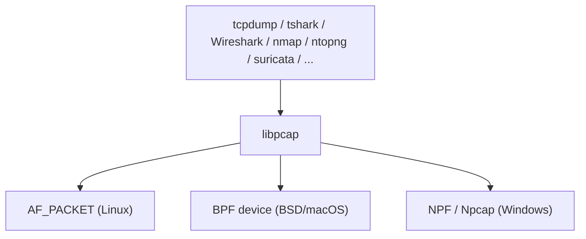
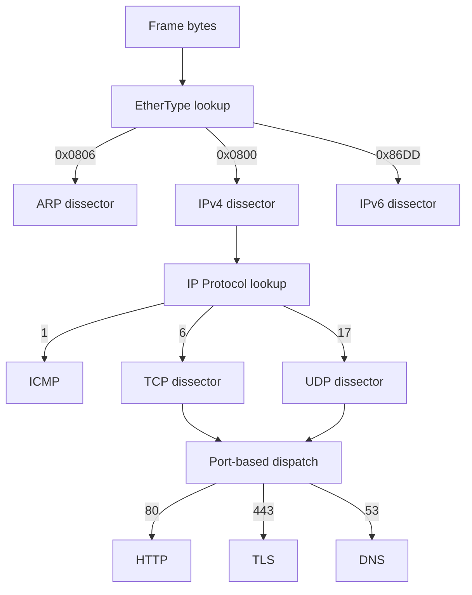
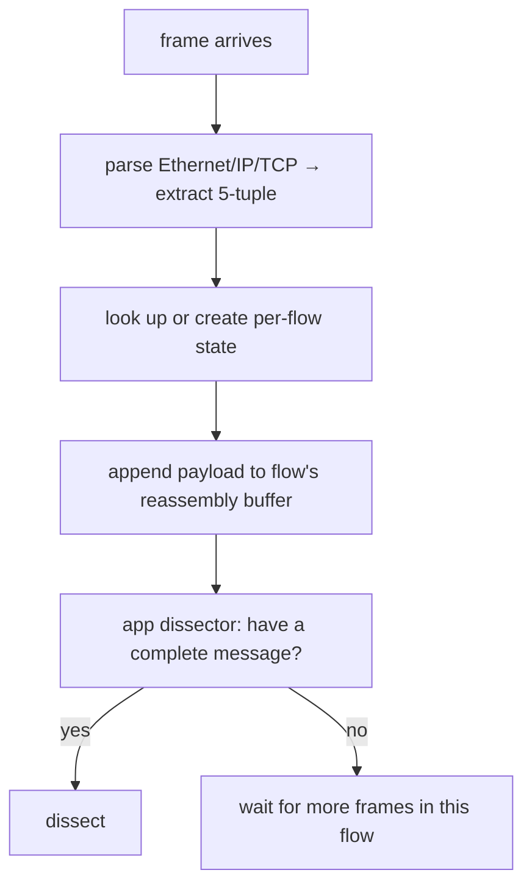

If you've ever opened Wireshark, clicked a packet, and seen a clean tree of `Ethernet → IP → TCP → TLS → HTTP/2 → JSON`, you've watched one of the most thorough protocol parsers ever written do its job. The simplicity of that tree hides an enormous amount of plumbing: a kernel API, a portable capture library, a dispatch tree of next-protocol fields, per-flow reassembly, decompression, decryption, and ~3000 protocol dissectors.

This post walks the stack bottom-up, the way the bytes actually flow.

## The cast of characters

Three tools come up constantly. They overlap, but each fits a different niche:

| Tool | Role | Install size | Decoding depth |
|---|---|---|---|
| **tcpdump** | lightweight CLI sniffer | ~1 MB | shallow (Eth/IP/TCP/UDP, some app) |
| **tshark** | Wireshark's CLI | ~100+ MB | deep (full dissector library) |
| **Wireshark GUI** | same engine + UI | hundreds of MB | deep, plus interactive views |

All three read and write the same `.pcap` / `.pcapng` format, so you can capture with one and analyze with another. The most ergonomic workflow on a server:

```bash
# 1. capture lightly on the server
sudo tcpdump -i eth0 -w /tmp/cap.pcap 'port 443'

# 2. copy to laptop
scp server:/tmp/cap.pcap .

# 3. open in Wireshark GUI for rich analysis
```

On Ubuntu Server, you'd typically install `tshark` rather than the full GUI:

```bash
sudo apt install tshark
sudo usermod -aG wireshark $USER   # capture without sudo after re-login
```

## Layer 0: the kernel exposes the wire

Normally the kernel demultiplexes incoming packets to whichever socket owns them. Capture needs the opposite: **give me a copy of every frame on this interface**. On Linux that's the `AF_PACKET` socket family:

```c
int fd = socket(AF_PACKET, SOCK_RAW, htons(ETH_P_ALL));
```

Three features layer on top:

- **Promiscuous mode** — `ioctl(SIOCSIFFLAGS, IFF_PROMISC)` tells the NIC to deliver frames not addressed to its MAC. This is the "promiscuous" checkbox in Wireshark.
- **BPF (Berkeley Packet Filter)** — a tiny in-kernel VM. A filter like `tcp port 443` is compiled to BPF bytecode and attached with `setsockopt(SO_ATTACH_FILTER)`. Non-matching packets get dropped *before* being copied to userspace, which is why capture filters are far cheaper than display filters.
- **`PACKET_MMAP` / `TPACKET_V3`** — a ring buffer mapped between kernel and userspace, so the kernel can dump packets in without a syscall per packet. Required for high-rate (10+ Gbps) capture.

Reading every packet is privileged. You get the capability via root, the `CAP_NET_RAW` / `CAP_NET_ADMIN` capabilities on the binary (`setcap cap_net_raw,cap_net_admin=eip /usr/bin/dumpcap`), or membership in a trusted group (the Ubuntu `wireshark` group pattern).

## Layer 1: libpcap — the portable wrapper

You almost never code against `AF_PACKET` directly. **libpcap** wraps it and gives a uniform API across operating systems:



libpcap also defines the `.pcap` file format, which is why captures are portable across platforms.

**What level of data does libpcap actually deliver?** Lower than most people expect: it hands you **link-layer frames** — raw bytes starting at layer 2.

```
┌──────────────┬─────────────┬──────────────┬─────────┬─────┐
│ Ethernet hdr │   IP hdr    │   TCP hdr    │ payload │ FCS │
│   14 bytes   │  20+ bytes  │  20+ bytes   │   ...   │  *  │
└──────────────┴─────────────┴──────────────┴─────────┴─────┘
└─────────────────────────── what libpcap gives you ────────┘
```

(The Ethernet FCS trailer is usually stripped by the NIC.)

A "packet" from libpcap's view is a frame: destination MAC, source MAC, ethertype, then everything above. Nothing has been parsed — it's a byte buffer plus metadata (timestamp, captured length, original length).

Why layer 2? Two reasons:

1. **It's the lowest layer the kernel sees.** No special hardware needed.
2. **It preserves everything.** ARP, VLAN tags, MPLS, malformed packets, non-IP protocols — all visible. The consumer decides how deep to decode.

Each capture is tagged with a **link-layer type** (`DLT_*`) so consumers know how to start parsing:

| DLT type | First bytes are |
|---|---|
| `DLT_EN10MB` | Ethernet header (most common) |
| `DLT_LINUX_SLL` | Linux "cooked" header (capturing on `any`) |
| `DLT_RAW` | Straight to IP header (PPP, some tunnels) |
| `DLT_IEEE802_11` | 802.11 wifi frames (with monitor mode) |
| `DLT_NULL` / `DLT_LOOP` | Loopback |

The libpcap callback interface is deliberately thin:

```c
void handler(u_char *user,
             const struct pcap_pkthdr *h,  // timestamp + lengths
             const u_char *bytes)           // ← raw frame starts here
{
    // bytes[0..13]  = Ethernet header (if DLT_EN10MB)
    // bytes[14..]   = IP header
    // bytes[14+ihl] = TCP/UDP header
    // ...
}
```

libpcap itself **doesn't know what TCP is**. Its value is portability and filtering, not protocol knowledge.

## Layer 2: identifying what's inside a frame

Given raw bytes, how does a tool decide it's looking at ICMP versus TCP versus UDP versus HTTP? The answer is much more elegant than "try every decoder and see which works": **protocols are self-describing**. Almost every header includes a "next protocol" field:

```
Ethernet header
  └─ EtherType field (2 bytes)
      0x0800 → IPv4
      0x86DD → IPv6
      0x0806 → ARP
      0x8100 → VLAN tag (then another EtherType inside)

IPv4 header
  └─ Protocol field (1 byte)
      1   → ICMP
      6   → TCP
      17  → UDP
      47  → GRE
      50  → ESP (IPsec)
      132 → SCTP

TCP/UDP header
  └─ Port number (2 bytes)
      no formal "next protocol" field — but ports are conventional:
      80   → HTTP
      443  → HTTPS (TLS)
      53   → DNS
      22   → SSH
```

Dissection becomes a chain of table lookups:



These numbers aren't arbitrary — they're maintained by IANA registries (Ethertypes, IP protocol numbers, TCP/UDP ports).

**Where it does get heuristic: ports.** Port 80 is *conventional* HTTP, but nothing forces it. SSH on port 80 is legal. So Wireshark's TCP/UDP dissector first tries the registered dissector for the port; if parsing fails or looks wrong, it falls back to **heuristic dissectors** that peek at the first few bytes:

- HTTP: starts with `GET `, `POST `, `HTTP/1.`?
- TLS: byte 0 in `{0x14, 0x15, 0x16, 0x17}` and bytes 1–2 a plausible TLS version?
- SSH: starts with `SSH-`?

So the trial-and-error intuition is right, but only at this **last** step (application layer). Everything below — Ethernet → IP → TCP — is fully deterministic.

## Layer 3: tcpdump vs Wireshark — depth, not breadth

A common framing is "tcpdump shows raw bytes; Wireshark decodes high-level protocols." That's nearly right, but worth sharpening:

- **tcpdump does decode**, just shallowly. It parses Ethernet, ARP, IPv4/IPv6, ICMP, TCP, UDP fully, plus a handful of app protocols (DNS, DHCP, NTP, basic HTTP request lines with `-A`). Beyond that, it just shows bytes (`-X`).
- **Wireshark/tshark goes deep** because its dissector library understands structure inside payloads — TLS records → handshake messages → individual extensions, HTTP/2 frames reassembled across TCP segments, Kerberos tickets, SMB operations, QUIC streams, gRPC, and so on.

The same TLS ClientHello, three views:

**tcpdump default:**
```
10:23:45.123 IP 10.0.0.5.52344 > 1.2.3.4.443: Flags [P.], seq 1:518, length 517
```

**tcpdump -X (hex):**
```
0x0000:  4500 0245 ... 1603 0102 0001 0001 fc03 03...
```

**tshark with TLS dissector:**
```
TLSv1.3 Record Layer: Handshake Protocol: Client Hello
    Version: TLS 1.2 (0x0303)
    Extension: server_name (len=19)
        Server Name: example.com
    Extension: supported_versions
        Supported Version: TLS 1.3
```

Same bytes — only one tool knows what they *mean*.

A small but important nuance: nothing was "recovered." The bytes are all there in the frame; userspace tools just **interpret** structure on top of them. The IP header isn't recovered, it's "the bytes at offset 14, interpreted per RFC 791."

## Layer 4: encryption is the hard ceiling

The "interpret bytes per spec" model has one immovable limit: **encryption**.

- TCP/UDP/IP headers — always visible (not encrypted).
- TLS handshake metadata — visible (SNI, cipher suites, certificates).
- TLS application data — opaque ciphertext, *unless* you provide keys (e.g., `SSLKEYLOGFILE` from a browser, or a server private key for old RSA handshakes).
- HTTP inside TLS — only with keys.

This is why network engineers love unencrypted protocols when debugging: dissectors can show everything. With TLS or QUIC, you see only what the protocol leaves in the clear.

## Layer 5: an HTTP message is rarely "a packet"

Network layers don't share a sense of "message." Each has its own unit:

| Layer | Unit | Size constraint |
|---|---|---|
| Ethernet | frame | ≤ ~1500 bytes payload (MTU) |
| IP | packet | up to MTU; bigger gets fragmented |
| TCP | segment | sized to fit MTU after headers (~1460 MSS) |
| HTTP | request/response | arbitrary — KB to GB |

A 50 KB HTTP response arrives as ~35 TCP segments, each in its own IP packet, each in its own Ethernet frame. The "HTTP message" exists only after you concatenate all those payloads back together.

Two distinct splittings happen:

1. **TCP segmentation (common).** TCP is a byte stream; the sender's TCP layer chops `write()` data into MSS chunks. The receiver reassembles in order.
2. **IP fragmentation (rare today).** Routers split IP packets too big for the next link's MTU. Modern stacks largely avoid this via Path MTU Discovery.

Wireshark dissectors above TCP must do **reassembly**:

```
TCP segments arrive:
  seg 1: "GET /index.html HTTP/1.1\r\nHost: example."
  seg 2: "com\r\nUser-Agent: curl/8.0\r\n\r\n"

HTTP dissector says: "I don't have a complete request yet,
                     need more bytes" → tells TCP to keep buffering.

After seg 2: HTTP dissector now sees the full request,
             dissects it as one logical message.
```

This is the *"Allow subdissector to reassemble TCP streams"* option (on by default). With it on, you see one cleanly decoded HTTP request even though it spanned multiple segments. Same machinery handles TLS records, SMB, DNS-over-TCP, and any length-prefixed protocol.

**Follow Stream** in the GUI concatenates *all* bytes of one TCP connection in both directions into two readable streams — the cleanest way to read an HTTP exchange or Telnet session, reconstructed from however many packets it took.

Strictly, there's **no such thing as an HTTP packet** — only TCP segments carrying HTTP bytes. Wireshark sometimes labels a packet `[TCP segment of a reassembled PDU]` to say "this segment is part of a larger HTTP message; the dissection happens on the segment that completes it."

Edge cases worth knowing:

- **Telnet** — each keystroke can be its own tiny TCP segment. Follow Stream is essential.
- **TLS** — a single record can span multiple segments, *and* multiple records can fit in one segment.
- **HTTP/2** — multiple streams multiplexed in one TCP connection; reassembly is per-stream, not just per-connection.
- **QUIC** — runs over UDP, so no TCP segmentation, but has its own packet/frame structure with similar reassembly concerns.

## Layer 6: the wire is a mixed stream — un-mixing it

libpcap delivers frames in **arrival order** with no grouping. On a busy machine, a 100 ms window might contain:

```
frame 1: browser → google.com  (TCP 443)
frame 2: ssh client → server   (TCP 22)
frame 3: DNS query             (UDP 53)
frame 4: google.com → browser  (TCP 443)
frame 5: video call            (UDP 50000)
frame 6: ssh server → client   (TCP 22)
frame 7: browser → google.com  (TCP 443)   ← different connection from #1
```

Wireshark's first real job is to sort this back into coherent **conversations**, identified by the **5-tuple**:

```
(protocol, src IP, src port, dst IP, dst port)
```

The OS guarantees no two simultaneous TCP/UDP connections share a 5-tuple — that's how the kernel itself routes incoming packets. Wireshark builds a hash table:

```
{
  (TCP, 10.0.0.5:52344, 142.250.80.46:443):  conversation A,
  (TCP, 10.0.0.5:52345, 142.250.80.46:443):  conversation B,
  (TCP, 10.0.0.5:48222, 1.2.3.4:22):         ssh session,
  (UDP, 10.0.0.5:51234, 8.8.8.8:53):         DNS query 1,
  ...
}
```

Reassembly only works **per-flow** — you can't concatenate bytes across different TCP connections. So the real dissector pipeline is:



A 1000-frame capture with 50 connections = 50 independent reassembly contexts.

This 5-tuple bookkeeping shows up in the UI as:

- **Statistics → Conversations** — table of every flow.
- **Statistics → Endpoints** — same data grouped by single IP.
- **Follow → TCP Stream** — picks one 5-tuple, shows only its bytes.
- **Filter `tcp.stream eq 5`** — Wireshark assigns each TCP connection an integer index.

Edge cases stretch the simple model:

- **Connection reuse** — a new SYN starts a new `tcp.stream` index even if the tuple matches.
- **NAT/proxies** — captures at a NAT box show translated tuples that don't match endpoint views.
- **ICMP** — no ports; grouped by identifier+sequence.
- **QUIC** — UDP 5-tuple is unstable (connection migration), so QUIC uses a **Connection ID** in its own header; Wireshark tracks by Connection ID.
- **HTTP/2** — one TCP connection multiplexes many requests; sub-identifier `http2.streamid` isolates them.

## Putting it all together: what one HTTP response actually costs

When Wireshark displays a single HTTP/2 JSON response cleanly, here's the chain it just performed:

1. Read frame from pcap (libpcap)
2. Parse Ethernet header → EtherType lookup → IPv4
3. Parse IPv4 header → Protocol lookup → TCP
4. Compute 5-tuple, find/create flow state
5. Track TCP sequence numbers; detect retransmits, out-of-order, duplicate ACKs, gaps
6. Reorder segments by sequence number
7. Append payload to per-flow reassembly buffer
8. Port 443 → TLS dissector
9. Parse TLS records (may span segments)
10. If keys available: decrypt → plaintext
11. Plaintext → HTTP/2 dissector
12. Parse HTTP/2 frames, demultiplex by stream ID
13. Reassemble HEADERS + DATA frames per stream
14. HPACK-decompress headers (stateful — depends on every prior HEADERS frame in the connection)
15. If `Content-Encoding: gzip`, decompress body
16. If `Content-Type: application/json`, JSON dissector
17. Render as tree in the UI

Every step is **stateful** and depends on packets that came earlier — sometimes hundreds of frames earlier. HPACK in particular is unforgiving: miss one HEADERS frame and every subsequent header decode in that connection is wrong.

The capacity behind this:

- ~3000 protocol dissectors in `epan/dissectors/`.
- Hundreds of thousands of lines of dissector C code.
- Dedicated subsystems for reassembly (`epan/reassemble.c`), conversation tracking (`epan/conversation.c`), and a display-filter language with its own parser, type system, and bytecode compiler.
- Decryption integrated for TLS, IPsec, WireGuard, Kerberos, 802.11.

Three useful corollaries fall out of the model:

1. **The same pcap can be analyzed at any depth** — the bytes were always there.
2. **A bigger tool isn't capturing more, just interpreting more.** tcpdump and Wireshark capturing the same interface get identical bytes.
3. **Dissection can be wrong; capture can't.** A dissector bug doesn't change the bytes — re-dissect later with a fixed Wireshark.

## A note on the project itself

Wireshark is fully open source (GPL-2.0-or-later), hosted on GitLab. It started in **1998** as **Ethereal**, written by Gerald Combs because commercial protocol analyzers cost thousands per seat. A 2006 trademark dispute forced a rename to **Wireshark**; almost the entire community moved with the fork. Riverbed sponsored development from 2010, and in 2022 the project transferred to the newly formed **Wireshark Foundation** (a US nonprofit), with Sysdig as the primary corporate sponsor.

Combs is still the project lead nearly three decades in — one of the longest tenures of any active open-source maintainer. The contributor list runs to thousands. Vendors regularly submit dissectors for their own protocols (Cisco, Microsoft, Ericsson, Juniper, Nokia, …) because every customer's network engineers need to debug their gear.

The closely related ecosystem:

- **libpcap / tcpdump** — `tcpdump.org`, The Tcpdump Group; Guy Harris bridges both projects.
- **Npcap** — Windows capture library, by the Nmap project.
- **dumpcap** — Wireshark's privileged capture helper.
- **editcap, mergecap, capinfos, text2pcap** — pcap-manipulation utilities.

## The mental model, finished

A clean way to hold all this in your head:

> The kernel exposes a tap point that copies every layer-2 frame to userspace. libpcap delivers those frames as raw bytes. tcpdump applies shallow built-in parsers; Wireshark runs **a deeply stateful, multi-thousand-protocol interpreter** that demultiplexes flows by 5-tuple, reassembles bytes across packets, decrypts where keys are available, and dissects entire application-layer conversations — presenting the result as if it were a simple tree.

Everything above the link layer in that tree is reconstruction. The bytes were always raw frames; the meaning is interpretation, all the way up.
