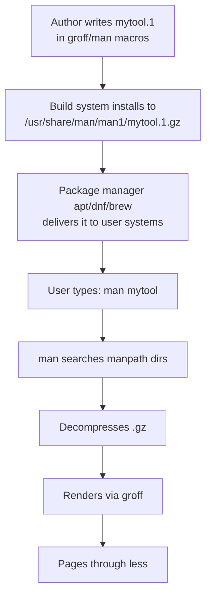

## What Is a Man Page?

A **manual page** (or "man page") is a form of software documentation in Unix-like systems, accessed via the `man` command in the terminal.

```bash
man <command>      # e.g., man ls
man 2 open         # section 2 (system calls)
man -k <keyword>   # search for pages
```

Essentially, a man page is software documentation. More precisely:

- **It's a documentation format** — a convention for structuring reference docs (NAME, SYNOPSIS, DESCRIPTION, etc.) for Unix programs, system calls, and config files.
- **It's also a delivery mechanism** — the `man` command reads files locally and renders them in the terminal, so docs ship *with* the software rather than living on a website.

So a man page is **reference documentation + a standard local viewer for it**.

## The Standard Format

`ls`, `grep`, `ssh`, and essentially all standard Unix tools follow the same man page format. It's a long-standing convention.

### Conventional sections (in order)

- **NAME** — program name + one-line description
- **SYNOPSIS** — command syntax (e.g. `ls [OPTION]... [FILE]...`)
- **DESCRIPTION** — what it does, in detail
- **OPTIONS** — every flag explained
- **EXAMPLES** — sample invocations *(optional)*
- **EXIT STATUS** — return codes *(optional)*
- **ENVIRONMENT** — env vars it reads *(optional)*
- **FILES** — config/data files it uses *(optional)*
- **SEE ALSO** — related commands
- **BUGS** / **AUTHOR** *(optional)*

### Synopsis notation

| Notation | Meaning |
|---|---|
| `[ ]` | optional |
| `...` | repeatable |
| `\|` | alternatives |
| **bold** | type literally |
| *italic* | replace with a value |

### Why so consistent?

1. **Convention** — documented in `man-pages(7)` on Linux.
2. **Tooling** — pages are written in `groff` with macro packages (`man`, `mdoc`) that *expect* these sections.
3. **Distribution policy** — Debian, for example, requires every binary in `/usr/bin` to ship a man page.

Once you learn to read one, you can read them all — that's the whole point.

## The Section Number — `ls(1)`, `printf(3)`, etc.

The number in parentheses after a command name is the **manual section**. The same name can exist in multiple sections, and the number disambiguates them.

### The 8 standard sections

| Section | Contents | Example |
|---|---|---|
| **1** | User commands (things you type in a shell) | `ls(1)`, `grep(1)` |
| **2** | System calls (kernel functions) | `open(2)`, `read(2)` |
| **3** | Library functions (C standard library, etc.) | `printf(3)`, `malloc(3)` |
| **4** | Special files / devices | `null(4)`, `tty(4)` |
| **5** | File formats and config files | `passwd(5)`, `crontab(5)` |
| **6** | Games and screensavers | (mostly historical) |
| **7** | Miscellaneous / overviews / conventions | `man-pages(7)`, `regex(7)` |
| **8** | System administration commands | `mount(8)`, `iptables(8)` |

### Real collisions

- **`printf(1)`** — the shell command vs. **`printf(3)`** — the C library function
- **`time(1)`** (shell) vs **`time(2)`** (system call) vs **`time(7)`** (overview)
- **`crontab(1)`** (the command) vs **`crontab(5)`** (the file format)

```bash
man 1 printf      # the command
man 3 printf      # the C function
man printf        # defaults to lowest-numbered section, so section 1
```

In **SEE ALSO** sections you'll constantly see things like `stat(2), lstat(2), readdir(3)` — that's telling you which section to look in. `man -k <name>` shows every section a name appears in.

## The Mental Model — One Book, Many Authors

A natural question: is `man` like a single big book that all software contributes to? Or does each tool ship its own doc independently?

**Both, in a sense.**

### At read-time, it feels like one book

When you type `man ls`, the experience is unified:
- Same format everywhere
- Same navigation (`/`, `n`, `q`)
- One index (`man -k`)
- One numbering scheme (sections 1–8)

### At write-time, each project writes its own page

Unlike a real book with one editor, **each piece of software ships its own man page**:

- `ls` → comes from **GNU coreutils**
- `grep` → comes from **GNU grep**
- `ssh` → comes from **OpenSSH**
- `git` → comes from the **Git** project

When you install software, its man pages get copied into `/usr/share/man/manN/` (where N is the section). That's how they all end up in "the same book."

```
/usr/share/man/man1/ls.1.gz       ← from coreutils
/usr/share/man/man1/grep.1.gz     ← from grep
/usr/share/man/man1/git.1.gz      ← from git
```

### Better analogy

It's not one publisher writing everything — it's more like **Wikipedia or npm**:

- A shared format and platform (the `man` system + section conventions)
- But every author writes and ships their own entry
- The system just collects them into one searchable namespace

The unified feel comes from **strong convention** (everyone follows NAME/SYNOPSIS/DESCRIPTION), **standard tooling** (everyone uses `groff`), and a **standard install location** (`/usr/share/man/`).

## How a Page Gets From Author to Your Terminal



### 1. Author writes the page

Typically as a `.1` file (for a section-1 command) using `groff`/`man` macros:

```groff
.TH MYTOOL 1 "2026-05-06" "1.0" "User Commands"
.SH NAME
mytool \- do something useful
.SH SYNOPSIS
.B mytool
[\fIOPTION\fR]... [\fIFILE\fR]...
.SH DESCRIPTION
Mytool processes files and...
```

Many modern projects write in **Markdown** or **AsciiDoc** and convert to groff via tools like `pandoc`, `ronn`, or `asciidoctor`.

### 2. Build system places it

The project's `Makefile` (or similar) does something like:

```make
install:
	install -m 644 mytool.1 $(DESTDIR)/usr/share/man/man1/mytool.1
	gzip $(DESTDIR)/usr/share/man/man1/mytool.1
```

### 3. Package manager handles it

When packaged for `apt`, `dnf`, `brew`, etc., the package metadata lists the man page as a file to install. So `apt install mytool` automatically drops the page in the right place.

### 4. `man` finds it

The `man` command searches a list of directories (the **manpath**):

```bash
manpath              # shows the search path, e.g.:
# /usr/local/share/man:/usr/share/man:...
```

When you type `man mytool`, it:
1. Searches each manpath dir for `man*/mytool.*`
2. Decompresses the `.gz`
3. Pipes it through `groff` to render
4. Pipes that through `less` (the pager)

### 5. `mandb` builds the search index

`man -k` (apropos) works because of a database:

```bash
sudo mandb         # rebuilds the index from all installed pages
```

Most distros run this automatically after package installs.

### Local install (no root needed)

```bash
mkdir -p ~/.local/share/man/man1
cp mytool.1 ~/.local/share/man/man1/
```

`man` will pick them up automatically — this path is in the default manpath.

## Where to Start Learning

Start with commands you already use — the man page makes more sense when you know what the tool does.

### Easy first reads (short, well-structured)

- [x] **`man ls`** — daily-use command; OPTIONS section is a clean list of single-letter flags.
- [x] **`man cp`** / **`man mv`** — short synopsis, clear examples of `[ ]` and `...` notation.
- [x] **`man echo`** — tiny page, good for seeing the minimum structure.
- [x] **`man cat`** — similarly small and approachable.

### Next step up (still friendly)

- [ ] **`man grep`** — longer, but OPTIONS group related flags well; EXAMPLES is genuinely useful.
- [ ] **`man mkdir`**, **`man rm`**, **`man touch`** — all short and follow the format strictly.

### Avoid at first

- ❌ `man bash` — huge (~5000 lines), overwhelming.
- ❌ `man ssh` — dense, references many other pages.
- ❌ `man find` — powerful but unusual syntax.
- ❌ `man gcc` — enormous.

### Suggested approach

```bash
man man           # explains how man itself works
man ls            # then a familiar command
man 7 man-pages   # later — the spec for how pages are structured
```

Inside `man`: `/word` searches, `n` jumps to next match, `q` quits, `h` shows help.

## Reading Man Pages in a Browser

You don't have to use the terminal. Several options:

### Online mirrors

- **man7.org** — `https://man7.org/linux/man-pages/` — Michael Kerrisk's site, the canonical Linux reference.
- **die.net** — `https://linux.die.net/man/` — older but well-indexed.
- **manpages.debian.org** — Debian's official mirror, version-specific.
- **manpages.ubuntu.com** — Ubuntu equivalent.
- **ss64.com** — reformatted, beginner-friendly versions.

### Generate HTML from your own system

```bash
man -Thtml ls > ls.html      # writes an HTML version
xdg-open ls.html             # opens in browser (Linux)
```

Or pipe through `groff` directly:

```bash
zcat /usr/share/man/man1/ls.1.gz | groff -mandoc -Thtml > ls.html
```

For learning, **man7.org** has the cleanest browser formatting — try `https://man7.org/linux/man-pages/man1/ls.1.html`.

## Why Modern Tools Skip Man Pages

A noticeable generational divide exists:

- **Traditional Unix tools** → man pages: `ls`, `grep`, `ssh`, `git`, `curl`, `vim`, `nginx`, `postgres`...
- **Modern web/app frameworks** → websites only: React, Vue, Tailwind, Next.js, FastAPI, Django, Rails, Express, Flutter...

### Why the shift?

#### 1. Audience and environment

- Unix tools are used **in the terminal** → docs in the terminal makes sense.
- React is used **while coding in an editor**, with a browser already open → website docs fit naturally.

#### 2. Man pages can't do what modern docs need

| Need | Man page | Website |
|---|---|---|
| Code snippets with syntax highlighting | poor | easy |
| Live/interactive examples | impossible | yes |
| Searchable across versions | hard | trivial |
| Diagrams, screenshots, videos | no | yes |
| Versioned (v17 vs v18 docs) | awkward | trivial |
| Community editing / PRs | possible but rare | common (GitHub-backed) |
| Analytics on what users read | no | yes |

#### 3. Distribution model

- A C tool ships **one binary + one man page** through `apt`/`brew`.
- A JS library ships through **npm**, which has no man page convention. The "install" step puts files in `node_modules/`, not `/usr/share/man/`.
- npm *technically* supports man pages via `package.json`'s `"man"` field — almost nobody uses it.

#### 4. Cross-platform reality

- Man pages are a Unix thing. Windows developers don't have `man`.
- A website works for everyone — Mac, Linux, Windows, Chromebook, phone.

#### 5. Cultural fit

- Unix culture: **"docs ship with the software, offline, uniform."**
- Modern web culture: **"docs are a product — branded, marketed, SEO'd."**

The React docs aren't just reference material — they're onboarding, marketing, and tutorials in one. A man page can't be that.

### The middle ground

Some modern tools do both:

- **`gh`** (GitHub CLI) → man pages *and* a website.
- **`docker`** → man pages + docs.docker.com.
- **`kubectl`** → has `kubectl --help` (man-page-like) plus kubernetes.io.

Many CLI tools provide `--help` / `-h` — a lightweight cousin of the man page even when no formal man page exists.

## Summary

> Man pages are for **system tools**. Websites are for **developer libraries**. The two cultures barely overlap.

The man page system is a 50+ year old answer to documentation that still works because it embodies the Unix philosophy: **uniform interfaces over fragmented ecosystems.** One command, one format, one keystroke to quit — and every Unix tool plays along.
