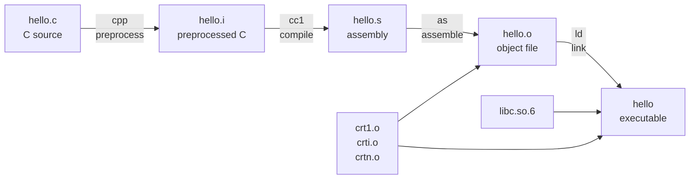

When you type `gcc hello.c -o hello`, it looks like a single step. It isn't. `gcc` is a *driver* that orchestrates four separate programs, each with its own input and output format. This post walks through them with a minimal hello-world C program.

## The starting point

```c
// hello.c
#include <stdio.h>

int main(void) {
    printf("Hello, World!\n");
    return 0;
}
```

The "one-shot" command everyone learns first:

```bash
gcc hello.c -o hello && ./hello
```

- `gcc hello.c` — compile the source file
- `-o hello` — name the output `hello` (default would be `a.out`)
- `&& ./hello` — run it if compilation succeeded

That single command secretly runs four phases, each producing a file with a conventional suffix. We can stop after each one and inspect the output.

## The four phases at a glance



| Phase | Tool | Input | Output | `gcc` flag to stop here |
|---|---|---|---|---|
| 1. Preprocess | `cpp` | `.c` | `.i` (still C) | `-E` |
| 2. Compile | `cc1` | `.i` | `.s` (assembly text) | `-S` |
| 3. Assemble | `as` | `.s` | `.o` (object file) | `-c` |
| 4. Link | `ld` | `.o` + libs | executable | (no flag — it's the final step) |

A useful property: `gcc` recognizes the file extension and only runs the phases that are still needed. Feed it a `.s`, it skips preprocess and compile. Feed it a `.o`, it only links.

## Phase 1: preprocess

The C preprocessor handles every directive starting with `#` and produces *more C source*.

```bash
gcc -E hello.c -o hello.i
```

- `-E` stops after preprocessing.
- Output `.i` is the conventional suffix for preprocessed C (`.ii` for C++).
- Without `-o` it writes to stdout, so people often pipe: `gcc -E hello.c | less`.

What the preprocessor does:

- `#include <stdio.h>` — literally pastes the contents of the header in place (transitively, including everything `stdio.h` itself includes).
- `#define FOO 42` — text substitution.
- `#ifdef` / `#if` / `#endif` — conditional inclusion.
- Strips comments.

The mental model that matters: **the preprocessor is a dumb text-manipulation pass.** It doesn't know C syntax — it just rewrites tokens. That's why a missing semicolon in a header surfaces as errors deep inside files you never wrote, and why function-like macros can evaluate arguments twice.

### What hello.i actually looks like

The output explodes from 6 lines to ~820. The vast majority is the transitive contents of `stdio.h`: type definitions (`size_t`, `__off_t`, `FILE`, `__mbstate_t`), the layout of `struct _IO_FILE`, function declarations like `extern int printf(...)`, `extern FILE *stdin/stdout/stderr`, and so on. Then at the very bottom — your unchanged `main`.

You'll also see lines like:

```
# 1 "/usr/include/stdio.h" 1 3 4
```

These are **linemarkers**, not preprocessor directives. Format: `# <linenum> "<file>" [flags]`. They tell the next stage "the chunk that follows came from this file at this line", so error messages and `__LINE__`/`__FILE__` point back to the right place. The flags `1`/`2` mean entering/leaving a file; `3` means "system header" (suppresses some warnings); `4` means `extern "C"` for C++.

### Useful `-E` companions

| Flag | Effect |
|---|---|
| `-P` | Suppress linemarkers — cleaner output if you just want to read the expansion |
| `-dM` | Print all `#define`s in effect instead of expanded source |
| `-I <dir>` | Add a header search path |

For a quick survey of every predefined macro on your platform:

```bash
gcc -E -dM - < /dev/null
```

### The output is still C

You can prove `hello.i` is valid C by feeding it back to `gcc`:

```bash
gcc hello.i -o hello
```

`gcc` sees the `.i` suffix and skips preprocessing — straight to phase 2. The final binary is byte-identical to compiling from `hello.c`.

## Phase 2: compile

This is what `cc1`, the actual C compiler, does: it parses the C, type-checks it, runs optimization passes, and emits **assembly** — human-readable text in the target machine's instruction set (x86-64 in our case). Everything after this point is no longer C.

```bash
gcc -S hello.i -o hello.s
```

- `-S` stops after compilation.
- You can also go straight from `.c` to `.s`: `gcc -S hello.c -o hello.s` runs preprocess + compile and stops.

### What hello.s looks like

Roughly:

```asm
        .file   "hello.c"
        .section        .rodata
.LC0:
        .string "Hello, World!"
        .text
        .globl  main
        .type   main, @function
main:
        pushq   %rbp
        movq    %rsp, %rbp
        leaq    .LC0(%rip), %rax
        movq    %rax, %rdi
        call    puts@PLT
        movl    $0, %eax
        popq    %rbp
        ret
```

Things worth pointing out:

- **Sections.** `.rodata` holds the read-only string `"Hello, World!"`; `.text` holds executable instructions. The assembler and linker propagate this distinction all the way to the final ELF file.
- **Labels.** `.LC0` is a compiler-generated label for the string. `main` is the function entry point, exposed to the linker via `.globl`.
- **Call to `puts`, not `printf`.** ⚙️ `gcc` recognizes `printf` with a constant string ending in `\n` and no format specifiers, and rewrites it to `puts` — a real optimization the compiler did, not something `printf` does at runtime. Pass `-fno-builtin-printf` to suppress it.
- **`@PLT`.** Indirect call through the **Procedure Linkage Table** — that's how dynamically-linked calls into libc work; the actual address gets patched in at load time.
- **Calling convention.** First argument goes in `%rdi` (System V AMD64 ABI). The string's address is loaded RIP-relative (`leaq .LC0(%rip), %rax`) for position-independent code.

Try recompiling with `-O2` and diff the output. The optimized version is much terser — often just a `lea` followed by a `jmp puts@PLT` tail call. Reading optimized assembly is one of the better ways to develop an intuition for what optimizers actually do.

## Phase 3: assemble

The assembler (`as`, part of GNU binutils) translates each assembly mnemonic into the exact bytes the CPU will execute, and packages them into an **object file** (`.o`).

```bash
gcc -c hello.s -o hello.o
```

- `-c` — assemble only, do not link.
- Equivalent direct call: `as hello.s -o hello.o`. `gcc -c` is just a friendlier wrapper.

### Three things to keep straight about object files

**1. The bytes are machine code, but the file is more than just code.**
`hello.o` is an **ELF relocatable object file**. It contains:

- Your machine instructions (in `.text`).
- The `.rodata` section with the bytes for `"Hello, World!"`.
- A **symbol table**: `main` is *defined* here; `puts` is *undefined* and needed from somewhere else.
- **Relocation entries**: notes saying "patch the address of `puts` into byte offset N once you know where it lives."
- Debug info (if compiled with `-g`).

The CPU can't run it yet — addresses are placeholders.

**2. The mapping from mnemonic to bytes is mechanical, not magical.**
Each x86-64 instruction has an encoding defined by the Intel/AMD manuals. `ret` is the single byte `0xC3`. `movl $0, %eax` is `b8 00 00 00 00`. The assembler is essentially a lookup-table-driven translator with bookkeeping for labels and operand sizes. Same input, same bytes — every time.

**3. "1s and 0s" is true but not useful framing.**
Every file on disk is bits. What makes machine code special is that the **CPU's instruction decoder** is wired to interpret these specific byte patterns as operations. The same bytes loaded as data would just be data.

### Inspecting hello.o

```bash
objdump -d hello.o          # disassemble the .text section
objdump -r hello.o          # show relocations (the "patch later" list)
objdump -t hello.o          # show the symbol table
nm hello.o                  # quick symbol summary (T = defined, U = undefined)
xxd hello.o | less          # raw hex view
```

In `objdump -d hello.o` you'll see a line like:

```
e8 00 00 00 00          callq  <puts-0x4>
```

The `e8` is the `call` opcode; the four `00`s are the placeholder offset that the **linker** will fill in during the next step. That's precisely why an object file alone can't run: it knows it wants to call `puts`, but doesn't yet know where `puts` lives.

## Phase 4: link

The linker (`ld`) takes one or more object files plus libraries, resolves cross-references between them, assigns final memory addresses, patches the placeholders, and emits a single executable.

```bash
gcc hello.o -o hello
```

Here `gcc` is acting as a *driver* for `ld` — it invokes the linker with all the right flags and inputs that you'd otherwise have to spell out yourself. Run with `-v` to see the actual `ld` command; it's surprisingly long.

### What the linker actually combines

Your `hello.o` is **not** linked alone. To produce a working executable, the linker pulls in several other pieces:

1. **Your object file(s)** — `hello.o`. Provides `main` and the `"Hello, World!"` string.
2. **C runtime startup objects** — `crt1.o`, `crti.o`, `crtn.o`. These contain `_start`, the *real* entry point of an ELF binary. `_start` sets up `argc`/`argv`/`envp`, calls `__libc_start_main`, which eventually calls *your* `main`, and after `main` returns it calls `exit()` with your return value. Without these, the kernel would jump into your binary and have no idea how to set up a C environment.
3. **The C library** — `libc.so.6`. Provides `puts`, `__libc_start_main`, and everything else. Linked **dynamically** by default: the executable just records "I need libc.so.6 and these symbols from it"; the actual code stays in the shared library on disk and gets mapped in at load time.
4. **The dynamic loader** — `/lib64/ld-linux-x86-64.so.2`. The linker hardcodes this path into your executable as the **interpreter**. When you run `./hello`, the kernel actually launches the dynamic loader first, and *it* maps `libc.so.6` into memory and resolves dynamic symbols before jumping to `_start`.

### What the linker does to make it work

- ✅ **Symbol resolution.** `hello.o` has `main` defined and `puts` undefined. The linker scans every input until it finds a definition for each undefined symbol. `puts` is found in `libc.so.6` → recorded as a dynamic dependency. If a symbol is unresolved at the end, you get the classic `undefined reference to ...` error.
- ✅ **Section merging.** Each object has its own `.text`, `.rodata`, `.data`, `.bss`. The linker concatenates all input `.text` sections into one output `.text`, all `.rodata` into one output `.rodata`, etc.
- ✅ **Address assignment.** Now that everything's laid out, the linker picks a virtual memory address for each section. `main` gets a real address like `0x401120`; the string gets one like `0x402004`.
- ✅ **Relocation.** Remember the `e8 00 00 00 00` placeholder for `call puts`? The linker now knows where the PLT stub for `puts` will live, computes the relative offset, and **patches those four bytes** with the real value. Same for `leaq .LC0(%rip), ...` — the placeholder gets replaced with the real RIP-relative offset to the string.
- ✅ **Output ELF construction.** Finally it writes an ELF executable with proper program headers (segments the kernel will `mmap`), a `PT_INTERP` segment naming the dynamic loader, a `.dynamic` section listing required libraries and symbols, and so on.

### Two flavors of linking

| | Dynamic (default) | Static (`-static`) |
|---|---|---|
| Command | `gcc hello.o -o hello` | `gcc -static hello.o -o hello` |
| `libc` | Shared `.so` loaded at runtime | Copied out of `libc.a` into the binary |
| Binary size | Tiny (a few KB) | ~800 KB+ |
| libc bug fix | Reaches every program automatically | Requires relinking each binary |
| Runtime deps | `libc.so.6`, dynamic loader | None (in principle) |

### Inspect the executable

```bash
file hello                  # "ELF 64-bit ... dynamically linked, interpreter /lib64/..."
ldd hello                   # list shared libraries it'll load at runtime
readelf -d hello            # dynamic section: NEEDED libs, INTERP, etc.
objdump -d hello | less     # full disassembly — now with real addresses, no placeholders
nm hello                    # symbol table of the final binary
```

Compare `objdump -d hello.o` to `objdump -d hello` and you'll see the `call` instruction's bytes change from `e8 00 00 00 00` to something like `e8 db fe ff ff` — that's the four-byte offset the linker computed and patched in. The placeholder is gone; the binary is runnable.

## Putting it all together

Doing it all by hand, one phase at a time:

```bash
gcc -E hello.c -o hello.i      # preprocess
gcc -S hello.i -o hello.s      # compile
gcc -c hello.s -o hello.o      # assemble
gcc    hello.o -o hello        # link
./hello
```

Same result as `gcc hello.c -o hello`. The intermediates are each readable in their own way:

- `.i` — still C; readable in any text editor.
- `.s` — assembly text; readable with some patience and an x86-64 reference.
- `.o` — binary; readable via `objdump -d`, `objdump -r`, `nm`, `readelf`.
- final binary — same tools as `.o`, plus `ldd` and `file`.

The next time something goes wrong — a confusing macro expansion, an unexpected optimization, a mysterious "undefined reference" — you can pinpoint **which phase** owns the problem and look at exactly what that phase saw. That's the real payoff of knowing the four phases by name. 🚀

## Quick reference

| Symptom | Phase that owns it |
|---|---|
| `error: ‘FOO’ undeclared` after a complex macro | Preprocess (`-E` to inspect) |
| `error: expected ‘;’ before ‘}’ token` | Compile (after preprocessing has finished) |
| Surprising `-O2` behavior, missed optimizations | Compile (read `-S` output) |
| `relocation truncated to fit` | Assemble or link |
| `undefined reference to 'foo'` | Link (missing symbol or library) |
| `error while loading shared libraries: libfoo.so.1` | Runtime, dynamic loader (link recorded the dep, but the `.so` isn't on the system) |
