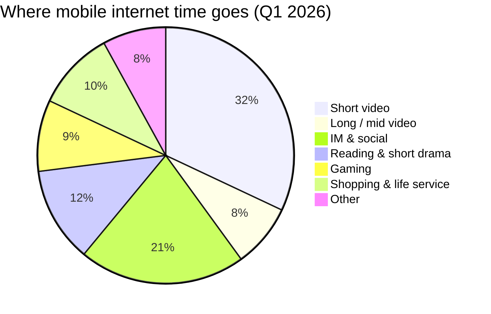

China's mobile internet has crossed into a new phase that QuestMobile labels "stock micro-growth, time explosion" — there are no more new users to acquire at scale, but the users already there are spending more hours per day inside fewer, deeper apps. This post pulls the headline numbers from the most recent reports, ranks apps by both monthly active users (MAU) and time spent, and looks at where AI-native apps and free novel readers are reshaping that ranking.

## How much time, on average

The two anchor data points come from very different sources, and both are worth keeping in mind because they answer slightly different questions.

| Source | Population | Average | Daily equivalent |
|---|---|---|---|
| NBS — Third National Time Use Survey (Oct 2024) | All residents | 5h 37min/day internet use | ~5.6h |
| QuestMobile — 2026 Spring Report (Apr 2026) | Active mobile users | 192.2h/month | ~6.4h/day, +9.3% YoY |

The official survey averages in retirees and light users, so it runs lower. QuestMobile only counts users who actually open apps, so it tracks closer to lived experience for anyone reading this post.

### The generation gap (NBS, 2024)

> "By age group, post-2000s spent the longest on the internet, 6h 45min; post-1990s 6h 21min, post-1980s 5h 56min."

> "Urban residents averaged 6h 3min, rural 4h 42min."

### What that time is spent on (NBS, 2024)

| Activity | Daily time |
|---|---|
| Internet entertainment (short video, gaming) | 2h 16min |
| Learning / work-aux | 1h 12min |
| Social (WeChat, etc.) | 1h 5min |
| Search & other | 36min |
| Shopping | 19min |
| Finance | 9min |

Entertainment is now the single largest category of leisure time — that one line is doing most of the work in every other chart in this post.

## Top 10 by monthly active users

Per QuestMobile's March 2026 figures, the top of the MAU table is a cartel of WeChat, Taobao, Douyin, Alipay and Pinduoduo, with the rest of the top ten filled in by the BAT-aligned super-apps.

| Rank | App | Owner | MAU |
|---:|---|---|---:|
| 1 | WeChat | Tencent | 1.065B |
| 2 | Taobao | Alibaba | 951M |
| 3 | Douyin | ByteDance | 928M |
| 4 | Alipay | Ant Group | 874M |
| 5 | Pinduoduo | PDD | 724M |
| 6 | Baidu | Baidu | 672M |
| 7 | JD | JD | 605M |
| 8 | Kuaishou | Kuaishou | 591M |
| 9 | Amap | Alibaba | 543M |
| 10 | Tencent Video | Tencent | 468M |

Just outside the top ten and worth tracking: **Xiaohongshu** at ~450M (climbing fast on its "life search engine" positioning), **Doubao** at 345M (ByteDance's AI-native app, ~1 year old), and **Hongguo Free Shorts** at 304M (the breakout short-drama app of 2025–26).

## Top 10 by time spent

MAU tells you what's installed; time-per-user tells you what is actually eating people's days. The ranking shifts dramatically.

| Rank | App | Category | Monthly h/user | Daily est. |
|---:|---|---|---:|---:|
| 1 | Douyin | Short video | 63.5h | 127 min |
| 2 | Kuaishou | Short video | 55.2h | 110 min |
| 3 | Hongguo Free Shorts | Mobile video / drama | 48.8h | 98 min |
| 4 | Tomato Novel | Digital reading | 42.3h | 85 min |
| 5 | Honor of Kings | Mobile game | 38.5h | 77 min |
| 6 | Bilibili | General video | 36.2h | 72 min |
| 7 | WeChat | Social / IM | 34.1h | 68 min |
| 8 | Qimao Free Novels | Digital reading | 31.4h | 63 min |
| 9 | Peace Elite | Mobile game | 29.2h | 58 min |
| 10 | Xiaohongshu | Social / community | 27.6h | 55 min |

A few things stand out:

- **WeChat ranks #1 on MAU but only #7 on time.** Messaging is high-frequency but fragmented — open, reply, leave. Short video and short drama are immersive — open, scroll for an hour.
- **Free novel readers outrank WeChat on minutes.** Tomato (ByteDance) and Qimao (Baidu) both crack the top 10 on time, even though their MAU is a fraction of the giants. Long-form text in fragmented time turns out to be very sticky.
- **Short drama is the new variable.** Hongguo went from rounding error to #3 on time in roughly a year.

## The video monopoly, in one number

QuestMobile's headline framing: **mobile video (short + long form) now accounts for 40.3% of all time spent on the Chinese mobile internet**, and within that bucket short video to long video runs roughly 8:2.

Approximate weights inferred from QuestMobile's 192.2h monthly base — the exact split varies report to report, but the share leader doesn't.

## AI-native apps: small base, fastest growth

This is the category that's moving the most in absolute terms in 2026. As of March 2026, AI-native apps had **446M MAU** with a monthly per-user time of **173.3 minutes** (~6 min/day), up **41.4% YoY** in time-per-user. They're not on the time-spent top ten yet, but the slope is the steepest in the report.

| AI app | Owner | MAU |
|---|---|---:|
| Doubao | ByteDance | 345M |
| Tongyi Qianwen | Alibaba | 166M |
| DeepSeek | DeepSeek | 127M |
| Yuanbao | Tencent | 41M |

Two patterns worth noting:

- **Doubao** isn't purely an assistant — it's bundled with light entertainment and social features, which is part of why its MAU pulled ahead.
- **DeepSeek** has a smaller MAU but unusually deep usage among technical and student users — it skews to long, focused sessions.

The structural read: pure utility apps that don't bolt on AI are flat-to-down on MAU; AI-native or AI-augmented apps are the only category absorbing user time without cannibalizing an existing one.

## A closer look: Tomato vs. Qimao vs. WeChat Reading

These three are all "reading apps," but they target different goals and economics. Tomato and Qimao are essentially **time-killers monetized by ads**; WeChat Reading is a **paid quiet space for serious books**.

| Dimension | Tomato Novel | Qimao Free Novels | WeChat Reading |
|---|---|---|---|
| Owner | ByteDance | Baidu (strategic) | Tencent (Yuewen / WeChat) |
| Model | Free + heavy ads | Free + ads + coin rewards | Subscription / unlimited card |
| Catalog | Web fiction, "shuǎng wén" | Web fiction, classic IPs | Trade books, literature, non-fiction |
| AI angle | AI TTS narration (very natural in 2026) | AI search & recs | AI book summaries, smart reading-companion |
| MAU (2026 Q1, est.) | ~190M | ~95M | ~35M |
| Monthly hours/user | 40+ | 40+ | ~12 |

### Tomato — the strongest "scroll-feel" reader

Tomato uses Douyin-grade recommendation, so the reading session feels like a feed: each chapter ends, the next one auto-suggests, and the AI narrator is good enough that many users listen rather than read. Heavy ads, but free at the wallet.

### Qimao — Baidu's web-novel stronghold

Wider catalog of older / classic web novels, including titles missing from Tomato. The "earn coins by reading" gamification still pulls hard with older users. Less polished AI integration than Tomato.

### WeChat Reading — the only "clean" reading space

No feed-style ads. Strong social layer (friends' annotations, what they're reading), and the **AI book-talk** feature in 2026 can summarize a 300k-character serious book in ~5 minutes. The catch: most popular trade books require a subscription or membership card, and the membership-card promotions have been getting less generous.

### Picking one

- For **killing time, free**: Tomato.
- For **finding an old web novel** Tomato doesn't have: Qimao.
- For **published books, quiet UI, willingness to pay**: WeChat Reading.

A 2026 second-order effect worth watching: Tomato (with AI narration and AI-generated "manhua-drama" adaptations of novels) is starting to **eat short-drama time** — same scroll-feel, no per-episode paywall.

## Macro trends from the QuestMobile spring report

Pulling the threads together, four shifts define China's mobile internet in early 2026:

- 📺 **Video dominance hardens** — 40%+ of all mobile time, with short video extending its lead over long video.
- 📚 **Short drama and free novels are the new time sinks** — three of the top ten on time-spent are in this stack (Hongguo, Tomato, Qimao).
- 🤖 **AI-native apps take off** — 446M MAU, time-per-user up 41.4% YoY, with Doubao, DeepSeek and Tongyi pulling away.
- 👴 **Silver-haired users matter** — share of users 46+ ticked up another ~2.1pp YoY, and they over-index on short video, manhua-drama and finance apps.

Across all of these, the average user is now at ~6.4 hours/day on a phone, and the top decile of heavy users has crossed **9.5 hours/day** — more than half of waking hours.

## Where the numbers come from

Three primary sources sit behind this post.

- **National Bureau of Statistics — Third National Time Use Survey (公报)**, released 2024-10-31. Authoritative for population-wide averages. [stats.gov.cn][1]
- **CNNIC — 54th Statistical Report on China's Internet Development**, Aug 2024. Best for population, penetration, and per-category coverage figures. [cnnic.cn][2]
- **QuestMobile — 2026 China Mobile Internet Spring Report**, released 2026-04-28. The standard reference for per-app MAU and time-spent rankings. [questmobile.com.cn][3]

### Getting the QuestMobile PDF

QuestMobile doesn't publish a one-click PDF. Realistic paths, easiest first:

1. **Public WeChat account** — follow `QuestMobile`, send `2026春季` (or `春季大报告`); they reply with a download link. This is the most common analyst-grade route and the public version (~40–60 pages) covers MAU and time tables.
2. **Third-party research aggregators** — `fxbaogao.com` (Discover Reports) and `199it.com` host the public PDF.
3. **Official trial request** — the full version (~200+ pages, with overlap-user analysis and flow analysis) is bundled with the TRUTH database; you fill out an enterprise trial form on `questmobile.com.cn` and a salesperson follows up.
4. **Paid subscription** — TRUTH-Professional and similar tiers run from tens of thousands of RMB per year and up.

For most non-commercial use, the public WeChat-account PDF is enough — it has all the numbers cited here.

[1]: https://www.stats.gov.cn/zwfwck/sjfb/202410/t20241031_1957217.html
[2]: https://www.cnnic.cn/n4/2024/0830/c88-11538.html
[3]: https://www.questmobile.com.cn/research/report-library
